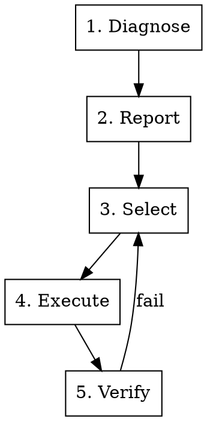

# 技能提升

## 概述

通过“诊断-选择-执行-验证”的工作流程，系统地优化技能的质量，确保技能符合Claude的官方最佳实践，以达到最佳效果。

**核心原则：** 如果没有对技能进行诊断，就无法知道需要修复什么问题。

---

## 工作流程



---

## 第1阶段：诊断

从4个方面扫描技能的质量问题：

**类别：**
- **元数据**（高优先级）：名称、描述、关键词
- **架构**（中等优先级）：文件结构、逐步披露信息
- **文本**（中等优先级）：简洁性、清晰度、代码效率
- **代码**（高优先级）：错误处理、依赖关系、验证机制

**流程：**
1. 阅读SKILL.md文件及所有引用的文件
2. 应用诊断检查表（详见references/diagnostic-checklist.md）
3. 记录每个问题，包括其所属类别、位置和严重程度

**输出：** 问题列表

**详细检查表：** 请参阅[diagnostic-checklist.md](references/diagnostic-checklist.md)

---

## 第2阶段：报告

以结构化格式呈现诊断结果。

**报告结构：**

```markdown
# Skill Diagnostic Report: [name]

**Grade:** [A/B/C/D]
**Issues:** X total (Y high, Z medium, W low)

## High Priority (Y)
[Issues that prevent discovery or execution]

## Medium Priority (Z)
[Issues that impact quality or usability]

## Low Priority (W)
[Minor improvements]
```

**每个问题应包含：**
- 问题所属类别及检查ID
- 当前状态与预期状态
- 问题影响说明
- 具体的修复建议
- 相关的质量标准参考

**报告模板：** 请参阅[report-templates.md](references/report-templates.md)

---

## 第3阶段：选择

用户选择需要修复的问题。

**选择界面：**

```markdown
## Select Issues to Fix

### High Priority ⚠️
- [ ] 1. [Problem] - Impact: [brief statement]
- [ ] 2. [Problem] - Impact: [brief statement]

### Medium Priority ⚙️
- [ ] 3. [Problem] - Impact: [brief statement]

### Low Priority 💡
- [ ] 4. [Problem] - Impact: [brief statement]

**Quick Actions:**
- `Fix all high priority` - Auto-select HIGH issues
- `Fix selected` - Process checked items
- `Details [N]` - View detailed analysis
```

**交互步骤：**
1. 用户查看问题列表
2. 用户勾选问题或使用快速修复选项
3. 系统确认用户的选择
4. 进入执行阶段

---

## 第4阶段：执行

将选定的修复措施应用到技能文件中。

**执行规则：**
1. **备份：** 在修改前创建备份文件
2. **修复顺序：** 首先修复高优先级问题，然后是中等优先级问题，最后是低优先级问题
3. **显示差异：** 显示每次修改的内容差异
4. **更新：** 将更改同步到相关文件
5. **记录：** 记录所有更改

**修复操作：**
```
For each selected issue:
  1. Locate exact position
  2. Generate fix content
  3. Preview change (diff)
  4. Apply edit
  5. Log change
  6. Update related content if needed
```

**输出：** 修复后的技能文件 + 更改日志

**质量标准：** 请参阅[quality-standards.md](references/quality-standards.md)

---

## 第5阶段：验证

使用子代理测试优化的效果。

**测试类型：**
1. **触发测试：** 确保技能能够被正确识别
2. **理解测试：** 确保工作流程能够被正确解读
3. **执行测试：** 确保技能能够完成实际任务
4. **回归测试：** 确保现有功能仍然正常运行

**流程：**
1. 定义测试场景
2. 并发调度子代理进行测试
3. 分析测试结果
4. 生成验证报告

**如果验证失败：**
- 记录失败原因
- 返回第3阶段或第4阶段
- 重新应用修复措施
- 重新进行验证
- 重复测试直到通过

**验证指南：** 请参阅[verification-guide.md](references/verification-guide.md)

---

## 快速参考

| 阶段 | 操作 | 输出 |
|-------|--------|--------|
| 1. 诊断 | 扫描技能 | 问题列表 |
| 2. 报告 | 格式化诊断结果 | 诊断报告 |
| 3. 选择 | 用户选择需要修复的问题 | 选定的问题列表 |
| 4. 执行 | 应用修复措施 | 修复后的文件 |
| 5. 验证 | 测试更改效果 | 验证报告 |

---

## 问题严重程度

| 严重程度 | 定义 | 处理方式 |
|-------|------------|--------|
| **高** | 阻止技能的正常发现或执行 | 必须修复 |
| **中** | 影响技能的质量或可用性 | 应该修复 |
| **低** | 仅涉及轻微改进 | 可选修复 |

---

## 质量评级标准

- **A（优秀）：** 所有高优先级问题都通过测试，中等优先级问题少于2个未通过 |
- **B（良好）：** 所有高优先级问题都通过测试，中等优先级问题少于5个未通过 |
- **C（可接受）：** 所有高优先级问题都通过测试 |
- **D（需要改进）：** 有任何高优先级问题未通过 |
- **F（故障）：** 多个高优先级问题未通过 |

---

## 常见问题

**元数据问题：**
- 名称格式错误 → 使用小写字母和连字符
- 描述中缺少“使用场景” → 添加相应的触发条件
- 未添加关键词 → 添加相关的触发词

**架构问题：**
- SKILL.md文件过长 → 将文件拆分为多个参考文件
- 代码结构过于复杂 → 优化为扁平结构
- 未提供逐步披露信息 → 添加“参见[相关文件.md]”的链接

**文本问题：**
- 说明过于冗长 → 简化说明，假设用户已了解基础内容
- 时效性强的信息 → 移至“旧模式”部分
- 术语不一致 → 统一术语使用

**代码问题：**
- 未进行错误处理 → 添加try/except语句并提供有用的提示信息
- 使用难以理解的代码（如“魔法数字”） → 添加解释性注释
- 未声明依赖关系 → 在SKILL.md文件中列出所有依赖项

---

## 应避免的错误做法

❌ 未经用户选择就自动修复所有问题
❌ 跳过验证阶段
❌ 忽视具体场景（忽略领域特定需求）
❌ 扰乱现有功能
❌ 对简单的技能进行过度设计

---

## 集成

**依赖库：**
- `superpowers:writing-skills` – 技能编写相关工具
- `superpowers:test-driven-development` – 验证方法库

**关联工具：**
- `skill-creator` – 在创建技能时使用质量标准
- `superpowers:verification-before-completion` – 在部署前进行技能验证