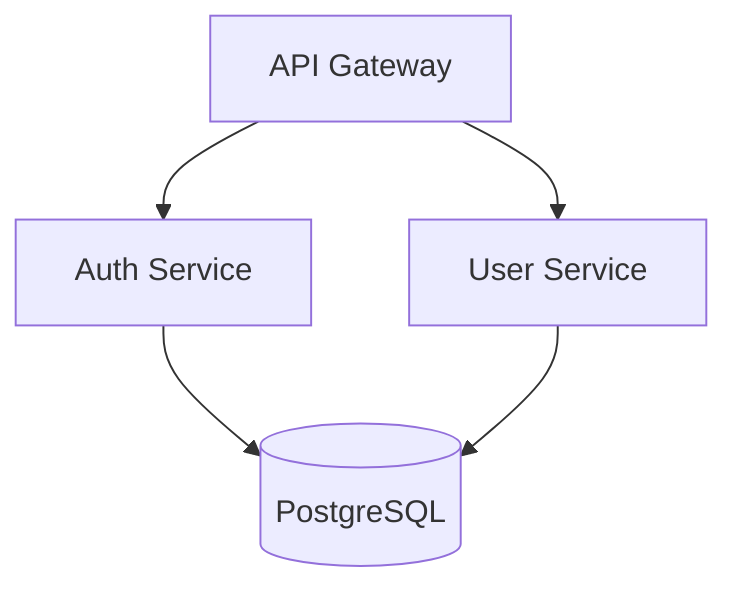

# 高级架构师

提供用于做出明智技术决策的架构设计和分析工具。

## 目录

- [快速入门](#quick-start)
- [工具概述](#tools-overview)
  - [架构图生成器](#1-architecture-diagram-generator)
  - [依赖关系分析器](#2-dependency-analyzer)
  - [项目架构师](#3-project-architect)
- [决策工作流程](#decision-workflows)
  - [数据库选择](#database-selection-workflow)
  - [架构模式选择](#architecture-pattern-selection-workflow)
  - [单体应用与微服务](#monolith-vs-microservices-decision)
- [参考文档](#reference-documentation)
- [技术栈覆盖](#tech-stack-coverage)
- [常用命令](#common-commands)

---

## 快速入门

```bash
# Generate architecture diagram from project
python scripts/architecture_diagram_generator.py ./my-project --format mermaid

# Analyze dependencies for issues
python scripts/dependency_analyzer.py ./my-project --output json

# Get architecture assessment
python scripts/project_architect.py ./my-project --verbose
```

---

## 工具概述

### 1. 架构图生成器

从项目结构生成多种格式的架构图。

**解决的问题：**“我需要可视化系统架构以便于文档编写或团队讨论”

**输入：** 项目目录路径
**输出：** 图表代码（Mermaid、PlantUML 或 ASCII）

**支持的图表类型：**
- `component` - 显示模块及其关系
- `layer` - 显示架构层次（表示层、业务层、数据层）
- `deployment` - 显示部署拓扑

**使用方法：**
```bash
# Mermaid format (default)
python scripts/architecture_diagram_generator.py ./project --format mermaid --type component

# PlantUML format
python scripts/architecture_diagram_generator.py ./project --format plantuml --type layer

# ASCII format (terminal-friendly)
python scripts/architecture_diagram_generator.py ./project --format ascii

# Save to file
python scripts/architecture_diagram_generator.py ./project -o architecture.md
```

**示例输出（Mermaid）：**


---

### 2. 依赖关系分析器

分析项目中的依赖关系，包括耦合度、循环依赖和过时的包。

**解决的问题：**“我需要了解依赖关系树并识别潜在问题”

**输入：** 项目目录路径
**输出：** 分析报告（JSON 或人类可读格式）

**分析内容：**
- 依赖关系树（直接依赖和传递依赖）
- 模块间的循环依赖
- 耦合度评分（0-100）
- 过时的包

**支持的包管理器：**
- npm/yarn (`package.json`)
- Python (`requirements.txt`, `pyproject.toml`)
- Go (`go.mod`)
- Rust (`Cargo.toml`)

**使用方法：**
```bash
# Human-readable report
python scripts/dependency_analyzer.py ./project

# JSON output for CI/CD integration
python scripts/dependency_analyzer.py ./project --output json

# Check only for circular dependencies
python scripts/dependency_analyzer.py ./project --check circular

# Verbose mode with recommendations
python scripts/dependency_analyzer.py ./project --verbose
```

**示例输出：**
```
Dependency Analysis Report
==========================
Total dependencies: 47 (32 direct, 15 transitive)
Coupling score: 72/100 (moderate)

Issues found:
- CIRCULAR: auth → user → permissions → auth
- OUTDATED: lodash 4.17.15 → 4.17.21 (security)

Recommendations:
1. Extract shared interface to break circular dependency
2. Update lodash to fix CVE-2020-8203
```

---

### 3. 项目架构师

分析项目结构，检测架构模式、代码问题以及改进机会。

**解决的问题：**“我想了解当前的架构并找出需要改进的地方”

**输入：** 项目目录路径
**输出：** 架构评估报告

**检测内容：**
- 架构模式（MVC、分层架构、六边形架构、微服务指标）
- 代码组织问题（如“上帝类”设计、职责混合）
- 架构层违规
- 缺失的架构组件

**使用方法：**
```bash
# Full assessment
python scripts/project_architect.py ./project

# Verbose with detailed recommendations
python scripts/project_architect.py ./project --verbose

# JSON output
python scripts/project_architect.py ./project --output json

# Check specific aspect
python scripts/project_architect.py ./project --check layers
```

**示例输出：**
```
Architecture Assessment
=======================
Detected pattern: Layered Architecture (confidence: 85%)

Structure analysis:
  ✓ controllers/  - Presentation layer detected
  ✓ services/     - Business logic layer detected
  ✓ repositories/ - Data access layer detected
  ⚠ models/       - Mixed domain and DTOs

Issues:
- LARGE FILE: UserService.ts (1,847 lines) - consider splitting
- MIXED CONCERNS: PaymentController contains business logic

Recommendations:
1. Split UserService into focused services
2. Move business logic from controllers to services
3. Separate domain models from DTOs
```

---

## 决策工作流程

### 数据库选择工作流程

用于为新项目选择数据库或迁移现有数据。

**步骤 1：确定数据特性**
| 特性 | 适合 SQL 的理由 | 适合 NoSQL 的理由 |
|----------------|---------------|-----------------|
| 具有结构化关系的数据 | ✓ | |
| 需要满足 ACID 事务 | ✓ | |
| 模式灵活/可扩展 | | ✓ |
| 以文档为导向的数据 | | ✓ |
| 时间序列数据 | | ✓（特定场景） |

**步骤 2：评估扩展需求**
- 数据量 < 100 万条记录，单地区部署 → PostgreSQL 或 MySQL
- 数据量 100 万至 1000 万条记录，读操作为主 → 使用带读副本的 PostgreSQL
- 数据量 > 1000 万条记录，全球分布 → CockroachDB、Spanner 或 DynamoDB
- 高写吞吐量（>10K/秒） → Cassandra 或 ScyllaDB

**步骤 3：检查一致性要求**
- 需要强一致性 → SQL 或 CockroachDB
- 可以接受最终一致性 → DynamoDB、Cassandra、MongoDB

**步骤 4：记录决策**

创建一个 ADR（架构决策记录），内容包括：
- 背景和需求
- 考虑的选项
- 决策理由
- 所接受的权衡

**快速参考：**
```
PostgreSQL → Default choice for most applications
MongoDB    → Document store, flexible schema
Redis      → Caching, sessions, real-time features
DynamoDB   → Serverless, auto-scaling, AWS-native
TimescaleDB → Time-series data with SQL interface
```

---

### 架构模式选择工作流程

用于设计新系统或重构现有架构。

**步骤 1：评估团队规模和项目规模**
| 团队规模 | 推荐的起始架构 |
|-----------|---------------------------|
| 1-3 名开发人员 | 模块化单体应用 |
| 4-10 名开发人员 | 模块化单体应用或面向服务的架构 |
| 10 名以上开发人员 | 考虑微服务 |

**步骤 2：评估部署需求**
- 单一部署单元适用 → 单体应用
- 需要独立扩展 → 微服务
- 部分服务扩展需求不同 → 混合架构

**步骤 3：考虑数据边界**
- 数据可以共享 → 单体应用或模块化单体应用
- 需要严格的数据隔离 → 使用独立数据库的微服务
- 适合事件驱动的通信方式 → 事件源驱动/命令-查询-响应（CQRS）

**步骤 4：选择合适的架构模式**

| 需求 | 推荐的架构模式 |
|-------------|-------------------|
| 快速开发 MVP | 模块化单体应用 |
| 团队独立部署 | 微服务 |
| 领域逻辑复杂 | 领域驱动设计 |
| 读写操作比例差异大 | 命令-查询-响应（CQRS） |
| 需要审计追踪 | 事件源驱动 |
| 需要集成第三方服务 | 六边形架构/端口适配器（Port & Adapter） |

详细架构模式描述请参阅 `references/architecture_patterns.md`。

---

### 单体应用与微服务决策

**在以下情况下选择单体应用：**
- [ ] 团队规模较小（<10 名开发人员）
- [ ] 领域边界不明确
- [ ] 需要快速迭代
- [ ] 需要最小化运营复杂性
- [ ] 可以使用共享数据库

**在以下情况下选择微服务：**
- [ ] 团队可以端到端负责各个服务
- [ ] 需要独立部署服务
- [ ] 不同组件有不同的扩展需求
- [ ] 需要使用多种技术
- [ ] 领域边界清晰

**混合架构：**
- 从模块化单体应用开始。仅在以下情况下提取服务：
  - 某个模块的扩展需求显著不同
  - 团队需要独立部署服务
  - 技术限制要求分离服务

---

## 参考文档

请查阅以下文件以获取详细信息：

| 文件 | 包含内容 | 用户询问时提供链接 |
|------|----------|--------------------------|
| `references/architecture_patterns.md` | 9 种架构模式及其权衡、代码示例和使用场景 | “应该选择哪种架构模式？”，“微服务与单体应用”，“事件驱动”，“CQRS” |
| `references/system_design_workflows.md` | 6 个系统设计步骤 | “如何进行系统设计？”，“容量规划”，“API 设计”，“数据迁移” |
| `references/tech_decision_guide.md` | 技术选型决策矩阵 | “应该选择哪种数据库？”，“哪种框架？”，“哪种云服务？”，“哪种缓存？” |

---

## 技术栈覆盖

**编程语言：** TypeScript、JavaScript、Python、Go、Swift、Kotlin、Rust
**前端框架：** React、Next.js、Vue、Angular、React Native、Flutter
**后端框架：** Node.js、Express、FastAPI、Go、GraphQL、REST
**数据库：** PostgreSQL、MySQL、MongoDB、Redis、DynamoDB、Cassandra
**基础设施：** Docker、Kubernetes、Terraform、AWS、GCP、Azure
**持续集成/持续部署：** GitHub Actions、GitLab CI、CircleCI、Jenkins

---

## 常用命令

```bash
# Architecture visualization
python scripts/architecture_diagram_generator.py . --format mermaid
python scripts/architecture_diagram_generator.py . --format plantuml
python scripts/architecture_diagram_generator.py . --format ascii

# Dependency analysis
python scripts/dependency_analyzer.py . --verbose
python scripts/dependency_analyzer.py . --check circular
python scripts/dependency_analyzer.py . --output json

# Architecture assessment
python scripts/project_architect.py . --verbose
python scripts/project_architect.py . --check layers
python scripts/project_architect.py . --output json
```

---

## 获取帮助

1. 使用 `--help` 参数运行任何脚本以获取使用说明
2. 查阅参考文档以了解详细的架构模式和工作流程
3. 使用 `--verbose` 参数获取详细的解释和建议