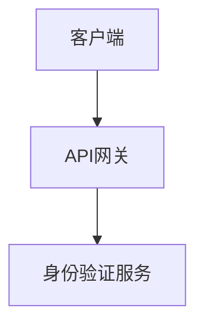

# 在线文档导航器

您可以访问存储在 `.specweave/docs/internal/` 中的项目文档。

## 快速导航

**当您需要相关背景信息时**，请从以下位置阅读相关文件：

### 📋 规范文档（功能与用户故事）
```
.specweave/docs/internal/specs/
```
- 包含用户故事的功能规范
- 接受标准
- 实现历史记录

**查找规范文档**：`ls .specweave/docs/internal/specs/`

### 📐 架构决策文档（ADRs）
```
.specweave/docs/internal/architecture/adr/
```
- 作出决策的原因
- 考虑的权衡因素
- 设计选择的背景信息

**查找架构决策文档**：`ls .specweave/docs/internal/architecture/adr/`

### 🏗️ 系统架构
```
.specweave/docs/internal/architecture/
```
- 高层设计（HLD）
- 系统图表
- 组件架构

**查找架构文档**：`ls .specweave/docs/internal/architecture/*.md`

### 📊 操作指南
```
.specweave/docs/internal/operations/
```
- 运行手册
- 服务水平目标（SLOs）
- 事件处理流程

### 💼 战略规划
```
.specweave/docs/internal/strategy/
```
- 业务需求
- 产品愿景
- 产品需求文档（PRDs）

### 🛡️ 管理规范
```
.specweave/docs/internal/governance/
```
- 安全政策
- 编码标准
- 合规性文档

---

## 使用方法

### 在实现功能之前

1. **查看相关规范文档**：
   ```bash
   grep -ril "keyword" .specweave/docs/internal/specs/
   ```

2. **阅读相关的架构决策文档（ADRs）**：
   ```bash
   grep -l "topic" .specweave/docs/internal/architecture/adr/*.md
   ```

3. **通过阅读相关文件来获取所需背景信息**。

### 在做出设计决策之前

1. **查看现有的架构决策文档（ADRs）**，以避免与过去的决策冲突
2. **阅读架构文档**，了解当前的设计模式
3. **遵循既定的规范和惯例**

### 示例工作流程

```
Task: "Implement user authentication"

1. Search for related docs:
   grep -ril "auth" .specweave/docs/internal/

2. Found:
   - .specweave/docs/internal/specs/backend/us-001-authentication.md
   - .specweave/docs/internal/architecture/adr/0001-jwt-vs-sessions.md
   - .specweave/docs/internal/architecture/auth-flow.md

3. Read each file for context before implementing.
```

---

## 逐步披露文档模式

本文档采用 **逐步披露** 的方式：

1. **仅显示元数据**（即当前的 SKILL.md 文件，包含约 200 个字符）
2. **您可以使用 grep/ls 命令搜索相关文档**
3. **仅阅读您需要的具体文件**
4. **结果**：最少显示信息，但提供最必要的背景信息

**无需使用 RAG 工具**——Claude 的原生文件阅读功能更为准确。

---

## 与 /sw:do 的集成

在执行 `/sw:do` 命令时：

1. 从 spec.md 文件中提取主题关键词
2. 在在线文档中搜索匹配的文档
3. 阅读相关的架构决策文档（ADRs）和架构文档
4. 在实现过程中应用这些文档中的信息

---

## 提示

- **架构决策文档（ADRs）至关重要**——在做出设计决策前务必查看
- **规范文档记录了开发历史**——了解已实现的功能和内容
- **广泛使用 grep 命令**——通过关键词查找文档，而不是猜测文件路径
- **跨引用**——相关文档之间相互链接

---

## 不同用户的文档需求

在线文档适用于不同的用户群体。请根据角色选择合适的导航方式：

### 对于业务利益相关者

快速获取非技术性的高层文档：

```
.specweave/docs/internal/
├── strategy/                    # Business context
│   ├── executive-summary.md     # Project overview for leadership
│   ├── feature-dashboard.md     # Feature status tracking
│   ├── roadmap.md               # Product roadmap
│   └── business-impact/         # Per-feature impact statements
├── operations/                  # System health
│   └── health-dashboard.md      # Current system status
└── specs/
    └── _feature-status.md       # Active features & completion %
```

**使用场景**：董事会报告、投资者更新、季度评审

### 对于技术负责人

快速获取架构和相关决策信息：

```bash
# Recent architectural decisions
ls -lt .specweave/docs/internal/architecture/adr/ | head -10

# Search for decisions about specific topics
grep -ril "authentication" .specweave/docs/internal/architecture/adr/

# Find system architecture diagrams
ls .specweave/docs/internal/architecture/*.md
```

**使用场景**：设计评审、技术债务评估、新员工培训

### 对于产品经理

快速获取规范文档和项目进度信息：

```bash
# Feature specifications
ls .specweave/docs/internal/specs/

# Find features by keyword
grep -ril "checkout" .specweave/docs/internal/specs/

# Check increment status
ls .specweave/increments/*/metadata.json
```

**使用场景**：冲刺计划、发布说明、利益相关者更新

---

## 生成执行摘要

在线文档可以转换为适合管理层阅读的格式：

### 自动生成

使用 **stakeholder-docs** 技能生成以下内容：
- 从技术规范文档生成执行摘要
- 功能状态仪表板
- 业务影响报告
- 发布总结

```
"Create an executive summary of our current project status"
"Generate a feature status dashboard for Q1"
```

### 手动导航

为了快速提供背景信息：

1. **项目概览**：`.specweave/docs/internal/strategy/executive-summary.md`
2. **功能状态**：`.specweave/docs/internal/strategy/feature-dashboard.md`
3. **最新决策**：`architecture/adr/` 目录下的最近 3 个架构决策文档

---

## 可视化文档

当文档需要图表或插图时：

### 架构图
在 markdown 文件中使用 Mermaid 生成图表：
```markdown

```

### 人工智能生成的插图
使用 `/sw:image-generation` 工具生成专业级别的插图：
```
"Generate an architecture diagram illustration for the API docs"
"Create a feature illustration for the living docs"
```

品牌颜色：深紫色 #7c3aed，浅紫色 #a78bfa

---

## 相关技能

- **stakeholder-docs**：生成适合管理层的文档视图
- **docs-writer**：创建详细的文档
- **image-generation**：使用 `/sw:image-generation` 生成可视化内容
- **docusaurus**：通过 `/sw-docs:view` 查看文档的网页版本