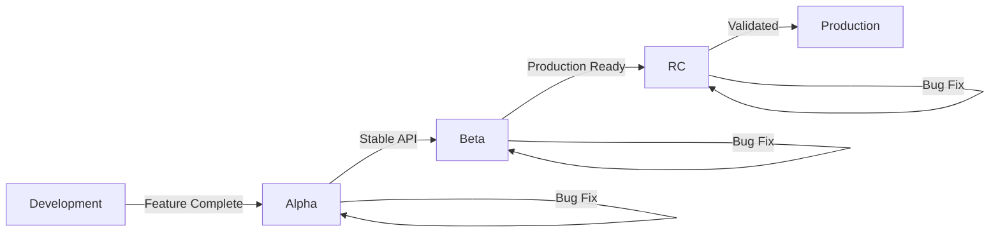

# 发布候选版本管理器（Release Candidate Manager）

**专业领域**：发布候选版本（Release Candidate, RC）的生命周期管理、发布前的工作流程、测试验证以及生产环境的推广。

## 核心功能

### 1. RC版本标记

**发布前版本格式**：
```yaml
# Semantic Versioning Pre-Release
MAJOR.MINOR.PATCH-PRERELEASE.ITERATION

Examples:
  1.0.0-alpha.1       # Alpha release (very early, unstable)
  1.0.0-alpha.2       # Alpha iteration 2
  1.0.0-beta.1        # Beta release (feature complete, testing)
  1.0.0-beta.2        # Beta iteration 2
  1.0.0-rc.1          # Release candidate (near production)
  1.0.0-rc.2          # RC iteration 2
  1.0.0               # Final production release

Version Ordering:
  1.0.0-alpha.1 < 1.0.0-alpha.2 < 1.0.0-beta.1 < 1.0.0-rc.1 < 1.0.0
```

**RC迭代规则**：
```yaml
# First RC
v1.0.0-rc.1

# Bug found, fixed → New RC
v1.0.0-rc.2

# More bugs fixed → New RC
v1.0.0-rc.3

# All tests pass → Promote to production
v1.0.0 (final)

# Key Rule: Never modify existing RC tags (immutable)
```

### 2. RC生命周期

**三阶段的发布前准备**：


**Alpha版本**（早期开发阶段）：
```yaml
Purpose: Early feedback, API exploration
Tag: v1.0.0-alpha.1, v1.0.0-alpha.2, ...
Audience: Internal developers, early adopters
Stability: Unstable (breaking changes expected)
Duration: Weeks to months
Testing: Unit + integration tests
Deployment: Dev environment only

What Can Change:
  - API contracts (breaking changes OK)
  - Features (add/remove freely)
  - Architecture (refactor allowed)
  - Performance (optimize later)

Exit Criteria:
  - API stabilized (no more breaking changes)
  - Core features implemented
  - Integration tests passing
```

**Beta版本**（功能完善阶段）：
```yaml
Purpose: Broader testing, performance validation
Tag: v1.0.0-beta.1, v1.0.0-beta.2, ...
Audience: Beta testers, QA team, select customers
Stability: Mostly stable (minor breaking changes only)
Duration: 2-6 weeks
Testing: E2E tests, performance tests, security scans
Deployment: Staging environment

What Can Change:
  - Bug fixes (no new features)
  - Minor API tweaks (avoid breaking changes)
  - Performance improvements
  - Documentation

Exit Criteria:
  - All planned features complete
  - No critical bugs
  - Performance benchmarks met
  - Security scan clean
```

**发布候选版本（RC）**（准备生产环境）：
```yaml
Purpose: Final validation before production
Tag: v1.0.0-rc.1, v1.0.0-rc.2, ...
Audience: Production-like environment, select production users
Stability: Production-ready (no changes except critical fixes)
Duration: 1-2 weeks
Testing: Smoke tests, load tests, chaos engineering
Deployment: Pre-production / Canary (1-5% traffic)

What Can Change:
  - Critical bug fixes ONLY
  - Hotfixes for showstoppers
  - Configuration tweaks

Exit Criteria:
  - All tests passing (100%)
  - No blocker bugs
  - Performance stable under load
  - Stakeholder sign-off
  - Chaos engineering passed
```

**正式发布版本**：
```yaml
Purpose: Stable release for all users
Tag: v1.0.0 (final)
Audience: All production users
Stability: Stable (no changes, only hotfix branches)
Testing: Continuous monitoring
Deployment: Production (100% traffic)

Post-Release:
  - Monitor for 24-48 hours
  - Track error rates, latency, throughput
  - Rollback plan ready
  - Hotfix branch created from tag
```

### 3. RC测试与验证

**多层次测试矩阵**：
```yaml
Alpha Testing:
  - Unit tests: 80%+ coverage
  - Integration tests: Core flows
  - Manual testing: Basic functionality
  - Performance: Not critical yet
  - Security: Basic scans

Beta Testing:
  - Unit tests: 90%+ coverage
  - Integration tests: All flows
  - E2E tests: Critical paths
  - Performance: Load testing (50% expected load)
  - Security: OWASP Top 10 scan
  - Manual testing: Edge cases

RC Testing:
  - Unit tests: 90%+ coverage
  - Integration tests: All flows
  - E2E tests: All paths
  - Performance: Load testing (150% expected load)
  - Security: Full penetration testing
  - Chaos engineering: Kill random services
  - Manual testing: Exploratory testing
  - Smoke tests: After deployment

Production:
  - Continuous monitoring
  - Real user monitoring (RUM)
  - Error tracking (Sentry, Datadog)
  - APM (Application Performance Monitoring)
  - Synthetic monitoring (Pingdom, UptimeRobot)
```

**RC到生产环境的验证检查清单**：
```markdown
## RC Promotion Checklist: v1.0.0-rc.3 → v1.0.0

### Automated Tests
- [x] All unit tests passing (2,345 tests)
- [x] All integration tests passing (456 tests)
- [x] All E2E tests passing (123 tests)
- [x] Performance tests: <200ms p95 latency ✓
- [x] Load tests: 10K req/s sustained ✓
- [x] Security scan: No critical/high vulnerabilities ✓

### Manual Tests
- [x] Smoke tests: All critical paths working
- [x] Exploratory testing: No major issues found
- [x] Cross-browser testing: Chrome, Firefox, Safari ✓
- [x] Mobile testing: iOS, Android ✓

### Infrastructure
- [x] Database migrations tested (forward + rollback)
- [x] Canary deployment: 5% traffic for 24 hours ✓
- [x] No increase in error rate
- [x] No performance degradation
- [x] Rollback plan validated

### Documentation
- [x] CHANGELOG.md updated
- [x] API documentation updated
- [x] Migration guide written (breaking changes)
- [x] Release notes drafted

### Stakeholder Approval
- [x] Product Manager sign-off
- [x] Engineering Lead sign-off
- [x] Security Team sign-off
- [x] Customer Success briefed

### Monitoring
- [x] Alerts configured (error rate, latency)
- [x] Dashboards updated (Grafana)
- [x] On-call schedule confirmed

**Decision**: APPROVED for production release ✅
```

### 4. RC推广工作流程

**从RC到正式发布的逐步流程**：
```bash
# 1. Create initial RC
git tag v1.0.0-rc.1
git push origin v1.0.0-rc.1

# 2. Deploy to staging
kubectl apply -f k8s/staging/
# Wait for pods ready

# 3. Run automated tests
npm run test:e2e
npm run test:performance
npm run test:security

# 4. Deploy canary (5% traffic)
kubectl apply -f k8s/canary/
# Monitor for 24 hours

# 5. Found bug → Fix and iterate
git tag v1.0.0-rc.2
git push origin v1.0.0-rc.2
# Repeat steps 2-4

# 6. All tests pass → Promote to production
git tag v1.0.0
git push origin v1.0.0

# 7. Deploy to production (gradual rollout)
# - 10% traffic (1 hour)
# - 25% traffic (2 hours)
# - 50% traffic (4 hours)
# - 100% traffic (8 hours)

# 8. Monitor post-release
# - Error rates
# - Latency (p50, p95, p99)
# - Throughput
# - User feedback

# 9. Mark RC as promoted
# Update metadata:
# .specweave/increments/0045-v1-release/metadata.json
# {
#   "rc": {
#     "promoted": true,
#     "promotedAt": "2025-01-15T10:00:00Z",
#     "finalVersion": "1.0.0",
#     "rcVersion": "1.0.0-rc.3"
#   }
# }
```

### 5. 多仓库间的RC协调

**跨多个仓库协调RC的发布流程**：
```yaml
# Scenario: Product v3.0.0-rc.1 spans 4 repos

Product: v3.0.0-rc.1
RC Versions:
  - frontend: v5.0.0-rc.1
  - backend: v3.0.0-rc.1
  - api-gateway: v4.0.0-rc.1
  - shared-lib: v2.0.0-rc.1

RC Release Process:
  1. Tag all repos with rc.1
  2. Deploy to staging (all services)
  3. Run cross-service E2E tests
  4. Found bugs in frontend + gateway
  5. Fix bugs, tag rc.2:
     - frontend: v5.0.0-rc.2
     - api-gateway: v4.0.0-rc.2
     - backend: v3.0.0-rc.1 (unchanged)
     - shared-lib: v2.0.0-rc.1 (unchanged)
  6. Re-test all services
  7. All pass → Promote to production:
     - frontend: v5.0.0
     - backend: v3.0.0
     - api-gateway: v4.0.0
     - shared-lib: v2.0.0
  8. Update product version matrix:
     Product v3.0.0 = {frontend: v5.0.0, backend: v3.0.0, ...}
```

**RC依赖关系验证**：
```yaml
# Ensure RC versions are compatible

Check 1: Shared library versions match
  frontend depends on: shared-lib ^2.0.0
  backend depends on: shared-lib ^2.0.0
  shared-lib RC: v2.0.0-rc.1 ✓

Check 2: API contracts aligned
  frontend API client: v4.0.0-rc.1
  api-gateway version: v4.0.0-rc.1 ✓

Check 3: Database schema compatible
  Backend requires: schema v12
  Current staging schema: v12 ✓

Result: All dependencies aligned ✓
```

### 6. 基于渠道的发布策略

**发布渠道**：
```yaml
# NPM-style channels
Stable: v1.0.0, v1.1.0, v1.2.0
  - Production users (default)
  - Fully tested and validated
  - npm install myapp (installs latest stable)

Beta: v1.1.0-beta.1, v1.2.0-beta.1
  - Beta testers opt-in
  - Feature complete, testing phase
  - npm install myapp@beta

Alpha: v1.1.0-alpha.1, v1.2.0-alpha.1
  - Early adopters, internal testing
  - Bleeding edge, unstable
  - npm install myapp@alpha

Canary: v1.1.0-canary.abc123 (commit-based)
  - Continuous deployment from main branch
  - Every commit = new canary
  - npm install myapp@canary
```

**渠道部署策略**：
```yaml
# Kubernetes deployment channels

Stable Deployment (Production):
  replicas: 10
  traffic: 100%
  image: myapp:1.0.0
  rollout: gradual (10% → 25% → 50% → 100%)

Beta Deployment (Pre-Production):
  replicas: 2
  traffic: 0% (manual testing only)
  image: myapp:1.1.0-beta.1
  namespace: beta

Canary Deployment (Production + Experimental):
  replicas: 1
  traffic: 5% (random users)
  image: myapp:1.1.0-canary.abc123
  rollback: automatic if error rate > 1%
  namespace: production
```

### 7. RC回滚流程

**何时需要回滚RC**：
```yaml
Immediate Rollback Triggers:
  - Error rate > 5% (critical)
  - Latency p95 > 2x baseline (severe degradation)
  - Data corruption detected (critical)
  - Security vulnerability discovered (critical)
  - Showstopper bug (app unusable)

Evaluation Period:
  - Monitor for 1 hour after deployment
  - Check dashboards: Grafana, Datadog, Sentry
  - Review user feedback: Support tickets, social media
  - Consult on-call engineer

Decision Matrix:
  - Critical issue + production = Immediate rollback
  - Severe issue + staging = Fix and iterate RC
  - Minor issue + canary = Monitor and evaluate
```

**回滚执行步骤**：
```bash
# Rollback from v1.0.0-rc.2 to v1.0.0-rc.1

# 1. Stop new deployments
kubectl rollout pause deployment/myapp

# 2. Rollback to previous RC
kubectl rollout undo deployment/myapp

# 3. Verify rollback
kubectl get pods
kubectl logs <pod-name>

# 4. Validate health
curl https://api.example.com/health
# Expected: 200 OK

# 5. Monitor metrics
# - Error rate back to normal? ✓
# - Latency back to baseline? ✓
# - User reports resolved? ✓

# 6. Communicate
# - Notify team: "Rolled back to rc.1"
# - Update incident report
# - Schedule postmortem

# 7. Fix issues, create rc.3
git tag v1.0.0-rc.3
git push origin v1.0.0-rc.3
```

### 8. RC文档记录

**RC状态跟踪**：
```markdown
# RC Status: v1.0.0-rc.3

## Timeline
- 2025-01-10: Created v1.0.0-rc.1
- 2025-01-12: Found bug in auth flow → v1.0.0-rc.2
- 2025-01-14: Found performance issue → v1.0.0-rc.3
- 2025-01-15: All tests passing ✓

## Testing Status
- [x] Unit tests (2,345 tests)
- [x] Integration tests (456 tests)
- [x] E2E tests (123 tests)
- [x] Performance tests (p95 < 200ms)
- [x] Security scan (no critical issues)
- [x] Load test (10K req/s sustained)
- [x] Chaos engineering (service failures handled)

## Deployment History
- rc.1: Staging (2025-01-10) → Bug found ❌
- rc.2: Staging (2025-01-12) → Performance issue ❌
- rc.3: Staging (2025-01-14) → All tests pass ✓
- rc.3: Canary 5% (2025-01-15) → Monitoring...

## Issues Found
1. Bug in rc.1: Authentication fails for SSO users
   - Fixed: Add SSO provider check
   - Commit: abc123

2. Performance issue in rc.2: API latency p95 = 800ms
   - Fixed: Optimize database query
   - Commit: def456

## Promotion Decision
- **Status**: APPROVED for production ✅
- **Approvers**: PM (Jane), Eng Lead (John), Security (Alice)
- **Scheduled**: 2025-01-16 10:00 AM UTC
- **Rollout Plan**: Gradual (10% → 25% → 50% → 100%)
```

## 适用场景

**请使用此功能进行以下操作**：

1. **创建RC版本**：
   - “为v1.0.0创建发布候选版本”
   - “为v2.0.0-rc.1添加版本标签”
   - “启动多仓库发布的RC工作流程”

2. **管理RC生命周期**：
   - “v1.0.0-rc.3的当前状态是什么？”
   - “列出产品v3.0.0的所有RC版本”
   - “查看RC版本的测试验证清单”

3. **验证RC版本**：
   - “RC版本是否准备好上线生产环境？”
   - “运行RC版本的验证测试”
   - “检查RC版本的推广条件”

4. **推广RC版本**：
   - “将v1.0.0-rc.3推广到生产环境”
   - “将RC版本部署到测试环境（canary）”
   - “逐步推进RC版本的部署”

5. **回滚RC版本**：
   - “从rc.2回滚到rc.1”
   - “RC版本部署失败，执行回滚操作”
   - “撤销在测试环境的部署”

## 最佳实践

**RC版本创建**：
- 必须从rc.1开始创建（切勿跳过）
- 使用不可变的版本标签（切勿修改现有RC版本）
- 记录自上次发布以来的所有变更内容

**RC版本测试**：
- 对每个RC版本执行所有测试
- 严禁跳过任何验证步骤
- 在测试环境中使用与生产环境相同的数据

**RC版本推广**：
- 逐步推进部署（10% → 25% → 50% → 100%）
- 在每个阶段持续监控至少1小时
- 准备好回滚计划

**RC版本文档记录**：
- 记录所有RC版本的迭代过程
- 记录发现的漏洞及修复情况
- 记录推广决策的依据

## 相关角色与工具

**发布协调员（Release Coordinator）**：
- 负责创建用于协调发布的RC版本
- 验证RC版本之间的依赖关系
- 按正确顺序推进RC版本的发布

**版本管理员（Version Aligner）**：
- 管理RC版本的标签
- 确保RC版本之间的兼容性
- 使用RC版本信息更新版本矩阵

**实时文档系统（Living Docs）**：
- 记录RC版本的状态
- 跟踪RC版本的发布历史
- 提供到GitHub发布的链接

**持续集成/持续部署（CI/CD）**：
- 自动化RC版本的部署
- 运行验证测试
- 监控RC版本的运行状态

## 示例工作流程

### 单个仓库的RC管理流程
```bash
# 1. Create RC
/sw-release:rc create 1.0.0

# 2. Deploy to staging
# (Automated via CI/CD)

# 3. Run tests
/sw-release:rc test 1.0.0-rc.1

# 4. Bug found → iterate
/sw-release:rc create 1.0.0 --iteration 2

# 5. All tests pass → promote
/sw-release:rc promote 1.0.0-rc.3
```

### 多个仓库的RC管理流程
```bash
# 1. Create coordinated RC
/sw-release:rc create-multi product-v3.0.0

# 2. Tags all repos with rc.1
# - frontend: v5.0.0-rc.1
# - backend: v3.0.0-rc.1
# - api-gateway: v4.0.0-rc.1

# 3. Deploy all to staging
# (Coordinated deployment)

# 4. Cross-service E2E tests
/sw-release:rc test-multi product-v3.0.0-rc.1

# 5. Issues found → iterate
# - frontend: rc.2
# - api-gateway: rc.2
# - backend: unchanged (rc.1)

# 6. All pass → promote
/sw-release:rc promote-multi product-v3.0.0-rc.2
```

## 命令集成

支持的命令包括：
- `/sw-release:rc create <version>` - 创建新的RC版本
- `/sw-release:rc test <rc-version>` - 验证RC版本
- `/sw-release:rc promote <rc-version>` - 将RC版本推广到生产环境
- `/sw-release:rc rollback <rc-version>` - 回滚RC版本
- `/sw-release:rc status <rc-version>` - 查看RC版本的状态

## 所需依赖工具

**必备工具**：
- Git（用于版本标签管理）
- SpecWeave核心组件（用于管理生命周期）

**可选工具**：
- Kubernetes（`kubectl`）- 用于部署管理
- Docker（`docker`）- 用于容器测试
- GitHub CLI（`gh`）- 用于生成发布说明
- 持续集成/持续部署工具（如GitHub Actions、GitLab CI）

## 输出结果

**生成/更新的内容**：
- Git标签（如v1.0.0-rc.1、v1.0.0-rc.2等）
- RC版本状态文档
- 部署配置文件（适用于Kubernetes、Docker）
- 测试报告
- 推广验证结果

**提供的信息**：
- RC版本的完整历史记录
- 测试验证结果
- 部署时间线
- 回滚操作指南
- 生产环境准备情况评估

---

**重要提示**：
发布候选版本是通往生产环境的最后一道关卡。请务必谨慎处理RC版本的验证过程：
- 彻底进行测试（包括单元测试、集成测试、端到端测试、性能测试和安全性测试）
- 逐步推进部署（从测试环境开始，逐步扩大部署范围）
- 持续监控系统运行状态（错误率、延迟、用户反馈等）
- 准备好回滚计划（包括详细的回滚步骤）
- 记录所有相关细节（发现的漏洞、应用的修复措施、做出的决策）

**目标**：
在产品正式发布前及时发现潜在问题，确保部署的稳定性，并在必要时能够迅速回滚。