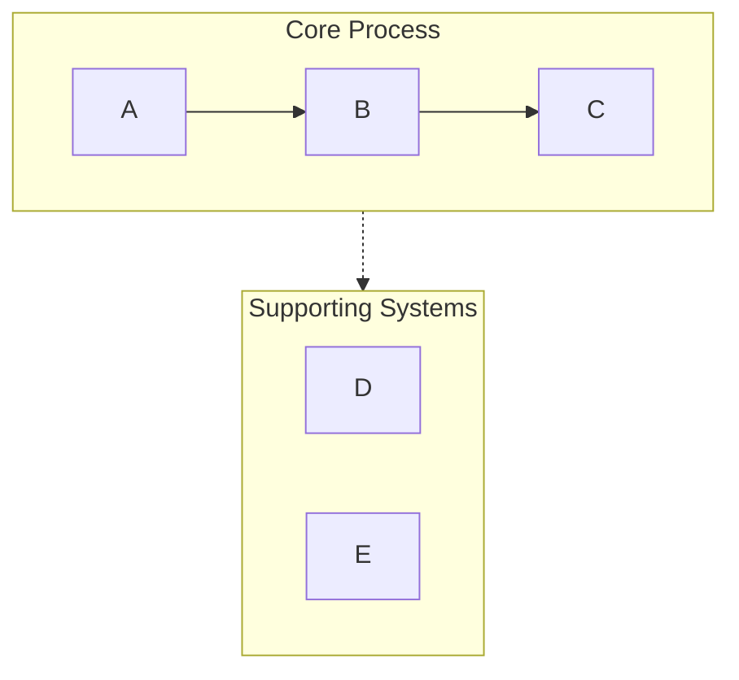
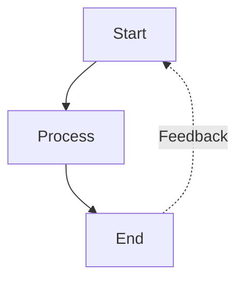
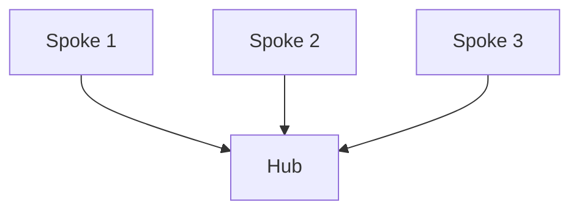

# Mermaid可视化工具

## 概述

Mermaid是一种将文本内容转换为清晰、专业的Mermaid图表的工具，非常适合用于演示文稿和文档编写。该工具能够自动处理常见的语法问题（如列表语法冲突、子图命名错误、间距问题等），确保图表在Obsidian、GitHub等支持Mermaid的平台上正确显示。

## 快速入门

创建Mermaid图表时，请按照以下步骤操作：

1. **分析内容**：识别关键概念、关系和流程。
2. **选择图表类型**：根据内容选择最合适的可视化方式（详见下文）。
3. **配置图表**：设置布局、详细程度和样式。
4. **生成图表代码**：编写符合Mermaid语法的代码。
5. **以Markdown格式输出**：使用适当的代码格式将图表代码包裹起来，并添加简要说明。

**默认设置：**
- 布局方式：垂直（TB，即“top-to-bottom”）；除非特别要求使用水平布局（LR）。
- 详细程度：介于简洁和信息丰富之间。
- 颜色方案：采用具有语义意义的职业化配色方案。
- 语法兼容性：支持Obsidian和GitHub。

## 图表类型

### 1. 流程图（graph TB/LR）
**适用场景**：工作流程、决策树、顺序流程、AI代理架构等。
**特点**：
- 使用子图对相关步骤进行分组。
- 使用箭头标签表示流程转换。
- 支持反馈循环和分支结构。
- 阶段通过颜色进行区分。

**配置选项：**
- `layout`：`vertical`（TB）或`horizontal`（LR）。
- `detail`：`simple`（仅显示核心步骤）或`standard`（包含描述）或`detailed`（包含注释）。
- `style`：`minimal`（简洁风格）或`professional`（专业风格）或`colorful`（鲜艳风格）。

### 2. 循环流程图（graph TD，采用圆形布局）
**适用场景**：循环流程、持续改进循环、代理反馈系统等。
**特点**：
- 以中心节点为核心，元素呈放射状分布。
- 使用曲线箭头表示反馈路径。
- 明确显示循环结构。

### 3. 对比图（graph TB，具有并行路径）
**适用场景**：对比两种或多种方法/系统。
**特点**：
- 采用并排布局。
- 有一个中央的对比节点。
- 通过颜色或样式清晰区分不同部分。

### 4. 思维导图
**适用场景**：具有层次结构的概念、知识组织或主题分解。
**特点**：
- 采用放射状树形结构。
- 支持多级嵌套。
- 视觉层次结构清晰。

### 5. 序列图
**适用场景**：组件之间的交互、API调用、消息流等。
**特点**：
- 基于时间线的布局。
- 明确显示参与者/系统之间的交互。
- 过程通过激活框表示。

### 6. 状态图
**适用场景**：系统状态、状态转换、生命周期阶段等。
**特点**：
- 显示状态节点和状态转换。
- 转换过程有明确的标签。
- 包含开始和结束状态。

## 重要的语法规则

为避免解析错误，请务必遵守以下规则：

### 规则1：避免列表语法冲突
```
❌ WRONG: [1. Perception]       → Triggers "Unsupported markdown: list"
✅ RIGHT: [1.Perception]         → Remove space after period
✅ RIGHT: [① Perception]         → Use circled numbers (①②③④⑤⑥⑦⑧⑨⑩)
✅ RIGHT: [(1) Perception]       → Use parentheses
✅ RIGHT: [Step 1: Perception]   → Use "Step" prefix
```

### 规则2：子图命名
```
❌ WRONG: subgraph AI Agent Core  → Space in name without quotes
✅ RIGHT: subgraph agent["AI Agent Core"]  → Use ID with display name
✅ RIGHT: subgraph agent          → Use simple ID only
```

### 规则3：节点引用
```
❌ WRONG: Title --> AI Agent Core  → Reference display name directly
✅ RIGHT: Title --> agent          → Reference subgraph ID
```

### 规则4：节点文本中的特殊字符
```
✅ Use quotes for text with spaces: ["Text with spaces"]
✅ Escape or avoid: quotation marks → use 『』instead
✅ Escape or avoid: parentheses → use 「」instead
✅ Line breaks in circle nodes only: ((Text<br/>Break))
```

### 规则5：箭头类型
- `-->`：实线箭头。
- `-.->`：虚线箭头（表示可选路径）。
- `==>`：粗箭头（用于强调）。
- `~~~`：隐藏链接（仅用于布局调整）。

有关完整的语法参考和特殊情况，请参阅[references/syntax-rules.md](references/syntax-rules.md)。

## 配置选项

所有图表都支持以下参数：

**布局：**
- `direction`：`vertical`（TB）或`horizontal`（LR）或`right-to-left`（RL）或`bottom-to-top`（BT）。
- `aspect`：`portrait`（默认）或`landscape`（宽屏）或`square`（正方形）。

**详细程度：**
- `simple`：仅显示核心元素，标签简洁。
- `standard`：包含关键描述。
- `detailed`：包含完整注释和元数据。
- `presentation`：优化后的展示格式（文本较大，细节较少）。

**样式：**
- `minimal`：单色，线条简洁。
- `professional`：使用具有语义意义的颜色，层次结构清晰。
- `colorful`：色彩鲜艳，对比度高。
- `academic`：适合论文或文档的正式风格。

**其他选项：**
- `show_legend`：是否显示颜色/符号图例。
- `numbered`：是否为步骤添加序号。
- `title`：图表的标题。

## 使用示例

**示例1：基本请求图**
```
User: "Visualize the software development lifecycle"
Response: [Analyze → Choose graph TB → Generate with standard detail]
```

**示例2：带配置的图表**
```
User: "Create a horizontal flowchart of our sales process with lots of detail"
Response: [Analyze → Choose graph LR → Generate with detailed level]
```

**示例3：对比图**
```
User: "Compare traditional AI vs AI agents"
Response: [Analyze → Choose comparison layout → Generate with contrasting styles]
```

## 工作流程

1. **理解内容**：
   - 识别主要概念、实体和它们之间的关系。
   - 确定内容的层次结构或顺序。
   - 注意是否存在需要对比的部分。

2. **选择图表类型**：
   - 根据内容结构选择合适的图表类型。
   - 考虑用户的展示需求。
   - 如果类型不明确，默认选择流程图。

3. **配置图表**：
   - 应用用户指定的选项。
   - 对未指定的选项使用默认设置。
   - 优化图表的可读性。

4. **生成Mermaid代码**：
   - 严格遵守所有语法规则。
   - 使用有意义的节点名称。
   保持一致的样式。
   - 检查常见错误：
     - 确保节点文本中没有“数字+空格”的格式。
     - 所有子图都使用`ID["显示名称"]`的格式。
     - 所有节点引用都使用ID而非显示名称。

5. **输出图表**：
   - 使用````mermaid`代码格式输出图表。
   - 添加图表结构的简要说明。
   - 提及图表的渲染兼容性（如Obsidian、GitHub等）。
   - 提供调整或创建变体的服务。

## 颜色方案（默认值）

标准的专业配色方案：
- 绿色（#d3f9d8/#2f9e44）：输入、感知、初始状态。
- 红色（#ffe3e3/#c92a2a）：计划、决策点。
- 紫色（#e5dbff/#5f3dc4）：处理、推理。
- 橙色（#ffe8cc/#d9480f）：行动、工具使用。
- 青色（#c5f6fa/#0c8599）：输出、执行、结果。
- 黄色（#fff4e6/#e67700）：存储、内存、数据。
- 粉色（#f3d9fa/#862e9c）：学习、优化。
- 蓝色（#e7f5ff/#1971c2）：元数据、定义、标题。
- 灰色（#f8f9fa/#868e96）：中性元素、传统系统。

## 常见图表模式

### 分组模式（Swimlane Pattern）


### 反馈循环模式（Feedback Loop Pattern）


### 中心辐射模式（Hub and Spoke Pattern）


## 质量检查清单

在输出图表之前，请确认以下内容：
- 所有节点文本中没有“数字+空格”的格式。
- 所有子图都使用了正确的ID格式。
- 所有箭头都使用了正确的语法（`-->`或`-.->`）。
- 颜色使用一致。
- 布局方向已指定。
- 风格设置已完成。
- 节点引用没有歧义。
- 图表兼容Obsidian/GitHub等渲染器。
- 图表文本中不使用表情符号——请使用文字标签或颜色编码。

## 参考资料

有关详细的语法规则和故障排除方法，请参阅：
- [references/syntax-rules.md](references/syntax-rules.md)——完整的语法参考和错误预防指南。