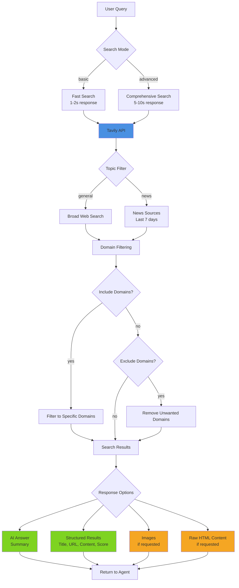

# Tavily AI 搜索

## 概述

Tavily 是一款专为大型语言模型（LLM）和人工智能应用优化的搜索引擎。与传统搜索 API 不同，Tavily 提供了具备人工智能功能的搜索结果，包括可选的答案生成、内容提取以及领域过滤功能。

**主要特性：**
- 从搜索结果中生成人工智能生成的答案摘要
- 结构清晰、适合大型语言模型处理的结果
- 快速（基础模式）和全面（高级模式）的搜索方式
- 领域过滤（包含/排除特定来源）
- 专注于新闻的搜索，可获取当前事件信息
- 图片搜索，附带相关的视觉内容
- 提供原始内容以供深入分析

## 架构



## 快速入门

### 基础搜索

```bash
# Simple query with AI answer
scripts/tavily_search.py "What is quantum computing?"

# Multiple results
scripts/tavily_search.py "Python best practices" --max-results 10
```

### 高级搜索

```bash
# Comprehensive research mode
scripts/tavily_search.py "Climate change solutions" --depth advanced

# News-focused search
scripts/tavily_search.py "AI developments 2026" --topic news
```

### 领域过滤

```bash
# Search only trusted domains
scripts/tavily_search.py "Python tutorials" \
  --include-domains python.org docs.python.org realpython.com

# Exclude low-quality sources
scripts/tavily_search.py "How to code" \
  --exclude-domains w3schools.com geeksforgeeks.org
```

### 带图片的搜索

```bash
# Include relevant images
scripts/tavily_search.py "Eiffel Tower architecture" --images
```

## 搜索模式

### 基础模式 vs 高级模式

| 模式 | 速度 | 覆盖范围 | 使用场景 |
|------|-------|----------|----------|
| **基础模式** | 1-2秒 | 良好 | 查阅快速事实、简单查询 |
| **高级模式** | 5-10秒 | 优秀 | 进行研究、处理复杂主题、进行全面分析 |

**决策树：**
1. 需要快速获取事实或定义？ → 使用 **基础模式**
2. 需要研究复杂主题？ → 使用 **高级模式**
3. 需要多种视角的信息？ → 使用 **高级模式**
4. 查询具有时效性？ → 使用 **基础模式**

### 通用搜索 vs 新闻搜索

| 主题 | 时间范围 | 来源 | 使用场景 |
|-------|------------|---------|----------|
| **通用搜索** | 所有时间 | 广泛的网络资源 | 永恒内容、教程、文档 |
| **新闻搜索** | 过去 7 天 | 新闻网站 | 当前事件、最新发展、突发新闻 |

**决策树：**
1. 查询中包含 “latest”（最新）、“recent”（最近）、“current”（当前）、“today”（今天）？ → 使用 **新闻搜索**
2. 需要历史或永恒内容？ → 使用 **通用搜索**
3. 需要最新信息？ → 使用 **新闻搜索**

## API 密钥设置

### 方案 1：Clawdbot 配置（推荐）

将以下配置添加到您的 Clawdbot 配置中：

```json
{
  "skills": {
    "entries": {
      "tavily": {
        "enabled": true,
        "apiKey": "tvly-YOUR_API_KEY_HERE"
      }
    }
  }
}
```

通过 Clawdbot 的配置系统在脚本中访问 Tavily。

### 方案 2：环境变量

```bash
export TAVILY_API_KEY="tvly-YOUR_API_KEY_HERE"
```

将以下内容添加到 `~/.clawdbot/.env` 或您的 shell 配置文件中。

## 获取 API 密钥

1. 访问 https://tavily.com
2. 注册账户
3. 进入您的仪表板
4. 生成 API 密钥（以 `tvly-` 开头）
5. 记下您的计划中的信用额度和配额限制

## 常见使用场景

### 1. 研究与事实查找

```bash
# Comprehensive research with answer
scripts/tavily_search.py "Explain quantum entanglement" --depth advanced

# Multiple authoritative sources
scripts/tavily_search.py "Best practices for REST API design" \
  --max-results 10 \
  --include-domains github.com microsoft.com google.com
```

### 2. 当前事件

```bash
# Latest news
scripts/tavily_search.py "AI policy updates" --topic news

# Recent developments in a field
scripts/tavily_search.py "quantum computing breakthroughs" \
  --topic news \
  --depth advanced
```

### 3. 领域特定研究

```bash
# Academic sources only
scripts/tavily_search.py "machine learning algorithms" \
  --include-domains arxiv.org scholar.google.com ieee.org

# Technical documentation
scripts/tavily_search.py "React hooks guide" \
  --include-domains react.dev
```

### 4. 视觉内容研究

```bash
# Gather visual references
scripts/tavily_search.py "modern web design trends" \
  --images \
  --max-results 10
```

### 5. 内容提取

```bash
# Get raw HTML content for deeper analysis
scripts/tavily_search.py "Python async/await" \
  --raw-content \
  --max-results 5
```

## 响应处理

### 人工智能生成的答案

人工智能生成的答案是从搜索结果中综合得出的简洁摘要：

```python
{
  "answer": "Quantum computing is a type of computing that uses quantum-mechanical phenomena..."
}
```

**适用场景：**
- 需要快速摘要
- 需要从多个来源合成信息
- 需要直接回答问题

**不适用场景（使用 `--no-answer` 选项）：**
- 仅需要来源 URL
- 希望自行合成信息
- 需要节省 API 信用额度

### 结构化结果

每个搜索结果包含：
- `title`：页面标题
- `url`：来源 URL
- `content`：提取的文本片段
- `score`：相关性评分（0-1）
- `raw_content`：完整的 HTML 内容（如果启用了 `--raw-content` 选项）

### 图片

当启用 `--images` 选项时，会返回搜索过程中找到的相关图片的 URL。

## 最佳实践

### 1. 选择合适的搜索深度

- 对于大多数查询，从 **基础模式** 开始（更快、更经济）
- 仅在以下情况下升级到 **高级模式**：
  - 初始结果不足
  - 主题复杂或微妙
  - 需要全面的信息覆盖

### 2. 战略性地使用领域过滤

**包含的领域：**
- 学术研究（`.edu` 域名）
- 官方文档（项目官方网站）
- 可信的新闻来源
- 已知的权威来源

**排除的领域：**
- 低质量内容网站
- 不相关的内容类型（例如，对于非视觉查询，排除 Pinterest）
- 有付费墙或访问限制的网站

### 3. 优化成本

- 默认使用 **基础模式**
- 限制 `max_results` 为实际需要的数量
- 除非需要，否则禁用 `include_raw_content` 选项
- 对于重复查询，本地缓存结果

### 4. 优雅地处理错误

脚本会提供有用的错误信息：

```bash
# Missing API key
Error: Tavily API key required
Setup: Set TAVILY_API_KEY environment variable or pass --api-key

# Package not installed
Error: tavily-python package not installed
To install: pip install tavily-python
```

## 集成方式

### 程序化使用

```python
from tavily_search import search

result = search(
    query="What is machine learning?",
    api_key="tvly-...",
    search_depth="advanced",
    max_results=10
)

if result.get("success"):
    print(result["answer"])
    for item in result["results"]:
        print(f"{item['title']}: {item['url']}")
```

### 用于解析的 JSON 输出

```bash
scripts/tavily_search.py "Python tutorials" --json > results.json
```

### 与其他工具的集成

```bash
# Search and extract content
scripts/tavily_search.py "React documentation" --json | \
  jq -r '.results[].url' | \
  xargs -I {} curl -s {}
```

## 与其他搜索 API 的比较

**与 Brave Search 的比较：**
- ✅ 支持人工智能生成的答案
- ✅ 支持原始内容提取
- ✅ 更好的领域过滤功能
- ❌ 比 Brave 搜索速度较慢
- ❌ 使用时会消耗 API 信用额度

**与 Perplexity 的比较：**
- ✅ 对来源有更多的控制权
- ✅ 提供原始内容
- ✅ 提供专门的新闻搜索模式
- ✅ 答案质量相似
- ✅ 速度相似

**与 Google Custom Search 的比较：**
- ✅ 结果优化适用于大型语言模型
- ✅ 支持答案生成
- ✅ API 更简单
- ❌ 索引规模较小
- 成本结构相似

## 故障排除

### 脚本无法运行

```bash
# Make executable
chmod +x scripts/tavily_search.py

# Check Python version (requires 3.6+)
python3 --version

# Install dependencies
pip install tavily-python
```

### API 密钥问题

```bash
# Verify API key format (should start with tvly-)
echo $TAVILY_API_KEY

# Test with explicit key
scripts/tavily_search.py "test" --api-key "tvly-..."
```

### 速率限制错误

- 在 https://tavily.com 查看您的计划信用额度分配情况
- 减少 `max_results` 以节省信用额度
- 对于重复查询，使用 **基础模式**
- 实现本地缓存

## 资源

请参阅 [api-reference.md](references/api-reference.md)：
- 完整的 API 参数文档
- 响应格式规范
- 错误处理细节
- 成本和速率限制信息
- 高级使用示例

## 所需依赖项

- Python 3.6 及以上版本
- `tavily-python` 包（安装方式：`pip install tavily-python`）
- 有效的 Tavily API 密钥

## 致谢与引用

- Tavily API：https://tavily.com
- Python SDK：https://github.com/tavily-ai/tavily-python
- 文档：https://docs.tavily.com