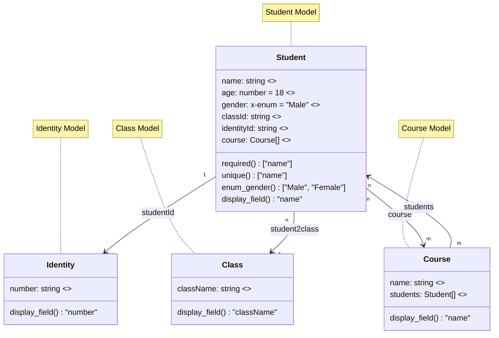
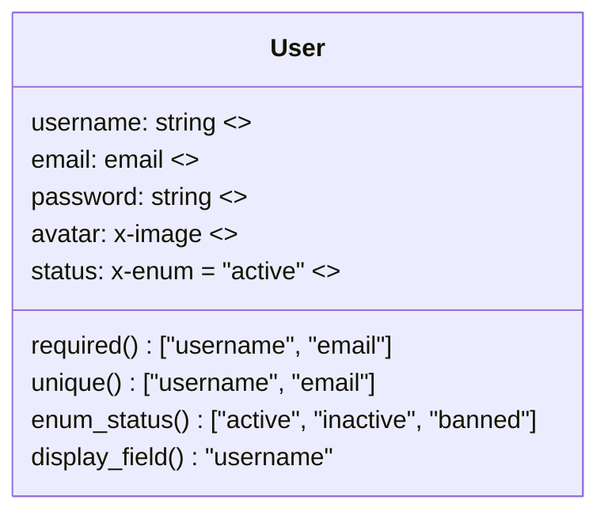
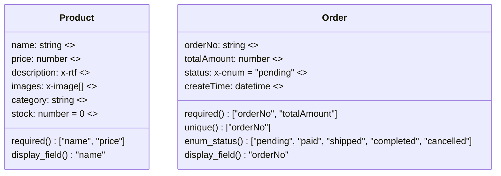
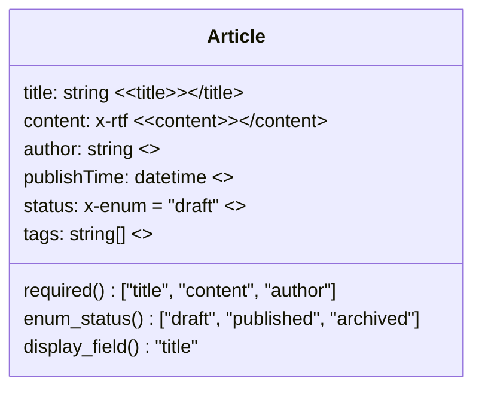

## 何时使用此技能

这是一个用于复杂数据库设计的**可选的高级建模工具**。对于大多数简单的表创建任务，应直接使用`relational-database-tool`并通过SQL语句来完成。

**仅在以下情况下使用此技能：**
- 需要管理复杂的多表关系并自动处理外键
- 需要生成可视化的ER图以用于文档编写
- 需要自动映射字段类型并生成约束条件
- 需要生成企业级的数据模型文档

**在大多数情况下，应使用`relational-database-tool`：**
- 使用`CREATE TABLE`语句创建简单表
- 执行基本的CRUD操作
- 使用`ALTER TABLE`修改数据库模式
- 直接执行SQL语句，无需使用Mermaid建模工具

**禁止用于：**
- 查询或操作现有数据（请使用数据库相关的技能）
- NoSQL数据库的设计（请使用NoSQL相关的技能）
- 前端数据结构的设计（请使用相应的前端开发技能）

---

## 如何使用此技能（针对编程代理）

**⚠️ 注意：此步骤是可选的。对于简单任务，可以直接跳过并使用`relational-database-tool`。**

当确实需要使用这种高级建模方法时，请按照以下步骤操作：

1. **可选的建模工作流程**（仅在任务复杂度较高时使用）：
   - **业务分析阶段**：分析用户需求，确定核心实体及其之间的关系
   - **Mermaid建模阶段**：根据生成规则创建mermaid类图
   - **模型验证阶段**：检查模型的完整性、一致性和正确性

2. **严格遵循生成规则**（在使用此工具时）：
   - 使用正确的类型映射（如string、number、boolean、x-enum等）
   - 将中文字段名转换为英文命名规则（类名使用PascalCase，字段名使用camelCase）
   - 根据需要定义`required()`、`unique()`、`display_field()`等函数
   - 使用正确的字段名来表示字段之间的关系

3. **正确使用工具**（仅在选择此方法时）：
   - 仅在处理涉及多个实体的复杂业务需求时才使用数据模型创建工具
   - 使用`mermaidDiagram`参数并传递完整的mermaid类图代码
   - 初始时将`publish`参数设置为`false`，完成建模后再进行发布
   - 根据模型是新创建还是已存在的，选择合适的`updateMode`参数

---

## 快速决策指南

**大多数数据库任务 → 使用`relational-database-tool`技能**
- ✅ 创建简单表
- ✅ 执行数据查询和修改
- ✅ 修改数据库模式
- ✅ 直接执行SQL语句

**仅适用于复杂建模 → 使用此技能（`data-model-creation`）**
- 🎯 多实体关系建模
- 🎯 自动管理外键
- 🎯 生成可视化ER图
- 🎯 生成企业级数据模型文档

---

# 数据模型AI建模专业规则

## ⚠️ 重要提示：简化的工作流程建议

**对于大多数数据库表创建任务，直接使用`relational-database-tool`技能：**
- 创建简单表：`CREATE TABLE users (id INT PRIMARY KEY, name VARCHAR(255))`
- 修改数据库模式：`ALTER TABLE users ADD COLUMN email VARCHAR(255)`
- 数据操作：`INSERT`、`UPDATE`、`SELECT`、`DELETE`

**仅在以下情况下使用这种高级的Mermaid建模方法：**
- 需要自动管理字段之间的关系
- 数据库模式包含复杂的多表关系
- 需要生成企业级文档
- 需要生成可视化ER图

**此规则适用于复杂建模场景，但大多数开发工作应直接使用SQL语句。**

## AI建模专家提示

作为数据建模专家和软件开发的高级架构师，您熟练掌握Mermaid工具。您的主要任务是根据用户描述，使用mermaid类图格式提供数据模型结构，需遵循以下详细规则：

### 生成规则

1. **类型映射优先级**：当用户描述的字段与预设的类型映射关系一致时，优先使用预设的类型。类型映射关系如下：
   | 业务字段 | 类型 |
   | --- | --- |
   | 文本 | string |
   | 数字 | number |
   | 布尔值 | boolean |
   | 枚举 | x-enum |
   | 电子邮件 | email |
   | 电话 | phone |
   | URL | url |
   | 文件 | x-file |
   | 图像 | x-image |
   | 富文本 | x-rtf |
   | 地区代码 | x-area-code |
   | 时间 | time |
   | 日期 | date |
   | 日期时间 | datetime |
   | 对象 | object |
   | 数组 | string[] |
   | 地理位置 | x-location |

2. **命名规则**：将中文字段名转换为英文命名规则（枚举值除外）。类名使用PascalCase，字段名使用camelCase。

3. **字段可见性**：使用默认的字段可见性设置，不要添加“+”或“-”等前缀。

4. **数组类型**：如果描述中包含数组类型，请使用具体的数组格式，如`string[]`、`number[]`等。

5. **中文行政区划**：当涉及中文行政区划（如“省份/城市/区”）时，使用`x-area-code`字段类型。

6. **必填字段**：如果描述中明确指出字段是必填的，定义一个无参数的`required()`函数，返回包含必填字段名的字符串数组，例如`required() ["name", "age"]`。默认情况下，字段不是必填的。

7. **唯一字段**：如果描述中明确指出字段是唯一的，定义一个无参数的`unique()`函数，返回包含唯一字段名的字符串数组，例如`unique() ["name", "age"]`。默认情况下，字段不是唯一的。

8. **默认值**：如果描述中指定了字段的默认值，在字段定义后使用“= 默认值”的格式，例如`age: number = 0`。默认情况下，字段没有默认值。

9. **字段描述**：在每个字段定义的末尾使用`<<description>>`格式添加字段描述，例如`name: string <<Name>>`。

10. **显示字段**：每个实体类应有一个用于显示的字段，通常是易于人类阅读的名称或唯一标识符。定义一个无参数的`display_field()`函数，返回表示主要显示字段的名称，例如`display_field() "name"`表示主要显示字段是“name”。如果没有指定，则默认使用数据模型的 `_id` 字段。

11. **类注释**：在所有类定义完成后，使用注释来描述类名。首先使用“%% Class naming”来标识类，然后为每个类提供中文名称。

12. **关系表示**：当描述中包含关系时，关系标签`LabelText`应使用字段名而不是原始的描述词。例如，`A "n" <-- "1" B: field1`表示A与B之间存在多对一的关系，数据存储在A的`field1`字段中。具体规则请参考示例。

13. **命名规范**：Mermaid中的字段名和描述应简洁且准确。

14. **控制复杂性**：除非用户有特殊要求，否则应控制模型的复杂性，例如类数量不应超过5个，字段的复杂性也应适中。

### 标准示例

## 数据模型创建工作流程

### 1. 业务分析阶段
- 仔细分析用户的业务需求描述
- 确定核心实体和业务对象
- 明确实体之间的关系
- 确定必填字段、唯一约束和默认值

### 2. Mermaid建模阶段
- 严格遵循上述生成规则创建mermaid类图
- 确保字段类型映射正确
- 正确处理关系的方向和基数
- 添加完整的中文描述和注释

### 3. 模型验证阶段
- 检查模型的完整性和一致性
- 验证关系的合理性
- 确认字段约束的正确性
- 检查命名规则的遵守情况

## MySQL数据类型支持

### 基本类型映射
- `string` → VARCHAR/TEXT
- `number` → INT/BIGINT/DECIMAL
- `boolean` → BOOLEAN/TINYINT
- `date` → DATE
- `datetime` → DATETIME
- `time` → TIME

### 扩展类型映射
- `x-enum` → ENUM类型
- `x-file`/`x-image` → 文件路径存储
- `x-rtf` → LONGTEXT富文本
- `x-area-code` → 地区代码
- `x-location` → 地理位置坐标
- `email`/`phone`/`url` → 带有验证功能的VARCHAR类型

### 关系实现
- 一对一关系：使用外键约束
- 一对多关系：使用外键关联
- 多对多关系：通过中间表实现
- 自关联：使用相同表的外键

## 工具使用指南

### 工具调用时机（很少使用）
- **仅在用户明确要求使用Mermaid图进行高级数据建模时**
- **仅适用于具有多实体关系的复杂企业应用**
- **仅在用户提供详细的业务需求描述并且需要自动化建模时**
- **仅在需要更新现有数据模型结构并生成可视化ER图时**

### 何时跳过此工具（大多数情况）
- 创建简单表 → 使用`executeWriteSQL`和`CREATE TABLE`
- 修改数据库模式 → 使用`executeWriteSQL`和`ALTER TABLE`
- 基本CRUD操作 → 直接使用相应的SQL语句
- 数据查询 → 使用`executeReadOnlySQL`

### 参数使用指南
- `mermaidDiagram`：传递完整的mermaid类图代码
- `publish`：是否立即发布模型（建议初始值设为`false`，完成建模后再发布）
- `updateMode`：创建新模型或更新现有模型

### 错误处理策略
- 语法错误：检查Mermaid的语法格式
- 字段类型错误：验证类型映射关系
- 关系错误：检查关系的方向和基数
- 命名冲突：提供重命名建议

## 最佳实践

### 模型设计原则
- **单一职责原则**：每个实体类只负责一个业务概念
- **减少依赖关系**：避免不必要的关系
- **可扩展性**：为未来的扩展预留字段空间
- **一致性**：保持命名和类型使用的统一性

### 性能考虑
- **索引设计**：为经常查询的字段创建索引
- **字段长度**：合理设置字符串字段的长度
- **关系优化**：避免过多的多对多关系
- **数据分片**：对于大型表，考虑使用数据分片策略

### 安全标准
- **敏感字段**：对敏感信息（如密码）进行加密存储
- **权限控制**：明确字段的读写权限
- **数据验证**：设置适当的字段约束
- **审计日志**：为重要操作记录日志

## 常见业务场景模板

### 用户管理系统

### 电子商务系统

### 内容管理系统

这些规则将指导AI代理在数据建模过程中生成高质量、符合业务需求的数据模型。