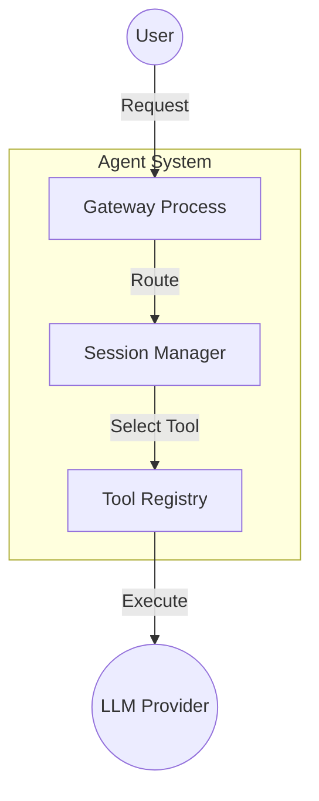

# Mermaid 图表生成工具

本工具能够自动生成专业且风格统一的 Mermaid 图表，适用于技术文档的可视化展示。它具备自动模板选择、内容生成以及质量验证等功能。

## 快速入门

**推荐使用子代理模式：**

当用户请求生成图表时，会启动一个子代理来处理整个流程：

```
Generate 3 Mermaid diagrams for /path/to/chapter-01.md and save to diagrams/chapter-01/
```

子代理将执行以下操作：
1. 读取相关章节内容
2. 选择合适的模板
3. 生成占位符内容
4. 创建 `content.json` 文件
5. 运行图表生成脚本
6. 验证生成结果

**手动模式：**

```bash
# 1. Create content.json (see assets/example-content.json)
# 2. Render diagrams
node scripts/generate.mjs --content content.json --out diagrams/chapter-01

# 3. Validate
node scripts/validate.mjs --dir diagrams/chapter-01
```

## 先决条件

### 自动安装（推荐）

运行安装脚本以自动安装并验证 `mermaid-cli`：

```bash
cd $SKILL_DIR  # Path to skill-mermaid-diagrams directory
./scripts/install-deps.sh
```

脚本会：
- 检查 Node.js 版本（要求 >= 18.0.0）
- 安装或升级 `mermaid-cli` 至最新版本
- 验证安装结果及版本兼容性
- 提供必要的故障排除指导

### 手动安装

也可以选择全局安装 `Mermaid CLI`：

```bash
npm install -g @mermaid-js/mermaid-cli
```

安装完成后，需要验证安装是否成功：

```bash
mmdc --version  # Should be >= 11.0.0
```

## 使用方式

### 子代理工作流程（主要模式）

当用户请求生成图表时，子代理会负责完成整个工作流程：

```
Task: Generate 3 Mermaid diagrams for chapter 5

Steps:
1. Read $CONTENT_DIR/chapters/chapter-05.md
2. Analyze content and select 3 appropriate diagram templates from: architecture, flowchart, sequence, concept-map, timeline, comparison
3. For each selected template:
   - Read template from $SKILL_DIR/assets/
   - Extract placeholders ({{PLACEHOLDER_NAME}} format)
   - Generate concise labels (max 8 words each) based on chapter content
4. Create content.json with structure:
   {
     "chapter": "chapter-05.md",
     "diagrams": [
       {
         "template": "architecture",
         "placeholders": { "SYSTEM_NAME": "...", ... }
       },
       ...
     ]
   }
5. Save to $CONTENT_DIR/diagrams/chapter-05/content.json
6. Run: node $SKILL_DIR/scripts/generate.mjs --content content.json --out $CONTENT_DIR/diagrams/chapter-05
7. Validate: node $SKILL_DIR/scripts/validate.mjs --dir $CONTENT_DIR/diagrams/chapter-05
8. Report success with file count

Note: Replace $SKILL_DIR and $CONTENT_DIR with actual paths:
- SKILL_DIR: Path to skill-mermaid-diagrams directory
- CONTENT_DIR: Path to your content/project directory
```

### 手动内容生成

如果需要手动生成 `content.json` 文件，可以按照以下步骤操作：

```bash
# 1. Create content.json (see assets/example-content.json)
# 2. Render
cd $SKILL_DIR  # Path to skill-mermaid-diagrams directory
node scripts/generate.mjs \
  --content /path/to/content.json \
  --out /path/to/output

# 3. Validate
node scripts/validate.mjs --dir /path/to/output
```

**参数说明：**
- `--content` / `-c`：内容 JSON 文件（必填）
- `--out` / `-o`：输出目录（默认为 `./diagrams`）

### 验证所有生成的图表

```bash
for dir in diagrams/chapter-*/; do
  node scripts/validate.mjs --dir "$dir"
done
```

## 可用模板

本工具提供了 12 个专业主题的模板，所有模板都采用统一的颜色方案：

1. **architecture.mmd** - 系统架构图、组件图、工具集成图
   - 适用场景：系统组件、工具流程、代理交互
   - **节点标识符固定**（支持空格）：内部使用 C1、C2、C3 作为节点标识符，仅标签可自定义

2. **flowchart.mmd** - 决策流程图、工作流程图、调试步骤图
   - 适用场景：决策树、流程图、验证流程

3. **sequence.mmd** - 行为者交互图、消息传递图
   - 适用场景：API 调用序列、行为者通信、消息流程

4. **concept-map.mmd** - 关键概念图、思维模型图
   - 适用场景：层次化概念、思维模型、知识图谱
   - **改进版**（基于图表，非思维导图）：支持全色显示和可读性强的文本

5. **radial-concept.mmd** - 从中心辐射出的层次化概念图
   - 适用场景：逐步总结、抽象层次结构、层次模型
   - 使用 4 种颜色编码：绿色 → 橙色 → 蓝色 → 紫色

6. **timeline.mmd** - 时间线图、项目阶段图、演变过程图
   - 适用场景：项目阶段、发展历程、分阶段流程

7. **comparison.mmd** - 对比图（二维图表）
   - 适用场景：成本与性能对比、工作量与影响对比（X/Y 坐标显示）
   - **注意事项**：需要提供项目的 X/Y 坐标数据

8. **comparison-table.mmd** - 并列特征对比表
   - 适用场景：功能对比（如 AI 与脚本）、选项对比、特性矩阵
   - **替代方案**：当只需要简单的并排对比时，可使用此模板而非二维图表

9. **gantt.mmd** - 甘特图、任务调度图
   - 适用场景：项目规划、里程碑跟踪、任务依赖关系
   - 支持多个任务部分、任务状态（已完成/进行中/关键）

10. **mindmap.mmd** - 自由形式的思维导图
    - 适用场景：头脑风暴、思维结构可视化
    - **限制**：自动分配颜色和文本（主题控制有限）
    - **建议使用**：如需更好的颜色控制，可改用 `radial-concept.mmd`

11. **class-diagram.mmd** - UML 类图
    - 适用场景：对象模型、数据库架构图（面向对象设计）
    - 支持属性、方法、关系（继承、组合、关联）

12. **state-diagram.mmd** - 状态机图、生命周期图
    - 适用场景：过程状态、对象生命周期、工作流程阶段
    - 支持带标签的转换、状态注释、开始/结束标记

### 模板占位符说明

每个模板都包含特定的占位符。**必须提供所有占位符**，否则会导致渲染错误。

| 模板 | 占位符 | 复杂度 | 必填字段 |
|----------|--------------|------------|-----------------|
| architecture | 10 | 中等 | SYSTEM_NAME, COMPONENT_1-3_LABEL, EXTERNAL_1-2_LABEL, FLOW_1-4 |
| flowchart | 11 | 中等 | START_LABEL, DECISION_1-2, ACTION_1-4, CHOICE_1-2_YES/NO, END_LABEL |
| sequence | 8 | 中等 | ACTOR_1-3, MESSAGE_1-5 |
| concept-map | 15 | 高难度 | CENTRAL_CONCEPT, BRANCH_1-4, BRANCH_X_SUB_1-3 |
| radial-concept | 13 | 中等 | CENTRAL_CONCEPT, LEVEL_1-4LABEL, LEVEL_X_NODE_1-3 |
| timeline | 6 | 低难度 | EVENT_1-6, DATE_1-6 |
| comparison | 18 | 高难度 | COMPARISON_TITLE, X/Y_AXIS_LOW/HIGH, QUADRANT_1-4_LABEL, ITEM_1-5 + X/YCoords |
| comparison-table | 10 | 低难度 | OPTION_1-2_TITLE, OPTION_X_CRITERION_1-4 |
| gantt | 14 | 高难度 | CHART_TITLE, SECTION_1-3_TITLE, TASK_X_Y (name/id/start/duration) |
| mindmap | 13 | 中等 | ROOT_CONCEPT, BRANCH_1-4, BRANCH_X_child_1-3 |
| class-diagram | 21 | 高难度 | CLASS_1-3_NAME, CLASS_X_ATTR_1-3, CLASS_X_METHOD_1-3, REL_1-3_TYPE/LABEL |
| state-diagram | 18 | 中等 | STATE_1-8, TRANSITION_1-7_LABEL, STATE_1/4/7_NOTE |

**重要说明：**
- **architecture.mmd**：内部使用固定的节点标识符（C1、C2、C3、E1、E2）。只有标签部分可自定义，且标签支持包含空格。
- **concept-map.mmd**：采用基于图表的改进版本，具有更好的颜色控制和可读性。
- **comparison.mmd**：需要提供 X/Y 坐标数据。对于简单的并排对比，建议使用 `comparison-table.mmd`。
- **gantt.mmd**：任务状态可选 `done`、`active`、`crit` 或空白。日期格式为 YYYY-MM-DD，持续时间格式为 Nd（天）或 YYYY-MM-DD。
- **mindmap.mmd**：颜色和文本的自动分配有限，如需控制颜色和文本，建议使用 `radial-concept.mmd`。
- **class-diagram.mmd**：关系类型包括 `<|--`（继承）、`*--`（组合）、`o--`（聚合）、`-->`（关联）。
- **state-diagram.mmd**：使用 `stateDiagram-v2` 语法，状态标识符需简洁（不含空格）。
- **文本长度限制**：如果标签超过推荐长度（根据模板不同，建议长度为 25-50 个字符），生成器会发出警告。

**占位符命名规则：**
- 组件标签：`COMPONENT_1_LABEL`、`COMPONENT_2_LABEL`
- 分支层次：`BRANCH_1`、`BRANCH_1_SUB_1`、`BRANCH_1_SUB_2`
- 层级标识：`LEVEL_1_LABEL`、`LEVEL_1_NODE_1`

---

## 更新日志与迁移说明

### v2.0 (2026-02-15) - 根本问题修复

**重大变更：**
1. **architecture.mmd**：修复了节点标识符的处理方式（支持空格）
   - **之前**：使用占位符值作为节点标识符，如果标签包含空格会导致错误
   - **现在**：使用固定的节点标识符（C1、C2、C3），标签可以包含任意字符
   - **迁移步骤**：从 `content.json` 中删除 `COMPONENT_1`、`COMPONENT_2`、`COMPONENT_3`（只需保留 `_LABEL` 占位符）

2. **concept-map.mmd**：将思维导图替换为基于图表的版本
   - **之前**：使用自动着色的思维导图格式，文本显示效果不佳（黑色背景上显示紫色文字）
   - **现在**：采用基于图表的格式，文字显示效果显著提升（紫色节点对比度从 2.6:1 提升至 5.2:1）

**新功能：**
- **radial-concept.mmd**：支持 4 种颜色编码的层次化概念图
- **comparison-table.mmd**：提供并排特征对比功能（替代传统的四象限图）
- **新增功能**：生成器会提示文本长度过长或占位符未解析的问题

**所有更改都针对根本问题**（如模板设计缺陷、验证机制缺失）进行优化，而非仅仅修复表面问题。

---

## 颜色方案（所有模板统一使用）

- **主要颜色**：`#4A90E2` - 主要组件、主要操作
- **次要颜色**：`#7B68EE` - 辅助元素
- **次要颜色**：`#90EE90` - 外部参与者、成功状态
- **警告颜色**：`#FFD700` - 决策节点、警告信息
- **错误颜色**：`#FF6B6B` - 失败状态、关键路径

## 输出格式

生成后的图表文件会保存在每个章节的目录中：

```
diagrams/chapter-01/
├── diagram-01-architecture.mmd   # Mermaid source
├── diagram-01-architecture.svg   # Vector output
├── diagram-01-architecture.png   # Raster output (1200px wide)
├── diagram-02-flowchart.mmd
├── diagram-02-flowchart.svg
├── diagram-02-flowchart.png
├── diagram-03-concept-map.mmd
├── diagram-03-concept-map.svg
├── diagram-03-concept-map.png
└── summary.json                   # Generation metadata
```

## 错误处理

本工具具有强大的错误处理机制：
- **模板选择失败**：会依次尝试使用前 N 个模板
- **内容生成失败**：跳过当前图表的生成，继续处理下一个图表
- **渲染失败**：会报告错误并保存 `.mmd` 源文件以供手动调试
- **未安装 mmdc**：会立即退出并提示安装路径

## 质量验证

验证器会检查每个图表的以下内容：
1. 文件是否为有效的 UTF-8 格式
2. 是否使用了正确的主题配置
3. 是否存在未解析的占位符（例如 `{{PLACEHOLDER}}`
4. 是否成功生成了 SVG 和 PNG 文件
5. 语法是否正确（可以重新生成而不会出错

**验证流程：**

```bash
# Generate diagrams
node scripts/generate.mjs --content content.json --out diagrams/chapter-01

# Validate output
node scripts/validate.mjs --dir diagrams/chapter-01

# Fix any failures and re-run
```

## 成本分析

**每章生成 3 张图表的成本：**
- 子代理（基于 LLM）：读取章节内容约需 3000 个令牌
- 模板选择：约需 500 个令牌
- 图表生成：约需 1500 个令牌
- 总计：约 5000 个令牌（成本约为 0.002 美元）

**大规模应用（例如 14 章节 × 3 张图表 = 42 张图表）：**
- 总成本约为 0.03 美元

**与 AI 图像生成工具相比（42 张图表）：**
- Mermaid 图表：约 0.03 美元
- GLM 图像：约 0.63 美元
- DALL-E 图像：约 2.52 美元
- **成本优势**：相比 AI 图像生成工具，成本降低了 95-99%

## 自定义选项

### 修改颜色方案

可以在任何模板文件（`assets/*.mmd`）中修改主题设置：

```mermaid
%%{init: {'theme':'base', 'themeVariables': {
  'primaryColor':'#NEW_COLOR',
  'secondaryColor':'#NEW_COLOR',
  ...
}}}%%
```

### 添加新模板

1. 创建包含主题和占位符的新模板文件（`assets/new-template.mmd`）
2. 在 `scripts/generate.mjs` 中的 `TEMPLATES` 对象中添加新模板条目：

```javascript
const TEMPLATES = {
  ...
  "new-template": "Description of when to use this template",
};
```

3. 使用示例内容测试新模板：

```bash
node scripts/generate.mjs --content test-content.json --out test-output
```

## 常见问题及解决方法

**“mmdc 未找到”**
- 安装方法：`npm install -g @mermaid-js/mermaid-cli`
- 验证方法：`which mmdc`

**“模板未找到”**
- 确保 `content.json` 中的模板名称与 `assets/` 目录下的文件名称一致（区分大小写）
- 可用的模板包括：`architecture`、`flowchart`、`sequence`、`concept-map`、`radial-concept`、`timeline`、`comparison`、`comparison-table`、`gantt`、`mindmap`、`class-diagram`、`state-diagram`

**“渲染失败”**
- 检查 `.mmd` 文件的语法是否正确
- 手动测试方法：`mmdc -i diagram.mmd -o test.svg`
- 使用 `node scripts/validate.mjs --dir output_dir` 验证渲染结果

**输出中存在未解析的占位符（例如 `{{PLACEHOLDER}}`）**
- 可能是子代理未生成所有必要的占位符值
- 检查模板文件以确认所需占位符
- 手动将缺失的值添加到 `content.json` 中，然后重新运行 `generate.mjs`

**子代理执行失败**
- 确认章节文件的路径是否正确
- 确保子代理能够访问所需的技能文件（mmdc）
- 确保 `mmdc` 已全局安装（子代理也需要该工具）

## 示例

### 生成的架构图示例



**输出结果：** 清晰、风格统一、专业性高的图表，适用于所有章节。

## 最佳实践：
1. **统一参数设置**：所有章节使用相同的 `--max` 参数值（例如 3）
2. **提交前进行验证**：在提交前对所有生成的图表进行验证
3. **版本控制**：同时提交 `.mmd` 源文件和生成的 `.svg`/`.png` 文件
4. **迭代优化模板**：如果图表显示不准确，调整模板后重新生成
5. **手动微调**：直接编辑 `.mmd` 文件进行细微调整，然后使用 `mmdc` 重新生成图表

## 测试

### 安装测试
```bash
./scripts/install-deps.sh
```

用于验证 `mermaid-cli` 是否已安装并满足版本要求。

### 功能测试

1. 创建测试用例内容：`assets/example-content.json`（已包含在资源目录中）
2. 生成图表：`node scripts/generate.mjs --content assets/example-content.json --out test-output`
3. 验证输出结果：`node scripts/validate.mjs --dir test-output`
4. 确保所有测试项均通过

## 参考资料

### 本地文档
- **Mermaid 语法指南**：`references/mermaid-syntax.md` - 提供图表语法、主题设置和常用模板的快速参考
- **示例内容**：`assets/example-content.json` - 实际应用中的内容结构示例

### 外部资源
- **Mermaid 官方文档**：https://mermaid.js.org/
- **语法参考**：https://mermaid.js.org/intro/syntax-reference.html
- **主题设置指南**：https://mermaid.js.org/config/theming.html
- **命令行工具文档**：https://github.com/mermaid-js/mermaid-cli
- **在线编辑器**：https://mermaid.live/（交互式测试工具）