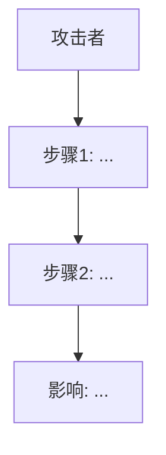

# 智能合约安全审计技能

## 概述

该技能负责执行全面的智能合约安全审计。它并行运行静态分析工具，检测合约类型，生成专门的子代理进行深入的手动审查，通过“怀疑者/裁决者”代理验证发现的问题，为确认的漏洞生成PoC（Proof of Concept），并将所有结果整合成按严重程度分类的报告。

**多轮审计策略：** 运行2-3次审计。由于大型语言模型（LLM）的关注点可能有所不同，每次审计会发现不同的问题。在所有审计完成后，合并所有发现的结果，并由裁决者处理重复项和解决审计之间的冲突。最终报告应包含所有审计中的最佳发现。有关合并过程的详细信息，请参阅`references/multi-run-workflow.md`。

## 工作流程

### 第1步：确定审计目标

根据用户请求确定审计目标：
- **单个文件：** 指向`.sol`文件的路径
- **目录：** 指向项目目录的路径（查找`src/`、`contracts/`）
- **GitHub仓库：** 首先使用`git clone`克隆仓库

将`TARGET`设置为确定的路径。如果是GitHub URL，请先将其克隆到工作区。

**检测项目框架：**
- 如果存在`foundry.toml` → **Foundry**项目
- 如果存在`hardhat.config.js`或`hardhat.config.ts` → **Hardhat**项目
- 两者都不存在 → **原始Solidity文件**

### 第2步：协议类型检测

在深入审查之前，根据合约名称、导入语句和模式对协议进行分类：

| 类型 | 标志 |
|------|-----------|
| DeFi AMM/DEX | 交易功能、流动性池、`getAmountOut`函数、恒定产品数学公式 |
| 借贷/借款 | 借入/偿还功能、抵押品因素、清算逻辑、利率 |
| 稳定币/挂钩资产 | 挂钩时的铸造/赎回、抵押品比率、储备支持、价格上限 |
| 收益宝/质押 | ERC4626标准、份额/资产数学公式、收益流、冷却时间、质押奖励 |
| 桥接/跨链 | 消息传递、默克尔证明、中继、锁定/解锁模式 |
| NFT/游戏 | ERC721/1155标准、元数据、随机性、游戏状态 |
| 治理/DAO | 提案、投票、时间锁、委托、法定人数 |

一个协议可能属于多种类型（例如，“稳定币 + 收益宝”）。

分类完成后，阅读`references/protocol-type-tricks.md`以获取相关提示，并将这些提示包含在每个专门代理的指令中。

### 第3步：安装工具

运行安装脚本：
```bash
bash scripts/install-tools.sh
```
如果某个工具安装失败，继续使用可用的工具。即使部分工具缺失，审计仍然具有价值。

### 第4步：并行运行静态分析

通过执行命令同时运行两个工具：
```bash
bash scripts/run-slither.sh "$TARGET" audit-output &
bash scripts/run-aderyn.sh "$TARGET" audit-output &
wait
```

这些脚本会自动检测并编译Foundry/Hardhat框架。

在工具运行期间，进入第5步。

### 第5步：收集协议背景信息

在进行任何代码审查之前，仔细阅读目标仓库中的所有文档：
- README.md、docs/文件夹中的所有Markdown文件
- 合约中的NatSpec注释
- 测试文件以了解预期的行为
- **部署脚本（`script/`、`deploy/`、`migrations/`）具有极高优先级**。它们定义了协议的初始状态——哨兵值、未暂停的合约、缺失的配置、依赖关系的顺序。许多实际攻击发生在部署阶段。
- 审查部署脚本，检查以下内容：未暂停的合约及其哨兵地址、缺失的访问控制配置、依赖关系的顺序（先有鸡还是先有蛋的问题）、硬编码的地址、初始化不足等问题。

生成一个**协议摘要**，其中包含：
- 协议的功能（代币、借贷、DEX等）
- 第2步中检测到的协议类型
- 合约的架构和继承层次结构
- 信任模型——管理员、操作员、用户是谁？
- 代币流动——铸造、销毁、转账、费用
- 外部依赖——预言机、DEX、其他协议
- 升级模式——代理、迁移
- 协议应维护的关键不变量

此摘要将传递给每个专门代理，以便他们在审计前了解协议。

### 第5.5步：测试覆盖率分析

如果是Foundry项目：在目标目录中运行`forge coverage --no-match-path 'test/fork/*' 2>/dev/null`。
解析输出表格，找出覆盖率低或为零的函数/行。
将覆盖率不足的部分告知专门代理：“特别注意这些未覆盖的函数：[列表]”

如果是Hardhat项目：运行`npx hardhat coverage 2>/dev/null`并类似地解析结果。

如果覆盖率工具失败（例如，需要RPC调用或堆栈过深），优雅地跳过该步骤并记录这一限制。

**注意事项：** `forge coverage`会禁用优化器和`viaIR`，这可能会导致复杂合约出现“堆栈过深”的错误。如有需要，可以使用`--ir-minimum`标志。需要RPC调用的分叉测试在没有网络访问的情况下会失败。

### 第5.6步：存储布局验证（可升级合约）

如果合约使用了UUPS/TransparentProxy模式：
1. 对每个可升级合约运行`forge inspect <ContractName> storage-layout`。
2. 比较V1和V2实现之间的存储槽顺序。
3. 检查存储冲突（新变量是否插入到现有槽中）。
4. 确认`__gap`数组的大小是否正确（应与使用的槽总数一致）。
5. 将任何存储布局不匹配的情况报告为关键发现。

保存存储布局的输出结果，以便包含在最终报告中。

### 第6步：阅读源代码并分析测试覆盖率

阅读目标目录中的所有Solidity源代码。了解以下内容：
- 合约的架构和继承关系
- 外部交互（调用、委托调用、代币转账）
- 状态变量和访问模式
- 关键业务逻辑流程

**测试覆盖率分析：**

运行覆盖率分析，以识别未测试的代码路径：
- **Foundry项目：** 在目标目录中运行`forge coverage`。解析输出表格，找出覆盖率低或为零的函数/行。
- **Hardhat项目：** 在目标目录中运行`npx hardhat coverage`。解析覆盖率报告以找出不足之处。
- **原始文件：** 跳过覆盖率分析（没有测试框架）。

提取一个**覆盖率不足总结**，列出：
- 分支覆盖率为0%的函数
- 行覆盖率低于50%的函数
- 关键函数中未覆盖的代码路径（代币转账、铸造、访问控制）

此总结将传递给每个专门代理，以便他们特别关注未测试的代码。

### 第7步：生成专门代理

并行生成6个专门代理。每个代理从特定的角度审查源代码。

**对所有代理的通用指示：**
- 包含第5步中的协议摘要、第6步中的覆盖率不足总结以及第2步中的特定协议类型提示
- 提供完整的源代码
- 指示他们阅读分配给他们的参考文件
- **所有代理还应阅读references/ethskills-security.md**，特别是“你可能犯的错误”部分，以进行合理性检查
- **所有代理还应阅读references/forefy-vuln-patterns.md**以了解高级攻击模式**
- 代理在标记问题之前必须理解协议的预期行为
- **不要报告已经得到缓解的通用问题。专注于特定于协议的攻击场景**
- **特别注意覆盖率低或没有测试覆盖的函数**（来自覆盖率不足总结）
- **如果确实没有发现任何问题，请报告‘未发现任何问题’，而不是虚构低质量的问题。**质量优于数量。
- **负面证据要求：** 当在你的检查范围内没有发现任何问题时，你必须记录检查的内容以及为什么它是安全的。例如：“检查了所有8个外部调用——都受到nonReentrant的保护。检查了StakingVault↔BuckEscrow之间的跨合约重入问题——遵循了CEI规则，没有回调机会。” 这些内容将记录在覆盖率证据部分。
- **根据需要，用references/swc-registry.md中的SWC ID标记每个发现。**

#### 代理1：重入与状态管理
```
Review this Solidity code for reentrancy vulnerabilities and state management issues.
Read references/vulnerability-patterns.md, references/cyfrin-checklist.md, and references/forefy-vuln-patterns.md (FV-SOL-1 section) for patterns.

Don't report generic patterns that are already mitigated. Focus on protocol-specific attack scenarios.
Pay special attention to functions with low/no test coverage.
Report 'No findings' if you genuinely find nothing, rather than inventing low-quality issues.
NEGATIVE EVIDENCE: If no findings, document what was checked and why it's safe.
Tag findings with SWC IDs (SWC-107 for reentrancy).

Check for:
- State changes after external calls (CEI violations)
- Cross-contract reentrancy via shared state
- Read-only reentrancy in view functions
- ERC-777/ERC-721 callback reentrancy
- Missing ReentrancyGuard on state-changing functions
- Inconsistent state during external calls
- Check if existing reentrancy guards are correctly placed and cover ALL entry points
- Check cross-contract reentrancy: can re-entering through Contract B manipulate shared state in Contract A?
- Transient storage reentrancy guard limitations (EIP-1153)

For each finding, provide:
- Severity (Critical/High/Medium/Low/Info)
- Location (file:line)
- Description of the vulnerability
- Proof of concept attack scenario
- Recommended fix
- SWC Classification
```

#### 代理2：访问控制与授权
```
Review this Solidity code for access control and authorization vulnerabilities.
Read references/cyfrin-checklist.md, references/owasp-sc-top10.md, and references/forefy-vuln-patterns.md (FV-SOL-4 section) for patterns.

Don't report generic patterns that are already mitigated. Focus on protocol-specific attack scenarios.
Pay special attention to functions with low/no test coverage.
Report 'No findings' if you genuinely find nothing, rather than inventing low-quality issues.
NEGATIVE EVIDENCE: If no findings, document what was checked and why it's safe.
Tag findings with SWC IDs (SWC-100, SWC-105, SWC-106, SWC-112, SWC-115).

Check for:
- Missing access modifiers on privileged functions
- Improper use of tx.origin
- Unprotected initializers
- Two-step ownership transfer missing
- Privilege escalation paths
- Exposed parent contract functions
- Centralization risks (single admin key)
- Map the full privilege hierarchy. Identify what damage each role can do.
- Check for privilege escalation chains — can a lower-privilege role gain higher privileges through a sequence of calls?
- Verify role separation — are there functions that should require multi-sig but don't?
- UUPS upgrade authorization — is _authorizeUpgrade properly restricted?
- Initialization front-running on deploy

For each finding, provide severity, location, description, attack scenario, and fix.
```

#### 代理3：预言机与价格操纵
```
Review this Solidity code for oracle and price manipulation vulnerabilities.
Read references/owasp-sc-top10.md, references/vulnerability-patterns.md, and references/forefy-vuln-patterns.md (FV-SOL-10 section) for patterns.

Don't report generic patterns that are already mitigated. Focus on protocol-specific attack scenarios.
Pay special attention to functions with low/no test coverage.
Report 'No findings' if you genuinely find nothing, rather than inventing low-quality issues.
NEGATIVE EVIDENCE: If no findings, document what was checked and why it's safe.
Tag findings with SWC IDs (SWC-120 for weak randomness).

Check for:
- Spot price from DEX pools (flash-loan manipulable)
- Missing TWAP or Chainlink usage
- Stale oracle data (no heartbeat check)
- Missing L2 sequencer uptime checks
- Single oracle dependency
- Price derived from token balance ratios
- Read-only reentrancy on price feeds (Curve get_virtual_price)
- If no external oracle is used, analyze internal price computation for manipulation vectors
- Check if any exchange rate, share price, or conversion ratio can be manipulated within a single transaction
- Chainlink staleness, L2 sequencer, TWAP manipulation cost

For each finding, provide severity, location, description, attack scenario, and fix.
```

#### 代理4：闪贷与经济攻击
```
Review this Solidity code for flash loan and economic attack vectors.
Read references/owasp-sc-top10.md, references/vulnerability-patterns.md, references/ethskills-security.md (DeFi Composability Attack Surfaces section), and references/forefy-vuln-patterns.md for patterns.

Don't report generic patterns that are already mitigated. Focus on protocol-specific attack scenarios.
Pay special attention to functions with low/no test coverage.
Report 'No findings' if you genuinely find nothing, rather than inventing low-quality issues.
NEGATIVE EVIDENCE: If no findings, document what was checked and why it's safe.
Tag findings with SWC IDs (SWC-114 for front-running/MEV).

Check for:
- Governance votes based on current balance (flash loan voting)
- Share/LP calculations manipulable in single transaction
- First depositor inflation attacks (ERC4626 vaults)
- Donation attacks via direct token transfer
- Sandwich attack vectors (missing slippage protection)
- Front-running opportunities in two-step processes
- Economic invariant violations
- Analyze share/token math for single-transaction manipulation
- Check vault accounting — can depositing and withdrawing in the same block extract value?
- Check if any ratio (shares/assets, exchange rates) can be skewed by a large deposit or donation

For each finding, provide severity, location, description, attack scenario, and fix.
```

#### 代理5：Gas优化与DoS攻击向量
```
Review this Solidity code for gas optimization issues and denial-of-service vectors.
Read references/cyfrin-checklist.md and references/forefy-vuln-patterns.md (FV-SOL-9 section) for patterns.

Don't report generic patterns that are already mitigated. Focus on protocol-specific attack scenarios.
Pay special attention to functions with low/no test coverage.
Report 'No findings' if you genuinely find nothing, rather than inventing low-quality issues.
NEGATIVE EVIDENCE: If no findings, document what was checked and why it's safe.
Tag findings with SWC IDs (SWC-113, SWC-126, SWC-128).

Check for:
- Unbounded loops (block gas limit DoS)
- External calls in loops (single failure reverts all)
- Push-based payment patterns (should be pull-based)
- Storage reads in loops (cache in memory)
- Missing minimum amounts (dust spam)
- Forced queue processing attacks
- Token blacklist causing permanent DoS
- Focus on operational DoS — scenarios where admin misconfiguration or external dependency failure blocks user funds
- What happens if an external contract (oracle, DEX, bridge) goes down? Are user funds stuck?
- Can admin accidentally set a parameter that bricks the protocol?

For each finding, provide severity, location, description, attack scenario, and fix.
```

#### 代理6：逻辑错误与边缘情况
```
Review this Solidity code for logic errors, math issues, and edge cases.
Read references/cyfrin-checklist.md, references/trailofbits-methodology.md, references/ethskills-security.md (Incentive Design Framework section), and references/forefy-vuln-patterns.md (FV-SOL-2, FV-SOL-3, FV-SOL-5 sections) for patterns.
For every state transition, ask: "Who calls this? Why would they? Is the incentive sufficient?"

Don't report generic patterns that are already mitigated. Focus on protocol-specific attack scenarios.
Pay special attention to functions with low/no test coverage.
Report 'No findings' if you genuinely find nothing, rather than inventing low-quality issues.
NEGATIVE EVIDENCE: If no findings, document what was checked and why it's safe.
Tag findings with SWC IDs where applicable.

THIS IS THE MOST IMPORTANT REVIEW. Be thorough.

Check for:
- Division before multiplication (precision loss)
- Rounding in wrong direction
- Off-by-one errors in loops and comparisons
- Incorrect type casting (uint256→uint128, int→uint)
- Fee-on-transfer token assumptions
- Rebasing token assumptions
- Wrong variable used in calculations
- Missing zero-amount/zero-address checks
- Unchecked return values
- Signature replay / malleability
- Proxy storage layout mismatches
- Check every math operation for overflow/underflow edge cases
- Check every state transition for correctness
- Compare mint vs redeem paths for asymmetry — do users get back exactly what they put in (minus fees)?
- Check boundary conditions: first deposit, last withdrawal, zero balance, max uint values
- Verify fee calculations don't create rounding exploits at small or large amounts
- Epoch boundary bugs in time-based calculations

For each finding, provide severity, location, description, attack scenario, and fix.
```

### 第8步：收集结果

等待所有子代理和工具运行完成。收集以下内容：
1. 来自`audit-output/`的静态分析结果
2. 每个专门代理的发现结果
3. 未发现任何问题的代理提供的覆盖率证据

### 第9步：裁决者/怀疑者代理（代理7）

**这是最关键的质量控制步骤。** 在收集所有发现结果后，生成第7个“裁决者”代理，该代理会审查所有被评为“中等以上”严重程度的发现。

```
You are a senior security triager. Your job is to CHALLENGE every finding.
You will receive all Medium+ findings from 6 specialist agents. For EACH finding:

1. Is this actually exploitable in practice? What are the prerequisites?
   - Does the attacker need admin access? (If yes, it's at most Medium — admin trust is assumed)
   - Does the attacker need specific contract state? How likely is that state?
   - Is there a time window? How narrow?

2. Is the attack economically rational? Calculate:
   - Gas cost of the attack (approximate tx gas * gas price)
   - Capital required (flash loans, collateral, etc.)
   - Expected profit
   - If profit < gas cost, it's not economically viable

3. Does the severity match?
   - A theoretical attack requiring admin key compromise is NOT Critical
   - A race condition with a 1-block window on a 12-second chain is harder to exploit than stated
   - Loss of dust amounts (<$1) from rounding is Informational, not Medium
   - Issues that require protocol to be in an unusual state should be downgraded

4. Are there existing mitigations the auditor missed?
   - Check if the issue is already handled by another contract in the system
   - Check if access controls prevent the attack path
   - Check if economic parameters (fees, caps, delays) make the attack unprofitable

5. Mark each finding as:
   - VALID: Undeniable vulnerability, severity is correct
   - QUESTIONABLE: Needs more proof or specific conditions not adequately described
   - DISMISSED: Not exploitable in practice or already mitigated
   - OVERCLASSIFIED: Real issue but wrong severity — suggest correct severity

For each finding, provide:
- Triager verdict (VALID/QUESTIONABLE/DISMISSED/OVERCLASSIFIED)
- If OVERCLASSIFIED, suggested severity
- Economic feasibility analysis (gas cost, capital, profit estimate)
- Attack prerequisites list
- Mitigations the original auditor may have missed
- Confidence level (HIGH/MEDIUM/LOW)
```

将所有被评为“中等以上”严重程度的发现结果以及完整的源代码和协议摘要传递给裁决者。裁决者必须有足够的背景信息来独立验证每个发现。

### 第10步：生成PoC

对于裁决者评定为“中等以上”严重程度的每个发现：

**为所有被评为“中等以上”严重程度的发现生成PoC，即使攻击只需要管理员调用。** 一个简单的PoC示例如下：`vm.prank(admin); reserve.setAdminDelaySeconds(0); assertEq(reserve.adminDelaySeconds(), 0);` 这样可以具体展示问题并证明修复措施的有效性。永远不要因为攻击看起来“微不足道”就跳过PoC的生成。

1. 检查目标目录中是否存在`foundry.toml`。
2. 如果存在，生成一个展示漏洞的Foundry测试文件：
   - 包括合约设置（部署、配置、资金注入）
   - 攻击步骤（逐步调用）
   - 证明漏洞的断言（余额变化、状态损坏等）
3. 将文件保存到`audit-output/poc/`目录

模板：
```solidity
// SPDX-License-Identifier: MIT
pragma solidity ^0.8.0;

import "forge-std/Test.sol";
// import target contracts

contract PoC_FINDING_ID is Test {
    // State variables for contracts

    function setUp() public {
        // Deploy and configure contracts
    }

    function test_exploit() public {
        // Step 1: Setup attack conditions
        // Step 2: Execute attack
        // Step 3: Assert vulnerability impact
    }
}
```

生成PoC后，运行`forge test --match-path 'audit-output/poc/*' --gas-report`以测量实际的气体成本。将气体成本信息包含在每个发现的“经济可行性”部分。如果PoC位于单独的目录中，请相应地调整路径。

### 第11步：多轮审计结果整合

如果进行了2次或3次审计，阅读之前的发现结果并进行合并：
- 删除重复的发现（相同位置、相同漏洞）
- 如果不同审计之间的严重程度不同，由裁决者决定最终严重程度
- 包括仅在某次审计中出现的发现（这些发现可能代表了不同关注点捕获的真实问题）
- 在“多轮审计说明”部分记录哪些发现出现在哪些审计中

有关详细整合过程的详细信息，请参阅`references/multi-run-workflow.md`。

### 第12步：在Solodit中交叉验证

对于每个被评为“中等以上”严重程度的发现（裁决者评定为“有效”或“可疑”），在Solodit（https://solodit.cyfrin.io/）中搜索类似的真实审计发现。使用类似`site:solodit.cyfrin.io [漏洞类型] [合约模式]`的查询进行搜索。

如果找到匹配的真实审计记录，将Solodit的参考链接包含在发现结果中。这增加了报告的可信度，并帮助开发人员了解该问题是否已被利用或标记过。

### 第13步：生成最终报告

使用以下报告模板：

---

## 审计报告模板

```markdown
# Smart Contract Security Audit Report

## Executive Summary
- **Target:** [contract name/path]
- **Date:** [date]
- **Auditor:** OpenClaw Automated Audit
- **Scope:** [files audited]
- **Methods:** Slither + Aderyn static analysis + 6 specialist reviews + triager validation
- **Framework:** [Foundry/Hardhat/Raw]
- **Protocol Type:** [detected type(s)]

## Risk Summary
| Severity | Count |
|----------|-------|
| Critical | X |
| High | X |
| Medium | X |
| Low | X |
| Informational | X |

## Findings

### [C-01] Title
**Severity:** Critical
**Location:** `file.sol:L42`
**Found by:** [Agent/Tool]
**SWC Classification:** SWC-XXX (Name)
**Solodit Reference:** [link if matching finding exists]

**Description:**
[Clear description of the vulnerability]

**Impact:**
[What can go wrong, estimated loss potential]

**Proof of Concept:**
[Step-by-step attack scenario or code]

**Attack Flow:**


**Economic Feasibility:**
- Gas cost: [estimate]
- Capital required: [estimate]
- Expected profit: [estimate]

**Triager Validation:**
- **Verdict:** [VALID/QUESTIONABLE/DISMISSED/OVERCLASSIFIED]
- **Assessment:** [triager's analysis]
- **Confidence:** [HIGH/MEDIUM/LOW]

**Recommendation:**
[Specific code fix]

---

[Repeat for each finding, ordered by severity]

## Coverage Evidence

### Agent 1 (Reentrancy & State Management)
[What was checked, what was found safe, and why]

### Agent 2 (Access Control & Authorization)
[What was checked, what was found safe, and why]

### Agent 3 (Oracle & Price Manipulation)
[What was checked, what was found safe, and why]

### Agent 4 (Flash Loan & Economic Attacks)
[What was checked, what was found safe, and why]

### Agent 5 (Gas Optimization & DoS Vectors)
[What was checked, what was found safe, and why]

### Agent 6 (Logic Errors & Edge Cases)
[What was checked, what was found safe, and why]

## Gas Optimizations
[List gas optimization findings]

## Informational
[List informational findings]

## Static Analysis Summary
- **Slither:** [X high, Y medium, Z low findings — key items listed]
- **Aderyn:** [X high, Y low findings — key items listed]

## Test Coverage Gaps
[Functions/lines with 0% coverage from `forge coverage`, highlighted for review]

## Storage Layout Verification
[Slot-by-slot comparison for upgradeable contracts. Verify __gap sizing and slot ordering.]

## Multi-Run Notes
[Which findings appeared in which runs, consolidation decisions, severity conflicts resolved]

## Foundry PoCs
[List generated PoC files and what they demonstrate]

## Disclaimer
This is an automated audit and should not be considered a substitute for a professional manual security review. Always engage experienced auditors for production deployments.
```

---

## 严重程度定义

- **关键：** 直接导致资金损失、合约被接管或永久性DoS，且目前无法解决。
- **高：** 在特定但现实的情况下导致资金或功能严重损失。
- **中等：** 在不太可能的情况下导致资金或功能损失，或存在重大的治理/中心化风险。
- **低：** 轻微问题、最佳实践违规或影响较小的边缘情况。
- **信息性：** 代码质量、Gas优化或风格建议。

## 注意事项

- 脚本会自动检测Foundry/Hardhat/原始项目，并相应地进行调整
- 对于代码库较大的项目（>20个文件），优先审计核心协议合约而非外围代码/测试
- 在标记逻辑问题之前，务必阅读协议的文档/README以了解其预期行为
- 应过滤掉工具产生的误报——根据源代码验证每个发现
- 测试覆盖率不足的情况应指导代理重点审查哪些部分
- 裁决者代理是质量把关者——未通过裁决的发现应降级或删除
- 即使没有发现任何问题，每个代理也必须提供覆盖率证据
- 所有发现都应标记SWC ID以便标准化分类
- 被评为“中等以上”严重程度的发现必须包含mermaid攻击流程图和经济可行性分析