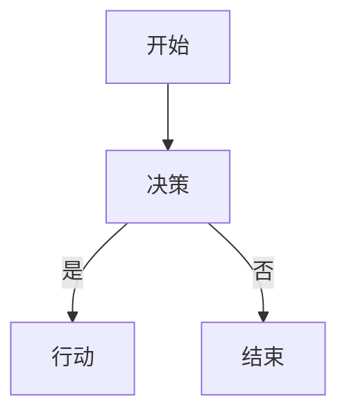
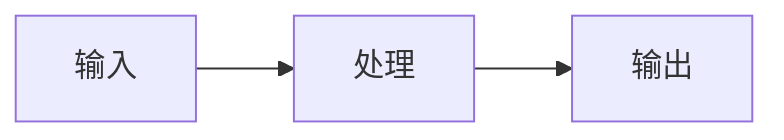

# BangunAI 博客管理器（数字花园 + 内容工作流）

**首页：** React 18 + Vite + MDX + shadcn/ui  
**博客根目录：** `/home/hades/BangunAI-Blog`  
**内容根目录：** `/home/hades/BangunAI-Blog/src/content`  
**技术栈：** TypeScript, Tailwind CSS, Mermaid 11, KaTeX, Shiki

该技能整合了以下功能：
- 定制的博客内容工作流（每日笔记、样式获取、通用写作工具、日志记录、智能阅读功能）
- 基于 MDX 的写作系统，适用于 React 架构的数字花园  
- 具有类似 Obsidian 的特性（注释、Mermaid 图表、LaTeX 数学公式、维基链接、回链功能）  
- 通过 `import.meta.glob` 实现自动导入内容的功能  

---

## 🌿 BangunAI 博客基础

该博客是一个 **数字花园与知识库**，其设计灵感来源于 Obsidian。

### 项目结构

```
/home/hades/BangunAI-Blog/
├── src/
│   ├── content/
│   │   ├── writing/       # Blog posts (notes, essays)
│   │   ├── articles/      # Technical articles, tutorials
│   │   ├── read/          # Reading notes, link curation
│   │   ├── daily/         # Daily notes (tasks, logs)
│   │   ├── about.mdx      # About page (single file)
│   │   ├── now.mdx        # Now page (current activities)
│   │   └── index.ts       # Auto-import loader
│   ├── components/        # React components (40+ shadcn/ui)
│   │   ├── Callout.tsx    # 14 tipe callouts
│   │   ├── MermaidDiagram.tsx  # Mermaid renderer
│   │   ├── WikiLink.tsx   # Internal linking
│   │   ├── Backlinks.tsx  # Auto backlinks
│   │   ├── GraphView.tsx  # Knowledge graph
│   │   └── ui/            # shadcn/ui components
│   ├── pages/             # Route pages
│   ├── lib/               # Utilities
│   │   ├── date.ts        # Date formatting
│   │   └── utils.ts       # Class utilities
│   └── data/
│       ├── posts.ts       # Helper functions
│       └── types.ts       # TypeScript types
├── public/                # Static assets
├── skill/                 # Agent skills (this!)
└── package.json           # Dependencies
```

### 内容类型

| 类型 | 描述 | 位置 | 特性 |
|------|-------------|----------|----------|
| **写作** | 个人笔记、文章 | `src/content/writing/` | 可按类型（笔记/文章）、类别、标签筛选 |
| **文章** | 技术教程、指南 | `src/content/articles/` | 按年份分组 |
| **阅读** | 精选阅读内容 | `src/content/read/` | 包含原文链接、摘录、标签 |
| **每日记录** | 每日笔记、任务、日志 | `src/content/daily/` | 支持任务滚动显示、时间戳功能 |
| **关于我们** | 关于页面（MDX 格式） | `src/content/about.mdx` | 单页静态页面 |
| **当前活动** | 当前活动更新 | `src/content/now.mdx` | 定期更新 |

### 自动导入系统

`src/content/index.ts` 文件通过 `import.meta.glob` 自动检测所有 `.mdx` 文件：

```typescript
// NO MANUAL REGISTRATION NEEDED!
const writingModules = import.meta.glob("./writing/*.mdx", { eager: true });
const articleModules = import.meta.glob("./articles/*.mdx", { eager: true });
const readModules = import.meta.glob("./read/*.mdx", { eager: true });
```

**优势：** 创建文件后 → 立即被自动检测并可用  

---

## 📝 前端内容格式

### 格式 A：标准文章（写作、文章、每日记录）

**必填字段：**
- `title` — 文章标题（字符串）  
- `slug` — 适合 URL 的slug（使用 kebab-case 格式）  
- `summary` — 简短且吸引人的描述（1-2 句）  
- `type` — 内容类型：  
  - `note` — 简短笔记  
  - `essay` — 深度文章  
  - `article` — 结构化的教程  
- `category` — 主要类别（可选）：  
  - `Tech` — 技术、编程、工具  
  - `Refleksi` — 个人反思  
  - `Produktivitas` — 生产力相关  
  - `Linux` — Linux 系统、终端操作  
  - `Coding` — 编程实践、模式  
  - `Life` — 生活方式、经历  
- `tags` — 标签数组（小写、使用 kebab-case 格式）  
- `date` — ISO 时间戳（格式：YYYY-MM-DDTHH:mm:ss）  
- `readingTime` — 预计阅读时间（约 200 字/分钟）  

**可选字段：**  
- `featured` — 是否作为首页的推荐文章  

### 格式 B：阅读内容（阅读页面）

**必填字段：**
- `title` — 文章标题（字符串）  
- `slug` — 适合 URL 的 slug（使用 kebab-case 格式）  
- `snippet` — 文章的精彩摘录  
- `source` — 文章来源链接（例如：`github.com`、`dev.to`）  
- `tags` — 标签数组（小写）  
- `date` — ISO 时间戳  

**正文内容：** 可选，用于个人笔记  

### 格式 C：特殊页面（关于我们、当前活动）

**最低要求的前端内容：** 仅需要 `title`  

---

## 🧩 可用的 MDX 组件

### 1. 注释组件（14 种类型）

**可用类型：**
- `info` — 通用信息（蓝色）  
- `tip` — 技巧与提示（绿色）  
- `warning` — 警告（黄色）  
- `danger` — 危险/错误（红色）  
- `success` — 成功消息（亮绿色）  
- `note` — 笔记（灰色）  
- `example` — 示例代码（紫色）  
- `bug` — 错误报告（红色）  
- `question` — 问题（浅蓝色）  
- `abstract` — 摘要/总结（靛蓝色）  
- `important` — 重要信息（橙色）  
- `caution` — 警告（深黄色）  
- `quote` — 引用（米色）  
- `cite` — 引用来源（深米色）  

**Obsidian 的引用格式：**  
```mdx
> [!info] Judul Callout
> Isi callout menggunakan sintaks Obsidian.
```

### 2. Mermaid 图表  



**支持的图表类型（Mermaid v11）：**
- `graph` / `flowchart` — 流程图  
- `sequenceDiagram` — 序列图  
- `pie` — 饼图  
- `classDiagram` — UML 类图  
- `stateDiagram-v2` — UML 状态图  
- `erDiagram` — 实体关系图  
- `gantt` — 甘特图  
- `mindmap` — 思维导图  
- `timeline` — 时间轴图  

**特性：**  
- 自动根据主题调整图表颜色（亮色/暗色）  
- 每个图表都有唯一的 ID（避免冲突）  
- 图表支持响应式布局  

### 3. LaTeX 数学公式（KaTeX）  

**使用 KaTeX 0.16** 进行数学公式的渲染  

### 4. 维基链接（内部链接）  

**特性：**  
- 如果目标 slug 不存在，会自动显示斜线标记  
- 自动从所有文章中检测链接  

### 5. 代码高亮显示  

### 6. YouTube 视频嵌入  

**特性：**  
- 响应式 iframe  
- 自动保持 16:9 的宽高比  

### 7. 代码块（使用 Shiki 进行高亮显示）  

```typescript
function hello(name: string): string {
  return `Hello, ${name}!`;
```

**特性：**  
- 使用 `github-dark-dimmed` 主题进行高亮显示  
- 提供复制按钮  
- 支持多种编程语言（TypeScript、Python、Bash 等）  

### 8. GFM（GitHub 风格的 Markdown）  

**表格格式：**  
```mdx
| Column 1 | Column 2 |
|----------|----------|
| Value A  | Value B  |
```  

**任务列表：**  
```mdx
- [x] Completed task
- [ ] Uncompleted task
```  

**斜线标记：**  
```mdx
~~deleted text~~
```  

### 9. 回链功能  

在每篇文章的详细页面中自动生成回链，显示引用该文章的其他文章。  

### 10. 图表视图  

交互式有向图显示内容之间的关联关系。  

### 11. 目录页  

- 在桌面版中固定显示  
- 在移动版中通过下拉栏显示  
- 跟踪活跃的标题  
- 显示进度条  

---

## 🎨 设计系统  

### 颜色方案（基于 HSL）

**默认模式（暗色）：**  
- `--background` — 深海蓝（#1A1A2E）  
- `--foreground` — 奶油色（#F5E6D3）  
- `--primary` — 金色/琥珀色（主要色调）  
- `--accent` — 温暖的金色（鼠标悬停时显示）  
- `--card` — 更浅的海军蓝  

**明亮模式：**  
- `--background` — 温暖的奶油色  
- `--foreground` — 深海蓝  
- `--primary` — 深琥珀色  
- `--card` — 更深的奶油色  

**使用方式：**  
```tsx
// ✅ Gunakan semantic tokens
<div className="bg-background text-foreground">
  <button className="bg-primary text-primary-foreground">
    Klik
  </button>
</div>

// ❌ Jangan hardcode warna
<div className="bg-[#1A1A2E] text-[#F5E6D3]">
```  

### 字体方案  

| 字体 | 用途 |
|------|-------|
| **Space Grotesk** | 标题和导航元素 |
| **Source Serif 4** | 文章正文（衬线字体） |
| **Inter** | 用户界面元素和标签  
| **JetBrains Mono** | 代码块和内联代码  

### 其他设计元素  

---  

## 🔧 工作流程  

### 1) **每日笔记**  
创建每日笔记，自动显示昨天的未完成任务。  

### 2) **获取最新样式参考**  
获取所有类别的最新文件（包括特殊页面）。  

### 3) **编写新内容**  
使用完整的前端内容格式编写新文章。  

**写作/文章示例：**  
```typescript
function example(): string {
  return "Hello World";
```


**阅读内容示例：**  
---  

### 4) **记录日志**  
将带有时间戳的日志添加到每日笔记中。  

### 5) **智能阅读**  
通过关键词智能搜索内容。  

### 6) **更新关于我们页面**  
使用 MDX 更新关于页面的内容。  

### 7) **更新当前活动页面**  
更新当前活动的显示内容。  

### 8) **验证内容导入**  
验证内容的自动导入情况。  

---

## 📋 内容分类指南  

| 类别 | 路径 | 使用场景 | 类型选项 | 示例 |
|----------|------|----------|--------------|----------|
| **写作** | `src/content/writing/` | 个人笔记、文章 | `note`, `essay` | 反思、简短笔记、深度思考 |
| **文章** | `src/content/articles/` | 技术教程、指南 | `article` | 操作指南、技术深度解析 |
| **阅读** | `src/content/read/` | 阅读笔记、精选链接 | 无（特殊格式） | 精选文章、书签 |
| **每日记录** | `src/content/daily/` | 每日笔记、任务、日志 | `daily` | 任务跟踪、每日记录 |
| **关于我们** | `src/content/about.mdx` | 关于页面（静态页面） | 无 | 个人简介、站点信息 |
| **当前活动** | `src/content/now.mdx` | 当前活动更新 | 无 | 我正在做的事情 |

### 类别选择建议：**  
- `Tech`：技术、编程、工具、框架  
- `Refleksi`：个人反思、思考  
- `Produktivitas`：生产力技巧、工作流程  
- `Linux`：Linux 系统、终端操作  
- `Coding`：编程实践、模式  
- `Life`：生活方式、个人经历  

---

## 🎯 最佳实践  

### 1. 前端内容的一致性  

**建议：**  
```yaml
title: "Belajar React Hooks di 2026"
slug: belajar-react-hooks-2026
type: note
category: Tech
tags: [react, hooks, javascript]
date: "2026-02-12T15:30:00"
```  

**避免：**  
```yaml
title: belajar-react-hooks    # Missing quotes
slug: Belajar React Hooks     # Not kebab-case
type: blog                     # Invalid type
category: technology           # Typo/wrong value
tags: React, Hooks             # Not array format
date: "2026-02-12"            # Missing time
```  

### 2. 文件命名规则  

**建议：**  
```
belajar-react-hooks-2026.mdx
setup-neovim-lua.mdx
refleksi-tahun-2025.mdx
```  

**避免：**  
```
Blog Post 1.mdx              # Spaces, not descriptive
temp.mdx                     # Non-descriptive
NEW_POST.mdx                 # Uppercase, underscore
```  

### 3. 内容结构推荐：**  
```mdx
---
frontmatter here
---

## Introduction (H2)
Brief intro, hook the reader.

<Callout type="info">
Context or prerequisite info.
</Callout>

## Main Section 1 (H2)

### Subsection A (H3)
Content...

### Subsection B (H3)
Content...

## Main Section 2 (H2)

### Examples (H3)
Code or examples...

## Conclusion (H2)
Summary and takeaways.
```  

### 4. 使用 MDX 组件  

**建议：**  
```mdx
<Callout type="tip" title="Pro Tip">
Use semantic components for better UX.
</Callout>

<WikiLink to="related-article" label="Read more about this" />
```  

**避免：**  
```mdx
<div style="background: yellow; padding: 10px;">
Hardcoded styling instead of using Callout
</div>

<a href="/artikel/related-article">Read more</a>
<!-- Should use WikiLink instead -->
```  

### 5. 日期和时间格式**  
使用 ISO 时间戳格式：  
**显示方式：**  
- 详情页面：`2026年2月11日，14:30`  
- 卡片列表：`2月11日 · 14:30`  

### 6. 预计阅读时间**  
提供文章的预计阅读时间。  

### 7. 标签使用建议：**  
- 使用小写  
- 使用 kebab-case 格式为多词标签  
- 在不同文章中保持标签的一致性  
- 优先使用具体而非泛化的标签  

**示例标签：**  
---  
**错误标签示例：**  
---  

### 8. 开发工作流程  

### 本地开发流程  

1. **获取样式参考**  
2. **创建新文件**  
3. **验证自动导入功能**  
4. **构建并部署**  

### Git 工作流程  

---  

## 🔍 故障排除  

### 问题：内容未显示  

**检查：**  
1. 前端内容是否完整？（所有必填字段是否齐全）  
2. MDX 语法是否正确？（没有未闭合的标签）  
3. 文件是否位于正确的目录？  
4. 开发服务器是否已重启？  

### 问题：Mermaid 图表无法渲染  

**检查：**  
1. Mermaid 语法是否正确？  
2. 支持的图表类型是否正确？  
3. 查看浏览器控制台是否有错误信息？  

### 问题：维基链接显示斜线标记  

**原因：**  
目标 slug 不存在  
**解决方法：**  
1. 确认目标 slug 是否存在  
2. 检查拼写  
3. 确保目标文件包含有效的前端内容  

### 问题：LaTeX 公式无法渲染  

**检查：**  
1. LaTeX 语法是否正确？  
2. 是否正确使用了转义字符？  
3. 是否正确使用了 `$` 或 `$$` 作为分隔符？  

---

## 📚 快速参考  

### 前端内容编写/文章格式指南  

### 阅读内容格式指南  

### 特殊页面格式指南  

### MDX 组件使用指南  

| 组件 | 使用方法 |
|-----------|-------|
| 注释 | `<Callout type="info" title="...">...</Callout>` |
| Mermaid | ````mermaid ... ``` ` |
| LaTeX | `$...$` 或 `$$...$$` |
| 维基链接 | `<WikiLink to="slug" label="..." />` |
| 代码高亮 | `<Highlight>...</Highlight>` |
| YouTube 视频 | `<YouTube url="..." title="..." />` |

### 文件位置指南  

| 类型 | 存储位置 |
|------|----------|
| 写作内容 | `src/content/writing/*.mdx` |
| 文章 | `src/content/articles/*.mdx` |
| 阅读内容 | `src/content/read/*.mdx` |
| 每日记录 | `src/content/daily/*.mdx` |
| 关于我们 | `src/content/about.mdx` |
| 当前活动 | `src/content/now.mdx` |
| 索引 | `src/content/index.ts` |

---

## 🎉 总结  

该技能已与 **BangunAI 博客** 完全集成：  
- 提供 8 种可用的工作流程  
- 支持 3 种前端内容格式  
- 提供完整的 MDX 组件参考  
- 文档中详细说明了类似 Obsidian 的特性  
- 提供设计系统指南和最佳实践  
- 支持自动导入功能  
- 基于 Git 的开发流程  
- 已准备好投入生产使用  

**官网：** https://github.com/dwirx/BangunAI-Blog