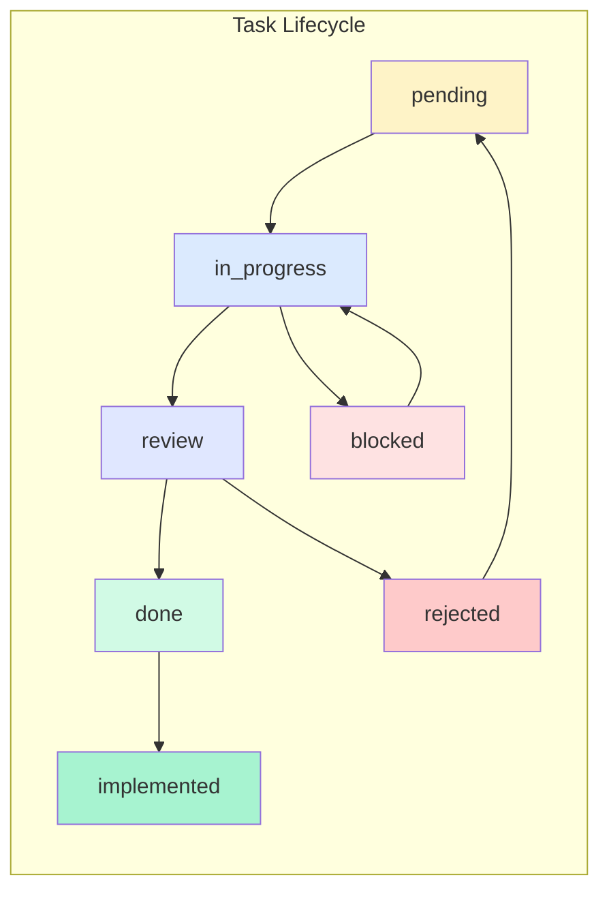

# OGT 文档 - 任务创建

本文档提供了在“文档优先”（docs-first）工作流程中创建和管理任务的完整指南。

## 概述

任务是“文档优先”系统中的工作单元。每个任务都相当于一个文件夹，它会依次经历不同的工作流程阶段，在此过程中逐步积累文档和相关的信号（signals）。



## 文件夹结构

```
docs/todo/
├── pending/                    # Tasks not yet started
│   └── {task_slug}/
│       ├── task.md             # Primary task definition
│       ├── context.md          # Background information (optional)
│       ├── .version            # Schema version
│       └── .priority           # Priority level (content: critical|high|medium|low)
│
├── in_progress/                # Tasks being actively worked on
│   └── {task_slug}/
│       ├── task.md
│       ├── progress.md         # Work log and updates
│       ├── .version
│       ├── .priority
│       ├── .assigned_to_{agent}  # Who's working on it
│       └── .started_at         # Timestamp when started
│
├── review/                     # Tasks awaiting review
│   └── {task_slug}/
│       ├── task.md
│       ├── progress.md
│       ├── implementation.md   # What was done
│       ├── .version
│       ├── .ready_for_review   # Empty signal
│       ├── .pr_link            # PR URL if applicable
│       └── .review_requested_at
│
├── blocked/                    # Tasks that cannot proceed
│   └── {task_slug}/
│       ├── task.md
│       ├── progress.md
│       ├── .version
│       ├── .blocked            # Empty signal
│       ├── .blocked_reason     # Why blocked (content)
│       ├── .blocked_at         # When blocked
│       └── .depends_on         # What it's waiting for
│
├── done/                       # Completed and verified tasks
│   └── {task_slug}/
│       ├── task.md
│       ├── progress.md
│       ├── implementation.md
│       ├── verification.md     # How it was verified
│       ├── .version
│       ├── .verified           # Empty signal - REQUIRED
│       ├── .completed_at       # Completion timestamp
│       └── .verified_by_{agent}  # Who verified
│
├── rejected/                   # Tasks that were declined
│   └── {task_slug}/
│       ├── task.md
│       ├── .version
│       ├── .rejected           # Empty signal
│       ├── .rejected_reason    # Why rejected (content)
│       └── .rejected_at        # When rejected
│
└── implemented/                # Done tasks that are deployed/released
    └── {task_slug}/
        ├── task.md
        ├── implementation.md
        ├── verification.md
        ├── .version
        ├── .verified
        ├── .completed_at
        ├── .implemented_at     # When deployed
        └── .release_version    # Which release included it
```

---

## 阶段：待处理（pending）

这些任务已被定义，但尚未开始执行。

### 示例：pending/fuzzy_search/

```
pending/
└── fuzzy_search/
    ├── task.md
    ├── context.md
    ├── .version
    └── .priority
```

#### task.md

```markdown
# Task: Fuzzy Search Implementation

## Summary

Replace substring search with fuzzy indexed search using MiniSearch.

## Objectives

- Install MiniSearch library
- Create SearchIndexService
- Refactor GlobalSearch component
- Add debounce to search input

## Acceptance Criteria

- [ ] Typing "fir" returns "Fireball", "Fire Elemental", etc.
- [ ] Results ranked by relevance
- [ ] Search responds within 16ms
- [ ] TypeScript compiles clean

## Dependencies

- None

## Estimated Effort

Medium (2-4 hours)

## References

- MiniSearch docs: https://lucaong.github.io/minisearch/
- Current search: front/components/features/GlobalSearch.tsx
```

#### context.md

```markdown
# Context: Fuzzy Search

## Current State

GlobalSearch.tsx uses `String.toLowerCase().includes()` for matching.
No ranking, no debounce, no fuzzy matching.

## User Request

"Global search with ctrl+k, should be instant, indexed, fuzzy.
If I search fire just by typing fir I should get instantly a list."

## Technical Decision

MiniSearch chosen over:

- Fuse.js (heavier, slower on large datasets)
- Lunr (no fuzzy matching)

MiniSearch is 6KB gzipped, used by VitePress.
```

#### .version

```json
{ "schema": "1.0", "created": "2026-02-05T10:00:00Z" }
```

#### .priority

```
high
```

---

## 阶段：进行中（in_progress）

这些任务正在积极处理中。

### 示例：in_progress/card_variants/

```
in_progress/
└── card_variants/
    ├── task.md
    ├── progress.md
    ├── .version
    ├── .priority
    ├── .assigned_to_claude
    └── .started_at
```

#### task.md

```markdown
# Task: Card Variant System Expansion

## Summary

Add Condensed, ListItemCondensed, and stub Quaternary/Penta card variants.

## Objectives

- Update UICardFrameType enum
- Create \*Condensed.tsx components
- Create \*ListItemCondensed.tsx components
- Stub Quaternary and Penta variants
- Update all \*CardMain.tsx orchestrators

## Acceptance Criteria

- [ ] Condensed renders 48-64px tile with art, border, icon badge
- [ ] ListItemCondensed renders 32px single-line row
- [ ] Quaternary/Penta exist as stubs
- [ ] All orchestrators route to new variants
- [ ] TypeScript compiles clean

## Dependencies

- None

## Estimated Effort

Large (4-8 hours)
```

#### progress.md

```markdown
# Progress: Card Variants

## 2026-02-05 10:30 - Started

- Read existing card components
- Identified 8 entity types needing variants
- Created implementation plan

## 2026-02-05 11:00 - UICardFrameType Updated

- Added Condensed, Penta, ListItem, ListItemCondensed to type
- File: front/data/app-generics.ts:82

## 2026-02-05 11:30 - CreatureCardCondensed Created

- Created front/components/compendium/CreatureCardCondensed.tsx
- 64x64 portrait, rarity border, type icon badge
- Tooltip on hover shows name

## Current Status

- [x] Type definition updated
- [x] CreatureCardCondensed
- [ ] ItemCardCondensed
- [ ] AbilityCardCondensed
- [ ] Remaining entity types
- [ ] ListItemCondensed variants
- [ ] Quaternary/Penta stubs
- [ ] Orchestrator updates
```

#### .assigned_to_claude

```
(empty file - presence indicates assignment)
```

#### .started_at

```
2026-02-05T10:30:00Z
```

---

## 阶段：审核中（review）

这些任务已完成，正在等待审核。

### 示例：review/spell_routes/

```
review/
└── spell_routes/
    ├── task.md
    ├── progress.md
    ├── implementation.md
    ├── .version
    ├── .ready_for_review
    ├── .pr_link
    └── .review_requested_at
```

#### task.md

```markdown
# Task: Wire SpellDetailView into Router

## Summary

SpellDetailView.tsx exists but is not routed. Wire it into the app router.

## Objectives

- Add route to APP_ROUTES
- Add Route element in App.tsx
- Verify component loads correctly

## Acceptance Criteria

- [ ] /spells/:slug route works
- [ ] SpellDetailView renders with spell data
- [ ] Navigation from spell cards works
- [ ] TypeScript compiles clean
```

#### progress.md

```markdown
# Progress: Spell Routes

## 2026-02-05 09:00 - Started

- Located SpellDetailView at front/app/(main)/compendium/SpellDetailView.tsx
- Reviewed existing route patterns

## 2026-02-05 09:15 - Implementation Complete

- Added spell_detail to APP_ROUTES in app-configs.ts
- Added Route element in App.tsx
- Tested with /spells/fireball - works
- TypeScript compiles clean
```

#### implementation.md

````markdown
# Implementation: Spell Routes

## Files Changed

### front/data/app-configs.ts

Added route configuration:

```typescript
spell_detail: {
  path: '/spells/:slug',
  label: 'Spell Detail',
}
```
```

### front/app/App.tsx

添加了导入语句和路由配置：

```typescript
import SpellDetailView from './(main)/compendium/SpellDetailView';
// ...
<Route path="/spells/:slug" element={<SpellDetailView />} />
```

## 测试

- 手动测试：/spells/fireball 能正确加载
- 手动测试：/spells/magic-missile 能正确加载
- TypeScript 编译无误

```

#### .ready_for_review
```

（空文件）

```

#### .pr_link
```

https://github.com/org/repo/pull/123

```

#### .review_requested_at
```

2026-02-05T09:30:00Z

```

---

## Stage: blocked/

Tasks that cannot proceed due to dependencies or blockers.

### Example: blocked/auth_refactor/

```

blocked/
└── auth_refactor/
├── task.md
├── progress.md
├── .version
├── .blocked
├── .blocked_reason
├── .blocked_at
└── .depends_on

````

#### task.md
```markdown
# 任务：认证服务重构（Auth Service Refactor）

## 目标
- 重构 AuthService 以支持多种 OAuth 提供商
- 添加 Steam OAuth 支持
- 实现令牌刷新机制
- 更新所有使用认证服务的组件

## 接受标准
- [ ] Google OAuth 仍然可用
- [ ] Discord OAuth 仍然可用
- [ ] Steam OAuth 可用
- [ ] 令牌刷新功能自动触发
- [ ] API 不会发生任何破坏性变更

## 进度

## 2026-02-03 14:00 - 开始
- 分析当前的 AuthService 实现
- 确定了 3 个需要重构的代码路径

## 2026-02-03 15:00 - 暂停
- Steam OAuth 需要服务器端修改
- 后端团队需要将 Steam 提供商添加到 Strapi 中
- 在后端工作完成之前无法继续

## 等待事项
- 后端任务：“将 Steam OAuth 提供商添加到 Strapi”

```

#### .blocked

```
（空文件）
```

#### .blocked_reason

```
**注意：** 在前端实现 Steam 登录功能之前，必须先在后端添加 Steam OAuth 提供商。

```

#### .blocked_at

```
2026-02-03T15:00:00Z
```

#### .depends_on

```
- backend/steam.oauth_provider （尚未创建）
- Strapi 插件配置

```

---

## Stage: done/

Completed tasks that have been **verified**.

### Example: done/ogt_cli_commands/

```
done/
└── ogt_cli_commands/
    ├── task.md
    ├── progress.md
    ├── implementation.md
    ├── verification.md
    ├── .version
    ├── .verified
    ├── .completed_at
    └── .verified_by_claude
```

#### task.md

```markdown
# 任务：OGT 命令行工具（OGT CLI Commands）

## 目标

在 `ogt check` 下创建通用的文件和数据验证命令行工具。

## 目标
- `ogt check assets`：检查缺失的文件
- `ogt check slugs`：验证 slug 的格式
- `ogt check indexed`：验证 `index.ts` 的导出内容
- `ogt check data`：根据schema 验证数据

## 接受标准
- [x] 所有命令都支持 `--help` 参数
- [x] 命令返回正确的退出代码
- [x] 支持 JSON 输出格式
- [x] TypeScript 编译无误

```

#### verification.md

```
# 验证：OGT 命令行工具（Verification: OGT CLI Commands）

## 验证日期：2026-01-30

## 执行的测试

### 命令存在性测试

```bash
$ ogt check --help
# ✅ Shows subcommands: assets, slugs, indexed, data, from-list

$ ogt check assets --help
# ✅ Shows usage and flags

$ ogt check slugs --help
# ✅ Shows usage and flags

$ ogt check indexed --help
# ✅ Shows usage and flags

$ ogt check data --help
# ✅ Shows usage and flags
```
````

### Functional Tests

```bash
$ ogt check indexed creatures
# ✅ 返回 JSON，显示共有 197 个条目，全部通过验证

$ ogt check slugs front/data/app-creatures -r
# ✅ 返回 slug 验证结果的 JSON

$ ogt check assets static/public/creaturesportrait.png -r
# ✅ 返回缺失的 portrait 文件列表的 JSON

```

### Exit Codes

```bash
$ ogt check indexed creatures && echo "pass"
# ✅ 输出 "pass"

$ ogt check indexed nonexistent || echo "fail"
# ✅ 输出 "fail"

```

## Verification Result

**PASS** - All acceptance criteria met

```

#### .verified
```

(empty file - REQUIRED for done/ status)

```

#### .completed_at
```

2026-01-30T14:00:00Z

```

#### .verified_by_claude
```

(empty file)

```

---

## 阶段：被拒绝（rejected）

这些任务已被拒绝，不会被进一步实现。

### 示例：rejected/legacy_api_compat/

```

rejected/
└── legacy_api_compat/
├── task.md
├── .version
├── .rejected
├── .rejected_reason
└── .rejected_at

```

#### task.md

```markdown
# Task: Legacy API Compatibility Layer

## Summary
Create compatibility layer for v0 API endpoints.

## Objectives
- Map v0 endpoints to v1 services
- Maintain backward compatibility for 6 months
- Log deprecation warnings

## Acceptance Criteria
- [ ] All v0 endpoints work
- [ ] Deprecation headers sent
- [ ] Usage logging enabled
```

#### .rejected

```
(empty file)
```

#### .rejected_reason

```
Decision: Clean break over compatibility layer.

Rationale:
1. No external consumers of v0 API
2. Maintenance burden outweighs benefits
3. v0 endpoints have security issues
4. Better to document migration path

Alternative: Create migration guide instead.
See: docs/guides/v0_to_v1_migration/
```

#### .rejected_at

```
2026-02-01T09:00:00Z
```

---

## 阶段：已实现（implemented）

这些任务已经完成，并部署到生产环境中。

### 示例：implemented/creatures_index/

```
implemented/
└── creatures_index/
    ├── task.md
    ├── implementation.md
    ├── verification.md
    ├── .version
    ├── .verified
    ├── .completed_at
    ├── .implemented_at
    └── .release_version
```

#### .implemented_at

```
2026-02-02T10:00:00Z
```

#### .release_version

```
v1.2.0
```

---

## 任务生命周期操作

### 创建新任务

**步骤：**
1. 创建文件夹：`docs/todo/pending/{task_slug}/`
2. 创建 `task.md` 文件，包含任务摘要、目标、接受标准等信息
3. （可选）添加 `context.md` 文件以记录背景信息
4. 创建 `.priority` 文件，指定任务的优先级（紧急/高/中/低）
5. 创建 `.version` 文件，记录任务的版本信息

### 启动任务

```bash
# Move from pending to in_progress
mv docs/todo/pending/{task_slug} docs/todo/in_progress/

# Add assignment signal
touch docs/todo/in_progress/{task_slug}/.assigned_to_{agent}

# Add start timestamp
echo "$(date -Iseconds)" > docs/todo/in_progress/{task_slug}/.started_at

# Create progress log
touch docs/todo/in_progress/{task_slug}/progress.md
```

### 暂停任务（Blocking a Task）

```bash
# Move to blocked
mv docs/todo/in_progress/{task_slug} docs/todo/blocked/

# Add blocked signals
touch docs/todo/blocked/{task_slug}/.blocked
echo "Reason here" > docs/todo/blocked/{task_slug}/.blocked_reason
echo "$(date -Iseconds)" > docs/todo/blocked/{task_slug}/.blocked_at
```

### 提交任务进行审核

```bash
# Move to review
mv docs/todo/in_progress/{task_slug} docs/todo/review/

# Add review signals
touch docs/todo/review/{task_slug}/.ready_for_review
echo "$(date -Iseconds)" > docs/todo/review/{task_slug}/.review_requested_at

# Add implementation docs
# Create implementation.md documenting what was done
```

### 完成任务

**重要提示：** 在标记任务为“完成”之前，必须先进行验证！

```bash
# 1. Run ALL acceptance criteria checks
# 2. Document in verification.md
# 3. ONLY if all pass:

# Move to done
mv docs/todo/review/{task_slug} docs/todo/done/

# Add completion signals
touch docs/todo/done/{task_slug}/.verified  # REQUIRED
echo "$(date -Iseconds)" > docs/todo/done/{task_slug}/.completed_at
touch docs/todo/done/{task_slug}/.verified_by_{agent}
```

### 拒绝任务（Rejecting a Task）

```bash
# Move to rejected
mv docs/todo/review/{task_slug} docs/todo/rejected/

# Add rejection signals
touch docs/todo/rejected/{task_slug}/.rejected
echo "Reason here" > docs/todo/rejected/{task_slug}/.rejected_reason
echo "$(date -Iseconds)" > docs/todo/rejected/{task_slug}/.rejected_at
```

---

## 信号文件说明

### 状态信号（Status Signals，为空文件）

| 信号                          | 阶段                | 含义                                      |
| --------------------------- | ---------------------- | -------------------------------------- |
| `.blocked`          | blocked/            | 任务无法继续执行                          |
| `.ready_for_review`     | review/             | 已准备好接受审核                          |
| `.verified`         | done/, implemented/       | 任务已实现并经过验证                         |
| `.rejected`         | rejected/           | 任务被拒绝                              |

### 分配信号（Assignment Signals，为空文件）

| 信号                          | 阶段                | 含义                                      |
| --------------------------- | ---------------------- | -------------------------------------- |
| `.assigned_to_{agent}`     | in_progress/           | 任务当前由 {agent} 负责处理                |
| `.verified_by_{agent}`     | done/                | 任务已由 {agent} 验证                         |
| `.approved_by_{name}`     | any                | 任务已由 {name} 批准                         |

### 内容信号（Content Signals，包含文本）

| 信号                          | 内容                        | 示例                                      |
| --------------------------- | -------------------------------------- | -------------------------------------- |
| `.version`         | JSON 格式的版本信息          | `{"schema": "1.0", "created": "..."}`                |
| `.priority`        | 任务的优先级                | `high`                                      |
| `.blocked_reason`     | 任务被暂停的原因                | 详细说明原因                         |
| `.rejected_reason`     | 任务被拒绝的原因                | 详细说明拒绝原因                         |
| `.depends_on`      | 任务的依赖关系                | 任务所依赖的其他任务列表                         |
| `.pr_link`        | 任务对应的 Pull Request URL         | `https://github.com/...`                         |
| `.started_at`      | 任务开始的 ISO 时间戳           | `2026-02-05T10:00:00Z`                        |
| `.completed_at`    | 任务完成的 ISO 时间戳           | `2026-02-05T14:00:00Z`                        |
| `.blocked_at`      | 任务被暂停的 ISO 时间戳           | `2026-02-05T12:00:00Z`                        |
| `.rejected_at`     | 任务被拒绝的 ISO 时间戳           | `2026-02-05T09:00:00Z`                        |
| `.implemented_at`    | 任务完成的 ISO 时间戳           | `2026-02-05T16:00:00Z`                        |
| `.release_version`     | 任务的发布版本              | `v1.2.0`                                |

---

## task.md 模板

```markdown
# Task: {Title}

## Summary

One paragraph describing what needs to be done and why.

## Objectives

- Specific objective 1
- Specific objective 2
- Specific objective 3

## Acceptance Criteria

- [ ] Verifiable criterion 1
- [ ] Verifiable criterion 2
- [ ] Verifiable criterion 3
- [ ] TypeScript compiles clean (if applicable)

## Dependencies

- {dependency} or "None"

## Estimated Effort

{Tiny|Small|Medium|Large|XLarge} ({time estimate})

## References

- Relevant link 1
- Relevant file path
- Related task
```

---

## 验证规则

**切勿在未经验证的情况下将任务标记为“完成”！**

### 验证检查清单（Verification Checklist）

```markdown
## For each acceptance criterion:

1. IDENTIFY: What command/action proves this criterion?
2. RUN: Execute the verification
3. CAPTURE: Record the output
4. ASSESS: Does it pass?

## Required Verifications by Type:

### File Creation

- [ ] File exists: `test -f {path} && echo "EXISTS"`
- [ ] File is exported (if module): `grep "export" {index_file}`

### Dependency Installation

- [ ] In package.json: `grep "{package}" package.json`
- [ ] Can import: Create test file with import

### Route Addition

- [ ] In router: `grep "{route}" {router_file}`
- [ ] Navigable: Test in browser

### Pattern Removal

- [ ] Zero matches: `grep -r "{pattern}" {path} | wc -l` = 0

### Type Addition

- [ ] Type exists: `grep "type {Name}" {types_file}`
- [ ] Compiles: `tsc --noEmit` or equivalent

### General

- [ ] TypeScript compiles: Run type checker
- [ ] Tests pass: Run test suite
- [ ] No console errors: Check browser/runtime
```

---

## 常见错误

| 错误类型                        | 错误原因                          | 正确做法                                      |
| -------------------------------------- | -------------------------------------- | ------------------------------------------------------ |
| 在未完成验证的情况下将任务标记为“完成”        | 未完成验证就直接标记为完成                        | 先完成验证，再标记为完成                          |
| 仅依赖任务.md 中的复选框来判断任务状态       | 复选框的状态可能不准确                         | 必须实际执行验证操作                          |
| 跳过 implementation.md 文件的验证            | 无法记录实际发生的变更                         | 必须记录所有的变更                          |
| verification.md 文件为空                    | 无法证明任务已经过验证                         | 必须记录验证的结果                         |
| 同时处理多个进行中的任务                | 会导致工作效率下降                         | 完成一个任务后再开始下一个                         |
| 在任务已被标记为“完成”的情况下编辑任务文件        | 任务的历史记录应该是不可变的                         | 应为每个任务创建单独的跟踪文件                         |