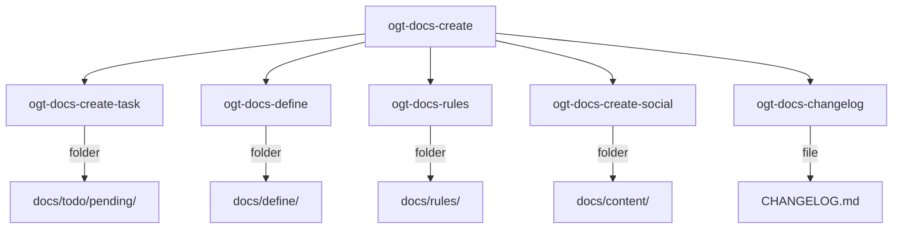

# OGT 文档 - 创建（OGT Docs - Create）

这是一个用于创建新文档实体的基础技能。

## 概述

该技能会根据您要创建的文档类型，引导您进入相应的创建工作流程。每个创建的文档实体都会对应一个包含相关文件和信号的文件夹。



## 使用场景

- 创建新任务
- 添加定义（功能、代码、业务内容等）
- 制定新规则
- 创建社交/营销内容
- 更新变更日志

## 快速参考

| 功能        | 子技能                        | 目标文件夹                |
| ------------- | --------------------------- | ---------------------- |
| 创建任务      | `ogt-docs-create-task`      | docs/todo/pending/     |
| 定义功能      | `ogt-docs-define-feature`   | docs/define/features/  |
| 定义业务内容 | `ogt-docs-define-business`  | docs/define/business/  |
| 定义代码      | `ogt-docs-define-code`      | docs/define/code/      |
| 定义营销内容 | `ogt-docs-define-marketing` | docs/define/marketing/ |
| 定义品牌内容 | `ogt-docs-define-branding`  | docs/define/branding/  |
| 工具文档      | `ogt-docs-define-tools`     | docs/define/tools/     |
| 编码规则      | `ogt-docs-rules-code`       | docs/rules/code/       |
| Git 规则      | `ogt-docs-rules-git`        | docs/rules/git/        |
| 社交媒体帖子   | `ogt-docs-create-social`    | docs/content/social/   |
| 变更日志     | `ogt-docs-changelog`        | CHANGELOG.md           |

---

## 创建工作流程

所有创建操作都遵循相同的步骤：

### 第一步：确定文档类型

确定您要创建的文档类型：

| 需要执行的操作       | 创建的文档类型           | 存放位置             |
| ------------------------- | ----------------------- | ---------------------- |
| 记录待办事项       | `docs/todo/pending/`         |
| 文档化产品功能     | `docs/define/features/`       |
| 文档化代码架构     | `docs/define/code/`         |
| 制定编码规范     | `docs/rules/code/`         |
| 记录变更内容     | `CHANGELOG.md`           |

### 第二步：创建文件夹

根据文档类型，创建相应的文件夹。

```bash
# Use slug format: lowercase, hyphens, no spaces
mkdir -p docs/{section}/{category}/{slug}

# Examples
mkdir -p docs/todo/pending/user-auth-flow
mkdir -p docs/define/features/dark-mode
mkdir -p docs/rules/code/error-handling
```

### 第三步：复制模板

复制相应的模板文件到新文件夹中。

```bash
# Copy appropriate template
cp docs/_templates/{type}.md docs/{path}/{slug}/{type}.md

# Examples
cp docs/_templates/task.md docs/todo/pending/user-auth-flow/task.md
cp docs/_templates/feature.md docs/define/features/dark-mode/feature.md
cp docs/_templates/rule.md docs/rules/code/error-handling/rule.md
```

### 第四步：填充内容

使用模板文件，填写实际内容。具体内容请参考相关子技能的说明。

### 第五步：添加信号文件

在文档中添加必要的信号文件（如 `.version`、`.priority` 等）。

```bash
# Common signals
echo '{"schema": "1.0", "created": "'$(date -Iseconds)'"}' > {folder}/.version

# Type-specific signals
echo "high" > docs/todo/pending/{task}/.priority
touch docs/rules/code/{rule}/.enforced_by
```

### 第六步：验证文档结构

确保文档结构完整且符合规范。

```bash
# Verify folder has required files
ls -la docs/{path}/{slug}/

# Expected output example for task:
# task.md
# .version
# .priority
```

## 模板说明

- **任务模板**：用于创建任务相关的文档。
- **功能模板**：用于创建功能相关的文档。
- **定义模板**：用于创建定义相关的文档。
- **规则模板**：用于创建规则相关的文档。

---

## 批量创建

可以一次性创建多个相关的文档实体。

```bash
#!/bin/bash
# create-feature-with-tasks.sh

FEATURE=$1

# Create feature definition
mkdir -p docs/define/features/$FEATURE
cat > docs/define/features/$FEATURE/feature.md << EOF
# Feature: $(echo $FEATURE | tr '-' ' ' | sed 's/\b\(.\)/\u\1/g')

## Summary

TODO: Add summary

## User Stories

As a user, I want to TODO, so that TODO.
EOF

# Create initial tasks
for task in "design" "implement" "test" "document"; do
  mkdir -p docs/todo/pending/${FEATURE}-${task}
  cat > docs/todo/pending/${FEATURE}-${task}/task.md << EOF
# Task: $(echo $FEATURE | tr '-' ' ' | sed 's/\b\(.\)/\u\1/g') - $(echo $task | sed 's/\b\(.\)/\u\1/g')

## Summary

${task^} the $FEATURE feature.

## Objectives

- TODO

## Acceptance Criteria

- [ ] TODO
EOF
  echo "medium" > docs/todo/pending/${FEATURE}-${task}/.priority
done

echo "Created feature: $FEATURE"
echo "Created tasks: ${FEATURE}-design, ${FEATURE}-implement, ${FEATURE}-test, ${FEATURE}-document"
```

## 命名规范

- **文件夹命名规则**：所有文件夹名称均采用 Slug 格式（短小、易读）。
  - 使用小写字母。
  - 用连字符代替空格（例如：`dark-mode` 而不是 `dark_mode`）。
  - 避免使用特殊字符（例如：`oauth2` 而不是 `oauth2.0`）。
  - 名称应具有描述性。
  - 文件夹名称长度应控制在 30 个字符以内，以便于阅读。

## 好的文件夹名称示例：

- `docs/tasks`  
- `docs/features`  
- `docs/code`  
- `docs/rules`  

## 不好的文件夹名称示例：

- `Docs/Tasks` （包含多个空格）
- `Docs/Features` （包含多个句点）

## 验证规则

创建文档后，请检查以下内容：

- 文件夹名称是否遵循 Slug 格式。
- 是否存在必要的文件（如 `task.md`、`feature.md` 等）。
- 是否添加了必要的信号文件（如 `.version`）。
- 是否包含了所有必要的内容部分。
- 链接是否有效。
- 是否检查了拼写和语法错误。
- 相关文档之间是否有交叉引用。

---

## 常见的创建流程

- **新功能创建流程**：
  1. 创建功能定义文档。
  2. 创建 `mvp.md` 文件来描述功能范围。
  3. 创建 `phase_0.md` 文件来规划初始工作。
  4. 为 `phase_0` 创建相应的任务。

- **新规则创建流程**：
  1. 确定需要标准化的规则。
  2. 创建规则对应的文件夹。
  3. 编写规则并附上示例。
  4. 配置规则的执行方式。
  5. 向团队宣布新规则的制定。

---

## 信号文件说明

| 信号文件名        | 用途                          | 文件内容                         |
| ------------------------- | ------------------------------------------- |
| `.version`     | 包含文档的 JSON 架构版本信息           |
| `.priority`    | 标示任务的优先级（critical/high/medium/low）     |
| `.enforced_by` | 列出该规则所依赖的工具             |
| `.status`      | 表示文档的审批状态（draft/review/approved）    |
| `.created_at`  | 文档的创建时间戳                     |
| `.created_by`  | 文档的创建者名称                     |

---

## 创建检查清单

在完成文档创建之前，请确保以下事项：

- 文件夹名称符合 Slug 格式。
- 主要文档文件（如 `task.md`、`feature.md` 等）已生成。
- 添加了必要的信号文件（如 `.version`）。
- 所有必要的内容部分都已包含。
- 不存在未完成的待办事项（TODO）。
- 链接是否有效。
- 检查了拼写和语法错误。
- 相关文档之间有正确的交叉引用。