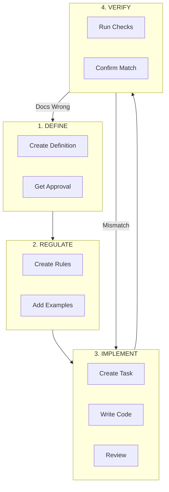

# OGT 文档 - 作为事实依据的文档

## 哲学

**文档是决策的记录；代码仅仅是这些决策的实现方式。**

```
┌─────────────────────────────────────────────────────────────────┐
│                    THE DOC-FIRST PRINCIPLE                      │
├─────────────────────────────────────────────────────────────────┤
│  1. Documentation DEFINES what something IS                     │
│  2. Code IMPLEMENTS what documentation specifies                │
│  3. Conflicts RESOLVE in favor of documentation                 │
│                                                                 │
│  If docs say X and code does Y → CODE IS WRONG                  │
└─────────────────────────────────────────────────────────────────┘
```

## 何时使用此技能

在以下情况下使用 `ogt-docs`：

- 需要理解文档/文件夹的结构；
- 为特定任务找到合适的子技能；
- 初始化一个以文档为主的项目；
- 在不同类型的文档之间导航。

**对于特定任务，请使用下面列出的专用子技能。**

## 文档结构概述

```
docs/
├── definitions/              # WHAT things ARE
│   ├── business/             # Business model, pricing, users
│   ├── features/             # Product features and specs
│   ├── technical/            # Architecture, services, data
│   └── domain/               # Domain-specific concepts
│
├── rules/                    # HOW to IMPLEMENT
│   ├── code/                 # Coding standards
│   │   ├── frontend/
│   │   ├── backend/
│   │   └── infra/
│   ├── git/                  # Version control rules
│   └── domain/               # Domain-specific rules
│
├── todo/                     # TASK management
│   ├── pending/              # Not started
│   ├── in_progress/          # Being worked on
│   ├── review/               # Awaiting review
│   ├── blocked/              # Cannot proceed
│   ├── done/                 # Completed & verified
│   └── rejected/             # Declined tasks
│
├── guides/                   # HOW-TO documents
│   └── {topic}/
│
└── social/                   # Marketing & communications
    ├── campaigns/
    ├── content/
    └── branding/
```

## “文件夹即实体”的模式

每个需要记录的项都是一个 **文件夹**，其中包含：

```
{item_slug}/
├── {type}.md                 # Primary document (task.md, feature.md, etc.)
├── {supporting_files}.md     # Additional documentation
└── .{signal_files}           # Status markers and metadata
```

**优势：**
- 可以在整个工作流程阶段之间移动整个文件夹；
- 可以附加无限数量的辅助文件；
- 通过点文件（`.dot` 文件）来指示状态；
- 可以原子级地版本控制和跟踪更改。

## 子技能参考

### 定义（说明事物的本质）

| 子技能                   | 目的                        | 使用场景                          |
| --------------------------- | ------------------------------ | --------------------------------- |
| `ogt-docs-define`           | 提供通用的定义指导    | 需要了解定义类型的概览             |
| `ogt-docs-define-business`  | 定义商业模式、定价、用户群体 | 规定业务概念                    |
| `ogt-docs-define-feature`   | 描述产品特性和规格     | 定义新功能                      |
| `ogt-docs-define-code`      | 描述技术架构         | 定义服务、数据模型                 |
| `ogt-docs-define-marketing` | 定义品牌、信息传递方式、目标受众 | 制定营销策略                   |
| `ogt-docs-define-branding`  | 规定视觉识别元素、语言风格   | 制定品牌指南                    |
| `ogt-docs-define-tools`     | 描述开发工具和命令行接口     | 定义开发工具的相关信息              |

### 规则（说明实现方法）

| 子技能                   | 目的                   | 使用场景                    |
| --------------------------- | ------------------------- | --------------------------- |
| `ogt-docs-rules`            | 提供通用的规则指导    | 需要了解规则类型的概览             |
| `ogt-docs-rules-code`       | 提供编码标准指导       | 制定通用编码规则                 |
| `ogt-docs-rules-code-front` | 提供前端特定规则       | 适用于 React、CSS、组件的规则           |
| `ogt-docs-rules-code-back`  | 提供后端特定规则       | 适用于 API、数据库、服务的规则           |
| `ogt-docs-rules-code-infra` | 提供基础设施规则       | 适用于 Docker、CI/CD、部署的规则           |
| `ogt-docs-rules-git`        | 提供版本控制规则       | 适用于提交、分支、Pull Request 的规则         |

### 任务（说明具体操作）

| 子技能              | 目的                 | 使用场景                       |
| ---------------------- | ----------------------- | ------------------------------ |
| `ogt-docs-create-task` | 创建和管理任务         | 需要创建或更新任务                   |
| `ogt-docs-audit-task` | 核实任务是否完成         | 检查任务是否真正完成                 |

### 其他

| 子技能                | 目的                   | 使用场景                          |
| ------------------------ | ------------------------- | --------------------------------- |
| `ogt-docs-create`        | 提供通用的创建指导       | 需要创建任何类型的文档                 |
| `ogt-docs-create-social` | 创建营销内容           | 制作社交媒体/营销相关的文档             |
| `ogt-docs-audit`         | 提供通用的审核指导       | 对文档进行审核                     |
| `ogt-docs-init`          | 初始化文档结构           | 设置新项目的文档结构                 |
| `ogt-docs-config`        | 配置文档工作流程         | 自定义文档处理流程                 |

## 工作流程概述



## 快速入门

### “我需要定义新内容”

→ 使用 `ogt-docs-define` 了解文档类型，然后选择相应的子技能；
### “我需要创建一个任务”

→ 使用 `ogt-docs-create-task`；
### “我需要确认任务是否已完成”

→ 使用 `ogt-docs-audit-task`；
### “我需要添加编码规则”

→ 使用 `ogt-docs-rules-code` 或相应的前端/后端/基础设施规则；
### “我需要为新项目设置文档结构”

→ 使用 `ogt-docs-init`。

## 命名规范

| 元素          | 命名格式                | 示例                                 |
| ---------------- | --------------------- | --------------------------------------- |
| 文件夹名称       | 使用蛇形命名法（snake_case）       | `global_search`, `user_auth`            |
| 主要文档文件     | 使用小写字母表示类型         | `task.md`, `feature.md`, `rule.md`      |
| 辅助文件       | 使用小写字母加描述性词汇       | `phase_0.md`, `notes.md`, `progress.md`     |
| 信号文件       | 使用点文件（`.dot`）加上蛇形命名法     | `.blocked_reason`, `.approved_by_human`     |

## 信号文件说明

信号文件是通过点文件（`.dot` 文件）来表示状态或元数据的文件。

| 信号类型       | 含义                         | 解释                          |
| ---------------------- | --------------------------- | --------------------------------- |
| `.version`       | 文件内容           | 文档的版本信息（JSON 格式）             |
| `.blocked`       | 文件被阻止           | 文件当前处于阻止状态                   |
| `.blocked_reason`     | 阻止原因           | 文件被阻止的具体原因                 |
| `.approved`       | 文件已获批准           | 文件已被批准进行实施                 |
| `.approved_by_{name}`     | 批准人             | 批准文件的人                     |
| `.rejected`       | 文件被拒绝           | 文件被拒绝的原因                 |
| `.verified`       | 文件已验证           | 文件的实现已通过验证                 |
| `.completed_at`     | 文件完成时间           | 文件完成的时间戳                   |
| `.assigned_to_{agent}`     | 负责人             | 负责处理该文件的人员                 |
| `.pr_link`       | 关联的 Pull Request 链接     | 与该文件相关的 Pull Request 链接           |
| `.depends_on`     | 依赖关系           | 文件所依赖的其他文件或任务               |

## 重要原则

1. **如果没有记录在文档中，那就意味着它不存在**；
2. **如果代码与文档矛盾，那么代码就是错误的**；
3. **未经验证，切勿相信“已完成”的状态**；
4. **移动文件夹，而不是复制文件**；
5. **使用点文件来传递状态信息，不要直接修改状态字段**。