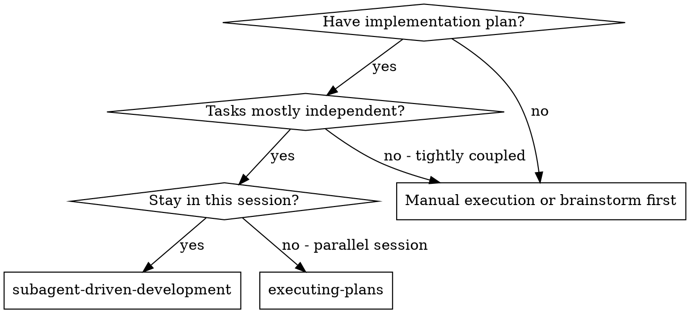
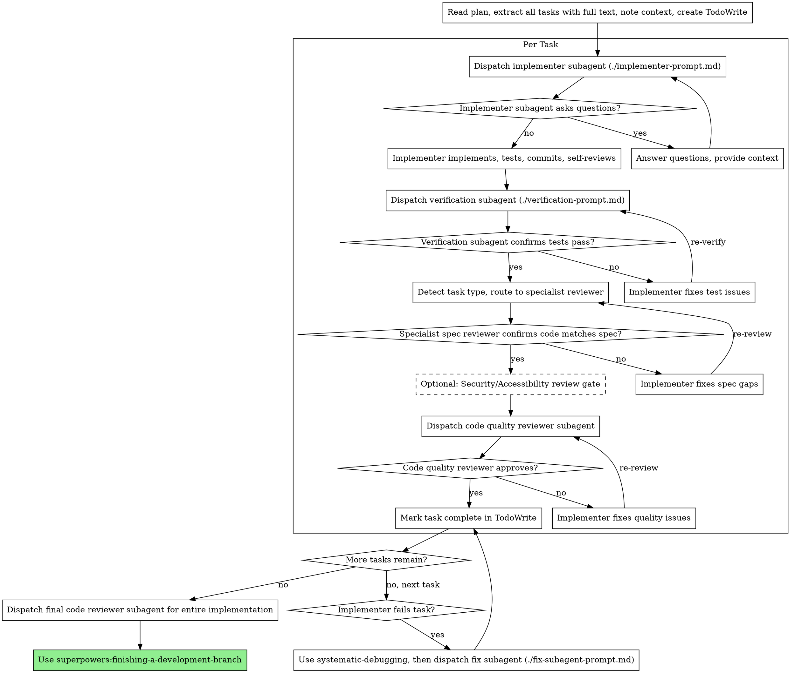

# 基于子代理的开发模式（Subagent-Driven Development）

该模式通过为每个任务分配一个新的子代理来执行计划，并在每个任务完成后进行多阶段的审查：首先是领域专家（domain-specialist）对规范合规性的审查，接着是独立的测试验证，最后是代码质量审查。

**核心原则：** 为每个任务分配新的子代理 + 领域专家的审查 + 独立的验证 = 高质量、快速迭代

## 适用场景



**与传统的并行执行计划的方式相比：**
- 任务在同一个会话中完成（无需切换上下文）
- 每个任务都使用新的子代理（避免上下文混淆）
- 审查人员是领域专家（而非通用审核人员）
- 进行独立的测试验证（而非依赖开发者的自我报告）
- 具有系统的故障恢复机制（能够深入分析根本原因）
- 迭代速度更快（任务之间无需人工干预）

## 改进后的流程



## 提示模板

**核心模板：**
- `./implementer-prompt.md` - 用于调度执行任务的子代理
- `./spec-reviewer-prompt.md` - 通用的规范合规性审查模板（备用）
- `./code-quality-reviewer-prompt.md` - 代码质量审查模板

**改进后的模板：**
- `./fix-subagent-prompt.md` - 用于修复失败实现的子代理
- `./verification-prompt.md` - 用于独立测试验证的子代理

**参考资料：**
- `./references/specialist-routing.md` - 领域专家分配指南

## 领域专家的分配机制

在调度规范合规性审查人员之前，需要分析任务描述中的关键词，以确定合适的专家：

| 关键词 | 领域 | 专家代理 |
|----------|--------|------------------|
| API、端点、路由、后端、数据库、架构 | 后端 | `backend-development:backend-architect` |
| 组件、用户界面、前端、React、可访问性 | 前端 | `frontend-mobile-development:frontend-developer` |
| 基础设施、持续集成/持续部署（CI/CD）、Docker、Kubernetes | DevOps | `senior-devops` |
| 数据、数据管道、ETL、数据分析 | 数据工程 | `senior-data-engineer` |
| 机器学习、模型训练、推理 | 数据科学 | `senior-data-scientist` |
| 架构、设计、可扩展性 | 架构设计 | `senior-architect` |

详细分配规则和提示模板请参阅 `references/specialist-routing.md`。

## 改进后的工作流程示例

```
You: I'm using Subagent-Driven Development to execute this plan.

[Read plan file once: docs/plans/feature-plan.md]
[Extract all 5 tasks with full text and context]
[Create TodoWrite with all tasks]

Task 1: Hook installation script

[Detect task type: generic utility]
[Get Task 1 text and context (already extracted)]
[Dispatch implementation subagent with full task text + context]

Implementer: "Before I begin - should the hook be installed at user or system level?"

You: "User level (~/.config/superpowers/hooks/)"

Implementer: "Got it. Implementing now..."
[Later] Implementer:
  - Implemented install-hook command
  - Added tests, 5/5 passing
  - Self-review: Found I missed --force flag, added it
  - Committed

[Dispatch verification subagent]
Verifier: Command: npm test -- --testPathPattern=hook
         Output: PASS 5/5 tests
         ✅ Claim confirmed

[Dispatch generic spec compliance reviewer - task type unclear]
Spec reviewer: ✅ Spec compliant - all requirements met, nothing extra

[Get git SHAs, dispatch code quality reviewer]
Code reviewer: Strengths: Good test coverage, clean. Issues: None. Approved.

[Mark Task 1 complete]

Task 2: Add user authentication API endpoint

[Detect task type: Backend - keywords: API, endpoint, auth]
[Dispatch implementation subagent]

Implementer: [No questions, proceeds]
Implementer:
  - Implemented POST /api/auth/login endpoint
  - Added JWT token generation
  - Tests: 12/12 passing
  - Committed

[Dispatch verification subagent]
Verifier: ✅ Claim confirmed - 12/12 tests passing

[Dispatch backend-development:backend-architect for spec review]
Backend specialist: ✅ Spec compliant
  Notes: Good RESTful design, appropriate status codes,
         but see code quality review for security concerns

[Optional: Add security review gate for auth task]
Security reviewer: Issues (Important):
  - Password not hashed before comparison
  - No rate limiting on login endpoint
  - Missing CORS configuration

[Implementer fixes security issues]
Implementer: Added bcrypt hashing, rate limiter middleware, CORS config

[Security reviewer re-checks]
Security reviewer: ✅ Approved

[Dispatch code quality reviewer]
Code reviewer: Strengths: Clean, well-tested. Issues: None. Approved.

[Mark Task 2 complete]

...

[After all tasks]
[Dispatch final code-reviewer]
Final reviewer: All requirements met, ready to merge

Done!
```

## 改进的功能

### 1. 独立测试验证

在接收开发者的测试报告之前，先调度一个验证子代理来进行检查：

**原因：** 开发者可能会犯错、过于乐观，或者测试方法不正确。

**模板使用：** `./verification-prompt.md`

**集成流程：** 在开发者报告测试结果后，再进行规范审查。

### 2. 领域专家的规范审查

根据任务中的关键词，将规范合规性审查任务分配给相应的领域专家：

**原因：** 通用审查人员可能忽略特定领域的细节（如 API 设计模式、可访问性要求等）。

**模板使用：** 请参考 `references/specialist-routing.md`。

**备用方案：** 对于没有明确领域特征的任务，可以使用通用的 `./spec-reviewer-prompt.md`。

### 3. 可选的第三轮审查

对于某些类型的任务，可以增加第三轮审查：
- **安全审查**：针对涉及认证、API 或敏感数据的任务
- **可访问性审查**：针对用户界面/前端相关的任务

**原因：** 可以在代码发布前及时发现安全或可访问性问题。

### 4. 系统化的故障恢复机制

当开发者未能完成任务时：
1. 使用 `systematic-debugging` 技能来查找问题的根本原因。
2. 调度 `./fix-subagent-prompt.md` 来修复问题。
3. 重新进行所有审查流程。

**优势：**
- 子代理自然遵循测试驱动开发（Test-Driven Development, TDD）的原则。
- 每个任务都有全新的上下文环境，避免混淆。
- 并发执行安全，子代理之间不会相互干扰。
- 子代理可以在工作过程中提出问题。

**与传统的执行计划方式相比：**
- 任务在同一个会话中完成，无需手动交接。
- 进度更加连续（无需等待）。
- 审查人员是领域专家，具有专业性。
- 进行独立的测试验证。
- 具有系统的故障恢复机制。

**质量保障措施：**
- 自我审查可以在任务交接前发现问题。
- 独立的测试验证提供了客观的证据。
- 领域专家的规范审查确保代码质量。
- 可选的安全性和可访问性审查进一步提升了代码质量。

**成本：**
- 每个任务需要调用更多的子代理。
- 控制者需要做更多的准备工作。
- 但能更早发现问题（从而节省后期调试的成本）。

## 注意事项：
- **绝对禁止：**
  - 跳过任何一轮审查（包括验证、规范合规性或代码质量审查）。
  - 在问题未解决的情况下继续执行任务。
  - 并行调度多个执行子代理（可能导致冲突）。
  - 让子代理直接阅读计划文件（应提供完整的计划内容）。
  - 忽略子代理的疑问（应在他们继续工作之前给予解答）。
  - 对规范合规性的审查结果简单敷衍了事（发现问题意味着任务未完成）。
  - 跳过审查流程（发现问题后需要重新审查）。
  - 允许开发者用自我报告代替独立的测试验证。
  - 在规范合规性未通过之前就开始代码质量审查。
  - 在任何审查尚未完成时就开始执行下一个任务。
  - 在未完成审查的情况下接受开发者的测试报告。

**如果子代理有问题：**
  - 清晰、完整地回答他们的问题。
  - 如有必要，提供额外的背景信息。
  - 不要催促他们立即开始实施。

**如果审查人员发现问题：**
  - 由开发者（使用同一个子代理）修复问题。
  - 审查人员再次进行审查。
  - 重复审查过程，直到问题得到解决。
  - 不要跳过重新审查的步骤。

**如果开发者未能完成任务：**
  - 使用 `systematic-debugging` 技能查找问题的根本原因。
  - 调度 `./fix-subagent-prompt.md` 来修复问题。
  **注意：** 不要尝试手动修复问题，以免造成上下文混乱。

## 所需的技能：**
- **编写计划（writing-plans）**：用于创建执行任务的计划。
- **代码审查（requesting-code-review）**：为审查子代理提供的代码审查模板。
- **完成开发流程（finishing-a-development-branch）**：确保所有任务都完成。
- **系统化故障排查（systematic-debugging）**：用于分析失败任务的根本原因。

**子代理应使用的技能：**
- **测试驱动开发（test-driven-development）**：子代理在执行任务时需遵循 TDD 原则。

**替代的工作流程：**
- **并行执行计划（executing-plans）**：适用于需要同时执行多个任务的场景。

**可选的集成工具：**
- **关键审查（critical-review）**：执行前的计划质量检查。
- **可访问性审计（accessibility-auditor）**：针对用户界面任务的第三轮审查。
- 领域专家代理：详见 `references/specialist-routing.md`。