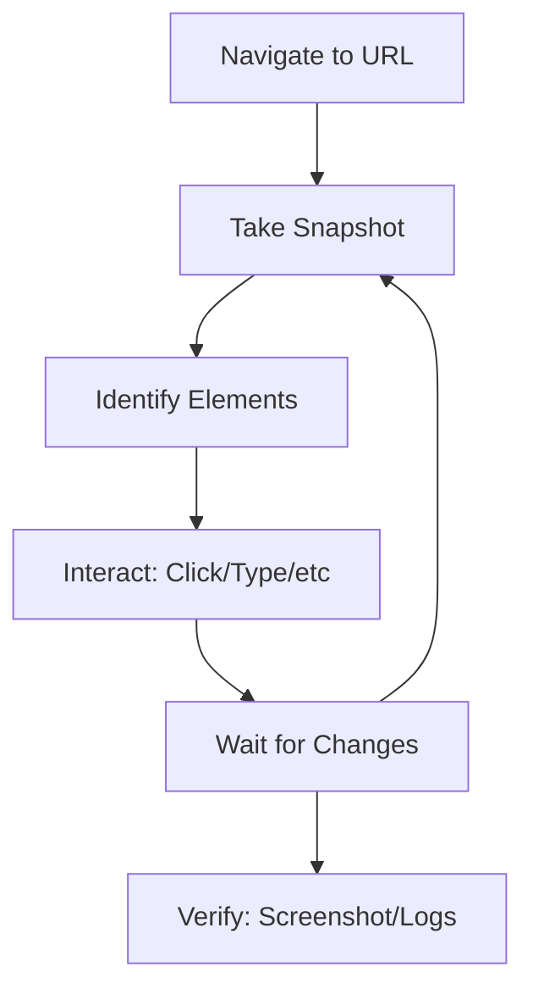

# BrowserMCP 技能

该技能允许 MCP 客户端通过 BrowserMCP 协议自动化浏览器操作。它利用本地的 MCP 服务器和 Chrome 扩展程序来控制用户的实际浏览器会话，从而实现身份验证后的操作并规避常见的机器人检测机制。

## 主要特性

- ⚡ **快速**：自动化操作在本地完成，无网络延迟
- 🔒 **私密**：浏览器活动仅保存在设备上
- 👤 **已登录**：使用用户现有的浏览器配置文件和活动会话
- 🥷 **隐蔽性**：通过真实的浏览器指纹避免基本的机器人检测和验证码

## 先决条件

在使用 BrowserMCP 自动化功能之前，请确保：

1. **MCP 服务器**：BrowserMCP 服务器必须正在运行（使用 `npx` 命令启动）
2. **Chrome 扩展程序**：必须安装并连接到 BrowserMCP 扩展程序
3. **目标标签页**：目标浏览器标签页必须通过扩展程序建立连接

> [!重要提示]
> 人工智能只能控制通过 BrowserMCP 扩展程序“连接”上的标签页。如果您切换标签页，需要重新连接新的标签页。

## 核心工作流程

标准的浏览器自动化流程采用迭代方式：



### 标准模式

| 步骤 | 工具 | 用途 | 关键注意事项 |
|------|------|---------|-------------------|
| **1** | `navigate` | 打开目标 URL | 确保扩展程序已连接 |
| **2** | `snapshot` | 捕获 ARIA 树结构以识别可交互元素 | 页面更改后需要刷新 |
| **3** | `click` | 点击页面元素 | 使用 `snapshot` 中的精确元素引用 |
| **4** | `wait` | 等待动态内容加载 | 浏览或点击操作后必须等待 |
| **5** | `screenshot` | 可视化验证结果 | 当对页面状态不确定时使用 |
| **6** | `get_console_logs` | 调试 JavaScript 错误 | 操作失败时检查控制台日志 |

## 快速参考

### 必用工具

| 工具 | 使用场景 | 参数 |
|------|----------|------------|
| `navigate` | 打开新页面 | `url` - 包含协议的完整 URL |
| `snapshot` | 了解页面结构 | 无参数 - 返回 ARIA 可访问性树 |
| `click` | 激活按钮/链接 | `element`（元素描述），`ref`（元素引用） |
| `type` | 填写输入框 | `element`，`ref`，`text`，`submit`（可选） |
| `hover` | 触发悬停菜单 | `element`，`ref` |
| `select_option` | 从下拉菜单中选择 | `element`，`ref`，`values`（数组） |
| `press_key` | 键盘快捷键 | `key` - 例如 "Enter"，"Escape"，"ArrowDown" |
| `wait` | 等待页面加载 | `time` - 等待时间（秒） |
| `screenshot` | 可视化验证 | 无参数 - 返回 PNG 图片 |
| `get_console_logs` | 调试错误 | 无参数 - 返回最近的控制台输出 |
| `go_back` / `go_forward` | 导航历史记录 | 无参数 |

### 常见关键参数

```
Navigation:    Enter, Escape, Tab
Editing:       Backspace, Delete
Arrows:        ArrowUp, ArrowDown, ArrowLeft, ArrowRight
Modifiers:     Control, Alt, Shift, Meta (combine via modifiers array)
Function:      F1-F12
Other:         Home, End, PageUp, PageDown, Space
```

## 使用示例

### 示例 1：在 Google 上搜索

```javascript
// Step 1: Navigate to search engine
navigate(url="https://google.com")

// Step 2: Type search query (use snapshot to find the ref)
type(element="Google search box", ref="e12", text="BrowserMCP automation", submit=true)

// Alternative: Type then press Enter separately
type(element="Search box", ref="e12", text="BrowserMCP automation")
press_key(key="Enter")
```

### 示例 2：填写并提交登录表单

```javascript
// Step 1: Navigate to login page
navigate(url="https://example.com/login")

// Step 2: Get snapshot to identify form fields
snapshot()

// Step 3: Fill username field
type(element="Username or email field", ref="e5", text="user@example.com")

// Step 4: Fill password field
type(element="Password field", ref="e7", text="password123")

// Step 5: Click login button
click(element="Sign in button", ref="e9")

// Step 6: Wait for redirect
wait(time=2)

// Step 7: Verify successful login with screenshot
screenshot()
```

### 示例 3：导航并提取信息

```javascript
// Navigate to documentation
navigate(url="https://docs.browsermcp.io")

// Wait for page load
wait(time=1)

// Capture accessibility tree to understand structure
snapshot()

// Click on a documentation link
click(element="API Reference link", ref="e15")

// Wait for content to load
wait(time=1)

// Take screenshot for verification
screenshot()

// Check for any JavaScript errors
get_console_logs()
```

### 示例 4：处理动态内容

```javascript
// Navigate to page with dynamic content
navigate(url="https://example.com/dashboard")

// Wait for initial load
wait(time=2)

// Take snapshot to see available elements
snapshot()

// Click element that triggers dynamic content
click(element="Load more button", ref="e22")

// Wait for new content to appear
wait(time=2)

// Refresh snapshot to see new elements
snapshot()

// Interact with newly loaded element
click(element="New item", ref="e45")
```

## 最佳实践

### 1. 始终使用快照进行元素识别

**推荐做法：**
```javascript
// Take snapshot first, then use exact refs
snapshot()
click(element="Submit button", ref="e12")
```

**不建议的做法：**
```javascript
// Guessing selectors without snapshot
click(element="button.submit")  // May not work with dynamic DOM
```

### 2. 浏览和重要操作后等待

动态网页应用通常会异步加载内容。请确保在以下操作后等待：
- 导航到新页面
- 点击触发请求的按钮
- 提交表单

```javascript
click(element="Load data button", ref="e8")
wait(time=2)  // Wait for data to load
snapshot()    // Then get fresh page structure
```

### 3. 处理连接要求

在开始任何自动化操作之前：
1. 确认已安装 BrowserMCP 扩展程序
2. 确保目标标签页已连接（用户需要点击“连接”按钮）
3. 如果出现连接错误，提醒用户重新连接

### 4. 使用截图进行调试

当操作失败时：
```javascript
// Take screenshot to see current page state
screenshot()

// Check console for JavaScript errors
get_console_logs()

// Re-snapshot to see updated element refs
snapshot()
```

### 5. 尊重隐私和安全

- BrowserMCP 使用用户的实际浏览器配置文件
- 对敏感数据要谨慎处理
- 用户的登录状态保持不变
- 所有操作都在设备上本地完成

## 参考资料

| 文件 | 内容 |
|------|----------|
| `references/setup.md` | MCP 服务器和 Chrome 扩展程序的详细安装和配置 |
| `references/tools.md` | 完整的工具参考，包含参数和示例 |
| `references/best-practices.md` | 高级模式、错误处理和故障排除技巧 |
| `references/workflows.md` | 常见的工作流程模式（表单处理、身份验证、数据抓取等） |

## 故障排除

### 连接错误

**错误**："无法连接到浏览器扩展程序"

**解决方法**：
1. 用户需要在 Chrome 工具栏中点击 BrowserMCP 扩展程序图标
2. 在目标标签页上点击“连接”按钮
3. 只有已连接的标签页才能被自动化操作

### 元素未找到

**错误**：元素引用无效或元素不存在

**解决方法**：
1. 重新获取快照（`snapshot()`）——DOM 可能已经发生变化
2. 使用更新后的快照中的新元素引用
3. 对于动态内容，可能需要在获取快照前等待一段时间（`wait()`）

### 操作被阻止或失败

**错误**：点击/输入操作未按预期执行

**解决方法**：
1. 截取当前页面的截图（`screenshot()`）
2. 检查控制台日志（`get_console_logs()`）以获取 JavaScript 错误信息
3. 确认元素在快照中可见且可交互
4. 检查是否有浏览器级别的弹出窗口或安全提示
5. 确保页面已完全加载

### 验证码或机器人检测

**注意**：BrowserMCP 通过使用用户的真实浏览器配置文件来规避基本的机器人检测。但是：
- 有些网站仍可能检测到自动化操作
- 快速操作可能会触发频率限制
- 用户可能需要手动解决某些验证码

## BrowserMCP 与 Playwright MCP 的比较

| 特性 | BrowserMCP | Playwright MCP |
|---------|------------|----------------|
| **浏览器** | 使用用户的现有浏览器 | 创建新的浏览器实例 |
| **配置文件** | 使用用户的现有配置文件（包括 Cookie） | 使用隔离的配置文件 |
| **身份验证** | 用户已登录 | 每次操作都需要重新登录 |
| **机器人检测** | 较低（基于真实浏览器行为） | 较高（可能需要额外验证） |
| **多标签页支持** | 一次只能操作一个标签页 | 支持多个标签页 |
| **适用场景** | 个人自动化、测试已登录的用户流程 | 测试、持续集成/持续部署（CI/CD）、隔离的测试环境 |

## 有效自动化的建议

1. **从 `navigate`、`wait`、`snapshot` 开始**——建立页面的初始状态
2. **使用描述性的元素名称**——有助于调试和提高代码可读性
3. **在关键步骤后截图**——可视化验证有助于早期发现问题
4. **操作失败后查看控制台日志**——JavaScript 错误通常能提供故障原因
5. **合理设置等待时间**——等待时间过短可能导致操作不稳定，过长则会导致效率降低
6. **操作后刷新快照**——DOM 变化会导致元素引用失效
7. **在表单提交时使用 `submit=true` | 比单独使用 `press_key("Enter")` 更简洁 |
8. **高效组合操作**——将相关操作组合在一起以减少不必要的请求次数

## 资源链接

- **BrowserMCP 官网**：https://browsermcp.io
- **文档**：https://docs.browsermcp.io
- **Chrome 扩展程序**：在 Chrome Web Store 中搜索 "Browser MCP"
- **GitHub 仓库**：https://github.com/browsermcp/mcp
- **基于**：[Playwright MCP](https://github.com/microsoft/playwright-mcp)