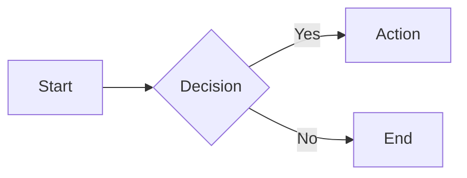
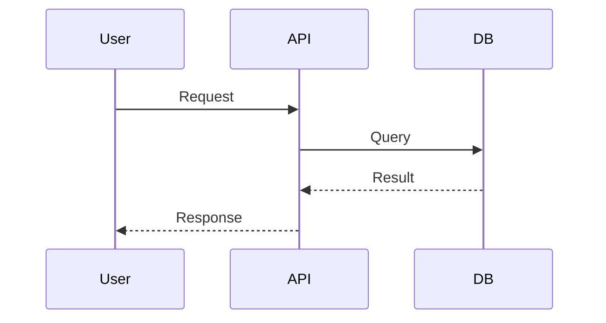
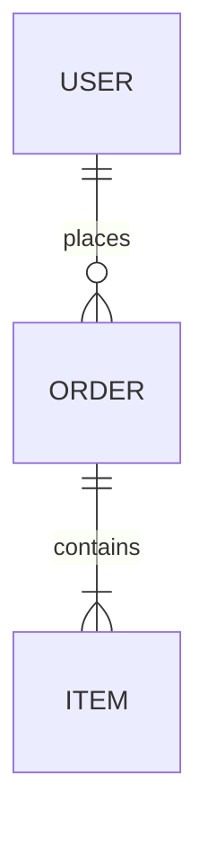

## 原则

图表的作用是**简化理解**，而非增加复杂性。从简单开始，仅在必要时添加细节。一个包含5个节点的流程图比一个包含50个节点的复杂图表更易于理解。

## 当用户描述系统或流程时

1. **确定图表类型**——这是流程图、架构图、序列图还是数据模型？
2. **选择格式**——默认使用Mermaid；对于复杂的图表，可以选择PlantUML；如果需要内联显示，可以使用ASCII；对于自定义图表，可以使用SVG。
3. **绘制最小化的版本**——仅包含核心元素，避免过多的装饰。
4. **根据反馈进行迭代**——根据用户的反馈逐步添加细节。

## 图表类型

| 类型 | 用途 | 格式 |
|------|---------|--------|
| 流程图 | 过程、决策、工作流程 | Mermaid `flowchart` |
| 序列图 | API调用、交互、协议 | Mermaid `sequenceDiagram` |
| 架构图 | 系统组件、基础设施 | Mermaid `flowchart` 或 `C4` |
| 数据模型图 | 数据库模式、关系 | Mermaid `erDiagram` |
| 类图 | 对象结构、继承关系 | Mermaid `classDiagram` |
| 状态图 | 对象的生命周期、状态转换 | Mermaid `stateDiagram-v2` |
| 时间线图 | 项目阶段、发展历程 | Mermaid `timeline` |
| 思维导图 | 头脑风暴、概念映射 | Mermaid `mindmap` |

## 输出方式

| 方法 | 适用场景 |
|--------|------|
| Mermaid代码块 | 用户可以直接在文档、GitHub或Notion中渲染图表 |
| 渲染为PNG/SVG | 用户需要图像文件 |
| ASCII内联显示 | 在聊天中快速绘制草图 |
| HTML + Mermaid.js | 提供交互式的图表查看体验 |

### 将Mermaid代码渲染为图像

```bash
# Using mmdc (mermaid-cli)
npx -y @mermaid-js/mermaid-cli mmdc -i diagram.mmd -o diagram.png -b transparent

# Or via browser tool
# Write HTML with Mermaid, screenshot the rendered diagram
```

## Mermaid快速参考

**流程图：**


**序列图：**


**数据模型图：**


## 风格指南

- **流程方向**：从左到右（LR）；**层次结构**：从上到下（TB）。
- **每个图表最多10-15个节点**，超过这个数量时需要拆分成多个图表。
- **命名规则**：系统名称使用大写字母，动作名称使用小写字母。
- **使用子图**来分组相关的组件。
- **谨慎使用颜色**——仅突出关键路径。

## 常见请求

| 请求 | 解释方式 |
|---------|--------------|
| “绘制我的API流程” | 绘制一个序列图，展示客户端 → API → 服务的交互过程 |
| “展示系统架构” | 使用流程图，并使用子图来表示各个组件 |
| “数据库模式” | 绘制一个数据模型图，展示数据库表之间的关系 |
| “授权机制的工作原理” | 根据复杂程度选择序列图或流程图来展示 |
| “用户使用流程” | 绘制一个包含决策点的流程图 |

## 避免的错误做法

- ❌ 图表中节点过多（应拆分成多个图表）
- ❌ 使用无实际意义的装饰性图标
- ❌ 混合不同的抽象层次（例如将数据库表与业务概念放在一起）
- ❌ 使用方向混乱的箭头（会导致流程理解困难）
- ❌ 标签过长（使用简短的名称，必要时添加图例）