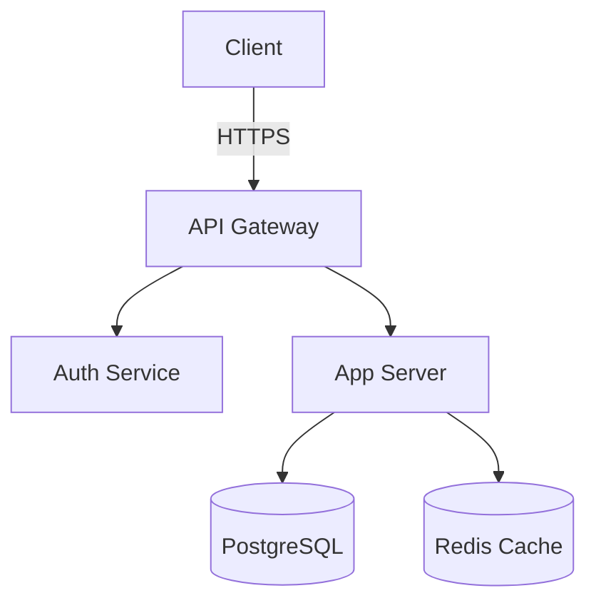
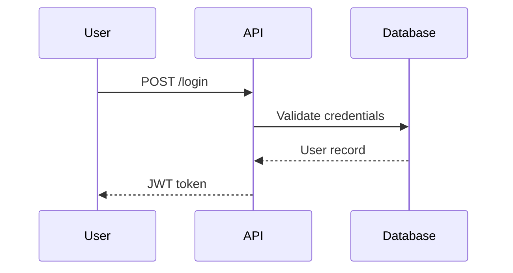

# Mermaid 图表技能

使用 [Mermaid](https://mermaid.js.org/) 从文本生成图表。

## 前提条件

- 需要安装 `@mermaid-js/mermaid-cli`（通过 `npm install -g @mermaid-js/mermaid-cli` 安装）。

## 使用方法

1. 将 Mermaid 语法写入 `.mmd` 文件中。
2. 运行 `mmdc` 命令将文件渲染为 PNG 或 SVG 格式的图像。
3. 将生成的图像展示给用户。

### 基本命令

```bash
mmdc -i input.mmd -o output.png -t dark -b transparent
```

### 选项

| 标志 | 描述 |
|---|---|
| `-i` | 输入的 `.mmd` 文件 |
| `-o` | 输出文件格式（`.png`, `.svg`, `.pdf`） |
| `-t` | 主题：`default`, `dark`, `forest`, `neutral` |
| `-b` | 背景颜色（`transparent`, 十六进制代码） |
| `-w` | 图像宽度（像素，默认值：800） |
| `-H` | 图像高度（像素） |
| `-s` | 缩放比例（默认值：1；高分辨率显示时使用 2-3） |
| `-c` | 高级主题配置 JSON 文件 |

### 支持的图表类型

- **流程图**：`graph TD` / `graph LR`
- **序列图**：`sequenceDiagram`
- **类图**：`classDiagram`
- **状态图**：`stateDiagram-v2`
- **ER 图**：`erDiagram`
- **甘特图**：`gantt`
- **饼图**：`pie`
- **思维导图**：`mindmap`
- **时间线图**：`timeline`
- **Git 图**：`gitGraph`
- **象限图**：`quadrantChart`
- **块图**：`block-beta`

### 工作流程

1. 确定用户所需的图表类型。
2. 将代码写入 `/tmp/mermaid-<名称>.mmd` 文件中。
3. 使用以下命令渲染图表：`mmdc -i /tmp/mermaid-<名称>.mmd -o /tmp/mermaid-<名称>.png -t dark -b transparent -s 2`
4. 通过 `Read` 工具向用户展示生成的图像。
5. 如果不需要，清理临时文件。

### 示例：架构图



### 示例：序列图



### 提示

- 使用 `graph LR` 表示从左到右的流程，使用 `graph TD` 表示自上而下的流程。
- 节点标签应简短，详细信息可以放在工具提示或注释中。
- 使用子图来分组相关的组件。
- 对于深色背景，使用 `-t dark -b transparent`。
- 为了在视网膜显示器上获得清晰的图像，可以使用 `-s 2` 或 `-s 3` 的缩放比例。
- 在调用 `mmdc` 时，**务必设置 `pty: false`。

### 主题定制

要自定义图表颜色，请创建一个 JSON 配置文件：

```json
{
  "theme": "base",
  "themeVariables": {
    "primaryColor": "#f59e0b",
    "primaryTextColor": "#1a1a1a",
    "primaryBorderColor": "#d97706",
    "lineColor": "#6b7280",
    "secondaryColor": "#10b981",
    "tertiaryColor": "#3b82f6"
  }
}
```

然后使用以下命令渲染图表：`mmdc -i 输入.mmd -o 输出.png -c 配置.json`