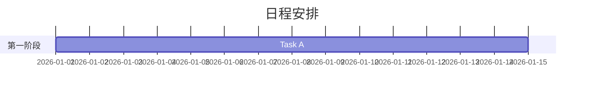

# Presentation Agent

通过Marp CLI将Markdown内容转换为幻灯片，并支持Mermaid图表的制作。

## 快速入门

```bash
bash scripts/md2slide.sh <input.md> [pdf|pptx|html] [output_dir]
```

## Markdown格式

使用标准的Marp语法。使用`---`来分隔不同的幻灯片。需要在文档的开头添加一些元数据（frontmatter）：

```markdown
---
marp: true
theme: default
paginate: true
---
# Title Slide
---
## Content Slide
- Point 1
- Point 2
```

## Mermaid图表

可以直接在Markdown中插入Mermaid代码块，这些代码块会自动渲染为PNG格式并嵌入到幻灯片中：

````markdown

```

支持的图表类型包括：gantt图、流程图、序列图、饼图、状态图和ER图。

## 数据图表

对于matplotlib/plotly生成的图表，需要先使用`exec`命令将其转换为PNG格式，然后再通过``的方式将其嵌入到Markdown中。

## 工作流程

1. 收到Markdown内容（或根据用户的数据/需求生成Markdown内容）。
2. 确保文档的开头包含`marp: true`这一元数据。
3. 运行`bash scripts/md2slide.sh input.md pdf ./output`命令将Markdown内容转换为PDF格式。
4. 将生成的PDF文件交付给用户。

## 设计规则（必须遵守）

以下规则是根据项目负责人的要求制定的，所有演示文稿都必须严格遵守：

### 字体
- **必须使用明朝体**（例如IPAex明朝）。默认不使用哥特体或其他风格的字体。
- 由于Google Fonts等远程字体在Marp生成PDF时可能无法正确显示，因此**只能使用本地安装的字体**。
- 字体大小要足够大：正文至少30px，标题h1至少50px，标题h2至少40px。

### 表情符号
- **幻灯片中严禁使用表情符号**，无论是标题、副标题还是正文内容。

### 徽标
- 在所有幻灯片的右上角显示`theme_logo.jpg`图片（该图片位于`frexida.css`文件的`section::before`部分）。
- 徽标的尺寸应至少为120px，否则会显示不清晰。
- 为了确保徽标在PDF生成时能够正确显示，请在CSS的`background-image: url()`中使用绝对路径。

### 主题风格
- 基本主题为`theme/frexida.css`（颜色方案为海军蓝+金色）。
- 在生成PDF时，通过`--theme`选项指定主题样式，并使用`--allow-local-files`选项来允许使用本地字体文件。
- 将`frexida.css`中的字体设置为本地安装的明朝体，并将修改后的CSS文件（包含绝对路径）保存在`/tmp/`目录下。

### 数据可视化
- 当文档中包含具体的日期、金额或数值时，**应尽可能使用图表进行可视化展示**。
- 积极使用Mermaid提供的各种图表类型，如甘特图、流程图、饼图和状态图等。
- 避免仅使用纯文本表格，尽量通过图表来帮助观众更好地理解信息。

### Mermaid图表的预处理
- 包含Mermaid图表的Markdown文件在传递给Marp之前，必须先使用`scripts/mermaid_preprocess.py`脚本将其转换为PNG格式。
- 请提前使用`mkdir -p`命令创建输出目录（脚本不会自动创建该目录）。

### 使用`md2slide.sh`时的注意事项
- 由于脚本在尝试读取标准输入（stdin）时可能会出现问题，因此请使用`--no-stdin`选项直接运行`marp`命令，或者将输入内容重定向到`< /dev/null`。

## 所需依赖库

- `@marp-team/marp-cli`（全局安装）
- `@mermaid-js/mermaid-cli`（全局安装）
- 这两个依赖库已经安装在本机上。