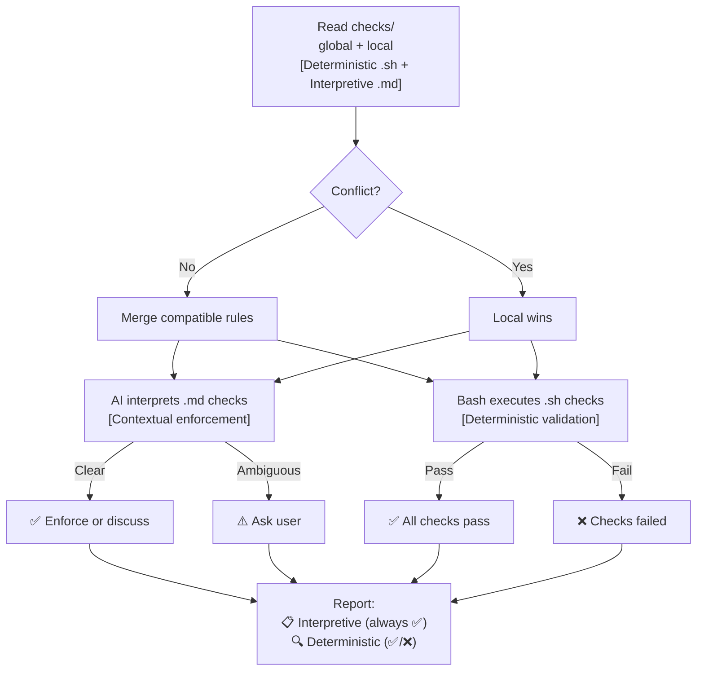
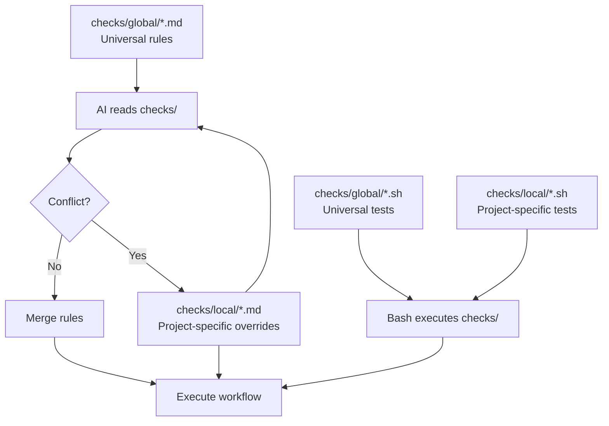
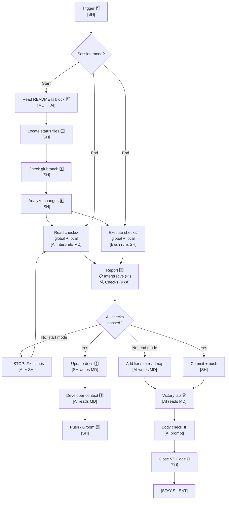

# 后台技能（Backstage Skill）

**昵称：** `backstage:`

**目标：** 为人工智能辅助开发提供统一的项目状态管理工具，确保每次提交前的文档内容与实际情况一致。

---

## 🔴 为什么需要这个技能（防止项目偏离目标）  
**后台技能（Backstage Skill）= 防止项目偏离目标（Anti-Drift）：**  
- ✅ 强制要求具备项目/任务的上下文意识  
- ✅ 通过健康检查防止混乱  
- ✅ 优先考虑项目架构  
- ✅ 保持路线图的可见性，避免意外  

**没有这个技能会怎样：**  
工作在后台之外进行 → 项目偏离目标 → 信任破裂 → 造成三倍的工作量  

**有了这个技能会怎样：**  
“早上好，X” → 系统自动加载上下文 → 工作在规定的范围内进行 → 保持项目的一致性  

---

**工作量问题：**  
没有后台技能时，任务分配的成本会增加三倍：  
1. 任务本身  
2. 需要解释工作方法（伦理规范、偏好设置、协议等）  
3. 需要确定学习内容的存储位置（愿景？灵魂？技能？记忆？）  

这对人类来说是非常耗费精力的。  

**只有当达到以下条件时，投资才是值得的：**  
- 人类只需培训一次 → 人工智能就能掌握这些知识  
- 每次使用时：系统会读取上下文文件 → 并根据伦理规范执行操作  
- 每次使用时：所需解释的内容减少  
- 达到这个阶段后，人类只需进行任务分配，人工智能即可自主执行  

**这个技能有助于稳定项目进度。**  
它强制要求具备项目/任务/设计架构的上下文意识，从而防止项目偏离目标。  
**原本需要三倍的工作量，现在只需完成一份工作。**  

---

## 政策与检查机制的执行  
**后台技能通过各种检查机制来执行所有规则（包括确定性和解释性规则，以及全局性和局部性规则）。**  

### 执行模型  


**两个执行领域：**  
1. **解释性检查（Interpretive Checks）**  
   - `checks/global/*.md`：通用的工作流程规则  
   - `checks/local/*.md`：项目特定的规则覆盖  
   - **执行者：** 人工智能（读取Markdown文件，解释上下文，并根据规则采取行动）  
   - **结果：** 人工智能会读取文件、理解内容并相应地执行操作  

2. **确定性检查（Deterministic Checks）**  
   - `checks/global/*.sh`：通用的验证测试  
   - `checks/local/*.sh`：项目特定的测试  
   - **执行者：** Bash脚本（执行脚本，并返回退出代码）  
   - **结果：** 成功（退出代码为0）或失败（退出代码非0）  

**多中心治理（Polycentric Governance）：**  
- 全局性规则与局部性规则共存  
- 在规则冲突时，以局部性规则为准  
- 如果规则兼容，人工智能会合并这些规则  

**报告格式：**  
```
📋 Interpretive checks:
  ✅ checks/global/branch-workflow.md (read)
  ✅ checks/global/commit-style.md (read)
  ✅ checks/local/dogfooding.md (read)

🔍 Checks (deterministic):
  ✅ checks/global/navigation-block-readme.sh
  ✅ checks/global/semver-changelog.sh
  ❌ checks/local/pre-merge-tasks.sh (incomplete tasks)
```  

**自包含性：** 所有提示信息都包含在`SKILL.md`文件中，无需外部提示文件。  

---

## Mermaid图生成（解释性功能）  
**目的：** 自动生成路线图，并将其添加到所有后台文件中。  

**工作流程：**  
1. **解析ROADMAP.md**（确定性操作）  
   ```bash
   parse-roadmap.sh backstage/ROADMAP.md
   # Output: version|status_emoji|name
   ```  

2. **读取检查规则与图示规则**（解释性操作，由人工智能完成）：  
   - `checks/global/navigation-block.md`定义了默认的图示格式（线性图，包含所有任务）  
   - `checks/local/*.md`可以覆盖这些规则（支持甘特图、流程图或其他格式）  
   - 在规则冲突时，以局部性规则为准  

3. **生成Mermaid图示**（解释性操作，由人工智能完成）：  
   - 根据检查规则处理解析后的数据  
   - 生成符合要求的Mermaid图示  

4. **将图示添加到所有文件中**（确定性操作）：  
   - 将图示插入到`> 🤖`标记后的位置  
   - 包括`README.md`、`ROADMAP.md`和`CHANGELOG.md`  
   - 删除旧的图示（防止项目偏离目标）  

**人工智能提示（在启动/关闭后台技能时执行）：**  
> 读取`checks/global/navigation-block.md`和`checks/local/*.md`中的图示规则。  
> 运行`parse-roadmap.sh`提取任务列表。  
> 根据检查规则生成Mermaid图示（优先使用局部性规则）。  
> 将图示插入到所有后台文件的`> 🤖`标记后。  
> 如果局部性规则指定不生成图示，则跳过此步骤。  

**使用的工具：**  
- `parse-roadmap.sh`：从`ROADMAP.md`中提取任务版本、状态和名称。  
- `checks/`：图示格式规则（指定图示类型、包含哪些内容、状态映射等）。  

---

## 多中心治理机制的工作原理  

**这个技能实现了多中心治理：**  
- 读取所有`checks/**/*.md`文件（全局性和局部性规则）  
- 执行所有`checks/**/*.sh`脚本（全局性和局部性规则）  
- 在规则兼容时合并这些规则  
- 在规则冲突时优先使用局部性规则  
- 显示检查结果的成败状态。  

**触发条件：**  
“早上好”、“晚上好”、“开始/结束后台技能”等命令。  

---

## 工作流程图  

**领域标签说明：**  
- **[MD]**：Markdown文件（如`checks/*.md`、`ROADMAP.md`）：人类/人工智能使用的提示文件  
- **[SH]**：Shell脚本（如`checks/*.sh`、`backstage-start.sh`）：机器执行的脚本  
- **[AI读取Markdown文件]**：人工智能解析Markdown文件并理解规则/提示  
- **[AI生成Markdown内容]**：人工智能生成Markdown格式的内容  
- **[Shell脚本修改Markdown文件]**：脚本用于修改Markdown文件（如添加复选框、导航栏等）  
- **[Bash执行脚本]**：Bash脚本用于执行验证操作  
- **[AI解释Markdown文件]**：人工智能读取检查规则并根据上下文采取行动  

**关键分离：**  
- **检查规则（checks/）**：人工智能负责读取、解释和执行规则  
- **执行脚本（checks/）**：Bash负责执行命令并返回退出代码  
- **人工智能作为中介**：负责读取检查规则、执行检查并生成报告  

**注意事项：**  
1. **触发条件：** “开始后台技能”、“开始工作”、“状态如何”（启动模式）或“结束后台技能”、“晚上好”、“结束工作”（结束模式）  
2. **读取README文件**：找到`> 🤖`标记之间的导航栏内容，提取所有状态文件的路径。  
3. **查找状态文件：** 使用这些路径；如果文件不存在，询问用户文件的位置，并在全局和局部规则中查找。  
4. **检查Git分支**：确定当前的工作上下文。  
5. **分析变更**：对变更进行分类（修复、调整、进行中、已完成），并与路线图进行对比。  
6. **报告结果：** 报告政策与检查结果。  

**报告格式：**  
```
📋 Interpretive checks:
  ✅ checks/global/branch-workflow.md (read)
  ✅ checks/global/commit-style.md (read)
  ✅ checks/local/dogfooding.md (read)

🔍 Checks (deterministic):
  ✅ checks/global/navigation-block-readme.sh
  ✅ checks/global/semver-changelog.sh
  ❌ checks/local/pre-merge-tasks.sh (incomplete tasks)
```  
**政策始终由人工智能执行：** 人工智能会读取规则并相应地采取行动。  
**检查可能会失败：** 退出代码决定了报告的结果（成功或失败）。  

**不同模式下的行为：**  
- **启动模式：** 如果检查失败，强制阻止提交。  
- **结束模式：** 发出警告，并将错误信息添加到路线图中。  
7. **更新文档：** 如果检查通过，自动更新路线图（标记复选框）和`CHANGELOG`（仅在文件末尾添加新内容），并更新文件版本。  
8. **向开发者展示信息：** 显示工作结果（5种可能的状态）。  
9. **推送/整理结果：** 如果检查通过，提交相应的信息（表示进度或已完成）。  
10. **总结成果：** 简要总结取得的成果（最多3项主要成果及相关数据）。  
11. **结束时的检查：** 询问用户的需求（是否需要休息、喝水等）。  
12. **关闭VS Code：** 关闭VS Code后保持沉默（防止未保存的更改被提示）。  

---

## 使用场景：**  
**触发命令：**  
- “开始后台技能”  
- “状态如何”  
- “开始处理X任务”  
- “当前项目状态如何”  
- 每次提交之前（尤其是在长时间中断后）  

**结束命令：**  
- “结束后台技能”  
- “晚上好”  
- “结束工作”  
- 在工作会话结束时，或者当用户感到疲劳或需要切换任务时使用。  

## 关键原则：**  
1. `README`文件中的`> 🤖`标记是文件位置的唯一权威信息来源。  
2. 状态文件由人工智能生成（包含检查规则和路线图等）。  
3. 采用多中心治理机制（全局性规则与局部性规则共存，冲突时以局部性规则为准）。  
4. 提交前必须通过所有检查（启动模式必须通过检查，结束模式可以容忍失败）。  
5. `CHANGELOG`文件仅允许添加新内容（不允许修改旧记录）。  
6. 有5种可能的结果状态（失败、信息不一致、进行中、已完成、完成）。  
7. 文档内容会自动与实际情况同步（通过标记复选框或更新文件版本来反映）。  
8. 结束时会进行简单的检查（关注用户状态和保持工作动力）。  
9. 关闭VS Code后保持沉默（防止未保存的更改被提示）。  
10. 适用于任何项目（无需指定文件路径，优先读取`README`文件）。  

## 5种状态：**  
| 状态 | 触发条件 | 应采取的行动 | 是否可以提交？ |
|------|-----------|--------------|-----------|---------|
| 🛑 失败 | 检查失败 | 修复问题 | 不允许提交 |
| ⚠️ 信息不一致 | 代码与文档不符 | 自动更新文档 | 允许提交 |
| 🧑 进行中 | 部分工作完成 | 更新复选框 | 允许提交 |
| 🎉 完成 | 所有工作完成 | 将结果添加到`CHANGELOG` | 允许提交 |

## 检查规则：**  
- 对于特定任务分支，允许失败（发出警告但不阻止提交）。  
- 对于主分支，失败会导致提交失败。  
- 在结束模式下，仅显示失败信息（列出需要修复的问题，但不允许提交）。  

## 三级系统结构：**  
- **第1级：个人工具**：个人使用的书籍、笔记、本地配置文件（不属于任何项目的一部分）。  
- **第2级：项目专用工具**：其他人可以使用的通用工具（包含状态文件，如`ROADMAP`、`CHANGELOG`等）。  
- **第3级：通用工作流程工具**：适用于任何项目；无需指定文件路径；通过读取`README`文件获取所有信息；可以复制到任何地方。  

## 参考提示：**  
- **原始提示文件（未来会进一步完善）：**  
  - `backstage-start.prompt.md`：完整的启动工作流程说明  
  - `backstage-close.prompt.md`：完整的结束工作流程说明  
- **文件位置：** `/Users/nfrota/Documents/nonlinear/.github/prompts/`  

**说明：** 这份`SKILL.md`是这些提示文件的简化版本。未来的改进将优化图示、添加表情符号注释并明确步骤细节。原始提示文件包含了所有详细信息。  

## 待办事项/未来改进计划：**  
- [ ] 更新`.sh`脚本，以便读取检查规则文件。  
- [ ] 添加表情符号注释（例如用于表示不同状态）。  
- [ ] 简化图示生成流程。  
- [ ] 添加代码执行点（如果需要的话）。  
- [ ] 为没有状态文件的新项目创建模板。  
- [ ] 处理边缘情况（如没有Git仓库、没有`README`文件或文件损坏的情况）。  
- [ ] 测试该工具在多个项目上的适用性。  
- [ ] 考虑将启动和结束功能分离为独立的技能。  

**创建时间：** 2026-02-12  
**更新时间：** 2026-02-18（版本1.0.0，包含模块化的检查功能）  
**当前状态：** 文档已更新，脚本待完善  
**文件位置：** `~/Documents/backstage/skills/backstage/SKILL.md`