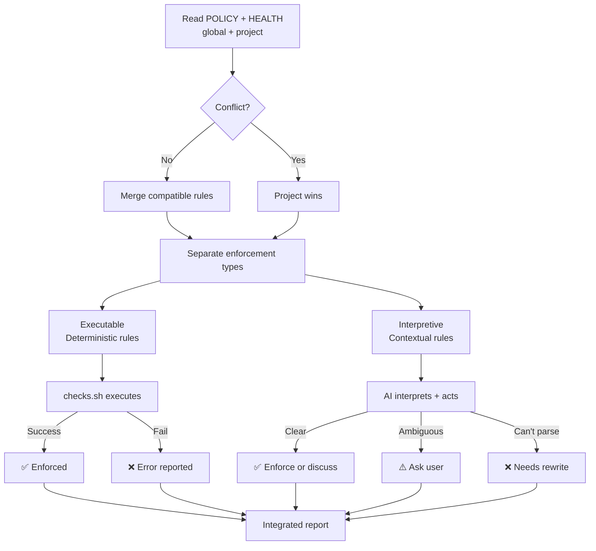
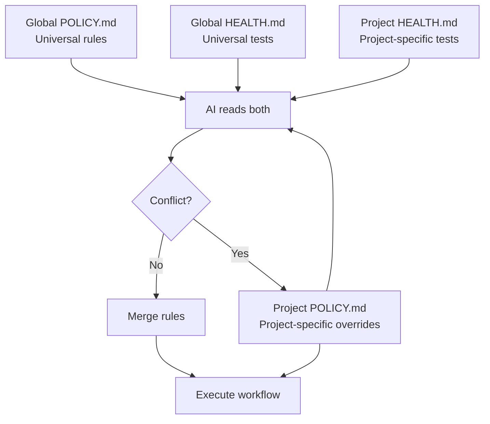
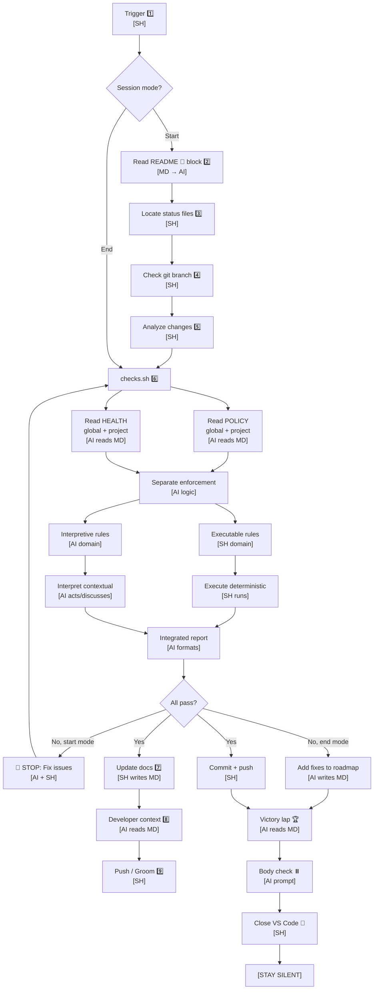

# 后台技能（Backstage Skill）

**昵称：** `backstage:`

**目标：** 为人工智能辅助开发提供通用的项目状态管理功能，确保每次提交前的文档内容与实际情况一致。

---

## 🔴 该技能存在的必要性（防止信息偏离）  
**后台技能 = 防止信息偏离（Anti-Drift）：**  
- ✅ 强制要求用户具备上下文意识（项目/任务）  
- ✅ 通过健康检查（HEALTH checks）防止混乱  
- ✅ 优先考虑项目架构（Architecture-first）  
- ✅ 保持路线图的可见性，避免意外  

**没有该技能时：**  
工作在后台之外进行 → 信息偏离 → 信任破裂 → 造成三倍的工作成本  

**使用该技能后：**  
“早上好，X” → 自动加载上下文 → 工作在规定的范围内 → 保持一致性  

---

**工作成本问题：**  
没有后台技能时，工作分配的成本会增加三倍：  
1. 工作本身  
2. 需要解释工作方法（伦理、偏好、协议）  
3. 需要确定学习内容的存储位置（愿景？灵魂？技能？记忆？）  

这对人类来说是非常耗费精力的。  

**只有当达到稳定状态时，投资才是值得的：**  
- 人类只需培训一次 → 人工智能就能内化这些知识  
- 每次使用该技能时：只需阅读上下文文件 → 按照既定伦理行事  
- 每次使用后：所需的解释减少  

**该技能有助于实现稳定：**  
强制要求用户具备上下文意识（项目/任务/设计架构），从而防止信息偏离。  
**原本需要三倍的工作量，现在只需完成一次。**  

---

## 政策与健康检查的执行  
**后台技能会执行 `POLICY.md` 和 `HEALTH.md` 中的所有规则（全局规则和项目特定规则）。**

### 执行模型  


**两个执行领域：**  
1. **可执行的（确定性的）**  
   - `HEALTH.md` 中的代码块  
   - `POLICY.md` 中的模板（导航块、版本信息）  
   - 文件结构规则（必须包含 🤖 标记）  
   - **执行方式：** `checks.sh`（提取并执行规则）  

2. **解释性的（基于上下文的）**  
   - `POLICY.md` 中的文字规则  
   - 质量指南（“精确修改”、“简洁明了”）  
   - 上下文相关的决策（“README 文件具有特殊意义”）  
   - **执行方式：** 人工智能（AI）（读取、解释并采取行动/与用户讨论）  

**保证：** 所有规则都会被尝试执行（可执行部分 → 由 `checks.sh` 处理；解释性部分 → 由 AI 处理）。失败情况会报告给用户。  

**自包含性：** `SKILL.md` 中包含所有提示信息（无需外部提示文件）。  

---

## Mermaid 图表生成（解释性功能）  
**目的：** 自动生成路线图（ROADMAP）并将其添加到所有后台文件中。  

**工作流程：**  
1. **解析 `ROADMAP.md`（可执行部分 → 由 `checks.sh` 处理）：**  
```bash
   parse-roadmap.sh backstage/ROADMAP.md
   # Output: version|status_emoji|name
   ```  

2. **读取 `POLICY.md` 中的图表规则**（解释性部分 → 由 AI 处理）：  
   - 全局 `POLICY.md` 定义了默认的图表格式（线性图、所有任务按顺序显示）  
   - 项目特定的 `POLICY.md` 可以覆盖这些规则（例如使用甘特图、流程图或禁用图表显示）  
   - 在规则冲突时，以项目规则为准。  

3. **生成 Mermaid 图表**（解释性部分 → 由 AI 处理）：  
   - 将 `POLICY.md` 中的规则应用于解析后的数据  
   - 生成符合规范的 Mermaid 代码  

4. **将图表添加到所有文件中**（可执行部分 → 由 `checks.sh` 处理）：  
   - 将图表插入到所有包含 `> 🤖` 标记的文件中（如 `README.md`、`ROADMAP.md`、`CHANGELOG.md`、`POLICY.md`、`HEALTH.md`）  
   - 删除旧的图表（防止信息偏离）  

**AI 提示（在启动/关闭后台技能时）：**  
> 读取全局/项目特定的 `POLICY.md` 中的 Mermaid 图表规则。  
> 运行 `parse-roadmap.sh` 命令以提取任务列表。  
> 根据项目规则生成 Mermaid 图表。  
> 将图表插入所有后台文件的导航块（`> 🤖`）之后。  
> 如果项目配置中禁止图表显示，则跳过图表生成。  

**工具：**  
- `parse-roadmap.sh`：从 `ROADMAP.md` 中提取任务信息（版本、状态、名称）。  
- `POLICY.md`：定义图表格式的规则（类型、包含/排除的内容、状态映射）。  

---

## 多中心治理机制（工作原理）  

**该技能采用多中心治理机制：**  
- 读取全局和项目特定的 `POLICY.md`/`HEALTH.md` 文件  
- 在规则一致时合并两者  
- 在规则冲突时优先采用项目规则  
- 根据合并后的理解来执行工作流程  

**触发条件：**  
“早上好”、“晚上好”、“启动/关闭后台技能”  

---

## 工作流程图  

**领域标签：**  
- **[MD]**：Markdown 文件（`POLICY.md`、`HEALTH.md`、`ROADMAP.md`）——人类/AI 提示  
- **[SH]**：Shell 脚本（`checks.sh`、`backstage-start.sh`）——机器可执行文件  
- **[AI 读取 Markdown 文件]**：AI 解析 Markdown 文件并理解规则/提示  
- **[AI 生成 Markdown 文件]**：AI 生成 Markdown 内容  
- **[Shell 修改 Markdown 文件]**：脚本修改 Markdown 文件（如添加复选框、导航块）  
- **[Shell 执行命令]**：脚本执行确定性规则  
- **[AI 解释规则]**：AI 解释上下文相关规则并采取行动或询问用户  
- **[AI 逻辑分离]**：AI 区分可执行规则和解释性规则  

**关键区分：**  
- **Markdown 文件** 是用于提示的——AI 负责读取、解释和执行  
- **Shell 脚本** 负责执行命令  
- **AI** 负责读取 `POLICY`/`HEALTH.md` 文件，区分规则类型，并在需要时调用 Shell 脚本执行确定性规则；解释性规则由 AI 自行处理  

**注意事项：**  
- **触发命令：** “启动后台技能”、“开始处理任务 X”、“怎么样？”（启动模式）或 “关闭后台技能”、“晚上好”、“结束工作”（结束模式）  
- **代码：** `backstage-start.sh` 或 `backstage-end.sh`  

- **读取 `README.md` 文件中的导航块：** 在 `> 🤖` 标记之间找到导航块，并提取所有状态文件的路径（`ROADMAP.md`、`CHANGELOG.md`、`HEALTH.md`、`POLICY.md`）。这是文件位置的唯一权威来源。  
- **代码：** `backstage-start.sh::read_navigation_block()`  

- **定位状态文件：** 使用 `🤖` 标记中的路径。如果文件不存在，询问用户应将其创建在哪里，并同时检查全局（`backstage/global/`）和项目（`backstage/`）目录。  
- **代码：** `backstage-start.sh::locate_status_files()`  

- **检查 Git 分支：** 运行 `git branch --show-current` 以确定当前工作上下文。  
- **代码：** `backstage-start.sh::check_branch()`  

- **分析变更：**  
```bash
git diff --name-status
git diff --stat
LAST_VERSION=$(grep -m1 "^## v" CHANGELOG.md | cut -d' ' -f2)
git log --oneline "${LAST_VERSION}..HEAD"
```  
  - 对变更进行分类（补丁、小修改、重大修改），并与路线图进行对比。  
- **代码：** `backstage-start.sh::analyze_changes()`  

- **`checks.sh` 的统一规则执行：**  
  - **读取 `POLICY.md`（全局和项目规则，以项目规则为准）  
  - **执行规则**：检测文档是否偏离实际情况（系统状态与文档内容是否一致），并修复文档问题  
  - **运行健康检查**  
  - **修复可解决的问题**（如漏洞、连接问题、文件缺失）  
  - **报告无法解决的问题**  

**模式行为：**  
- **启动模式：** 如果检查失败，直接阻止提交  
- **结束模式：** 发出警告，并将问题记录到 `ROADMAP` 中  
- **代码：** `checks.sh`（在启动/关闭脚本中被调用）  

- **更新文档：** 如果检查通过，自动更新 `ROADMAP`（标记复选框）和 `CHANGELOG`（仅在文件顶部添加新条目），并升级版本。同时为所有状态文件添加导航菜单。  
- **代码：** `backstage-start.sh::update_docs()`  

- **向开发者展示反馈：** 根据分析结果生成反馈信息（5 种可能的状态：🛑 失败、⚠️ 不一致、🧑 整理中、✅ 进行中、🎉 完成）。  
- **代码：** `backstage-start.sh::show_developer_context()`  

- **提交操作：** 如果检查通过，提交更改并附上相应的信息（说明变更内容、原因、状态等）。如果处于整理阶段，仅更新 `ROADMAP` 的优先级。  
- **代码：** `backstage-start.sh::prompt_push()`  

- **胜利总结：** 简要总结取得的成果（最多展示 3 项主要成果）。  
- **代码：** `backstage-end.sh::victory_lap()`  

- **结束时的身体检查：** 询问用户的需求（是否需要吃东西、喝水、休息等）。  
- **代码：** `backstage-end.sh::body_check()`  

- **关闭 VS Code：** 运行倒计时脚本 `osascript -e 'quit app "Visual Studio Code"'` 以关闭 VS Code。**  
  **重要提示：** 关闭 VS Code 后不要发送任何提示信息，否则 VS Code 会提示“未保存的更改”。  
- **代码：** `backstage-end.sh::close_vscode()`  

---

## 使用场景：**  
**触发命令：**  
- “启动后台技能”  
- “怎么样？”  
- “开始处理任务 X”  
- “当前项目状态如何？”  
- 每次提交之前（尤其是在长时间休息后）  

- **结束命令：**  
- “关闭后台技能”  
- “晚上好”  
- “结束工作”  
- 在工作会话结束时，或者当用户感到疲劳或需要切换工作时  

## 关键原则：**  
1. `README.md` 中的 `🤖` 标记是文件位置的唯一权威来源。  
2. 状态文件由 AI 提供（`HEALTH.md` 包含测试信息，`POLICY.md` 包含规则，`ROADMAP.md` 包含任务列表，`CHANGELOG.md` 包含变更记录）。  
3. 采用多中心治理机制（全局规则和项目规则同时适用，冲突时以项目规则为准）。  
4. 在提交前必须通过所有检查（启动模式必须通过所有检查；结束模式仅发出警告）。  
5. `CHANGELOG` 只允许追加新内容（不允许修改旧记录）。  
6. 有 5 种可能的状态（失败、不一致、整理中、进行中、完成）。  
7. 文档内容会自动与实际情况同步（标记复选框、升级版本）。  
8. 结束时进行身体检查（关注用户状态，保持工作连贯性）。  
9. 关闭 VS Code 后不要发送任何提示信息。  
10. 该技能适用于任何项目（无需指定文件路径，优先读取 `README.md`）。  

## 5 种状态（启动模式）：**  
| 状态                | 触发条件                | 执行操作                | 是否可以提交？ |
|---------------------|-------------------|-------------------|-----------|  
| 🛑 失败                | 测试失败                | 修复问题                | ✌ 不允许提交   |
| ⚠️ 文档不一致            | 文档内容与实际不符          | 自动更新文档            | ✅ 允许提交   |
| 🧑 整理中                | 无变化                | 规划下一项工作            | 不需要提交   |
| ✅ 进行中                | 部分工作完成            | 更新复选框              | ✅ 允许提交   |
| 🎉 完成                | 所有工作完成              | 将任务状态更新到 `CHANGELOG`       | ✅ 允许提交   |  

## 规则检查：**  
**来自 `HEALTH.md` 的规则：**  
- 对于特殊分支（如实验性分支），仅发出警告但不阻止提交。  
- 对于主分支，如果检查失败，则阻止提交。  
- 在结束模式中，仅列出已修复的问题，不允许提交。  

## 三层级系统：**  
- **第 1 层：个人工具**（未纳入管理范围）：  
  - 个人使用的书籍、笔记、本地配置文件  
  - 不属于任何项目的一部分  

- **第 2 层：项目专用工具**（例如 Librarian MCP）：  
  - 其他用户也可使用的通用工具  
  - 包含状态文件（`ROADMAP.md`、`CHANGELOG.md`、`HEALTH.md`、`POLICY.md`）  
  - 可作为第 3 层工具的示例项目  

- **第 3 层：通用工作流程工具**：  
  - 适用于任何项目  
  - 不需要指定文件路径  
  - 通过读取 `README.md` 文件获取所有信息  
  - 可以复制到任何地方  

## 参考提示：**  
**原始提示（未来优化内容）：**  
- `backstage-start.prompt.md`：完整的启动工作流程说明  
- `backstage-close.prompt.md`：完整的结束工作流程说明  

**文件位置：** `/Users/nfrota/Documents/nonlinear/.github/prompts/`  

**说明：**  
此 `SKILL.md` 是这些提示内容的初步整理版本。未来的优化将包括改进图表、添加表情符号注释、明确步骤等。原始提示文件中包含所有详细信息。  

## 待办事项/未来优化方向：**  
- [ ] 添加表情符号注释  
- [ ] 简化图表结构（图表节点过多，需要优化）  
- [ ] 明确脚本的执行位置  
- [ ] 为没有状态文件的新项目创建模板  
- [ ] 文档边缘情况的处理（如没有 Git 仓库、没有 `README.md` 文件、文件损坏等情况）  
- [ ] 测试该工具在不同项目中的表现  
- [ ] 考虑将启动/结束功能分离为独立的技能  

**创建时间：** 2026-02-12  
**状态：** 初稿（需要进一步优化）  
**文件位置：** `~/Documents/skills/backstage/SKILL.md`