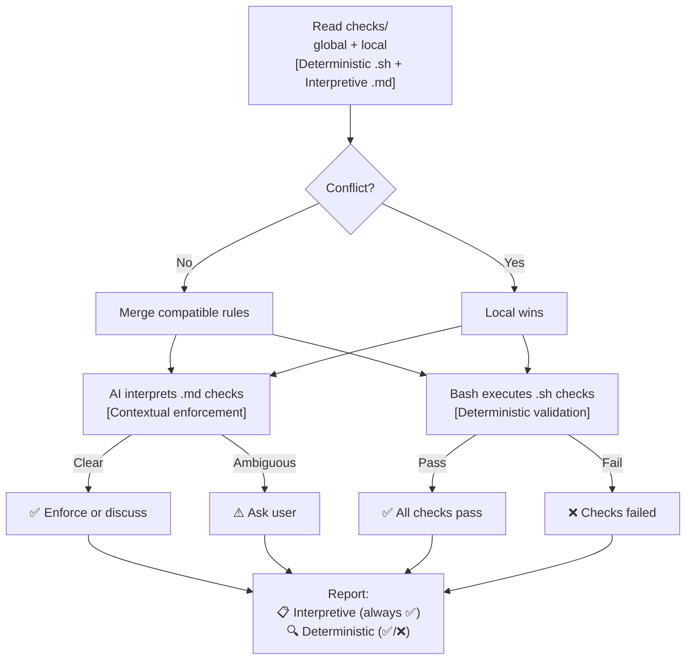
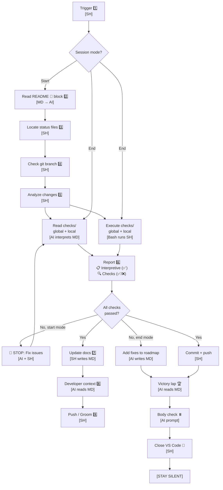

# 后台技能（Backstage Skill）

**昵称：** `backstage:`

**目标：** 实现人工智能辅助开发中的通用项目状态管理，确保每次提交前的文档内容与实际情况一致。

---

## 🔴 为何需要这项技能（防止项目偏离目标）（Why This Skill Exists: Anti-Drift）

**后台技能 = 防止项目偏离目标（Anti-Drift）：**
- ✅ 强制要求具备项目/任务的上下文意识
- ✅ 通过健康检查防止混乱
- ✅ 优先考虑项目架构
- ✅ 保持路线图的可见性，避免意外情况

**没有这项技能时：**
- 工作在后台之外进行 → 项目偏离目标 → 信任度下降 → 造成三倍的工作负担

**使用这项技能后：**
- 输入“good morning X”后，系统会自动加载上下文信息 → 工作在规定的范围内进行 → 保持项目状态的同步

---

**工作负担问题（The Metabolic Cost Problem）：**

没有后台技能时，工作负担会**增加三倍**：
1. 工作本身
2. 需要解释工作方法（伦理规范、偏好设置、协议流程）
3. 需要确定学习内容的存储位置（愿景？灵魂？技能？还是记忆？）

这对人类来说是非常耗费精力的。

**只有当达到以下条件时，投资这项技能才是值得的：**
- 人类只需培训一次 → 人工智能就能掌握相关知识
- 每次使用时：系统会读取上下文文件 → 并根据伦理规范执行操作
- 每次使用时：所需解释的内容减少
- 达到这个阶段后，人类可以 delegating（分配任务），而人工智能无需监督即可执行任务

**这项技能有助于实现工作的稳定：**  
强制要求具备项目/任务/设计架构的上下文意识，从而防止项目偏离目标。  
**原本需要三倍的工作量，现在只需完成一份。**

---

## 政策与检查的执行（Policies & Checks Enforcement）

**后台技能通过各种检查（确定性和解释性检查，全局性和局部性检查）来执行所有规则。**

### 执行模型（Enforcement Model）


```mermaid
flowchart TD
    READ_CHK["Read checks/<br/>global + local<br/>[Deterministic .sh + Interpretive .md]"]
    
    CONFLICT{Conflict?}
    MERGE[Merge compatible rules]
    LOCAL[Local wins]
    
    AI["AI interprets .md checks<br/>[Contextual enforcement]"]
    SH["Bash executes .sh checks<br/>[Deterministic validation]"]
    
    AI_ACT[✅ Enforce or discuss]
    AI_AMBIG[⚠️ Ask user]
    
    SH_OK[✅ All checks pass]
    SH_FAIL[❌ Checks failed]
    
    REPORT["Report:<br/>📋 Interpretive (always ✅)<br/>🔍 Deterministic (✅/❌)"]
    
    READ_CHK --> CONFLICT
    CONFLICT -->|No| MERGE
    CONFLICT -->|Yes| LOCAL
    MERGE --> AI
    MERGE --> SH
    LOCAL --> AI
    LOCAL --> SH
    
    AI -->|Clear| AI_ACT
    AI -->|Ambiguous| AI_AMBIG
    
    SH -->|Pass| SH_OK
    SH -->|Fail| SH_FAIL
    
    AI_ACT --> REPORT
    AI_AMBIG --> REPORT
    SH_OK --> REPORT
    SH_FAIL --> REPORT
```

**两个执行领域：**

1. **解释性检查（Interpretive Checks）**
   - `checks/global/*.md`：通用工作流程规则
   - `checks/local/*.md`：项目特定的自定义规则
   - **执行者：** 人工智能（读取 Markdown 文件，解释上下文，并根据规则采取行动）
   - **结果：** 人工智能会读取文件、理解内容，并据此采取行动

2. **确定性检查（Deterministic Checks）**
   - `checks/global/*.sh`：通用验证测试
   - `checks/local/*.sh`：项目特定的测试
   - **执行者：** Bash 脚本（执行脚本，并返回退出代码）
   - **结果：** 成功（退出代码为 0）或失败（退出代码非 0）

**多中心治理（Polycentric Governance）：**
- 全局性规则和局部性规则共存
- 在规则冲突时，以局部性规则为准
- 当规则兼容时，人工智能会合并这些规则

**报告格式（Report Format）：**

```
📋 Interpretive checks:
  ✅ checks/global/branch-workflow.md (read)
  ✅ checks/global/commit-style.md (read)
  ✅ checks/local/dogfooding.md (read)

🔍 Checks (deterministic):
  ✅ checks/global/navigation-block-readme.sh
  ✅ checks/global/semver-changelog.sh
  ❌ checks/local/pre-merge-tasks.sh (incomplete tasks)
```

**自包含性（Self-Contained）：** 所有提示信息都包含在 `SKILL.md` 文件中，无需外部提示文件。

---

## Mermaid 图表生成（Interpretive）

**目的：** 自动生成路线图（ROADMAP）图表，并将其添加到所有后台文件中。

**工作流程（Workflow）：**

1. **解析路线图文件（ROADMAP.md）（确定性步骤）：**
   ```bash
   parse-roadmap.sh backstage/ROADMAP.md
   # Output: version|status_emoji|name
   ```

2. **读取检查规则和图表格式要求（解释性步骤）：**
   - `checks/global/navigation-block.md` 定义了默认的图表格式（线性图，包含所有任务）
   - `checks/local/*.md` 可以自定义图表格式（甘特图、流程图或无图表）
   - 在规则冲突时，以局部性规则为准

3. **生成 Mermaid 图表（解释性步骤）：**
   - 根据检查规则和格式要求生成 Mermaid 图表
   - 示例（默认格式）：
     ```mermaid
     graph LR
         A[🏗️ v0.1.0 Active Epic] --> B[📋 v0.2.0 Backlog Epic]
     ```

4. **将图表添加到所有文件中（确定性步骤）：**
   - 将生成的图表插入到文件中的 `> 🤖` 标记之后
   - 包括 `README.md`、`ROADMAP.md` 和 `CHANGELOG.md`
   - 删除旧的图表（防止项目偏离目标）

**人工智能提示（在启动/结束后台技能时）：**

> 读取 `checks/global/navigation-block.md` 和 `checks/local/*.md` 中的图表格式要求。
> 运行 `parse-roadmap.sh` 命令提取任务列表。
> 根据检查规则生成 Mermaid 图表（优先使用局部性规则）。
> 将生成的图表插入到所有文件中的 `> 🤖` 标记之后。
> 如果局部性规则中指定“无需生成图表”，则跳过此步骤。

**使用的工具：**
- `parse-roadmap.sh`：从 `ROADMAP.md` 中提取任务版本、状态和名称。
- `checks/`：图表格式规则（指定图表类型、包含的内容、状态映射）

---

## 多中心治理（How It Works）

**这项技能通过以下方式实现多中心治理：**
- 读取所有 `checks/**/*.md` 文件（全局性和局部性规则）
- 执行所有 `checks/**/*.sh` 脚本（全局性和局部性规则）
- 在规则兼容时合并检查结果
- 在规则冲突时优先使用局部性规则
- 显示检查结果的成败状态

**触发条件（Trigger Conditions）：**
- 输入“good morning”、“good night”或“backstage start/end”来启动/结束后台技能

---

## 工作流程图（Workflow Diagram）


```mermaid
flowchart TD
    START["Trigger 1️⃣<br/>[SH]"]
    MODE{"Session mode?"}
    
    %% Common enforcement module
    READ_POL["Read checks/<br/>global + local<br/>[AI interprets MD]"]
    EXEC_CHK["Execute checks/<br/>global + local<br/>[Bash runs SH]"]
    
    REPORT["Report 6️⃣<br/>📋 Interpretive (✅)<br/>🔍 Checks (✅/❌)"]
    CHECKS_GATE{"All checks<br/>passed?"}
    
    %% Start Branch
    START_BRANCH["Read README 🤖 block 2️⃣<br/>[MD → AI]"]
    START_FILES["Locate status files 3️⃣<br/>[SH]"]
    START_GIT["Check git branch 4️⃣<br/>[SH]"]
    START_WORK["Analyze changes 5️⃣<br/>[SH]"]
    START_FIX["🛑 STOP: Fix issues<br/>[AI + SH]"]
    START_UPDATE["Update docs 7️⃣<br/>[SH writes MD]"]
    START_REPORT["Developer context 8️⃣<br/>[AI reads MD]"]
    START_PUSH["Push / Groom 9️⃣<br/>[SH]"]
    
    %% End Branch
    END_FIXES["Add fixes to roadmap<br/>[AI writes MD]"]
    END_PUSH["Commit + push<br/>[SH]"]
    END_VICTORY["Victory lap 🏆<br/>[AI reads MD]"]
    END_BODY["Body check ⏸️<br/>[AI prompt]"]
    END_CLOSE["Close VS Code 🌙<br/>[SH]"]
    END_SILENT["[STAY SILENT]"]
    
    %% Flow
    START --> MODE
    
    MODE -->|Start| START_BRANCH
    START_BRANCH --> START_FILES
    START_FILES --> START_GIT
    START_GIT --> START_WORK
    START_WORK --> READ_POL
    START_WORK --> EXEC_CHK
    
    READ_POL --> REPORT
    EXEC_CHK --> REPORT
    REPORT --> CHECKS_GATE
    
    CHECKS_GATE -->|No, start mode| START_FIX
    START_FIX --> READ_POL
    CHECKS_GATE -->|Yes| START_UPDATE
    START_UPDATE --> START_REPORT
    START_REPORT --> START_PUSH
    
    MODE -->|End| READ_POL
    MODE -->|End| EXEC_CHK
    CHECKS_GATE -->|No, end mode| END_FIXES
    CHECKS_GATE -->|Yes| END_PUSH
    END_FIXES --> END_VICTORY
    END_PUSH --> END_VICTORY
    END_VICTORY --> END_BODY
    END_BODY --> END_CLOSE
    END_CLOSE --> END_SILENT
```

**领域标签（Domain Labels）：**
- **[MD]**：Markdown 文件（`checks/*.md`、`ROADMAP.md`）：人类/人工智能使用的提示文件
- **[SH]**：Shell 脚本（`checks/*.sh`、`backstage-start.sh`）：机器执行的脚本
- **[AI 读取 Markdown 文件]**：人工智能解析 Markdown 文件并理解规则/提示
- **[AI 生成 Markdown 文件]**：人工智能生成 Markdown 内容
- **[Shell 修改 Markdown 文件]**：脚本用于修改 Markdown 文件（例如添加复选框、导航块）
- **[Bash 执行脚本]**：Bash 脚本执行验证操作
- **[AI 解释 Markdown 文件]**：人工智能读取检查结果并根据上下文采取行动

**关键分离（Critical Separations）：**
- **检查规则（checks/）**：人工智能负责读取、解释和执行规则
- **执行脚本（checks/）**：Bash 脚本负责执行命令并返回退出代码
- **人工智能作为中介**：负责读取检查结果、执行检查并整合报告

**注意事项（Notes）：**

- **触发条件：** 输入“backstage start”、“vamos trabalhar no X”、“whatsup”（启动模式）或“backstage end”、“boa noite”、“wrap up”（结束模式）
- **相关脚本：** `backstage-start.sh` 或 `backstage-end.sh`

- **读取 `README.md` 文件中的导航块：** 在文件中的 `> 🤖` 标记之间找到导航块，并提取所有状态文件的路径（`ROADMAP.md`、`CHANGELOG.md`、`checks/` 等）。这是获取文件位置的唯一可靠来源。
- **相关代码：** `backstage-start.sh::read_navigation_block()`

- **查找状态文件：** 使用导航块中的路径。如果文件不存在，系统会询问用户文件的位置，并在全局（`backstage/checks/global/`、`backstage/checks/local/`）和局部（`backstage/checks/local/`）目录中查找文件。
- **相关代码：** `backstage-start.sh::locate_status_files()`

- **检查 Git 分支：** 运行 `git branch --show-current` 命令以确定当前的工作上下文。
- **相关代码：** `backstage-start.sh::check_branch()`

- **分析变更：** 
```bash
git diff --name-status
git diff --stat
LAST_VERSION=$(grep -m1 "^## v" CHANGELOG.md | cut -d' ' -f2)
git log --oneline "${LAST_VERSION}..HEAD"
```
  对变更进行分类（修复、小修改、重大修改），并与路线图进行对比，确保实际工作与计划一致。
- **相关代码：** `backstage-start.sh::analyze_changes()`

**报告内容（Report Content）：**

**报告格式（Report Format）：**
```
📋 Interpretive checks:
  ✅ checks/global/branch-workflow.md (read)
  ✅ checks/global/commit-style.md (read)
  ✅ checks/local/dogfooding.md (read)

🔍 Checks (deterministic):
  ✅ checks/global/navigation-block-readme.sh
  ✅ checks/global/semver-changelog.sh
  ❌ checks/local/pre-merge-tasks.sh (incomplete tasks)
```

**政策说明：**
- **政策始终由人工智能执行：** 人工智能会读取规则并据此采取行动
- **检查结果可能失败（Check Results May Fail）：** 退出代码会决定报告的状态

**不同模式下的行为（Mode Behavior）：**
- **启动模式：** 如果检查失败，系统会强制阻止提交。
- **结束模式：** 系统会发出警告，并将错误信息添加到路线图中。

- **相关代码：** `backstage-start.sh::report_enforcement()`

- **更新文档：** 如果检查通过，系统会自动更新路线图（标记复选框的状态）和 `CHANGELOG`（在文件顶部添加新记录），并更新版本号。同时为所有状态文件添加导航菜单。
- **相关代码：** `backstage-start.sh::update_docs()`

- **向开发者展示反馈：** 根据分析结果生成反馈信息（5 种可能的状态：🛑 失败、⚠️ 不匹配、🧑 准备中、✅ 进行中、🎉 完成）。包括时间、具体内容、原因、当前状态和下一步行动。
- **相关代码：** `backstage-start.sh::show_developer_context()`

- **提交操作：** 如果检查通过，系统会提交更改，并附上相应的提示信息（表示进度或完成情况）。如果处于准备中阶段，只需更新路线图的优先级。
- **相关代码：** `backstage-start.sh::prompt_push()`

- **胜利总结（Victory Summary）：** 简要总结取得的成果（最多展示 3 项主要成果和统计数据）。
- **相关代码：** `backstage-end.sh::victory_lap()`

- **结束时的检查（Body Check）：** 询问用户的需求（是否需要吃东西、喝水、休息等）。
- **相关代码：** `backstage-end.sh::body_check()`

- **关闭 VS Code：** 关闭 VS Code 时不会显示任何提示信息（防止未保存的更改导致问题）。
- **相关代码：** `backstage-end.sh::close_vscode()`

---

## 使用场景（When to Use）**

**启动模式（Start Mode）：**
- 输入“backstage start”、“whatsup”、“vamos trabalhar no X”或“what’s the status”来启动后台技能
- 在每次提交之前（尤其是在长时间休息后）

**结束模式（End Mode）：**
- 输入“backstage end”、“boa noite”或“wrap up”来结束后台技能
- 在工作会话结束时，或者当用户感到疲劳或需要切换工作时

## 关键原则（Key Principles）**

1. `README.md` 中的导航块是文件位置的唯一可靠来源。
2. 状态文件由人工智能生成的提示信息控制（检查规则用于验证文件内容，路线图用于展示项目进度，`CHANGELOG` 用于记录历史变更）。
3. 采用多中心治理机制（全局性和局部性规则共存，在规则冲突时以局部性规则为准）。
- 提交前必须通过所有检查（启动模式下必须通过所有检查；结束模式下允许部分检查失败）。
- `CHANGELOG` 只允许追加新内容（不允许修改旧记录）。
- 有 5 种可能的状态（失败、不匹配、准备中、进行中、完成）。
- 文档内容会自动与实际情况同步（通过标记复选框来更新状态）。
- 在关闭 VS Code 时进行必要的检查（关注用户的需求和状态）。

## 5 种状态（5 States）**

| 状态                | 触发条件          | 应采取的行动            | 是否可以提交？ |
|---------------------|-------------------|-------------------|-----------|
| 🛑 失败（Failed Checks）    | 检查失败         | 修复问题             | 不允许提交     |
| ⚠️ 文档不匹配（Docs Mismatch） | 代码与文档不一致     | 自动更新文档         | 允许提交     |
| 🧑 准备中（Grooming）       | 无变更           | 规划下一阶段的工作       | 不需要提交     |
| ✅ 进行中（In Progress）     | 部分工作已完成     | 更新复选框的状态       | 允许提交     |
| 🎉 完成（Complete）       | 所有工作已完成     | 将状态更新到 `CHANGELOG`     | 允许提交     |

## 检查策略（Check Policies）**

- 对于特定任务分支，系统会发出警告但不阻止提交。
- 对于主分支，系统会强制阻止提交。
- 在结束模式下，系统会列出需要修复的问题，但不允许提交。

## 三级系统架构（The 3-Level System）**

- **第一级：个人工具（Level 1）**：个人使用的书籍、笔记、本地配置文件
- 不属于任何项目的一部分

- **第二级：项目专用工具（Level 2）**：其他人可以使用的通用工具
- 包含状态文件（路线图、`CHANGELOG`、检查规则等）
- 可以作为第三级工具的示例项目

- **第三级：通用工作流程管理工具（Level 3）**：适用于任何项目
- 不需要硬编码的路径
- 通过读取 `README.md` 文件来获取所有所需信息
- 可以复制到任何地方使用

## 参考提示（Reference Prompts）**

- **原始提示文件（For Future Refinement）：**
  - `backstage-start.prompt.md`：完整的启动工作流程规范
  - `backstage-close.prompt.md`：完整的结束工作流程规范

- **文件位置：** `/Users/nfrota/Documents/nonlinear/.github/prompts/`

**说明：** 这份 `SKILL.md` 文件是这些提示文件的初步版本。未来的改进将优化图表内容、添加表情符号注释并明确步骤细节。原始提示文件中包含了所有详细信息。

## 待办事项与未来优化计划（TODO / Future Refinements）**

- [ ] 更新 `checks/` 和 `checks/` 脚本，以便能够读取相关文件。
- [ ] 添加表情符号注释（例如用于表示设计差异的提示）。
- [ ] 简化图表生成流程（合并重复的检查步骤）。
- [ ] 明确脚本的执行位置（如果有的话）。
- [ ] 为没有状态文件的新项目创建模板。
- [ ] 处理边缘情况（例如没有 Git 仓库、没有 `README.md` 文件或文件损坏的情况）。
- [ ] 测试该工具在多个项目中的适用性。
- [ ] 考虑将启动和结束操作拆分为单独的技能。

**创建时间：** 2026-02-12
**更新时间：** 2026-02-18（版本 1.0.0，包含模块化的检查规则）
**当前状态：** 文档已更新，脚本待完善
**文件位置：** `~/Documents/backstage/skills/backstage/SKILL.md`