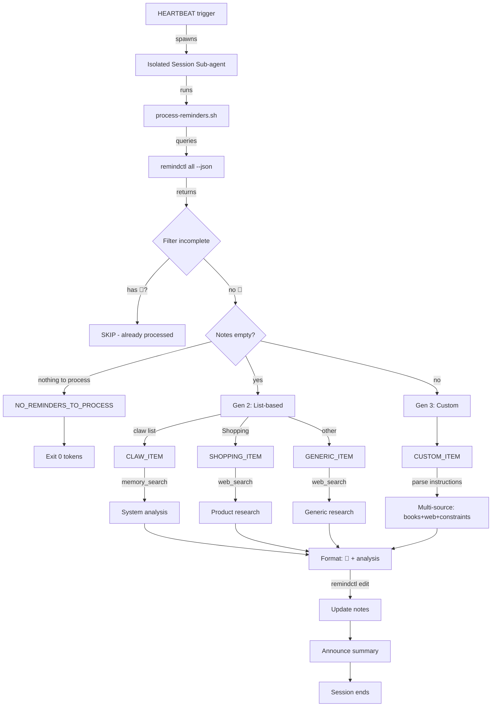

# 提醒研究（Reminder Research）

**版本3.0 的改进：** 自定义指令 + 自动处理 + 结果跟踪

## 🔧 设置（Setup）

**必备条件：**
1. 安装 `remindctl`：`brew install steipete/tap/remindctl`
2. 安装 `jq`：`brew install jq`
3. 授予 `remindctl` 权限：`remindctl authorize`

**可选（用于网络研究）：**
1. 获取 Brave Search API 密钥：https://brave.com/search/api/
2. 配置：`openclaw configure --section web`
3. 在提示时设置 `BRAVE_API_KEY`

**可选（用于书籍研究）：**
- 安装 `Librarian` 技能（需要外部项目支持）

**推荐使用 Cron 脚本进行调度：**
```bash
# Add via OpenClaw cron tool
cron add --schedule "0 3 * * *" --payload "Run reminder-research skill..."
```

**或手动执行：**
```bash
~/Documents/skills/reminder-research/process-reminders.sh
```

---



## 🎯 三个版本（Three Generations）**

### 第1代（手动操作 - 已弃用）  
```
Title: 🔍 Pesquise tarot no livro
Notes: (empty)
→ Manual emoji trigger
```

### 第2代（自动操作 - 当前默认版本）  
```
Title: Stacker bag
Notes: (empty)
→ Auto-detect empty notes
→ List-based behavior (shopping/claw/generic)
```

### 第3代（自定义操作 - 新功能）  
```
Title: Bitcoin ETF regulation
Notes: "Procure no livro de David Graeber sobre anarchism + web search SEC rulings 2024"
→ Follow custom instructions
→ Output: "💎 [resultado da pesquisa]"
```

## 🔑 标记符号（Signifiers）

**💎 = 已处理结果（Result processed）**  
- 对 Nicholas 来说：「阅读报告，已完成」  
- 对 Claw 来说：「跳过此项，已进行过研究」

**无 💎 = 需要处理（Needs processing）**  
- 空笔记：采用基于列表的默认处理方式  
- 包含指令的笔记：按照自定义研究流程处理  

## 📋 处理逻辑（Processing Logic）**

### 检测（Detection）  
```bash
process-reminders.sh
```

**输出类型（Output types）：**  
```
NO_REMINDERS_TO_PROCESS          # Nothing to do
CLAW_ITEM|<id>|<title>            # System improvement (empty notes)
SHOPPING_ITEM|<id>|<title>        # Product search (empty notes)
GENERIC_ITEM|<id>|<list>|<title>  # Generic research (empty notes)
CUSTOM_ITEM|<id>|<list>|<title>|<instructions>  # Custom instructions (Gen 3)
```

### 人工智能处理（AI Processing）  

**对于 **自定义任务（CUSTOM_ITEM）**：**
1. 从笔记中解析自定义指令  
2. 执行多源搜索：  
   - 如果提到 “livro/book” → 使用 `Librarian` 技能  
   - 如果提到 “web search” → 使用 `web_search`  
   - 如果提到特定来源 → 优先处理这些来源  
3. 合并搜索结果  
4. 更新笔记：`💎 [搜索结果]`  

**对于 **Claw 任务（CLAW_ITEM）**：**
1. 使用 `memory_search` 工具搜索类似的问题  
2. 分析问题模式（频率、上下文、影响）  
3. 提出解决方案（技术/流程/系统相关）  
4. 更新笔记：`💎 [分析结果 + 解决方案]`  

**对于 **购物任务（SHOPPING_ITEM）**：**
1. 在 Temu、Shop.app、AliExpress 等网站进行搜索（避免使用 Amazon）  
2. 提取链接、价格、评分信息  
3. 更新笔记：`💎 [购物结果]`  

**对于 **通用任务（GENERIC_ITEM）**：**
1. 根据任务名称在网络上进行搜索  
2. 查找教程、操作指南、文档等资源  
3. 总结关键信息  
4. 更新笔记：`💎 [研究摘要]`  

## 💎 结果格式（Result Format）**

结果以 `💎` 标记开头：  
```
💎 RESEARCH RESULTS

**Sources:**
- Book: "Debt: The First 5000 Years" by David Graeber, Chapter 7
- Web: SEC ruling 2024-08 (Bitcoin ETF approval)

**Summary:**
[Key findings organized by source]

**Next steps:**
[Actionable recommendations if applicable]
```

## 📊 基于列表的处理方式（List-Based Behavior, 第2代）  
| 任务类型 | 处理方式 | 输出格式 |  
|------|--------|---------------|  
| 🛒 购物（Groceries） | 跳过（Skip） | 无需处理 |  
| Claw | 系统分析（System analysis） | 💎 分析结果 + 解决方案 |  
| 购物（Shopping） | 产品搜索结果 | 💎 链接 + 价格 |  
| 其他（Others） | 通用搜索结果 | 💎 摘要 + 来源信息 |  

## 🎨 自定义指令（Custom Instructions, 第3代）**

**笔记中的示例提示：**  
```
Procure no livro de finance + web search "mortgage prepayment calculator"
```  

**特定约束条件（Specific constraints）：**  
```
Web search only (no books). Focus on 2024 data. Avoid crypto sites.
```  

**专注于书籍研究（Librarian focus）：**  
```
Pesquise nos livros de tarot + I Ching. Compare interpretations.
```  

**带有约束条件的购物任务（Shopping with constraints）：**  
```
Where to buy. Budget under $50. Avoid Amazon.
```  

## 🔄 心跳机制集成（Heartbeat Integration）**

**通过 **HEARTBEAT** 触发（可配置的调度计划）：**  
```bash
RESULT=$(process-reminders.sh)

if [ "$RESULT" = "NO_REMINDERS_TO_PROCESS" ]; then
  # Exit immediately - 0 tokens spent
  exit 0
fi

# Otherwise: Parse each item type, research, update notes
```  

**高效运行模式：** 如果没有需要处理的任务，则脚本直接退出，不会启动人工智能会话，也不会产生任何成本。  

## 📝 更新提醒笔记（Update Reminder Notes）  
```bash
remindctl edit <id> --notes "💎 [your research findings here]"
```  

## 🎯 使用场景（Use Cases）**  
- **系统调试（System debugging）**  
- **产品研究（Product research）**  
- **深度自定义研究（Custom deep research）**  
- **后续操作指令（Follow-up instructions）**  
```
List: Creative Code
Title: Vertical slider library
Notes: "Find React examples on GitHub. Check if any use Framer Motion. Budget: MIT license only."
→ Custom: GitHub code search with constraints
→ Result: "💎 FOUND: 3 MIT-licensed libs using Framer..."
```  

## 🚫 不需要处理的场景（What NOT to Process）**  
- 已标记为 💎 的笔记：已处理，直接跳过  
- 类型为 🛒 的购物任务：无需额外研究  
- 已完成的提醒任务：忽略它们  

## 架构（Architecture）  
有关系统设计、数据流和实现细节，请参阅 [references/architecture.md](references/architecture.md)。  

## 依赖库（Dependencies）：**  
- `remindctl`（Apple Reminders 的命令行工具）  
- `jq`（用于 JSON 数据处理）  
- OpenClaw 的 `web_search` 和 `memory_search` 工具  
- `Librarian` 技能（用于书籍研究）