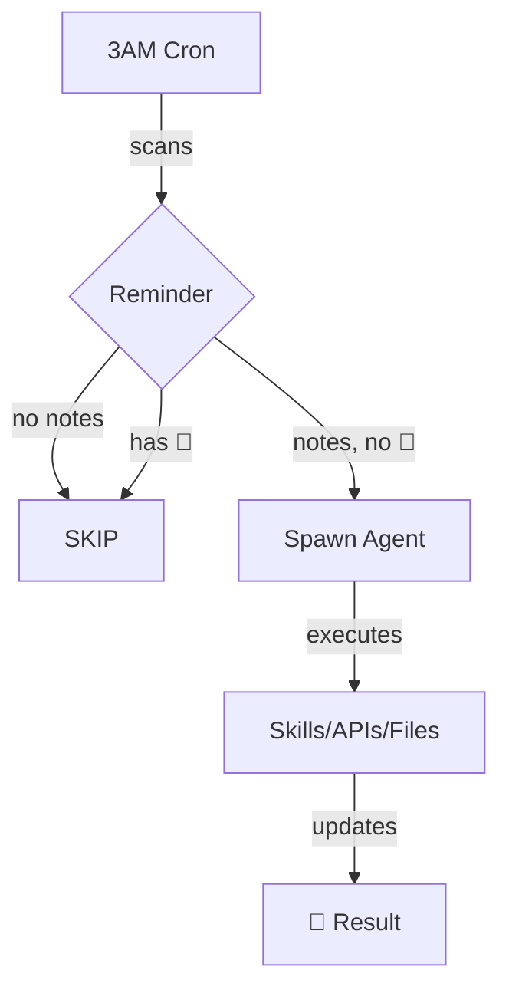

# 提示研究（Reminder Research）

**将 Apple Reminders 转换为自然语言任务队列**

**发布链接：** https://clawhub.ai/nonlinear/reminder-research

1. **提醒事项没有备注？** → 跳过（SKIP）
2. **提醒事项有备注？** → 执行（EXECUTE）
3. **提醒事项的备注中包含 🤖 符号？** → 跳过（SKIP）

**提出问题，触发相应技能，分配任务。**

---

## 安装步骤

1. 安装所需依赖项：
   `brew install steipete/tap/remindctl jq`

2. 授权提醒事项的访问权限：
   `remindctl authorize`

3. 安装该技能：
   `clawd whatever put code here`

4. 设置定时任务（Cronjob）：

---

## 工作原理


```mermaid
graph TD
    A[3AM Cron] -->|scans| B{Reminder}
    
    B -->|no notes| C[SKIP]
    B -->|has 🤖| C
    B -->|notes, no 🤖| D[Spawn Agent]
    
    D -->|executes| E[Skills/APIs/Files]
    E -->|updates| F[🤖 Result]
```

---

## 所需条件

- macOS 系统及 Apple Reminders 应用
- `remindctl` 工具：`brew install steipete/tap/remindctl`
- `jq` 工具：`brew install jq`
- OpenClaw 服务正在运行
- **定时任务**（建议使用 LaunchAgent，每天凌晨 3 点执行）

---

## 功能概述

该技能能够执行以下操作：

✅ **信息检索**（通过网络、书籍或外部技能获取信息）
✅ **文件操作**（编辑 roadmap、创建备注、执行 git 提交）
✅ **日历管理**（创建事件、设置重复日程）
✅ **API 调用**（与 GitHub issues、Home Assistant、Jira 等服务交互）
✅ **自动化任务**（执行用户指定的任何操作）

**用户通过自然语言描述任务，系统会自动判断执行方式并执行任务，完成后会通过 🤖 符号反馈结果。**

---

## 使用示例

**技能示例：**
```
Notes: "search iching hexagram 30 for love"
→ 🤖 Hexagram 30 (離 Li): Love requires clarity and passion...
```

**roadmap 管理：**
```
Notes: "add to personal roadmap: v0.9.0 - Calendar Control Plane"
→ 🤖 Added epic v0.9.0. Commit: a3f82b1
```

**日历管理：**
```
Notes: "create event Friday 3pm: Design review with Nicholas"
→ 🤖 Event created: Friday Feb 28 at 3:00 PM
```

**GitHub 交互：**
```
Notes: "create issue in librarian repo: --book flag not working"
→ 🤖 Issue #47 created: https://github.com/.../issues/47
```

**Home Assistant 配置：**
```
Notes: "turn off bedroom lights at 11pm daily"
→ 🤖 Automation created: automation.bedroom_lights_off
```

**信息检索：**
```
Notes: "web search: best iPad mini 6 deals under $350"
→ 🤖 FOUND: eBay $320, Swappa $340, Facebook $300
```