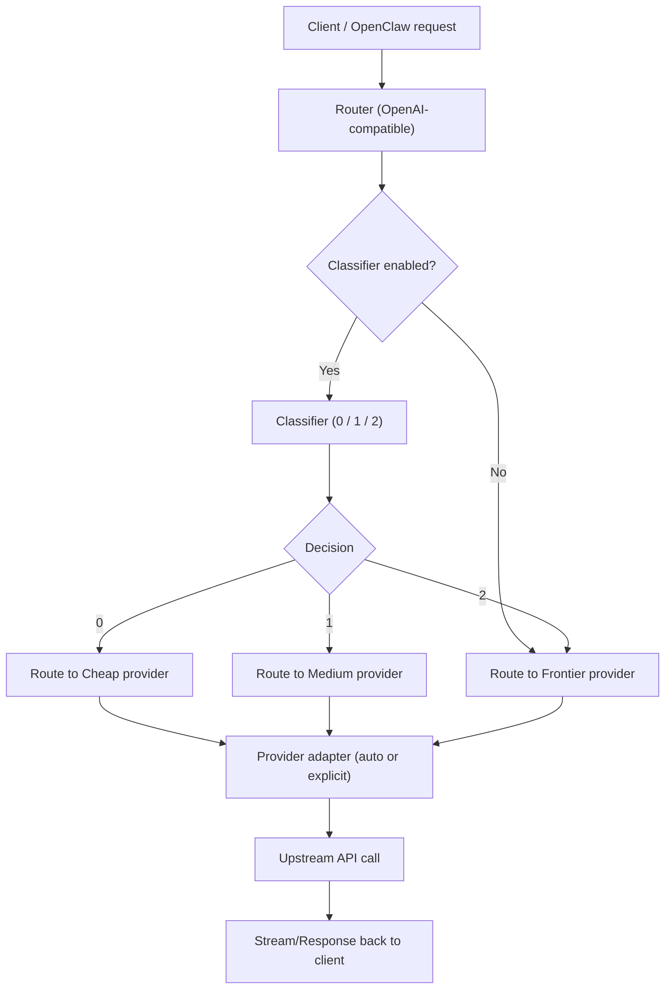

# Xrouter

Xrouter 是一个开源的推理路由器，位于 OpenClaw 与您的 LLM（大型语言模型）提供者之间。它使用一个快速且能够识别硬件性能的分类器，将每个请求路由到最能高效处理该任务的模型。

本项目采用 MIT 许可协议。详情请参阅 [MIT 许可协议](LICENSE)。

**核心特性**
- 支持 OpenAI 格式的请求，通过 `/v1/chat/completions` 路由请求。
- 三层分类器系统（0 = 低成本模型，1 = 中等成本模型，2 = 高性能模型），并支持提前终止请求处理。
- 具有硬件检测功能，可推荐适合当前硬件的本地模型。
- 提供提供者选择向导，用于选择本地或云端的模型服务。
- 内置缓存机制，支持 Redis 或内存中的 LRU（最近最少使用）缓存策略。
- 当无法使用本地模型时，可切换到全云模式。
- 提供 `dashboard` 界面，用于查看令牌使用情况。

**工作流程**


**仓库结构**
- `src/server.js`：负责路由器和流式请求处理。
- `src/classifier.js`：处理分类器调用及重试逻辑。
- `src/config.js`：配置文件解析。
- `src/cache.js`：实现 Redis 缓存功能。
- `src/token_tracker.js`：令牌跟踪模块。
- `scripts/check_hw.js`：硬件检测脚本。
- `scripts/configure_providers.js`：提供者配置工具。

**系统要求**
- 需要 Node.js 20 及更高版本。
- 可选：需要本地分类器引擎。
- 必须配置一个高性能模型服务的提供者端点。

**快速入门**
1. 安装项目依赖项。
2. （可选）启动本地模型服务器。
3. 运行配置向导。
4. 启动 Xrouter。

```bash
npm install
npm run configure
npm run dev
```

**使用方法**
1. （推荐）启动本地模型服务器。
2. 通过向导配置提供者和模型。
3. 启动 Xrouter。
4. 向 Xrouter 发送符合 OpenAI 格式的请求。
5. 通过响应头或 `dashboard` 查看请求的路由结果。

**本地模型设置示例（以 Ollama 为例）**
```bash
ollama pull llama3.1
ollama run llama3.1
```

**运行配置向导**
```bash
npm run configure
```

**启动 Xrouter**
```bash
npm run dev
```

**测试请求**
```bash
curl -i http://localhost:3000/v1/chat/completions \
  -H "Content-Type: application/json" \
  -d '{"model":"any","messages":[{"role":"user","content":"Fix this sentence: I has a apple."}]}'
```

**注意检查以下响应头信息：**
- `X-Xrouter-decision`：值为 `0`、`1` 或 `2`，分别表示使用低成本模型、中等成本模型或高性能模型。
- `X-Xrouter-upstream`：值为 `cheap`、`medium` 或 `frontier`，表示请求被路由到的模型类型。

**打开 `dashboard`：**
- 访问 `http://localhost:3000/dashboard`。

**原始使用数据 JSON 格式：**
- `http://localhost:3000/usage`

**提供者选择向导（终端命令）**
运行以下命令：
```bash
npm run configure
```

**向导功能：**
- 检测当前硬件配置，并推荐合适的本地模型。
- 提供模型选择选项。
- 允许用户配置不同成本级别的提供者端点、API 密钥及模型参数。
- 生成 `upstreams.json` 文件，并可选地更新 `env` 文件。

**快速启动模式：**
- 如果您的设备支持运行本地模型，可以选择快速启动模式。
- 快速启动模式会自动配置本地分类器。
- 低成本请求始终使用相同的本地模型，以避免模型切换。
- 用户只需配置中等成本和高性能模型的相关参数。
- 在苹果 Silicon 平台上，向导会列出已安装的 Ollama 模型，并可自动下载推荐模型。

**路由规则：**
- 对于未缓存的请求，系统会调用分类器进行判断。
- 分类器返回的 `0`、`1` 或 `2` 分别表示使用低成本、中等成本或高性能模型。
- 如果分类失败，系统会默认使用高性能模型。
- 使用分类器时，必须配置相应级别的模型路由规则。

**兼容性：**
- Xrouter 支持 OpenAI 格式的请求，并在需要时进行转换。
- 提供者类型可以明确指定（如 `xrouter`、`openai_compatible`、`openai`、`anthropic`、`gemini`、`cohere`、`azure_openai`、`mistral`、`groq`、`together`、`perplexity` 等），或使用 `auto` 自动识别。
- 当提供者支持 OpenAI 格式的接口时，系统会自动选择 `openai_compatible` 适配器。
- Anthropic/Gemini/Cohere 模型的输出会被转换为 OpenAI 格式的 SSE 数据格式。
- 非 OpenAI 提供者的接口仅支持纯文本请求及基本采样参数（如温度、采样次数、停止请求等）。

**令牌跟踪：**
- `GET /usage`：查询低成本、中等成本和高性能模型的令牌使用情况。
- `GET /dashboard`：显示令牌使用情况的可视化界面。
- 当使用本地模型时，低成本请求的统计数据会单独统计。

**环境配置参数：**
- `HOST`：指定服务器监听地址，默认为 `0.0.0.0`。
- `PORT`：指定服务器端口，默认为 `3000`。
- `ROUTER_API_KEY`：设置 API 访问密钥，需使用 `Authorization: Bearer <key>` 进行身份验证。
- `LOG_LEVEL`：设置日志记录级别（debug/info/warn/error）。
- `LOG_TO_FILE`：决定是否将日志写入文件。
- `LOG_DIR`：指定日志文件存储目录，默认为 `./logs`。
- `CLASSIFIER_ENABLED`：禁用本地分类器功能。
- `CLASSIFIER_BASE_URL`：指定 OpenAI 兼容的分类器端点地址。
- `CLASSIFIER_MODEL`：指定分类器模型名称。
- `CLASSIFIER_SYSTEM_PROMPT`：分类器的提示语。
- `CLASSIFIER_TIMEOUT_MS`：分类器请求的超时时间（毫秒）。
- `CLASSIFIER_FORCE_STREAM`：强制使用流式分类器。
- `CLASSIFIER_WARMUP`：启动时对分类器进行预热。
- `CLASSIFIER_WARMUP_DELAY_MS`：预热请求的延迟时间（毫秒）。
- `CLASSIFIER_KEEP_ALIVE_MS`：分类器保持活跃状态的间隔时间（毫秒）。
- `CLASSIFIER_LOADING_RETRY_MS`：模型加载时的重试间隔时间（毫秒）。
- `CLASSIFIER_LOADING_MAX_RETRIES`：模型加载时的最大重试次数。
- `CHEAP_BASE_URL`：低成本模型的基础地址（可选）。
- `CHEAP_API_KEY`：低成本模型的 API 密钥（可选）。
- `CHEAP_MODEL`：低成本模型的可选配置参数。
- `CHEAP_PROVIDER`：低成本模型的提供者类型（默认为 `auto`）。
- `CHEAP_HEADERS`：低成本模型的可选 JSON 请求头（字符串化对象）。
- `CHEAP_DEPLOYMENT`：低成本模型的 Azure 部署配置（可选）。
- `CHEAP_API_VERSION`：低成本模型的 Azure API 版本（可选）。
- `MEDIUM_BASE_URL`：中等成本模型的基础地址（分类器启用时必需）。
- `MEDIUM_API_KEY`：中等成本模型的 API 密钥（可选）。
- `MEDIUM_MODEL`：中等成本模型的可选配置参数。
- `MEDIUM_PROVIDER`：中等成本模型的提供者类型（默认为 `auto`）。
- `MEDIUM_HEADERS`：中等成本模型的可选 JSON 请求头（字符串化对象）。
- `MEDIUM_DEPLOYMENT`：中等成本模型的 Azure 部署配置（可选）。
- `MEDIUM_API_VERSION`：中等成本模型的 Azure API 版本（可选）。
- `FRONTIER_BASE_URL`：高性能模型的基础地址。
- `FRONTIER_API_KEY`：高性能模型的 API 密钥（可选）。
- `FRONTIER_MODEL`：高性能模型的可选配置参数。
- `FRONTIER_PROVIDER`：高性能模型的提供者类型（默认为 `auto`）。
- `FRONTIER_HEADERS`：高性能模型的可选 JSON 请求头（字符串化对象）。
- `FRONTIER_DEPLOYMENT`：高性能模型的 Azure 部署配置（可选）。
- `FRONTIER_API_VERSION`：高性能模型的 Azure API 版本（可选）。
- `REDIS_URL`：如果配置了 Redis，将启用缓存功能。

**本地模型安装与运行指南：**
- **Ollama（适用于 Mac，跨平台最佳方案）：**
  - 安装：[Ollama 快速入门指南](https://ollama.readthedocs.io/en/quickstart/)
  - 下载模型：`ollama pull llama3.1`
  - 运行模型：`ollama run llama3.1`
  - 分类器配置：`CLASSIFIER_BASE_URL=http://localhost:11434`；`CLASSIFIER_MODEL=llama3.1`
- **vLLM（基于 NVIDIA GPU）：**
  - 使用 [vLLM OpenAI 服务器](https://docs.vllm.ai/en/stable/serving/openai_compatible_server/)：
    - 示例命令：`vllm serve NousResearch/Meta-Llama-3-8B-Instruct --dtype auto --api-key token-abc123`
    - 分类器配置：`CLASSIFIER_BASE_URL=http://localhost:8000`；`CLASSIFIER_MODEL=NousResearch/Meta-Llama-3-8B-Instruct`
- **TensorRT-LLM（NVIDIA GPU）：**
  - 从 [TensorRT-LLM 仓库](https://github.com/NVIDIA/TensorRT-LLM) 下载并运行：
    - 服务器命令：`trtllm-serve`
    - 分类器配置：`CLASSIFIER_BASE_URL=http://<host>:<port>`；`CLASSIFIER_MODEL=<your model>`
- **llama.cpp（适用于 CPU/AMD 平台）：**
  - 从 [llama.cpp 仓库](https://github.com/ggml-org/llama.cpp) 下载并运行：
    - 命令：`llama-server -m model.gguf --port 8080`
    - 分类器配置：`CLASSIFIER_BASE_URL=http://localhost:8080`；`CLASSIFIER_MODEL=<gguf model name>`

**Docker 配置：**
- 可通过 Docker 构建并运行包含 Redis 的 Xrouter 服务。

**硬件检测：**
运行相关命令后，系统会显示推荐的模型类型：
- 对于大型 NVIDIA GPU，推荐使用 `tensorrt-llm`。
- 对于标准 NVIDIA GPU，推荐使用 `vllm`。
- 对于苹果 Silicon 平台，推荐使用 `mlx`。
- 对于 CPU/AMD 平台，推荐使用 `llama.cpp`。

**模型列表获取：**
- 向导会尝试从相应提供者端点获取模型列表：
  - OpenAI 兼容模型：`/v1/models`
  - Anthropic：`/v1/models`
  - Gemini：`/v1beta/models`
  - Cohere：`/v1/models`
  - 如果获取失败，系统会使用 `scripts/cloud_model_catalog.json` 作为备用。

**项目星图历史记录：**
[](https://star-history.com/#pathemata-mathemata/xrouter&Date)