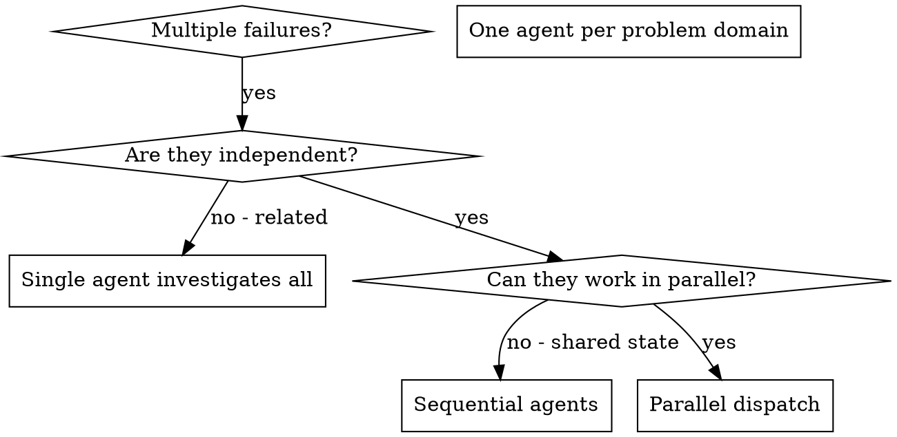

# 派发并行代理

## 概述

当遇到多个不相关的故障（不同的测试文件、不同的子系统、不同的错误）时，按顺序进行排查会浪费时间。每个故障的排查都是独立的，可以并行进行。

**核心原则：** 为每个独立的问题领域派发一个代理，让它们同时工作。

## 适用场景



**适用情况：**
- 3个或更多测试文件出现故障，且故障的根本原因各不相同
- 多个子系统独立出现故障
- 每个问题的排查无需依赖于其他问题的结果
- 各个故障之间没有共享的状态

**不适用情况：**
- 故障之间存在关联（修复一个故障可能会解决其他故障）
- 需要了解整个系统的状态
- 代理之间可能会相互干扰

## 实施步骤

### 1. 确定独立的问题领域

根据故障的类型对故障进行分类：
- 文件A的测试：工具审批流程相关的问题
- 文件B的测试：批量完成行为相关的问题
- 文件C的测试：异常终止功能相关的问题

每个问题领域都是独立的——修复工具审批流程不会影响异常终止功能的测试。

### 2. 为每个代理创建具体的任务

每个代理的任务包括：
- **明确的范围**：负责处理一个特定的测试文件或子系统
- **明确的目标**：使这些测试通过
- **约束条件**：不得修改其他代码
- **预期的输出**：报告发现的问题及修复的内容

### 3. 并行派发代理

```typescript
// In Claude Code / AI environment
Task("Fix agent-tool-abort.test.ts failures")
Task("Fix batch-completion-behavior.test.ts failures")
Task("Fix tool-approval-race-conditions.test.ts failures")
// All three run concurrently
```

### 4. 审查与集成

当代理完成任务后：
- 阅读每个代理的报告
- 确认修复的内容没有冲突
- 运行完整的测试套件
- 集成所有修复的更改

## 代理任务的编写规范

优秀的代理任务描述应具备以下特点：
1. **目标明确**：针对一个具体的问题领域
2. **信息完整**：包含理解问题所需的所有背景信息
3. **输出具体**：明确代理需要返回的结果内容

```markdown
Fix the 3 failing tests in src/agents/agent-tool-abort.test.ts:

1. "should abort tool with partial output capture" - expects 'interrupted at' in message
2. "should handle mixed completed and aborted tools" - fast tool aborted instead of completed
3. "should properly track pendingToolCount" - expects 3 results but gets 0

These are timing/race condition issues. Your task:

1. Read the test file and understand what each test verifies
2. Identify root cause - timing issues or actual bugs?
3. Fix by:
   - Replacing arbitrary timeouts with event-based waiting
   - Fixing bugs in abort implementation if found
   - Adjusting test expectations if testing changed behavior

Do NOT just increase timeouts - find the real issue.

Return: Summary of what you found and what you fixed.
```

## 常见错误

**❌** 任务范围过宽：例如“修复所有测试”——代理无法明确工作重点
**✅** 任务范围具体：例如“修复agent-tool-abort.test.ts”——任务目标明确
**❌** 缺少背景信息：例如“修复竞态条件”——代理无法定位问题所在
**✅** 提供背景信息：例如附上错误信息和测试名称
**❌** 未设置约束条件：代理可能会随意修改代码
**✅** 设置约束条件：例如“不得修改生产代码”或“仅修复测试相关的问题”
**❌** 输出内容模糊：例如“修复问题”——无法了解具体修复了什么
**✅** 输出内容具体：例如“返回问题的根本原因及修复内容的总结”

## 不适用场景

**故障之间存在关联**：修复一个故障可能会解决其他故障——应先一起排查这些问题
**需要完整系统信息**：需要了解整个系统的状态才能解决问题
**处于探索性调试阶段**：目前还不知道具体哪里出了问题
**存在共享状态**：代理之间可能会相互干扰（例如同时编辑相同的文件或使用相同的资源）

## 实际应用示例

**场景**：在一次重大重构后，3个文件中出现了6个测试故障

**故障情况：**
- agent-tool-abort.test.ts：3个故障（与计时相关的问题）
- batch-completion-behavior.test.ts：2个故障（工具未正常执行）
- tool-approval-race-conditions.test.ts：1个故障（执行次数为0）

**决策**：这些问题属于不同的领域，应分别进行排查：
- 异常终止功能的问题与批量完成行为的问题是独立的，竞态条件的问题也需要单独处理

**代理派发情况：**
```
Agent 1 → Fix agent-tool-abort.test.ts
Agent 2 → Fix batch-completion-behavior.test.ts
Agent 3 → Fix tool-approval-race-conditions.test.ts
```

**结果：**
- 代理1：将超时处理方式改为基于事件的等待机制
- 代理2：修复了事件处理结构中的错误（threadId变量位置错误）
- 代理3：添加了等待异步工具执行完成的逻辑

**集成结果：**
- 所有修复内容都是独立的，没有冲突，整个测试套件通过

**节省的时间：** 并行处理3个问题，比顺序处理节省了大量时间

## 主要优势

1. **并行处理**：多个问题可以同时被排查
2. **专注性**：每个代理的任务范围明确，需要跟踪的信息较少
3. **独立性**：代理之间不会相互干扰
4. **效率**：在相同的时间内解决了3个问题

## 验证步骤

代理完成任务后：
1. **查看每个代理的报告**：了解修复的内容
2. **检查是否存在冲突**：代理是否修改了相同的代码
3. **运行完整的测试套件**：验证所有修复内容是否正常工作
4. **进行抽查**：确保代理没有犯系统性错误

## 在实际开发中的影响

（来自2025年10月3日的调试记录）：
- 3个文件中出现了6个故障
- 并行派发了3个代理
- 所有故障都得到了独立排查
- 所有的修复内容都成功集成
- 代理之间的修改没有产生任何冲突