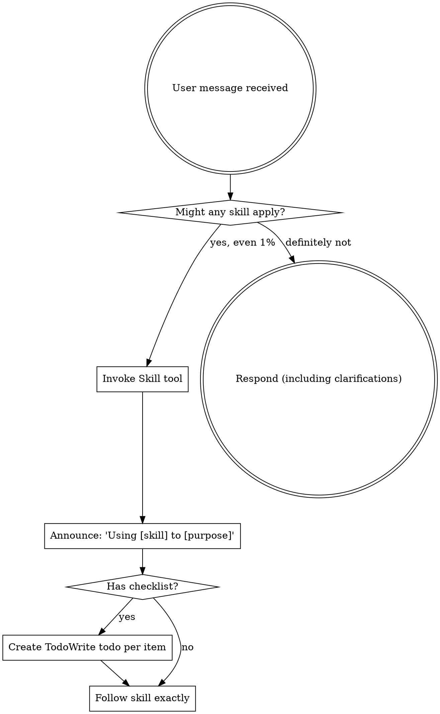

<EXTREMELY-IMPORTANT>
即使你认为某个技能只有一点点（1%）可能适用于你的工作，你也绝对必须使用它。

如果某个技能确实适用于你的任务，那你没有任何选择——你必须使用它。

这是没有商量余地的，也不是可选项。你无法通过理性思考来逃避这个规则。

</EXTREMELY-IMPORTANT>

## 如何使用技能

**在Claude代码中：** 使用`Skill`工具。当你调用一个技能时，它的内容会被加载并展示给你——直接按照提示操作即可。切勿使用`Read`工具来查看技能文件的内容。

**在其他环境中：** 查阅你所在平台的文档，了解如何加载和使用技能。

# 使用技能的规则

**在任何响应或行动之前，先调用相关的技能。** 即使某个技能只有1%的适用可能性，你也应该先调用它进行验证。如果调用的技能并不适用于当前情况，那么你就不需要使用它。

## 注意事项（提示你不要滥用技能）

以下这些想法表明你正在试图通过理性思考来逃避使用技能的必要性：

| 思想 | 现实情况 |
|---------|---------|
| “这只是一个简单的问题” | 任何问题都可能涉及到需要使用技能的情况。 |
| “我需要先获取更多背景信息” | 应该在使用技能之前先进行问题澄清。 |
| “让我先探索代码库” | 技能会告诉你如何有效地探索代码库。 |
| “我可以快速查看Git文件” | 文件本身无法提供足够的上下文信息，需要使用技能来辅助理解。 |
| “让我先收集一些信息” | 技能会告诉你如何有效地收集信息。 |
| “这个任务不需要使用特定的技能” | 如果有相关的技能可用，就应该使用它。 |
| “我记得这个技能的存在” | 技能会不断更新，你应该查看最新版本。 |
| “这个任务不算正式的工作任务” | 任何行动本质上都属于工作任务，都需要使用技能来辅助完成。 |
| “使用这个技能似乎有些过度了” | 即使任务看起来简单，也可能需要使用技能来提高效率。 |
| “我先只做这一件事” | 在采取任何行动之前，都应该先使用技能来确认是否需要这样做。 |
| “这样做似乎更有效率” | 无计划的行为会浪费时间，而技能可以帮助你更高效地完成任务。 |
| “我知道这个概念的含义” | 仅仅理解概念并不意味着你会使用相应的技能——你需要实际调用它。 |

## 技能的优先级

当多个技能都可能适用于某个任务时，按照以下顺序使用它们：

1. **处理相关问题的技能**（如头脑风暴、调试等）——这些技能会告诉你如何开始解决问题。
2. **实现相关功能的技能**（如前端设计、代码构建工具等）——这些技能会指导你如何完成任务的具体步骤。

例如：“让我们构建X”时，应该先进行头脑风暴，然后再使用实现相关的技能；“修复这个bug”时，应该先进行调试，然后再使用特定领域的技能。

## 技能的类型

- **固定类型的技能**（如TDD（测试驱动开发）、调试工具等）：必须严格按照其使用方法来操作，不能随意调整。
- **灵活类型的技能**（如设计模式等）：可以根据具体情况灵活应用相关原则。

技能本身会告诉你应该使用哪种类型的技能。

## 用户使用说明

使用说明通常只告诉你需要做什么（如“添加X”或“修复Y”），但不会告诉你具体的操作步骤。因此，即使某个技能符合任务需求，也不能忽略使用说明中的工作流程。