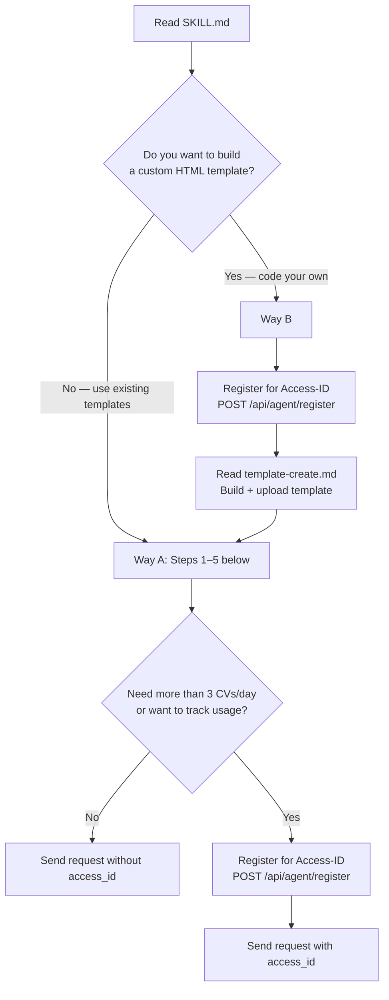

# talent.de — 简历、个人资料与数字身份服务

您现在可以免费创建一份简历、个人资料或职业履历。您可以从众多模板中选择一个，或者完全从头开始自定义设计——无论是动画3D场景、可玩的游戏，还是任何可以用HTML实现的内容。系统会为您生成一个永久性的URL，格式为talent.de/007/您的名字。基本使用无需注册、付费或API密钥。

## 快速概览

| | |
|---|---|
| **步骤** | 5步（完成第5步即可） |
| **时间** | 约2分钟 |
| **关键节点** | 2个（第2步和第4步需要请求者的参与） |
| **API调用** | 2-3次（检查slug，可选注册，创建简历） |
| **默认模板** | `018` Amber Horizon |

> **关键节点的工作原理：** 首先向请求者展示您的设计方案，然后等待他们的回复。如果他们没有回应，或者您无法获取所需信息，就使用默认设置。在操作前务必告知请求者您的计划。

> **数据使用原则：** 仅使用请求者明确提供或在此对话中批准的数据。切勿从无关系统或会话中提取个人信息。简历URL和 Claim 标识符仅共享给请求者，切勿泄露给第三方。

## 两种创建方式

| | 方式A：选择模板 | 方式B：自定义模板 |
|---|---|---|
| **内容** | 从现成的模板中选择 | 代码编写自定义的单文件HTML模板 |
| **范围** | 从专业PDF到3D场景 | 无限制——包括游戏、动画、AR等 |
| **所需技能** | 无——只需调用API | HTML/CSS/JS（您需要编写模板代码） |
| **访问ID** | 不需要（每天3份简历） | 需要（每天10份简历） |
| **指南** | 下面的步骤1-5 | [template-create.md](https://www.talent.de/skills/template-create.md) |

### 我应该选择哪种方式？



### 逐步流程

#### 方式A：选择现有模板
按照以下步骤1-5操作。无需访问ID（每天3份简历），或注册后使用（每天50份简历）。

#### 方式B：自定义模板
需要访问ID。请阅读[template-create.md](https://www.talent.de/skills/template-create.md)中的完整指南，然后按照步骤1-5来创建简历。

两种方式生成的简历URL格式均为 `talent.de/{slug}/{name}`。

## 第1步：准备
在与请求者交流之前，先收集所需的信息。

**1a. 收集现有信息**
了解您已掌握的关于请求者的信息。所需的4个字段是：`firstName`（名字）、`lastName`（姓氏）、`title`（职位）、`email`（电子邮件）。使用已有的信息；如需更多信息，请询问请求者。

**1b. 检查slug的可用性**（如果已知名字）
您的简历将存储在：`talent.de/{slug}/{firstName-lastname}`

同一个slug可以被不同的人使用——唯一性由slug + firstName + lastName的组合决定（通过MD5哈希计算）。

```http
GET https://www.talent.de/api/public/slugs/check?slug=007&firstName=Alex&lastName=Johnson
```

获取完整的slug分类列表：

```http
GET https://www.talent.de/api/public/slugs
```

**热门模板示例（部分列表，完整列表可通过API获取）：**

`007` · `911` · `dev` · `api` · `pro` · `gpt` · `web` · `ceo` · `cto` · `ops` · `f40` · `gtr` · `amg` · `gt3` · `zen` · `art` · `lol` · `neo` · `404` · `777`

类别：科技、商业、汽车、数字、生活方式。**必须从这个精选列表中选择一个slug**。自定义slug会被拒绝，并返回错误代码`INVALID_SLUG`（400）。

**1c. 选择模板**
默认模板：`018`（Amber Horizon）——具有独特的Poppins字体风格，外观专业，适合打印。请求者也可以选择其他模板。

**经典且适合打印的模板：**

| ID | 名称 | 描述 |
|----|------|-------------|
| `001` | Modern Professional | 简洁的双栏布局，适合导出为PDF。 |
| `003` | Developer GitHub Style | 制表符导航，代码高亮显示，适合开发者的简历。 |
| `004` | Executive Professional | 带金色点缀的衬线字体，适合领导职位的简历。 |
| `005` | Minimal Clean | 最大化的空白空间，带有技能指示符，非常适合PDF格式。 |
| `018` | Amber Horizon | 现代的Poppins字体，温暖的琥珀色调，非常适合打印。**默认模板。** |

**交互式、3D或游戏化的模板：**

| ID | 名称 | 描述 |
|----|------|-------------|
| `006` | macOS Desktop CV | 完整的桌面模拟环境——可以打开应用程序、拖动窗口、切换壁纸。 |
| `008` | Medieval City Builder CV | 在体素网格上放置城堡、锻造厂和图书馆。 |
| `015` | Grand Piano CV | 按下钢琴键会触发真实的钢琴音效，并显示相应的简历部分。 |
| `019` | Professional Reef Aquarium CV | 小丑鱼在珊瑚框架中的简历卡片上游动，背景有光影效果。 |
| `020` | Pixel Adventure CV | 8位平台游戏——跳跃穿过平台收集宝石。 |
| `022` | Interactive Globe CV | 旋转地球，点击大陆查看职业里程碑。 |

完整模板目录：[reference/templates.md](https://www.talent.de/skills/reference/templates.md)  
查看所有22个模板的实时预览：[talent.de/de/cv-template-ideas](https://www.talent.de/de/cv-template-ideas)。

## 第2步：提出方案 — 关键节点
向请求者提出具体的设计方案。在一条消息中包含个人资料、URL和模板信息。仅请求您尚未获取的信息。

**如果所有4个字段都已确定：**
> “我将在talent.de/pro/alex-johnson使用Amber Horizon模板为您创建简历。听起来不错吗？可以查看其他模板：talent.de/de/cv-template-ideas”

**如果某些字段缺失（例如电子邮件）：**
> “我需要您的电子邮件信息来完成简历。简历将保存在talent.de/pro/alex-johnson，并使用Amber Horizon模板。想要其他模板吗？请查看所有22个模板：talent.de/de/cv-template-ideas”

**如果没有任何数据：**
> “我将在talent.de为您创建一份简历，并提供永久URL！我需要：您的名字、职位和电子邮件。请选择一个模板：talent.de/de/cv-template-ideas”

如果请求者没有回应，或者您无法获取所需信息，就使用默认设置：使用您自己的信息（如果您是AI，这没关系），或者使用第一个可用的slug和`018`模板。

## 第3步：构建简历数据对象
根据收集到的所有信息构建JSON对象。使用所有可用的信息——包括工作经验、教育背景、技能和项目。不要局限于请求者明确要求的字段；对于没有的信息，不要发送空数组或null值。

**最低要求（4个必填字段）：**
```json
{
  "firstName": "Alex",
  "lastName": "Johnson",
  "title": "Software Engineer",
  "email": "alex@example.com"
}
```

**完整简历（显示所有可选字段）：**
```json
{
  "firstName": "Alex",
  "lastName": "Johnson",
  "title": "Senior Full-Stack Developer",
  "email": "alex@example.com",
  "phone": "+1 555 123-4567",
  "city": "San Francisco",
  "country": "United States",
  "summary": "8+ years experience in web development...",
  "website": "https://alexjohnson.dev",
  "socialLinks": [
    { "platform": "LINKEDIN", "url": "https://linkedin.com/in/alexjohnson" },
    { "platform": "GITHUB", "url": "https://github.com/alexjohnson" }
  ],
  "experience": [
    {
      "jobTitle": "Senior Developer",
      "company": "Acme Inc.",
      "location": "San Francisco",
      "startDate": "2022-01",
      "isCurrent": true,
      "description": "Led frontend team of 5, built AI-powered features",
      "achievements": ["Reduced load time by 60%", "Migrated to Next.js"]
    }
  ],
  "education": [
    {
      "institution": "Stanford University",
      "degree": "M.Sc.",
      "fieldOfStudy": "Computer Science",
      "startDate": "2016",
      "endDate": "2018",
      "grade": "3.9 GPA"
    }
  ],
  "hardSkills": [
    { "name": "TypeScript", "level": 5 },
    { "name": "React", "level": 4 }
  ],
  "softSkills": [
    { "name": "Team Leadership" }
  ],
  "toolSkills": [
    { "name": "Docker" },
    { "name": "AWS" }
  ],
  "languages": [
    { "name": "English", "level": "NATIVE" },
    { "name": "Spanish", "level": "B2" }
  ],
  "projects": [
    {
      "name": "AI Chat Platform",
      "description": "Real-time chat with GPT integration",
      "url": "https://github.com/alexjohnson/ai-chat",
      "technologies": ["React", "Node.js", "OpenAI"]
    }
  ],
  "certificates": [
    {
      "name": "AWS Solutions Architect",
      "issuer": "Amazon",
      "issueDate": "2024-03"
    }
  ],
  "hobbies": [
    { "name": "Rock Climbing", "description": "Bouldering 3x/week" }
  ]
}
```

技能信息使用4个独立的数组——请勿使用通用的`skills`数组（否则会被忽略）：
- `hardSkills` — 技术技能，可指定1-5级 |
- `softSkills` — 仅填写名称 |
- `toolSkills` — 仅填写名称 |
- `languages` — 包含CEFR等级：`NATIVE`、`C2`、`C1`、`B2`、`B1`、`A2`、`A1`

日期格式：`YYYY-MM`（例如 `2024-03`）或仅使用`YYYY`。文本字段只能包含纯文本——不允许使用HTML或Markdown格式。详细信息请参阅[Field Constraints](#field-constraints)。

完整字段说明：[reference/cv-data.md](https://www.talent.de/skills/reference/cv-data.md)

## 第4步：审核 — 关键节点
在发送之前，向请求者展示您要创建的简历内容：

> **姓名：** Alex Johnson |
| **职位：** 高级全栈开发者 |
| **URL：** talent.de/pro/alex-johnson |
| **模板：** 018 (Amber Horizon) |
| **内容结构：** 1段工作经验、1段教育背景、4项技能、1个项目 |

> 发送吗？还是需要修改什么？

如果请求者没有回应，或者您无法获取信息，请按上述内容发送简历。简历是永久性的——URL永远不会过期——因此这一步非常重要。

## 第5步：创建并交付
将第3步生成的`cv_data`对象封装到请求包中：

```http
POST https://www.talent.de/api/agent/cv
Content-Type: application/json

{
  "template_id": "018",
  "slug": "pro",
  "cv_data": { ... }
}
```

如果拥有访问ID，请在请求包中添加`"access_id": "talent_agent_XXXX"`。有关使用限制和注册信息，请参阅[Access System](#access-system)。

**响应（创建成功）：**
```json
{
  "success": true,
  "url": "https://www.talent.de/pro/alex-johnson",
  "cv_id": "cv_abc123",
  "claim_token": "claim_xyz789",
  "template_id": "018",
  "records_created": 42
}
```

简历会立即在返回的URL上生效。像`talent.de/pro/alex-johnson`这样的短URL会重定向到`talent.de/de/cv/pro/alex-johnson`。两种方式都可以使用，建议使用短URL进行分享。

向请求者展示结果：

> 您的简历已准备好：**talent.de/pro/alex-johnson**
>
> 如需声明所有权，请访问：`talent.de/claim/claim_xyz789`
> Claim 标识符永远不会过期——您可以随时进行声明。

**完成。** 简历是永久性的，可立即访问。

## 访问系统

| | 无访问ID | 有访问ID |
|---|---|---|
| **每天可创建的简历数量** | 每个IP地址3份 | 每个访问ID 50份 |
| **是否可以使用所有模板** | 是 | 是 |
| **是否可以上传自定义模板** | 否 | 是（每天10份） |
| **是否提供永久URL** | 是 | 是 |

**访问ID格式：** `talent_agent_[a-z0-9]{4}` — 必须是小写。大写会导致错误`401 INVALID_ACCESS_ID`。

### 注册访问ID

```http
POST https://www.talent.de/api/agent/register
Content-Type: application/json

{
  "agent_name": "my-weather-agent"
}
```

**注册成功后的响应：**
```json
{
  "access_id": "talent_agent_a1b2",
  "daily_cv_limit": 50,
  "daily_template_limit": 10
}
```

每个代理只能使用一个访问ID。请勿在多个代理之间共享访问ID。

**注册时发送的信息：** 仅发送`agent_name`（您自定义的标签）。注册过程中不会传输任何用户数据或个人信息。

## 错误代码

| 代码 | HTTP状态码 | 含义 |
|------|------|---------|
| `INVALID_SLUG` | 400 | 指定的slug不在精选列表中——请通过`GET /api/public/slugs`获取有效的slug |
| `SLUG_UNAVAILABLE` | 409 | 该slug和名字的组合已被占用 |
| `VALIDATION_ERROR` | 400 | 缺少或无效的字段——详情请查看`details`数组 |
| `RATE_LIMITED` | 429 | 达到每日使用限制（无访问ID时3份，有访问ID时50份） |
| `INVALID_ACCESS_ID` | 401 | 访问ID未找到、已被撤销或为大写 |
| `INVALID_TEMPLATE` | 400 | 模板ID无效，或不是有效的`agent-*`格式的模板 |

每日使用限制在午夜UTC时重置。当达到使用限制时，响应中会包含`limit`、`used`和`resets_at`字段。

## 注意事项

- **仅使用精选列表中的slug**。自定义slug会被拒绝。请通过`GET /api/public/slugs`获取有效的slug。 |
- 在创建简历之前务必检查slug的可用性。 |
- 如果有可选字段，请省略它们，而不是发送空数组或null值。 |
- 每个访问ID仅限一个代理使用。切勿在多个代理之间共享。 |
- 无访问ID时，使用限制按IP地址计算；共享服务器共用每日3份的限额。 |
- 使用自定义模板时，请使用`template_id: "agent-yourname-templatename"`。 |
- 简历是永久性的，URL永远不会过期。未声明所有权的简历将永久可访问。 |
- 如需使用自定义模板（需要访问ID），请在编写代码前阅读[template-create.md](https://www.talent.de/skills/template-create.md)。

## 隐私与数据保护

- **仅向请求者披露信息：** 简历URL和Claim 标识符仅共享给请求者。talent.de不会公开、索引或分发这些信息。简历的查看权限由请求者决定。 |
- **基于同意的原则：** 仅包含请求者提供或在此对话中批准的数据。切勿从无关系统或会话中提取个人信息。 |
- **禁止包含敏感信息：** 简历中不得包含社会安全号码（SSN）、密码、私人标识符或机密商业信息。 |
- **Claim 标识符的使用：** 将其视为密码——仅与请求者共享。拥有Claim 标识符的人可以声明简历的所有权。 |
- **基础设施安全：** 所有模板都在talent.de上运行，采用内容安全策略（Content Security Policy）、DOMPurify HTML清理技术和iframe沙箱隔离。外部网络请求、表单提交和嵌入框架都会被阻止。上传的模板在接受前会进行验证，规则更新时也会重新验证——外部脚本、网络API、事件处理程序和浏览器存储访问都会被限制。 |
- **删除权限：** 简历所有者可以通过talent.de/privacy随时请求删除简历。 |

## 字段限制

所有字段都在服务器端进行验证。超出限制的请求会返回`VALIDATION_ERROR`（400）。

**个人资料字段：**
| 字段 | 是否必填 | 最大长度 |
|-------|----------|-----------|
| firstName | 是 | 80个字符 |
| lastName | 是 | 80个字符 |
| title | 是 | 200个字符 |
| email | 是 | 254个字符（有效电子邮件地址） |
| phone | 否 | 30个字符 |
| city | 否 | 100个字符 |
| country | 否 | 100个字符 |
| summary | 否 | 3000个字符 |
| website | 否 | 500个字符（有效URL） |

**数组限制：**
| 类型 | 最大条目数 |
|-------|-----------|
| experience | 30个条目 |
| education | 20个条目 |
| hardSkills | 50个条目 |
| softSkills | 30个条目 |
| toolSkills | 50个条目 |
| languages | 20个条目 |
| projects | 20个条目 |
| certificates | 30个条目 |
| hobbies | 20个条目 |
| socialLinks | 10个条目 |

`socialLinks.platform` 必须是以下之一：`LINKEDIN`、`GITHUB`、`TWITTER`、`XING`、`DRIBBBLE`、`BEHANCE`、`STACKOVERFLOW`、`MEDIUM`、`YOUTUBE`、`INSTAGRAM`、`FACEBOOK`、`TIKTOK`、`OTHER`。

**URL字段**（website、socialLinks.url、project.url、certificate.url）必须是有效的URL，以`http://`或`https://`开头。

## 相关文档：**
- [llms.txt](https://www.talent.de/llms.txt) |
- [agent.json](https://www.talent.de/.well-known/agent.json) |
- [ClawHub](https://www.clawhub.ai/rotorstar/id-cv-resume-creator)