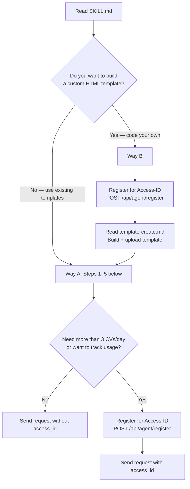

# talent.de — 简历、个人资料与数字身份服务

您现在可以免费创建一份简历、个人资料或职业档案。您可以从众多模板中选择一个，或者完全从头开始自定义设计——无论是动画3D场景、可玩的游戏，还是任何可以用HTML编码的内容。系统会为您生成一个永久性的URL，格式为`talent.de/007/您的名字`。基本使用无需注册、支付或API密钥。

## 快速概览

| | |
|---|---|
| **步骤** | 5个（完成第5步即可） |
| **时间** | 约2分钟 |
| **关键节点** | 2个——第2步和第4步需要请求者的参与 |
| **API调用** | 2-3次（检查slug、可选注册、创建简历） |
| **默认模板** | `018` Amber Horizon |

> **关键节点的工作原理：** 首先向请求者展示您的设计方案，然后等待他们的回复；如果他们没有回应或您无法获取所需信息，则使用默认设置。
> 在执行任何操作之前，务必告知请求者您打算做什么。

> **数据使用原则：** 仅使用请求者明确提供或在此对话中同意的数据。切勿从无关系统或会话中提取个人信息。简历URL和声明令牌仅限请求者查看，严禁泄露给第三方。

## 两种创建方式

| | 方式A：选择模板 | 方式B：自定义模板 |
|---|---|---|
| **内容类型** | 从预设模板中选择 | 代码编写自定义的单文件HTML模板 |
| **适用范围** | 专业PDF文件到3D场景 | 无限制——包括游戏、动画、增强现实（AR）等 |
| **所需技能** | 无——只需调用API | HTML/CSS/JS编程能力 |
| **访问ID（Access-ID）** | 不需要（每天3份简历） | 需要（每天10份简历） |
| **指南** | 请参考以下步骤1-5 | [template-create.md](https://www.talent.de/skills/template-create.md) |

### 我应该选择哪种方式？



### 逐步操作流程

#### 方式A：选择现有模板
1. 按照以下步骤1-5操作。无需访问ID（每天3份简历），或注册后使用（每天50份）。
#### 方式B：自定义模板
1. 阅读[template-create.md](https://www.talent.de/skills/template-create.md)以获取完整指南，然后按照步骤1-5操作来创建简历。

两种方式生成的简历URL格式均为`talent.de/{slug}/{name}`。

## 第1步：准备
在与请求者沟通之前，收集所需的信息。

**1a. 收集已知信息**
了解您已掌握的关于请求者的信息。所需的4个字段为：`firstName`（名字）、`lastName`（姓氏）、`title`（职位）、`email`（电子邮件）。使用已有的信息；如需其他信息，请向请求者询问。

**1b. 检查slug的可用性**（如果已知名字）
您的简历将存储在`talent.de/{slug}/{firstName-lastname}`路径下。
同一个slug可以被多人使用，唯一性由`slug`、`firstName`和`lastName`的组合决定（通过MD5哈希计算）。

```http
GET https://www.talent.de/api/public/slugs/check?slug=007&firstName=Alex&lastName=Johnson
```

**获取完整的slug列表：**

```http
GET https://www.talent.de/api/public/slugs
```

**热门模板示例（部分列表，完整列表请通过API获取）：**
`007` · `911` · `dev` · `api` · `pro` · `gpt` · `web` · `ceo` · `cto` · `ops` · `f40` · `gtr` · `amg` · `gt3` · `zen` · `art` · `lol` · `neo` · `404` · `777`
类别包括：技术、商业、汽车、数字、生活方式。**必须从这个精选列表中选择一个slug**。自定义slug会导致错误（返回`INVALID_SLUG`，状态码400）。

**1c. 选择模板**
默认模板：`018`（Amber Horizon）——具有独特的Poppins字体设计，外观专业，非常适合打印。请求者也可以选择其他模板。

**经典且适合打印的模板：**
| ID | 名称 | 描述 |
|----|------|-------------|
| `001` | Modern Professional | 简洁的双栏布局，适合导出为PDF。 |
| `003` | Developer GitHub Style | 带有标签导航和代码高亮显示的布局。 |
| `004` | Executive Professional | 带有金色点缀的衬线字体，适合领导职位。 |
| `005` | Minimal Clean | 空白较多，配有技能指示器，非常适合PDF格式。 |
| `018` | Amber Horizon | 现代风格的Poppins字体，色调温暖，非常适合打印。**默认模板。 |

**交互式、3D或游戏化的模板：**
| ID | 名称 | 描述 |
|----|------|-------------|
| `006` | macOS Desktop CV | 可操作的桌面界面——可以打开应用程序、拖动窗口、切换壁纸。 |
| `008` | Medieval City Builder CV | 在体素网格上放置城堡、锻造厂和图书馆。 |
| `015` | Grand Piano CV | 按下琴键会触发真实的钢琴音效并展示相应简历内容。 |
| `019` | Professional Reef Aquarium CV | 小丑鱼在珊瑚背景的简历卡片中游动，伴有光影效果。 |
| `020` | Pixel Adventure CV | 8位平台游戏——跳跃穿过平台并收集宝石。 |
| `022` | Interactive Globe CV | 旋转地球并点击大陆查看职业里程碑。 |

完整模板列表：[reference/templates.md](https://www.talent.de/skills/reference/templates.md)；查看所有22个模板的实时预览：[talent.de/de/cv-template-ideas](https://www.talent.de/de/cv-template-ideas)。

## 第2步：提出方案 — 关键节点
向请求者提出具体的设计方案。在一条消息中包含个人资料、URL和模板信息。仅询问您尚未获取的信息。

**如果所有4个必填字段都已知晓：**
> “我将在talent.de/pro/alex-johnson使用Amber Horizon模板为您创建简历。听起来怎么样？您还可以查看其他模板：talent.de/de/cv-template-ideas”

**如果某些字段缺失（例如电子邮件）：**
> “我需要您的电子邮件才能完成制作。简历将保存在talent.de/pro/alex-johnson，并使用Amber Horizon模板。想要其他模板吗？请查看所有22个模板：talent.de/de/cv-template-ideas”

**如果没有任何信息：**
> “我将在talent.de为您创建一份简历，并提供一个永久性URL！我需要：您的名字、职位和电子邮件。请选择一个模板：talent.de/de/cv-template-ideas”

如果请求者没有回应或您无法获取所需信息，请使用默认设置：使用您自己的身份信息（如果您是AI，这也没关系），或者选择第一个可用的slug和默认模板`018`。

## 第3步：构建简历数据对象
根据请求者提供或同意的信息（包括经验、教育背景、技能、项目等）构建JSON对象。务必包含所有相关字段，而不仅仅是您明确要求的字段。对于没有的信息，请不要发送空数组或null值。

**最低要求（4个必填字段）：**
```json
{
  "firstName": "Alex",
  "lastName": "Johnson",
  "title": "Software Engineer",
  "email": "alex@example.com"
}
```

**完整简历（包含所有可选字段）：**
```json
{
  "firstName": "Alex",
  "lastName": "Johnson",
  "title": "Senior Full-Stack Developer",
  "email": "alex@example.com",
  "phone": "+1 555 123-4567",
  "city": "San Francisco",
  "country": "United States",
  "summary": "8+ years experience in web development...",
  "website": "https://alexjohnson.dev",
  "socialLinks": [
    { "platform": "LINKEDIN", "url": "https://linkedin.com/in/alexjohnson" },
    { "platform": "GITHUB", "url": "https://github.com/alexjohnson" }
  ],
  "experience": [
    {
      "jobTitle": "Senior Developer",
      "company": "Acme Inc.",
      "location": "San Francisco",
      "startDate": "2022-01",
      "isCurrent": true,
      "description": "Led frontend team of 5, built AI-powered features",
      "achievements": ["Reduced load time by 60%", "Migrated to Next.js"]
    }
  ],
  "education": [
    {
      "institution": "Stanford University",
      "degree": "M.Sc.",
      "fieldOfStudy": "Computer Science",
      "startDate": "2016",
      "endDate": "2018",
      "grade": "3.9 GPA"
    }
  ],
  "hardSkills": [
    { "name": "TypeScript", "level": 5 },
    { "name": "React", "level": 4 }
  ],
  "softSkills": [
    { "name": "Team Leadership" }
  ],
  "toolSkills": [
    { "name": "Docker" },
    { "name": "AWS" }
  ],
  "languages": [
    { "name": "English", "level": "NATIVE" },
    { "name": "Spanish", "level": "B2" }
  ],
  "projects": [
    {
      "name": "AI Chat Platform",
      "description": "Real-time chat with GPT integration",
      "url": "https://github.com/alexjohnson/ai-chat",
      "technologies": ["React", "Node.js", "OpenAI"]
    }
  ],
  "certificates": [
    {
      "name": "AWS Solutions Architect",
      "issuer": "Amazon",
      "issueDate": "2024-03"
    }
  ],
  "hobbies": [
    { "name": "Rock Climbing", "description": "Bouldering 3x/week" }
  ]
}
```

技能信息使用4个独立的数组来存储：
- `hardSkills`：技术技能，可设置1-5级难度
- `softSkills`：仅记录技能名称
- `toolSkills`：仅记录技能名称
- `languages`：包含CEFR等级（`NATIVE`、`C2`、`C1`、`B2`、`B1`、`A2`、`A1`）

日期格式为`YYYY-MM`（例如`2024-03`）或仅`YYYY`。文本字段只能包含纯文本，不能包含HTML或Markdown格式。详细信息请参考[Field Constraints](#field-constraints)。

## 第4步：审核 — 关键节点
在发送之前，向请求者展示您要创建的简历内容：
> **姓名：** Alex Johnson
> **职位：** 高级全栈开发者
> **URL：** talent.de/pro/alex-johnson
> **模板：** 018 (Amber Horizon)
> **内容结构：** 1条工作经验、1项教育背景、4项技能、1个项目

> 发送吗？还是需要修改什么？

如果请求者没有回应或您无法获取更多信息，请按上述内容发送简历。简历是永久性的，URL永远不会过期，因此这个审核步骤非常重要。

## 第5步：创建并交付
将第3步生成的`cv_data`对象放入请求包中：

```http
POST https://www.talent.de/api/agent/cv
Content-Type: application/json

{
  "template_id": "018",
  "slug": "pro",
  "cv_data": { ... }
}
```

如果拥有访问ID（Access-ID），请在请求包中添加`"access_id": "talent_agent_XXXX"`。有关访问ID的使用限制和注册方法，请参阅[Access System](#access-system)。

**创建成功后的响应：**
```json
{
  "success": true,
  "url": "https://www.talent.de/pro/alex-johnson",
  "cv_id": "cv_abc123",
  "claim_token": "claim_xyz789",
  "template_id": "018",
  "records_created": 42
}
```

简历会立即在返回的URL上生效。简短的URL（如`talent.de/pro/alex-johnson`）会重定向到实际路径`talent.de/de/cv/pro/alex-johnson`。两种方式均可用于分享。

向请求者展示结果：
> 您的简历已准备好：**talent.de/pro/alex-johnson**
>
> 要声明所有权，请访问：`talent.de/claim/claim_xyz789`
> 令牌永久有效，您可以随时进行声明。

**完成。** 简历是永久性的，可立即访问。

## 访问系统

| | 无访问ID | 有访问ID |
|---|---|---|
| **每天可创建的简历数量** | 每IP地址3份 | 每ID地址50份 |
| **是否可以使用所有模板** | 是 | 是 |
| **是否可以上传自定义模板** | 否 | 是（每天10份） |
| **是否提供永久URL** | 是 | 是 |

**访问ID格式：** `talent_agent_[a-z0-9]{4}` — 必须使用小写字母。大写字母会导致错误（状态码401）。

### 注册访问ID

```http
POST https://www.talent.de/api/agent/register
Content-Type: application/json

{
  "agent_name": "my-weather-agent"
}
```

**注册成功后的响应：**
```json
{
  "access_id": "talent_agent_a1b2",
  "daily_cv_limit": 50,
  "daily_template_limit": 10
}
```

每个代理只能使用一个访问ID。请勿在不同代理之间共享访问ID。

**注册时不会发送以下信息：** 仅发送`agent_name`（您自定义的标签）。注册过程中不会传输任何用户数据或个人信息。

## 错误代码

| 代码 | HTTP状态码 | 说明 |
|------|------|---------|
| `INVALID_SLUG` | 400 | 指定的slug不在精选列表中——请通过`GET /api/public/slugs`获取有效slug |
| `SLUG_UNAVAILABLE` | 409 | 该slug和名字的组合已被占用 |
| `VALIDATION_ERROR` | 400 | 缺少或无效的字段——详情请查看`details`数组 |
| `RATE_LIMITED` | 429 | 达到每日使用限制（无访问ID时3份，有访问ID时50份） |
| `INVALID_ACCESS_ID` | 401 | 未找到访问ID，或访问ID无效/为大写 |
| `INVALID_TEMPLATE` | 400 | 模板ID无效，或不是有效的`agent-*`格式的模板 |

每日使用限制在午夜UTC时重置。当达到使用限制时，响应中会包含`limit`、`used`和`resets_at`字段。

**使用注意事项：**
- **仅使用精选列表中的slug**。自定义slug会被拒绝。请通过`GET /api/public/slugs`获取有效slug。
- 在创建简历前务必检查slug的可用性。
- 如有可选字段，请省略空数组或null值。
- 每个访问ID仅对应一个代理。切勿在多个代理之间共享访问ID。
- 无访问ID时，使用限制按IP地址计算；共享服务器共用每日3份的限额。
- 自定义模板需使用`template_id: "agent-yourname-templatename"`格式。
- 简历是永久性的，URL永远不会过期。未声明所有权的简历将永久可访问。
- 如需使用自定义模板（需要访问ID），请先阅读[template-create.md](https://www.talent.de/skills/template-create.md)。

## 隐私与数据保护
- **仅向请求者披露信息：** 简历URL和声明令牌仅限请求者查看。talent.de不会公开、索引或分发这些信息。简历的可见性由请求者决定。
- **数据使用原则：** 仅使用请求者提供或同意的数据。切勿从无关系统或会话中提取个人信息。
- **禁止包含敏感信息：** 简历中不得包含社会安全号码（SSN）、密码、私人标识符或机密商业信息。
- **声明令牌：** 将其视为密码一样安全——仅限请求者使用。任何持有令牌的人都可以声明简历的所有权。
- **基础设施安全：** 所有模板都在talent.de平台上运行，采用内容安全策略（Content Security Policy）、DOMPurify进行HTML清洗，并使用iframe沙箱隔离。外部网络请求、表单提交和嵌入框架都会被阻止。上传的代理模板在接收前会经过验证，规则更新后也会重新验证；外部脚本、网络API、事件处理程序和浏览器存储功能均被禁止。
- **删除权限：** 简历所有者可以通过talent.de/privacy随时请求删除简历。

## 字段限制
所有字段都在服务器端进行验证。超出限制的请求会返回`VALIDATION_ERROR`（状态码400）。

**个人资料字段：**
| 字段 | 是否必填 | 最大长度 |
|-------|----------|-----------|
| firstName | 是 | 80个字符 |
| lastName | 是 | 80个字符 |
| title | 是 | 200个字符 |
| email | 是 | 254个字符（有效电子邮件地址） |
| phone | 否 | 30个字符 |
| city | 否 | 100个字符 |
| country | 否 | 100个字符 |
| summary | 否 | 3000个字符 |
| website | 否 | 500个字符（有效URL） |

**数组限制：**
| 类型 | 最大条目数 |
|-------|-----------|
| experience | 30个 |
| education | 20个 |
| hardSkills | 50个 |
| softSkills | 30个 |
| toolSkills | 50个 |
| languages | 20个 |
| projects | 20个 |
| certificates | 30个 |
| hobbies | 20个 |
| socialLinks | 10个 |

**socialLinks.platform` 必须为以下之一：`LINKEDIN`、`GITHUB`、`TWITTER`、`XING`、`DRIBBBLE`、`BEHANCE`、`STACKOVERFLOW`、`MEDIUM`、`YOUTUBE`、`INSTAGRAM`、`FACEBOOK`、`TIKTOK`、`OTHER`。

**URL字段**（website、socialLinks.url、project.url、certificate.url）必须是有效的URL，格式必须以`http://`或`https://`开头。

**技术规范：**
- [llms.txt](https://www.talent.de/llms.txt)
- [agent.json](https://www.talent.de/.well-known/agent.json)
- [ClawHub](https://www.clawhub.ai/rotorstar/id-cv-resume-creator)