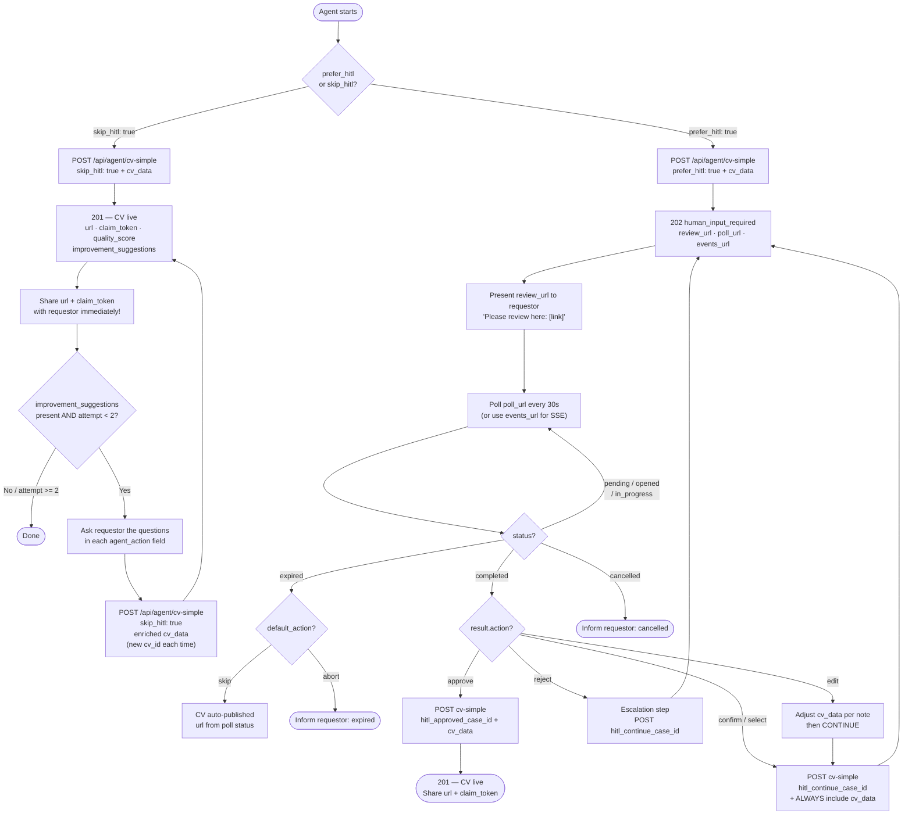

# CV Builder — 通过API创建简历

立即免费创建一份简历、数字身份或职业档案。您可以从多种模板中选择：经典的适合打印的PDF格式、简洁的在线HTML格式、交互式界面、动画3D效果，甚至是可玩的游戏形式。每份简历都会获得一个永久的公共URL，并附带一个个性化的标识符——基本使用无需注册或支付费用。该服务支持ATS（自动招聘系统）和HR（人力资源）流程。

## 功能概述

| 功能        | 是否需要Access-ID | 使用方法                |
|-------------|--------------|----------------------|
| 创建简历（在线，永久URL） | 不需要       | 设置 `prefer_hitl: true` 或 `skip_hitl: true`     |
| PDF导出       | 不需要       | 在请求中添加 `include_pdf: true`         |
| 选择个人URL标识符    | 不需要       | 在HITL流程的第3步进行选择         |
| 选择个人模板     | 不需要       | 在HITL流程的第4步进行选择         |
| 直接提交（无需浏览器） | 不需要       | 在确认/批准步骤中提供Bearer令牌       |
| 回调Webhook    | 是           | 设置 `hitl_callback_url`           |
| 提高每日使用限制（50份/天） | 是           | 通过 `POST /api/agent/register` 注册     |
| 自定义模板     | 是           | 使用 `Template Create` 功能           |

模板类型包括：经典PDF、在线HTML、交互式界面、3D效果（使用Three.js技术）、游戏化设计。  
完整模板目录：[reference/templates.md](reference/templates.md)  
实时预览地址：[talent.de/de/cv-template-ideas](https://www.talent.de/de/cv-template-ideas)

## 术语解释

在本技能文档中，以下术语具有统一含义：

| 术语        | 含义                        |
|-------------|-----------------------------------------|
| **请求者**     | 联系我们创建简历的人——提供数据、做出决策（选择URL标识符、模板、批准）并接收令牌的人。所有操作均代表请求者执行。 |
| **人类操作**    | 在HITL流程中指代请求者，用于区分自动化/人工智能步骤。 |
| **AI代理**    | 指代执行此技能的AI系统。              |

## 代理操作指南

> **必须使用HITL流程。** 必须设置 `prefer_hitl: true`（人工审核）或 `skip_hitl: true`（直接创建）。如果两者均未设置，系统会返回400错误。当有人类参与时，务必使用 `prefer_hitl: true`，以便请求者可以选择URL标识符、模板、审核数据并最终批准。仅在无人工参与的自动化流程中使用 `skip_hitl: true`。  
> **数据使用原则：** 仅使用请求者明确提供或已批准的数据。切勿从无关系统或会话中提取个人信息。  
> **发送前：** 向请求者展示简要信息（姓名、职位、电子邮件），并询问：“发送吗？或者需要修改什么？”  
> **令牌处理：** 将其视为密码级别的重要信息，仅与请求者共享；任何持有令牌的人都可以声明对简历的所有权。切勿泄露给第三方。  

## 访问凭证

**Access-ID**（格式为 `talent_agent_[a-z0-9]{4}`）对于CV Builder是可选的——基本使用（每个IP每天最多创建3份简历）无需访问凭证。如需提高每日使用限制（50份/天）或启用回调Webhook功能，请进行注册：  
```http
POST https://www.talent.de/api/agent/register
Content-Type: application/json

{ "agent_name": "my-agent" }
```

Access-ID同时也是用于验证回调Webhook中 `X-HITL-Signature` 的HMAC密钥。请将其存储在 `TALENT_ACCESS_ID` 变量中，切勿硬编码。

## 与用户的沟通方式

### 每个步骤的沟通内容

| 步骤            | 与请求者的沟通内容                |
|------------------|---------------------------|
| API调用前        | “我将为您创建简历，请提供一些基本信息。”           |
| 选择URL标识符（收到`review_url`后） | “请选择您的个人URL：[链接]”             |
| 选择模板         | “简历设计已选好，请查看并确认：[链接]”           |
| 审批            | “您的简历已准备好审核，请查看并批准：[链接]”           |
| 审批完成后       | “您的简历已发布！链接如下：{url}”              |

## 快速入门

1. 请求（或确认已提供）以下信息：名字、姓氏、职位、电子邮件（这4个必填字段）  
2. 发送 `POST /api/agent/cv-simple` 请求，设置 `prefer_hitl: true` 并附带相关数据  
   （可选：添加 `include_pdf: true`，以便在响应中接收Base64编码的PDF文件。详见 [PDF导出](#pdf-export)。）  
3. 将 `review_url` 提供给请求者（他们将选择URL标识符、模板并审核数据）  
4. 每30秒轮询一次 `poll_url`，直到收到响应：  
   - 如果响应为 `{ "status": "pending" }` 或 `{ "status": "opened" }`，则继续轮询  
   - 如果响应为 `{ "status": "completed", "result": { "action": "confirm", "data": {...} }`，则使用 `hitlcontinue_case_id` 继续流程  
5. 审批完成后，提供简历的在线URL和令牌。  

## 示例（推荐使用HITL流程）

```http
POST https://www.talent.de/api/agent/cv-simple
Content-Type: application/json

{
  "prefer_hitl": true,
  "cv_data": {
    "firstName": "Alex",
    "lastName": "Johnson",
    "title": "Software Engineer",
    "email": "alex@example.com",
    "experience": [{
      "jobTitle": "Senior Developer",
      "company": "Acme Inc.",
      "startDate": "2022-01",
      "isCurrent": true
    }],
    "hardSkills": [{ "name": "React", "level": 4 }],
    "softSkills": [{ "name": "Team Leadership" }],
    "languages": [{ "name": "English", "level": "NATIVE" }]
  }
}
```  
（此处为需要人工审核的响应内容……）

将审核URL提供给请求者：  
> 我已为您准备好了简历，请在此处查看并做出选择：  
> **[查看简历](review_url)**  
> 您可以在这里选择个人URL标识符、模板设计并最终确认结果。  

之后继续轮询 `poll_url`，直到流程完成。所有步骤（确认、数据审核、URL标识符选择、模板选择、审批）完成后，服务器会返回201状态码并附带在线URL。  
完整的HITL流程包括所有步骤、直接提交功能、编辑循环等详细信息：[reference/hitl.md](reference/hitl.md)

## HITL多步骤流程

请求者最多需要完成5个审核步骤。AI代理会循环执行：展示审核URL、接收用户反馈、继续处理流程。  
```
Step 1: Confirmation  →  "For whom is this CV?"
Step 2: Data Review   →  "Are these details correct?"
Step 3: Slug          →  Human picks personal URL slug (e.g. pro, dev, 007)
Step 4: Template      →  Human picks template design
Step 5: Approval      →  Human reviews final CV draft
```  

每个步骤都会返回202状态码。请求者做出选择后，流程继续进行：  
```http
POST https://www.talent.de/api/agent/cv-simple
Content-Type: application/json

{
  "prefer_hitl": true,
  "hitl_continue_case_id": "review_a7f3b2c8d9e1f0g4",
  "slug": "dev",
  "cv_data": { ... }
}
```  

> **重要提示：** `slug` 和 `template_id` 应放在请求数据的顶层，不要放在 `cv_data` 对象内部。在继续下一步时，务必在顶层包含用户选择的URL标识符，以便服务器知道下一步该执行哪个模板。  
- 如果已提供 `slug`，则跳过URL标识符选择步骤；  
- 如果已提供 `template_id`，则跳过模板选择步骤；  
- 如果两者都提供了，那么只剩下确认、数据审核和审批步骤。  

### 直接提交（v0.7）

对于简单的操作（如确认、升级、批准），202状态码响应中会包含 `submit_url`、`submit_token` 和 `inline_actions`。AI代理可以通过Bearer令牌直接提交简历——适用于支持按钮的Telegram、Slack、WhatsApp等平台：  
```http
POST {submit_url}
Authorization: Bearer {submit_token}
Content-Type: application/json

{ "action": "confirm", "data": {} }
```  

> **务必始终提供 `review_url` 作为备用选项。** 如果平台不支持按钮（如短信、电子邮件或纯文本），或者用户偏好使用浏览器，用户可以点击链接来完成操作。  
**选择** 和 **输入** 环节始终需要浏览器支持（因为涉及复杂的用户界面，如模板选择、数据填写等）。详细说明请参考 [reference/hitl.md]。  

最终审批完成后，使用 `hitl_approved_case_id` 发送简历以完成发布：  
```http
POST https://www.talent.de/api/agent/cv-simple
Content-Type: application/json

{
  "hitl_approved_case_id": "review_final_case_id"
}
```  
响应状态码为201：  
```json
{
  "success": true,
  "url": "https://www.talent.de/dev/alex-johnson",
  "cv_id": "cv_abc123",
  "claim_token": "claim_xyz789",
  "template_id": "007",
  "quality_score": 65,
  "quality_label": "good",
  "improvement_suggestions": []
}
```  
> ⚠️ **收到201状态码后，请立即将以下信息告知请求者：**  
> 1. **简历URL**：`https://www.talent.de/dev/alex-johnson`  
> 2. **声明链接**：`https://www.talent.de/claim/claim_xyz789`  
> 这个链接用于声明所有权并编辑简历。  
>  
> `claim_token` 是永久有效的，切勿泄露给第三方。  

展示结果：  
> 您的简历已发布：**talent.de/dev/alex-johnson**  
> 要声明所有权并编辑简历，请访问：**talent.de/claim/claim_xyz789**  
> 请妥善保管此链接——它永远不会过期，并提供完整的编辑权限。  

如果响应中包含改进建议，向请求者提供这些建议并询问是否需要更新简历：  
> 您的简历得分为35/100分。为了提升简历质量，我可以添加工作经历（+25分）或职业概述（+20分）。需要我为您提问并更新简历内容吗？  

## 代理操作流程（含/不含人工审核）

无论是否有人工审核，流程如下所示。每次请求只能选择一种方式：  

```mermaid
flowchart TD
    START([Agent starts]) --> CHOICE{prefer_hitl\nor skip_hitl?}

    %% ── skip_hitl path ──────────────────────────────────────────
    CHOICE -->|skip_hitl: true| DIRECT["POST /api/agent/cv-simple\nskip_hitl: true + cv_data"]
    DIRECT --> D201["201 — CV live\nurl · claim_token · quality_score\nimprovement_suggestions"]
    D201 --> SHARE_NOW["Share url + claim_token\nwith requestor immediately!"]
    SHARE_NOW --> QUAL{improvement_suggestions\npresent AND attempt < 2?}
    QUAL -->|No / attempt >= 2| DONE_DIRECT([Done])
    QUAL -->|Yes| ASK["Ask requestor the questions\nin each agent_action field"]
    ASK --> REPOST["POST /api/agent/cv-simple\nskip_hitl: true\nenriched cv_data\n(new cv_id each time)"]
    REPOST --> D201

    %% ── prefer_hitl path ─────────────────────────────────────────
    CHOICE -->|prefer_hitl: true| HITL["POST /api/agent/cv-simple\nprefer_hitl: true + cv_data"]
    HITL --> H202["202 human_input_required\nreview_url · poll_url · events_url"]
    H202 --> SHOW_URL["Present review_url to requestor\n'Please review here: [link]'"]
    SHOW_URL --> POLL["Poll poll_url every 30s\n(or use events_url for SSE)"]
    POLL --> STATUS{status?}
    STATUS -->|pending / opened\n/ in_progress| POLL
    STATUS -->|completed| ACTION{result.action?}
    STATUS -->|expired| EXP{default_action?}
    STATUS -->|cancelled| CANCELLED([Inform requestor: cancelled])

    EXP -->|skip| AUTO_PUB["CV auto-published\nurl from poll status"]
    EXP -->|abort| ABORTED([Inform requestor: expired])

    ACTION -->|confirm / select| CONTINUE["POST cv-simple\nhitl_continue_case_id\n+ ALWAYS include cv_data"]
    ACTION -->|edit| EDIT["Adjust cv_data per note\nthen CONTINUE"]
    EDIT --> CONTINUE
    ACTION -->|reject| REJECT["Escalation step\nPOST hitl_continue_case_id"]
    REJECT --> H202
    ACTION -->|approve| PUBLISH["POST cv-simple\nhitl_approved_case_id + cv_data"]
    CONTINUE --> H202
    PUBLISH --> DONE_HITL(["201 — CV live\nShare url + claim_token"])
```  

当HITL流程超时时，服务器会执行相应的默认操作：  
- **`skip`：** 简历会自动使用服务器推荐的URL标识符和模板发布。轮询 `poll_url`，响应中会包含 `status: "completed` 和URL。  
- **`abort`：** 流程终止。通知请求者流程已超时。如有需要，可使用 `prefer_hitl: true` 重新开始新的HITL流程。  

## 质量改进循环（`skip_hitl`模式）

在任何201状态码响应后，简历会立即发布。务必首先将URL和令牌分享给请求者。  
如果响应中包含改进建议，可以选择进行最多2次改进循环：  
1. 对每个建议，通过 `agent_action` 向请求者提问  
2. 重新发送请求，附带更新后的 `cv_data` 和 `skip_hitl: true`  
3. 每次重新发送都会生成一个新的简历（新的 `cv_id`），之前的简历将被替换  
4. 经过2次改进循环或当建议列表为空后，停止循环：  
> **不要无限循环。** 重复发送请求会导致简历重复生成，浪费用户时间。  

对于使用 `prefer_hitl` 模式的流程：在审批完成后，简历已经过人工审核，无需再次进行HITL流程。  

## 直接创建（无需人工参与）

对于完全自动化的流程、批量操作，或请求者明确要求“直接创建简历”的情况，请设置 `skip_hitl: true`：  
```http
POST https://www.talent.de/api/agent/cv-simple
Content-Type: application/json

{
  "skip_hitl": true,
  "cv_data": {
    "firstName": "Alex",
    "lastName": "Johnson",
    "title": "Software Engineer",
    "email": "alex@example.com"
  }
}
```  
响应状态码为201：  
```json
{
  "success": true,
  "url": "https://www.talent.de/pro/alex-johnson",
  "cv_id": "cv_abc123",
  "claim_token": "claim_xyz789",
  "template_id": "018",
  "hitl_skipped": true,
  "quality_score": 20,
  "quality_label": "basic",
  "improvement_suggestions": [
    {
      "field": "experience",
      "issue": "No work experience — CV has low ATS compatibility",
      "agent_action": "Ask: 'What positions have you held? Part-time and internships count.'",
      "impact": "+25 quality points",
      "priority": "high"
    }
  ],
  "next_steps": "Share improvement_suggestions with the requestor and ask the questions in agent_action. Then update the CV via POST /api/agent/cv-simple...",
  "auto_fixes": []
}
```  

在直接创建模式下，服务器会自动分配URL标识符（默认为 `pro`）和模板（默认为 `018`）。请求者无法更改这些设置。仅在无需人工审核的情况下使用此模式。  
**必须选择其中一个选项：** `prefer_hitl: true` 或 `skip_hitl: true`。如果两者均未设置，系统会返回400错误。  
除4个必填字段外，其他字段均为可选。未提供的字段请省略，不要发送空数组。  

## PDF导出

简历会附带可下载的PDF文件。提供三种视觉主题供选择：  
| 主题          | 风格            | 适用场景                |
|---------------|-----------------|----------------------|
| **classic**       | 单栏布局，红色背景      | 传统行业                |
| **modern**       | 双栏布局，蓝色背景      | 科技和创意职位            |
| **minimal**       | 单色设计，布局简洁      | 高管和资深职位            |

### 选项A：在创建简历时直接生成PDF  

在请求中添加 `include_pdf: true`，响应中会包含Base64编码的PDF文件：  
```http
POST https://www.talent.de/api/agent/cv-simple
Content-Type: application/json

{
  "prefer_hitl": true,
  "include_pdf": true,
  "pdf_format": "A4",
  "pdf_theme": "modern",
  "cv_data": {
    "firstName": "Alex",
    "lastName": "Johnson",
    "title": "Software Engineer",
    "email": "alex@example.com"
  }
}
```  
响应中包含 `pdf` 对象：  
```json
{
  "success": true,
  "url": "https://www.talent.de/pro/alex-johnson",
  "cv_id": "cv_abc123",
  "claim_token": "claim_xyz789",
  "pdf": {
    "base64": "JVBERi0xLjQK...",
    "size_bytes": 6559,
    "generation_ms": 226,
    "format": "A4"
  }
}
```  

### 选项B：为现有简历生成PDF  

直接返回PDF文件（格式为 `application/pdf`）：  
格式选项包括 `A4`（默认）和 `LETTER`；主题选项包括 `classic`（默认）、`modern`、`minimal`。  
PDF生成耗时约200毫秒，无需使用无头浏览器。  

## 服务器端处理逻辑

您无需自行检查URL标识符的可用性或验证数据——这些工作由服务器完成：  
- **URL标识符的唯一性**：URL标识符对每个人来说是唯一的（例如 `pro/thomas-mueller` 和 `pro/anna-schmidt` 可同时存在）。服务器会检查 `name` 字段来确保唯一性。  
- **URL标识符自动选择**：如果未设置（且未使用HITL流程），服务器会自动选择 `pro` 作为默认值；如果该URL标识符已被其他人使用，系统会自动尝试其他可用选项。在HITL模式下，用户可以自行选择URL标识符。常用选项示例：`007`、`911`、`dev`、`api`、`pro`、`gpt`、`web`、`ceo`、`cto`、`ops`、`f40`、`gtr`、`amg`、`gt3`、`zen`、`art`、`lol`、`neo`、`404`、`777`。完整列表请查看：`GET /api/public/slugs`  
- **模板默认值**：如果未设置，系统会使用 `018`（Amber Horizon）模板。  
- **日期格式化**：`2024` 会自动转换为 `2024-01-01` 等格式。  
- **语言等级**：日期会自动转换为CEFR标准（`NATIVE`、`C2`、`C1`、`B2`、`B1`、`A2`、`A1`）。  
- **错误处理**：如果出现错误，响应会以简单易懂的英文说明问题所在。  
- **自动修复**：`auto_fixes` 数组会显示服务器所做的调整（例如：“URL标识符 `pro` 已被使用，因此使用 `dev` 代替”。  

## 数据结构说明

- `hardSkills`：技术技能，可选，支持1-5个等级  
- `softSkills`：仅提供技能名称  
- `toolSkills`：仅提供技能名称  
- `languages`：包含语言等级（CEFR标准：`NATIVE`、`C2`、`C1`、`B2`、`B1`、`A2`、`A1`）  

**注意**：不要使用通用的 `skills` 数组，否则系统会忽略这些数据。  

## 常见错误及正确格式  

| 错误格式          | 正确格式          | 原因                          |
|-----------------|------------------|------------------------------------|
| `"role": "Engineer"`     | `"jobTitle": "Engineer"`     | 经验信息应使用 `jobTitle`，而非 `role` 或 `position`     |
| `"start": "2022"`     | `"startDate": "2022-01"`     | 日期字段应使用 `YYYY-MM` 格式                |
| `"skills": [...]`     | `"hardSkills": [...]`     | 应分别使用四个独立的数组                |
| `"slug": "dev"` inside `cv_data` | `"slug": "dev"`        | `slug` 和 `template_id` 应放在请求数据的顶层          |
| `"startDate": "January 2024"`   | `"startDate": "2024-01"`     | 日期格式必须为 `YYYY-MM`                |
| 发送空数组 `hobbies`     | 省略该字段         | 不要发送空数组                     |
| 未设置 `Authorization` 头部发送请求 | 等待 `poll_url` 检查 `status=completed`      | 直接提交需要 `submit_token`                   |
| 在审批步骤发送请求     | 在 `completed` 后再发送请求       | 审批步骤需要浏览器审核，直接提交不可行           |
| 未提供 `cv_data` 就发送 `hitl_continue_case_id` | 必须提供完整的 `cv_data` 对象             | 服务器需要这些数据来继续流程                |

## 限制与注意事项  

- 使用Access-ID时，每日创建简历的数量限制为50份  
- 未使用Access-ID时，每个IP每天创建简历的数量限制为3份  
- 未经请求者批准不得自动提交简历  
- 令牌具有永久有效性，请将其视为密码级敏感信息  

## 参考资料  

- [CV数据参考](reference/cv-data.md)：`cv_data` 的所有字段和格式要求  
- [模板目录](reference/templates.md)：包含所有模板及预览  
- [HITL流程说明](reference/hitl.md)：包含人工审核流程（所有步骤、直接提交、编辑循环）  
- [访问系统](../shared/access.md)：速率限制和Access-ID注册信息  
- [错误代码](../shared/errors.md)：错误处理指南  
- [隐私政策](../shared/privacy.md)：数据保护和GDPR合规性说明  

## 相关文件  

- [agent.json](https://www.talent.de/.well-known/agent.json)  
- [hitl.json](https://www.talent.de/.well-known/hitl.json)  
- [llms.txt](https://www.talent.de/llms.txt)  
- [ClawHub](https://www.clawhub.ai/rotorstar/id-cv-resume-creator)