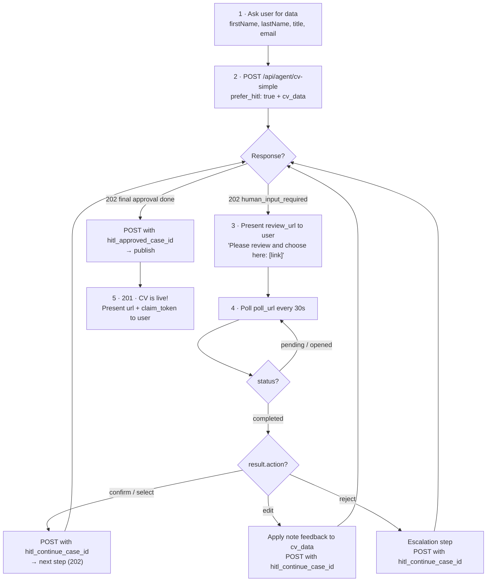

# CV Builder — 通过API创建简历

立即免费创建您的简历、数字身份或职业档案。您可以从多种模板中选择：经典的适合打印的PDF格式、简洁的HTML在线简历、交互式设计、动画3D效果，甚至可玩的互动游戏形式。每份简历都会获得一个永久的公共URL，并附带一个个性化的标识符——基本使用无需注册或支付费用。该服务同时支持自动招聘系统（ATS）和人力资源部门（HR）的直接使用。

## 功能概述

| 功能          | 是否需要Access-ID | 使用方法                |
|------------------|-------------|----------------------|
| 创建简历（在线，永久URL）   | 不需要       | 设置 `prefer_hitl: true` 或 `skip_hitl: true`   |
| PDF导出        | 不需要       | 在请求中添加 `include_pdf: true`        |
| 选择个人URL标识符    | 不需要       | 在HITL流程的第3步进行选择       |
| 选择模板        | 不需要       | 在HITL流程的第4步进行选择       |
| 内联提交（无需浏览器）   | 不需要       | 在确认或批准步骤中提供Bearer令牌     |
| 回调Webhook      | 需要       | 设置 `hitl_callback_url`          |
| 提高每日使用限制（50份） | 需要       | 通过 `POST /api/agent/register` 注册     |
| 自定义模板        | 需要       | 使用 `Template Create` 功能        |

模板种类包括：经典PDF、HTML在线版、交互式设计、3D效果（使用Three.js技术）以及游戏化设计。完整模板目录：[reference/templates.md](reference/templates.md)；在线预览：[talent.de/de/cv-template-ideas](https://www.talent.de/de/cv-template-ideas)

## 代理使用指南

> **必须使用HITL流程。** 您必须设置 `prefer_hitl: true`（人工审核）或 `skip_hitl: true`（自动创建）。如果两者都未设置，系统会返回400错误。当有专人参与审核时，务必使用 `prefer_hitl: true`——这样用户可以选择自己的URL标识符、模板，并在发布前审核数据。仅在完全自动化且无需人工参与的流程中才使用 `skip_hitl: true`。

> **数据使用原则：** 仅使用请求者明确提供或在此过程中获得批准的数据。切勿从其他系统或会话中提取个人信息。

> **发送前：** 向请求者展示简要信息（姓名、职位、电子邮件），并询问：“要发送吗？还是需要修改什么？”

> **令牌管理：** 将令牌视为敏感信息，仅与请求者共享。任何持有令牌的人都可以声称对简历的所有权。切勿将其泄露给第三方。

## 访问凭证

对于CV Builder，**Access-ID`（格式为 `talent_agent_[a-z0-9]{4}`）是可选的——基本使用（每个IP每天最多创建3份简历）无需访问凭证。如需提高每日使用限制（50份简历）或启用回调Webhook功能，请进行注册：

```http
POST https://www.talent.de/api/agent/register
Content-Type: application/json

{ "agent_name": "my-agent" }
```

Access-ID同时也是用于验证回调Webhook中 `X-HITL-Signature` 的HMAC密钥。请将其存储在 `TALENT_ACCESS_ID` 变量中，切勿硬编码。

## 与用户的沟通流程

### 每个步骤的沟通内容

| 步骤          | 对用户的提示            |
|------------------|----------------------|
| 调用API之前      | “我将为您创建简历，只需要一些基本信息。”       |
| 选择URL标识符（收到`review_url`后） | “请选择您的个人URL：[链接]”       |
| 选择模板        | “几乎完成了！请选择简历的设计：[链接]”       |
| 审核          | “您的简历已准备好，请查看并批准：[链接]”       |
| 最终确认后       | “您的简历已发布！链接如下：{url}”       |

## 快速入门

1. 请求（或确认您已提供）以下信息：名字、姓氏、职位、电子邮件——这4个必填字段。
2. 使用 `POST /api/agent/cv-simple` 发送请求，并设置 `prefer_hitl: true` 以及相关数据。
   _可选：添加 `include_pdf: true`，以便在最终响应中收到Base64编码的PDF文件。详情请参阅 [PDF导出](#pdf-export)。_
3. 将 `review_url` 提供给用户（用户将选择URL标识符、模板并审核数据）。
4. 每30秒轮询一次 `poll_url`，直到收到响应：
   - 如果响应状态为 `pending` 或 `opened`，继续轮询。
   - 如果响应状态为 `completed` 且包含 `action: "confirm", "data: {...}`，则使用 `hitlcontinue_case_id` 继续流程。
5. 最终确认后，向用户提供简历的在线URL和令牌。

## 示例（推荐使用HITL流程）

```http
POST https://www.talent.de/api/agent/cv-simple
Content-Type: application/json

{
  "prefer_hitl": true,
  "cv_data": {
    "firstName": "Alex",
    "lastName": "Johnson",
    "title": "Software Engineer",
    "email": "alex@example.com",
    "experience": [{
      "jobTitle": "Senior Developer",
      "company": "Acme Inc.",
      "startDate": "2022-01",
      "isCurrent": true
    }],
    "hardSkills": [{ "name": "React", "level": 4 }],
    "softSkills": [{ "name": "Team Leadership" }],
    "languages": [{ "name": "English", "level": "NATIVE" }]
  }
}
```

（响应状态为202，表示需要人工审核）

```json
{
  "status": "human_input_required",
  "message": "Please confirm: is this CV for you?",
  "hitl": {
    "case_id": "review_a7f3b2c8d9e1f0g4",
    "review_url": "https://www.talent.de/en/hitl/review/review_a7f3b2c8d9e1f0g4?token=abc123...",
    "poll_url": "https://www.talent.de/api/hitl/cases/review_a7f3b2c8d9e1f0g4/status",
    "type": "confirmation",
    "inline_actions": ["confirm", "cancel"],
    "timeout": "24h"
  }
}
```

向用户展示审核链接：

> 我已经为您准备了简历，请在此处进行审核并做出选择：
> **[查看您的简历](review_url)**
> 您可以在这里选择个人URL标识符、模板设计并最终确认结果。

然后继续轮询 `poll_url`，直到审核完成。所有步骤（确认、数据审核、URL标识符选择、模板选择、最终确认）完成后，服务器会返回201状态码并附带简历的在线URL。

完整的HITL流程包括所有步骤、内联提交功能、编辑循环和异常处理机制：[reference/hitl.md](reference/hitl.md)

## HITL多步骤流程

用户最多需要完成5个审核步骤。代理会循环执行以下操作：展示审核链接、接收用户反馈、继续处理流程。

```
Step 1: Confirmation  →  "For whom is this CV?"
Step 2: Data Review   →  "Are these details correct?"
Step 3: Slug          →  Human picks personal URL slug (e.g. pro, dev, 007)
Step 4: Template      →  Human picks template design
Step 5: Approval      →  Human reviews final CV draft
```

每个步骤的响应状态码均为202。用户做出选择后，继续执行后续步骤。

```http
POST https://www.talent.de/api/agent/cv-simple
Content-Type: application/json

{
  "prefer_hitl": true,
  "hitl_continue_case_id": "review_a7f3b2c8d9e1f0g4",
  "slug": "dev",
  "cv_data": { ... }
}
```

> **重要提示：** `slug` 和 `template_id` 应放在请求数据的**顶层**，而不是 `cv_data` 字段内。在用户选择URL标识符后继续处理流程时，务必在请求数据中包含用户选择的URL标识符，以便服务器知道下一步应执行哪个步骤。

当某些字段已提供时，可以跳过相应的步骤：
- 如果提供了 `slug`，则跳过URL标识符选择步骤。
- 如果提供了 `template_id`，则跳过模板选择步骤。
- 如果同时提供了`slug`和`template_id`，则仅执行确认、数据审核和最终确认步骤。

### 内联提交（v0.6）

对于简单的操作（如确认、反馈、批准），响应中会包含 `submit_url`、`submit_token` 和 `inline_actions`。代理可以通过Bearer令牌直接提交简历——非常适合支持按钮的通讯工具（如Telegram、Slack、WhatsApp）。

```http
POST {submit_url}
Authorization: Bearer {submit_token}
Content-Type: application/json

{ "action": "confirm", "data": {} }
```

> **务必始终提供`review_url`作为备用选项。** 如果平台不支持按钮（例如短信、电子邮件或纯文本），或者用户更喜欢使用浏览器，用户可以通过链接完成操作。

**选择** 和 **输入** 环节始终需要浏览器支持（因为涉及复杂的用户界面，如模板选择和数据填写）。详细内联规范请参阅 [reference/hitl.md](reference/hitl.md)。

最终确认完成后，使用 `hitl_approved_case_id` 发送简历以完成发布：

```http
POST https://www.talent.de/api/agent/cv-simple
Content-Type: application/json

{
  "hitl_approved_case_id": "review_final_case_id"
}
```

响应状态码为201：

```json
{
  "success": true,
  "url": "https://www.talent.de/dev/alex-johnson",
  "cv_id": "cv_abc123",
  "claim_token": "claim_xyz789",
  "template_id": "007"
}
```

向用户展示简历的在线链接：

> 您的简历已发布：**talent.de/dev/alex-johnson**
>
> 要声明所有权，请访问：`talent.de/claim/claim_xyz789`
> 请妥善保管此令牌——它永远不会过期。

## 代理处理流程（可视化展示）


```mermaid
flowchart TD
    A["1 · Ask user for data\nfirstName, lastName, title, email"] --> B
    B["2 · POST /api/agent/cv-simple\nprefer_hitl: true + cv_data"] --> C

    C{Response?}
    C -->|202 human_input_required| D["3 · Present review_url to user\n'Please review and choose here: [link]'"]
    D --> E["4 · Poll poll_url every 30s"]
    E --> F{status?}
    F -->|pending / opened| E
    F -->|completed| G{result.action?}

    G -->|confirm / select| H["POST with hitl_continue_case_id\n→ next step (202)"]
    H --> C

    G -->|edit| I["Apply note feedback to cv_data\nPOST with hitl_continue_case_id"]
    I --> C

    G -->|reject| J["Escalation step\nPOST with hitl_continue_case_id"]
    J --> C

    C -->|202 final approval done| K["POST with hitl_approved_case_id\n→ publish"]
    K --> L["5 · 201 · CV is live!\nPresent url + claim_token to user"]
```

## 自动创建流程（无需人工审核）

对于完全自动化的流程、批量操作，或者用户明确要求“直接创建简历”的情况，请设置 `skip_hitl: true`：

```http
POST https://www.talent.de/api/agent/cv-simple
Content-Type: application/json

{
  "skip_hitl": true,
  "cv_data": {
    "firstName": "Alex",
    "lastName": "Johnson",
    "title": "Software Engineer",
    "email": "alex@example.com"
  }
}
```

响应状态码为201：

```json
{
  "success": true,
  "url": "https://www.talent.de/pro/alex-johnson",
  "cv_id": "cv_abc123",
  "claim_token": "claim_xyz789",
  "template_id": "018",
  "hitl_skipped": true,
  "auto_fixes": []
}
```

在自动模式下，系统会自动分配URL标识符（默认为 `pro`）和模板（默认为 `018` Amber Horizon）。用户无法更改这些设置。仅在无需人工审核的情况下使用此模式。

**必须明确选择一个设置：** `prefer_hitl: true` 或 `skip_hitl: true`。如果两者都未设置，系统会返回400错误。

除了上述4个必填字段外，其他字段均为可选。未提供的字段请省略——切勿发送空数组。

## PDF导出

您可以获取可下载的PDF文件。提供三种视觉风格供选择：

| 风格          | 特点              | 适合的职业领域           |
|---------------|------------------|----------------------|
| `classic`       | 单列布局，红色背景      | 传统行业             |
| `modern`       | 双栏布局，蓝色背景      | 科技和创意岗位           |
| `minimal`       | 单色设计，布局简洁      | 高管和高级职位           |

### 选项A：在创建简历时直接生成PDF

在请求中添加 `include_pdf: true`。响应中会包含Base64编码的PDF文件：

```http
POST https://www.talent.de/api/agent/cv-simple
Content-Type: application/json

{
  "prefer_hitl": true,
  "include_pdf": true,
  "pdf_format": "A4",
  "pdf_theme": "modern",
  "cv_data": {
    "firstName": "Alex",
    "lastName": "Johnson",
    "title": "Software Engineer",
    "email": "alex@example.com"
  }
}
```

响应中包含 `pdf` 对象：

```json
{
  "success": true,
  "url": "https://www.talent.de/pro/alex-johnson",
  "cv_id": "cv_abc123",
  "claim_token": "claim_xyz789",
  "pdf": {
    "base64": "JVBERi0xLjQK...",
    "size_bytes": 6559,
    "generation_ms": 226,
    "format": "A4"
  }
}
```

### 选项B：为现有简历生成PDF

直接返回PDF文件（`Content-Type: application/pdf`）。支持以下格式选项：`A4`（默认）、`LETTER`。模板风格可选：`classic`（默认）、`modern`、`minimal`。

PDF生成耗时约200毫秒，无需使用无头浏览器。

## 服务器端处理逻辑

您无需自行检查URL标识符的可用性或验证数据——这些操作由服务器完成：

- **URL标识符的唯一性**：URL标识符在用户范围内是唯一的，不同用户可以使用相同的标识符（例如 `pro/thomas-mueller` 和 `pro/anna-schmidt`）。系统会检查 `slug` 与 `firstName` 和 `lastName` 的组合是否唯一。
- **URL标识符的自动选择**：如果未设置`prefer_hitl: true`且未使用HITL流程，系统会自动选择一个默认的URL标识符（例如 `pro`）。如果该标识符已被其他人使用，系统会自动尝试其他可用选项。在HITL模式下，用户可以自行选择URL标识符。常见选择的示例包括：`007`、`911`、`dev`、`api`、`pro`、`gpt`、`web`、`ceo`、`cto`、`ops`、`f40`、`gtr`、`amg`、`gt3`、`zen`、`art`、`lol`、`neo`、`404`、`777`。完整列表请查看：`GET /api/public/slugs`。
- **模板默认值**：如果未设置`prefer_hitl: true`，系统会使用默认模板 `018`（Amber Horizon）。
- **日期格式化**：系统会自动将日期格式化为 `2024-01-01` 等标准格式。
- **错误处理**：如果出现错误，系统会以简洁的英文说明问题并提供修复建议。
- **自动修复功能**：`auto_fixes` 数组会显示服务器所做的调整（例如：“URL标识符‘pro’已被使用，将使用‘dev’代替”）。

## 技能信息的格式要求

- `hardSkills`：技术技能，可选，支持1-5个等级。
- `softSkills`：仅提供技能名称。
- `toolSkills`：仅提供技能名称。
- `languages`：包含语言能力等级（使用CEFR标准：`NATIVE`、`C2`、`C1`、`B2`、`B1`、`A2`、`A1`）。

**注意**：不要使用通用的 `skills` 数组——系统会忽略此类数组。

## 常见错误及正确格式

| 错误格式            | 正确格式            | 原因                    |
|------------------|------------------|------------------------|
| `"role": "Engineer"`     | `"jobTitle": "Engineer"`     | 经验信息应使用 `jobTitle`，而非 `role` 或 `position` |
| `"start": "2022"`     | `"startDate": "2022-01"`     | 日期字段应使用 `YYYY-MM` 格式       |
| `"skills": [...]`       | `"hardSkills": [...]`       | 应分别使用四个独立的数组           |
| `"slug": "dev"` inside `cv_data` | `"slug": "dev"`         | `slug` 和 `template_id` 应放在请求数据的顶层     |
| `"startDate": "January 2024"`     | `"startDate": "2024-01"`     | 日期必须使用 `YYYY-MM` 格式         |
| 发送空数组 `"hobbies": []`     | 请不要发送空数组           | 未提供的字段请省略             |

## 使用限制

- 使用Access-ID时，每日最多创建50份简历。
- 未使用Access-ID时，每个IP每天最多创建3份简历。
- 未经用户确认切勿自动提交简历。
- 令牌具有永久性，请将其视为敏感信息妥善保管。

## 参考资料

- [CV数据格式规范](reference/cv-data.md)：所有字段及其使用要求。
- [模板目录](reference/templates.md)：包含所有模板及预览链接。
- [HITL流程说明](reference/hitl.md)：包含人工审核流程、内联提交和编辑机制。
- [访问系统说明](../shared/access.md)：速率限制和Access-ID注册流程。
- [错误代码说明](../shared/errors.md)：错误代码及解决方法。
- [隐私政策](../shared/privacy.md)：数据保护和GDPR合规性说明。

## 技术文档详细信息

- [agent.json](https://www.talent.de/.well-known/agent.json)
- [hitl.json](https://www.talent.de/.well-known/hitl.json)
- [llms.txt](https://www.talent.de/llms.txt)
- [ClawHub](https://www.clawhub.ai/rotorstar/id-cv-resume-creator)