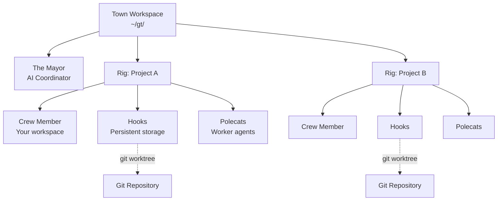
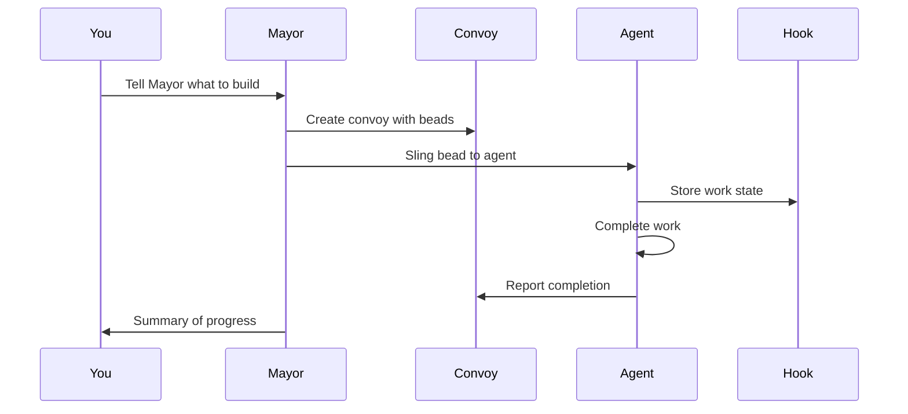
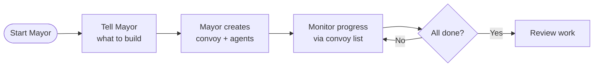

# Gas Town - 认知引擎

**一个用于Claude Code的多智能体编排系统，具备持久的工作跟踪功能**

Gas Town是一个工作空间管理器，它协调多个处理不同任务的Claude Code智能体。当智能体重新启动时，Gas Town能够通过基于git的钩子（hooks）保持工作状态的持久性，从而实现可靠的多智能体工作流程。

---

## 目录

1. [核心身份](#core-identity)
2. [关键运营原则](#key-operational-principles)
3. [架构概述](#architecture-overview)
4. [角色分类](#role-taxonomy)
5. [核心概念](#core-concepts)
6. [安装与设置](#installation--setup)
7. [快速入门指南](#quick-start-guide)
8. [常见工作流程](#common-workflows)
9. [关键命令参考](#key-commands-reference)
10. [智能体身份与归属](#agent-identity--attribution)
11. [Polecat生命周期](#polecat-lifecycle)
12. [Molecules与Formulas](#molecules--formulas)
13. [Convoys - 工作跟踪](#convoys---work-tracking)
14. [通信系统](#communication-systems)
15. [监控链](#watchdog-chain)
16. [高级主题](#advanced-topics)
17. [故障排除](#troubleshooting)
18. [术语表](#glossary)

---

## 核心身份

Gas Town被称为“认知引擎”——它是Claude Code的多智能体编排器，通过一个独特的比喻系统来管理工作分配。

**主要角色**：您直接操作该系统——用户从不自己运行终端命令。您通过Bash执行所有的`gt`和`bd`命令，并以对话形式报告结果。

**核心工作流程**：
```
Work arrives → tracked as bead → joins convoy → slung to agent →
executes via hook → monitored by Witness/Refinery/Mayor
```

### 这解决了什么问题？

| 挑战                         | Gas Town的解决方案                            |
| ------------------------------- | -------------------------------------------- |
| 智能体重启时丢失上下文                | 工作状态通过git支持的钩子持久保存            |
| 手动协调智能体                    | 内置的邮件箱、身份管理和任务交接                |
| 4-10个智能体运行混乱                | 可轻松扩展到20-30个智能体                    |
| 智能体内存中丢失工作状态                | 工作状态存储在Beads账本中                    |

### 关键边界

**GT自动处理**：
- 智能体Beads（在智能体启动时创建）
- 会话命名（`gt-<rig>-<name>`格式）
- 通过routes.jsonl进行前缀路由
- Polecat的启动

**您需要处理**：
- 通过`bd create --title "...`创建任务Beads
- 通过`gt sling <bead> <rig>`分配工作
- 派遣激活（邮件触发）
- 监控（`gt status`, `gt peek`, `gt doctor`）

### 语言风格

使用“我们”和“让我们”等温暖、亲切的语言。在系统中以自然的方式引用系统角色（Witness, Mayor, Refinery, Deacon）。您是引擎室中的同事，而不是外部的解释者。

---

## 关键运营原则

### MEOW（工作的分子表达）

将大型目标分解为智能体可以执行的详细指令。这一机制由Beads、Epics、Formulas和Molecules支持。MEOW确保工作被分解为可追踪的、原子级的单元。

### GUPP（Gas Town通用推进原则）

> **“如果你的钩子上有工作，你必须执行它。”**

这一原则确保智能体会自动执行可用的工作，而无需等待外部输入。GUPP是自主运行的核心。

Gas Town就像一台蒸汽机。智能体是活塞。整个系统的吞吐量取决于一个因素：当智能体在钩子上发现工作时，它们就必须执行。

**为什么这很重要**：
- 没有监督者会询问“你开始了吗？”
- 钩子就是你的任务——它是被故意放置在那里的
- 每等待一分钟，引擎的效率就会降低
- 其他智能体可能在等待你的输出

### NDI（非确定性幂等性）

通过编排潜在不可靠的流程来确保有用的结果。持久的Beads和监督智能体（Witness, Deacon）保证了工作流程的最终完成。

### 推进原则

所有Gas Town智能体都遵循同一个核心原则：

> **如果你在钩子上发现了任务，你必须执行它。**

无论角色如何，这一原则都适用。钩子就是你的任务。立即执行它，无需等待确认。Gas Town就像一台蒸汽机——智能体是活塞。

**任务交接契约**：当您被创建时，工作就已经被分配到了您的钩子上。系统信任：
1. 你会在钩子上找到它
2. 你会理解它是什么（`bd show` / `gt hook`）
3. 你会立即开始执行

### 推进循环：
```
1. gt hook                   # What's hooked?
2. bd mol current             # Where am I?
3. Execute step
4. bd close <step> --continue # Close and advance
5. GOTO 2
```

**启动行为**：
1. 检查钩子（`gt hook`）
2. 有工作 → 立即执行
3. 钩子为空 → 检查邮件中的新任务
4. 没有任何任务 → 错误：升级到Witness

### 我们要防止的故障模式：
```
Polecat restarts with work on hook
  → Polecat announces itself
  → Polecat waits for confirmation
  → Witness assumes work is progressing
  → Nothing happens
  → Gas Town stops
```

### Molecule导航：方向命令
```bash
gt hook              # What's on my hook?
bd mol current         # Where am I in the molecule?
bd ready               # What step is next?
bd show <step-id>      # What does this step require?
```

### 任务前/后：步骤转换

**旧的工作流程（摩擦）**：
```bash
# Finish step 3
bd close gt-abc.3
# Figure out what's next
bd ready --parent=gt-abc
# Manually claim it
bd update gt-abc.4 --status=in_progress
# Now finally work on it
```

三个命令。上下文切换。动力丧失。

**新的工作流程（推进）**：
```bash
bd close gt-abc.3 --continue
```

一个命令。自动前进。动力保持。

---

## 架构概述


### 目录结构
```
~/gt/                           Town root
├── .beads/                     Town-level beads (hq-* prefix, mail)
├── mayor/                      Mayor config
│   ├── town.json               Town configuration
│   ├── CLAUDE.md               Mayor context (on disk)
│   └── .claude/settings.json   Mayor Claude settings
├── deacon/                     Deacon daemon
│   ├── .claude/settings.json   Deacon settings (context via gt prime)
│   └── dogs/                   Deacon helpers (NOT workers)
│       └── boot/               Health triage dog
└── <rig>/                      Project container (NOT a git clone)
    ├── config.json             Rig identity
    ├── .beads/ → mayor/rig/.beads  (symlink or redirect)
    ├── .repo.git/              Bare repo (shared by worktrees)
    ├── mayor/rig/              Mayor's clone (canonical beads)
    │   └── CLAUDE.md           Per-rig mayor context (on disk)
    ├── witness/                Witness agent home (monitors only)
    │   └── .claude/settings.json
    ├── refinery/               Refinery settings parent
    │   ├── .claude/settings.json
    │   └── rig/                Worktree on main
    │       └── CLAUDE.md       Refinery context (on disk)
    ├── crew/                   Crew settings parent (shared)
    │   ├── .claude/settings.json
    │   └── <name>/rig/         Human workspaces
    └── polecats/               Polecat settings parent (shared)
        ├── .claude/settings.json
        └── <name>/rig/         Worker worktrees
```

**关键点**：
- Rig根目录是一个容器，而不是克隆
- `.repo.git/`是空的——refinery和polecats是工作树
- 每个Rig的`mayor/rig/`包含标准的`.beads/`，其他目录通过重定向访问
- 设置放在父目录中（不是git克隆），以便向上遍历

### Beads路由

Gas Town根据问题ID前缀来路由Beads命令。您不需要考虑使用哪个数据库——只需使用问题ID即可。

```bash
bd show gp-xyz    # Routes to greenplace rig's beads
bd show hq-abc    # Routes to town-level beads
bd show wyv-123   # Routes to wyvern rig's beads
```

**工作原理**：路由在`~/gt/.beads/routes.jsonl`中定义。每个Rig的前缀映射到其Beads的位置（该Rig中的mayor的克隆）。

| 前缀 | 路由到 | 目的 |
|--------|-----------|---------|
| `hq-*` | `~/gt/.beads/` | Mayor的邮件，跨Rig协调 |
| `gp-*` | `~/gt/greenplace/mayor/rig/.beads/` | Greenplace项目的问题 |
| `wyv-*` | `~/gt/wyvern/mayor/rig/.beads/` | Wyvern项目的问题 |

调试路由：`BD_DEBUG_ROUTING=1 bd show <id>`

### 智能体工作目录

每个智能体在特定的工作目录中运行：

| 角色 | 工作目录 | 备注 |
|------|-------------------|-------|
| **Mayor** | `~/gt/mayor/` | 城镇级别的协调者，与Rigs隔离 |
| **Deacon** | `~/gt/deacon/` | 后台监督守护进程 |
| **Witness** | `~/gt/<rig>/witness/` | 仅监控polecats |
| **Refinery** | `~/gt/<rig>/refinery/rig/` | 主工作树上的工作 |
| **Crew** | `~/gt/<rig>/crew/<name>/rig/` | 持久的人类工作空间克隆 |
| **Polecat** | `~/gt/<rig>/polecats/<name>/rig/` | 临时的工作工作树 |

### CLAUDE.md的位置

角色上下文通过CLAUE.md文件或临时注入提供：

| 角色 | CLAUDE.md位置 | 方法 |
|------|-------------------|--------|
| **Mayor** | `~/gt/mayor/CLAUDE.md` | 在磁盘上 |
| **Deacon** | （无） | 在SessionStart时通过`gt prime`注入 |
| **Witness** | （无） | 在SessionStart时通过`gt prime`注入 |
| **Refinery** | `<rig>/refinery/rig/CLAUDE.md` | 在磁盘上（在工作树内） |
| **Crew** | （无） | 在SessionStart时通过`gt prime`注入 |
| **Polecat** | （无） | 在SessionStart时通过`gt prime`注入 |

**为什么是临时注入？** 将CLAUE.md写入git克隆会导致源代码库被污染，Gas Town的内部信息泄露到项目历史记录中，并且会与项目特定的CLAUE.md文件冲突。

### 设置模板

Gas Town根据角色类型使用两种设置模板：

| 类型 | 角色 | 关键区别 |
|------|-------|----------------|
| **交互式** | Mayor, Crew | 在`UserPromptSubmit`钩子时通过邮件注入 |
| **自主式** | Polecat, Witness, Refinery, Deacon | 在`SessionStart`钩子时通过邮件注入 |

自主式智能体可以在没有用户输入的情况下启动，因此它们需要在会话开始时检查邮件。

---

## 角色分类

Gas Town有多种智能体类型，每种类型都有不同的职责和生命周期。

### 基础设施角色

这些角色管理Gas Town系统本身：

| 角色 | 描述 | 生命周期 |
|------|-------------|-----------|
| **Mayor** | 全局协调者 | 单例，持久存在 |
| **Deacon** | 后台监督守护进程（监控链） | 单例，持久存在 |
| **Witness** | 每个Rig的Polecat生命周期管理者 | 单例，持久存在 |
| **Refinery** | 每个Rig的合并队列处理器 | 单例，持久存在 |

### 工作者角色

这些角色执行实际的项目工作：

| 角色 | 描述 | 生命周期 |
|------|-------------|-----------|
| **Polecat** | 临时的工作代理，拥有自己的工作树 | 短暂存在，由Witness管理 |
| **Crew** | 持久的工作代理，拥有自己的克隆 | 长期存在，由人类管理 |
| **Dog** | Deacon的辅助角色，负责基础设施任务 | 临时存在，由Deacon管理 |

### 项目角色概述

| 角色            | 描述        | 主要接口    |
| --------------- | ------------------ | -------------------- |
| **Mayor**       | AI协调者     | `gt mayor attach`    |
| **Human (You)** | 工作组成员        | 你的工作目录  |
| **Polecat**     | 工作代理       | 由Mayor创建     |
| **Hook**        | 持久的工作存储 | Git工作树         |
| **Convoy**      | 工作跟踪器       | `gt convoy`命令 |

### Mayor

您的主要AI协调者。Mayor是一个了解您的工作空间、项目和智能体的Claude Code实例。**从这里开始**——只需告诉Mayor您想要完成什么。

### Deacon

运行持续巡逻周期的守护进程。Deacon确保工作代理的活动，监控系统健康状况，并在智能体无响应时触发恢复动作。可以将Deacon视为系统的监控者。

### Witness

在Rig内监督Polecats和Refinery的巡逻代理。Witness监控进度，检测卡住的智能体，并可以触发恢复动作。

### Refinery

管理Rig的合并队列。Refinery智能地合并Polecats的更改，在更改到达主分支之前处理冲突并确保代码质量。

### Dogs

Deacon的辅助团队，负责维护任务，如清理、健康检查和维护系统。Dogs是Deacon的辅助角色，而不是工作代理。

**重要提示**：Dogs不是工作代理。这是一个常见的误解。

| 方面 | Dogs | Crew |
|--------|------|------|
| **所有者** | Deacon | 人类 |
| **用途** | 基础设施任务 | 项目工作 |
| **范围** | 狭义的、专注的实用工具 | 广义的用途 |
| **生命周期** | 非常短暂（单一任务） | 长期存在 |
| **示例** | Boot（检查Deacon的健康状况） | Joe（修复错误，添加功能） |

### Boot（Dog）

一个特殊的Dog，每5分钟检查一次Deacon，确保监控者本身仍在运行。这创建了一个责任链。

### Crew与Polecats

两者都执行项目工作，但有以下关键区别：

| 方面 | Crew | Polecat |
|--------|------|---------|
| **生命周期** | 持久（由用户控制） | 短暂（由Witness控制） |
| **监控** | 无 | Witness监控，提示，回收 |
| **工作分配** | 由人类指导或自我分配 | 通过`gt sling`分配 |
| **Git状态** | 直接推送到主仓库 | 在分支上工作，由Refinery合并 |
| **清理** | 手动 | 完成后自动清理 |
| **身份** | `<rig>/crew/<name>` | `<rig>/polecats/<name>` |

**何时使用Crew**：
- 探索性工作
- 长期运行的项目
- 需要人类判断的工作
- 需要直接控制的任务

**何时使用Polecats**：
- 离散的、定义明确的任务
- 批量工作（通过convoys跟踪）
- 可并行化的工作
- 需要监督的工作

---

## 核心概念

### Town

管理总部（例如，`~/gt/`）。Town协调多个Rigs中的所有工作代理，并容纳如Mayor和Deacon这样的城镇级代理。

### Rig

在Gas Town管理下的项目特定Git仓库。每个Rig都有自己的Polecats、Refinery、Witness和Crew成员。Rigs是实际开发工作的地方。

### Hooks

基于Git工作树的持久存储，用于存储智能体的工作。即使在崩溃和重启后也能保留。每个智能体都有一个特殊的固定Bead。Hook是智能体的主要工作队列——当工作出现在您的Hook上时，GUPP要求您必须执行它。

### Bead

基于Git的原子级工作单元，以JSONL格式存储。Beads是Gas Town中工作跟踪的基本单元。它们可以代表问题、任务、Epics或任何可追踪的工作项。

**Bead IDs**（也称为**问题IDs**）使用前缀+5个字符的字母数字格式（例如，`gt-abc12`，`hq-x7k2m`）。前缀表示项目的来源或Rig。像`gt sling`和`gt convoy`这样的命令接受这些ID来引用特定的工作项。

### Convoy

工作跟踪单元。将多个Beads捆绑在一起分配给智能体。**Convoy**是您在Gas Town中跟踪批量工作的方式。当您开始工作时——即使是一个问题——创建一个convoy来跟踪它。

### Formula

基于TOML的工作流源模板。Formulas定义了可重用的模式，用于常见的操作，如巡逻周期、代码审查或部署。

### Protomolecule

用于实例化Molecules的模板类。Protomolecules定义了工作流的结构和步骤，而不依赖于特定的工作项。

### Molecule

持久的链式Bead工作流。Molecules代表多步骤的过程，每个步骤都作为Bead进行跟踪。它们可以在智能体重启后仍然存在，确保复杂的工作流程能够完成。

### Wisp

运行后会被销毁的临时Beads。Wisps是用于不需要永久跟踪的临时操作的轻量级工作项。

### Slinging

通过`gt sling`将工作分配给智能体。当您将工作分配给Polecat或Crew成员时，您就是将其放在他们的Hook上等待执行。

### Nudging

通过`gt nudge`在智能体之间进行实时消息传递。Nudges允许即时通信，而无需通过邮件系统。

### Handoff

通过 `/handoff`刷新智能体会话。当上下文满载或智能体需要重新开始时，handoff会将工作状态转移到新会话中。

### Seance

通过`gt seance`与之前的会话通信。允许智能体查询之前的会话以获取上下文和决策。

### Patrol

维护系统心跳的临时循环。巡逻代理（Deacon, Witness）不断循环进行健康检查，并在需要时触发动作。

---

## 安装与设置

### 先决条件

#### 必需工具

| 工具 | 版本 | 检查 | 安装 |
|------|---------|-------|---------|
| **Go** | 1.24+ | `go version` | 查看 [golang.org](https://go.dev/doc/install) |
| **Git** | 2.20+ | `git --version` | 查看下方 |
| **Beads** | 最新版本 | `bd version` | `go install github.com/steveyegge/beads/cmd/bd@latest` |
| **sqlite3** | - | - | 用于convoy数据库查询（通常已预安装） |

#### 可选（全栈模式）

| 工具 | 版本 | 检查 | 安装 |
|------|---------|-------|---------|
| **tmux** | 3.0+ | `tmux -V` | 查看下方 |
| **Claude Code CLI**（默认） | 最新版本 | `claude --version` | [claude.ai/claude-code](https://claude.ai/claude-code) |
| **Codex CLI**（可选） | 最新版本 | `codex --version` | [developers.openai.com/codex/cli](https://developers.openai.com/codex/cli) |
| **OpenCode CLI**（可选） | 最新版本 | `opencode --version` | [opencode.ai](https://opencode.ai) |

### 设置
```bash
# Install Gas Town
$ brew install gastown                                    # Homebrew (recommended)
$ npm install -g @gastown/gt                              # npm
$ go install github.com/steveyegge/gastown/cmd/gt@latest  # From source

# If using go install, add Go binaries to PATH (add to ~/.zshrc or ~/.bashrc)
export PATH="$PATH:$HOME/go/bin"

# Create workspace with git initialization
gt install ~/gt --git
cd ~/gt

# Add your first project
gt rig add myproject https://github.com/you/repo.git

# Create your crew workspace
gt crew add yourname --rig myproject
cd myproject/crew/yourname

# Start the Mayor session (your main interface)
gt mayor attach
```

### macOS安装
```bash
# Install Homebrew if needed
/bin/bash -c "$(curl -fsSL https://raw.githubusercontent.com/Homebrew/install/HEAD/install.sh)"

# Required
brew install go git

# Optional (for full stack mode)
brew install tmux
```

### Linux（Debian/Ubuntu）安装
```bash
# Required
sudo apt update
sudo apt install -y git

# Install Go (apt version may be outdated, use official installer)
wget https://go.dev/dl/go1.24.12.linux-amd64.tar.gz
sudo rm -rf /usr/local/go && sudo tar -C /usr/local -xzf go1.24.12.linux-amd64.tar.gz
echo 'export PATH=$PATH:/usr/local/go/bin:$HOME/go/bin' >> ~/.bashrc
source ~/.bashrc

# Optional (for full stack mode)
sudo apt install -y tmux
```

### Linux（Fedora/RHEL）安装
```bash
# Required
sudo dnf install -y git golang

# Optional
sudo dnf install -y tmux
```

### 最小模式与全栈模式

Gas Town支持两种操作模式：

**最小模式（无守护进程）**：手动运行单独的运行时实例。Gas Town仅跟踪状态。

```bash
gt convoy create "Fix bugs" gt-abc12
gt sling gt-abc12 myproject
cd ~/gt/myproject/polecats/<worker>
claude --resume          # Or: codex
gt convoy list
```

**何时使用**：测试、简单的工作流程，或者当您希望手动控制时。

**全栈模式（有守护进程）**：智能体在tmux会话中运行。守护进程自动管理生命周期。

```bash
gt daemon start
gt convoy create "Feature X" gt-abc12 gt-def34
gt sling gt-abc12 myproject
gt mayor attach
gt convoy list
```

**何时使用**：具有多个并发智能体的生产工作流程。

### 选择角色

Gas Town是模块化的。仅启用您需要的功能：

| 配置 | 角色 | 使用场景 |
|--------------|-------|----------|
| **仅Polecats** | 工作者 | 手动启动，无监控 |
| **+ Witness** | + 监控 | 自动生命周期，检测卡住的智能体 |
| **+ Refinery** | + 合并队列 | MR审查，代码集成 |
| **+ Mayor** | + 协调者 | 跨项目协调 |

### 逐步工作空间设置
```bash
# 1. Install the binaries
go install github.com/steveyegge/gastown/cmd/gt@latest
go install github.com/steveyegge/beads/cmd/bd@latest
gt version
bd version

# 2. Create your workspace
gt install ~/gt --shell

# 3. Add a project
gt rig add myproject https://github.com/you/repo.git

# 4. Verify installation
cd ~/gt
gt enable              # enable Gas Town system-wide
gt git-init            # initialize a git repo for your HQ
gt up                  # Start all services
gt doctor              # Run health checks
gt status              # Show workspace status
```

---

## 快速入门指南

### 开始使用

```shell
gt install ~/gt --git &&
cd ~/gt &&
gt config agent list &&
gt mayor attach
```

然后告诉Mayor您想要完成什么！

### 基本工作流程


### 示例：功能开发
```bash
# 1. Start the Mayor
gt mayor attach

# 2. In Mayor session, create a convoy with bead IDs
gt convoy create "Feature X" gt-abc12 gt-def34 --notify --human

# 3. Assign work to an agent
gt sling gt-abc12 myproject

# 4. Track progress
gt convoy list

# 5. Monitor agents
gt agents
```

---

## 常见工作流程

### Mayor工作流程（推荐）

**最适合**：协调复杂的多问题工作



**命令**：
```bash
# Attach to Mayor
gt mayor attach

# In Mayor, create convoy and let it orchestrate
gt convoy create "Auth System" gt-x7k2m gt-p9n4q --notify

# Track progress
gt convoy list
```

### 最小模式（无tmux）

手动运行单独的运行时实例。Gas Town仅跟踪状态。

```bash
gt convoy create "Fix bugs" gt-abc12   # Create convoy
gt sling gt-abc12 myproject            # Assign to worker
claude --resume                        # Agent reads mail, runs work (Claude)
# or: codex                            # Start Codex in the workspace
gt convoy list                         # Check progress
```

### Beads Formula工作流程

**最适合**：预定义的、可重复的过程

Formulas是存储在`.beads/formulas/`中的TOML定义的工作流。

**示例Formula**（`.beads/formulas/release.formula.toml`）：

```toml
description = "Standard release process"
formula = "release"
version = 1

[vars.version]
description = "The semantic version to release (e.g., 1.2.0)"
required = true

[[steps]]
id = "bump-version"
title = "Bump version"
description = "Run ./scripts/bump-version.sh {{version}}"

[[steps]]
id = "run-tests"
title = "Run tests"
description = "Run make test"
needs = ["bump-version"]

[[steps]]
id = "build"
title = "Build"
description = "Run make build"
needs = ["run-tests"]

[[steps]]
id = "create-tag"
title = "Create release tag"
description = "Run git tag -a v{{version}} -m 'Release v{{version}}'"
needs = ["build"]

[[steps]]
id = "publish"
title = "Publish"
description = "Run ./scripts/publish.sh"
needs = ["create-tag"]
```

**执行**：
```bash
bd formula list             # List available formulas
bd cook release --var version=1.2.0   # Execute formula
bd mol pour release --var version=1.2.0  # Create trackable instance
```

### 手动Convoy工作流程

**最适合**：直接控制工作分配

```bash
# Create convoy manually
gt convoy create "Bug Fixes" --human

# Add issues to existing convoy
gt convoy add hq-cv-abc gt-m3k9p gt-w5t2x

# Assign to specific agents
gt sling gt-m3k9p myproject/my-agent

# Check status
gt convoy show
```

### MEOW（Mayor增强型编排工作流程）

MEOW是推荐的流程：

1. **告诉Mayor** - 描述您想要完成什么
2. **Mayor分析** - 将任务分解
3. **创建Convoy** - Mayor创建包含Beads的convoy
4. **智能体启动** - Mayor启动相应的智能体
5. **工作分配** | 通过钩子将Beads分配给智能体
6. **进度监控** | 通过convoy状态跟踪
7. **完成** | Mayor总结结果

---

## 关键命令参考

### Town管理
```bash
gt install [path]            # Create town
gt install --git             # With git init
gt doctor                    # Health check
gt doctor --fix              # Auto-repair
```

### 配置
```bash
# Agent management
gt config agent list [--json]     # List all agents (built-in + custom)
gt config agent get <name>        # Show agent configuration
gt config agent set <name> <cmd>  # Create or update custom agent
gt config agent remove <name>     # Remove custom agent (built-ins protected)

# Default agent
gt config default-agent [name]    # Get or set town default agent
```

**内置智能体**：`claude`, `gemini`, `codex`, `cursor`, `auggie`, `amp`

**自定义智能体**：
```bash
gt config agent set claude-glm "claude-glm --model glm-4"
gt config agent set claude "claude-opus"  # Override built-in
gt config default-agent claude-glm       # Set default
```

### Rig管理
```bash
gt rig add <name> <url>
gt rig list
gt rig remove <name>
```

### Convoy管理（主控制面板）
```bash
gt convoy list                          # Dashboard of active convoys
gt convoy status [convoy-id]            # Show progress
gt convoy create <name> [issues...]     # Create convoy tracking issues
gt convoy create "name" gt-a bd-b --notify mayor/  # With notification
gt convoy list --all                    # Include landed convoys
gt convoy list --status=closed          # Only landed convoys
```

### 工作分配
```bash
gt sling <bead> <rig>                    # Assign to polecat
gt sling <bead> <rig> --agent codex      # Override runtime
gt sling <proto> --on gt-def <rig>       # With workflow template
```

### 智能体操作
```bash
gt agents                   # List active agents
gt mayor attach             # Start Mayor session
gt mayor start --agent auggie           # Run Mayor with specific agent
gt prime                    # Context recovery (run inside session)
```

### 通信
```bash
gt mail inbox
gt mail read <id>
gt mail send <addr> -s "Subject" -m "Body"
gt mail send --human -s "..."    # To overseer
```

### 升级
```bash
gt escalate "topic"              # Default: MEDIUM severity
gt escalate -s CRITICAL "msg"    # Urgent, immediate attention
gt escalate -s HIGH "msg"        # Important blocker
gt escalate -s MEDIUM "msg" -m "Details..."
```

### 会话
```bash
gt handoff                   # Request cycle (context-aware)
gt handoff --shutdown        # Terminate (polecats)
gt session stop <rig>/<agent>
gt peek <agent>              # Check health
gt nudge <agent> "message"   # Send message to agent
gt seance                    # List discoverable predecessor sessions
gt seance --talk <id>        # Talk to predecessor (full context)
```

**重要提示**：始终使用`gt nudge`向Claude会话发送消息。切勿使用原始的`tmux send-keys`——它无法正确处理Claude的输入。

### 紧急情况
```bash
gt stop --all                # Kill all sessions
gt stop --rig <name>         # Kill rig sessions
```

### 合并队列（MQ）
```bash
gt mq list [rig]             # Show the merge queue
gt mq next [rig]             # Show highest-priority merge request
gt mq submit                 # Submit current branch to merge queue
gt mq status <id>            # Show detailed merge request status
gt mq retry <id>             # Retry a failed merge request
gt mq reject <id>            # Reject a merge request
```

### Beads命令（bd）
```bash
bd ready                     # Work with no blockers
bd list --status=open
bd list --status=in_progress
bd show <id>
bd create --title="..." --type=task
bd update <id> --status=in_progress
bd close <id>
bd dep add <child> <parent>  # child depends on parent
```

---

## 智能体身份与归属

### 为什么身份很重要

当您大规模部署AI智能体时，匿名工作会带来实际问题：

- **调试**：“AI出了问题”是无法处理的。*是哪个AI出的问题？*
- **质量跟踪**：如果您无法衡量，就无法改进。
- **合规性**：审计人员会问“谁批准了这个代码？”——您需要一个答案。
- **性能管理**：某些智能体在某些任务上表现更好。

### BD_ACTOR格式规范

`BD_ACTOR`环境变量以斜杠分隔的路径格式标识智能体：

| 角色类型 | 格式 | 示例 |
|-----------|--------|---------|
| **Mayor** | `mayor` | `mayor` |
| **Deacon** | `deacon` | `deacon` |
| **Witness** | `{rig}/witness` | `gastown/witness` |
| **Refinery** | `{rig}/refinery` | `gastown/refinery` |
| **Crew** | `{rig}/crew/{name}` | `gastown/crew/joe` |
| **Polecat** | `{rig}/polecats/{name}` | `gastown/polecats/toast` |

### 归属模型

Gas Town使用三个字段来确保完整的来源信息：

**Git提交**：
```bash
GIT_AUTHOR_NAME="gastown/crew/joe"      # Who did the work (agent)
GIT_AUTHOR_EMAIL="steve@example.com"    # Who owns the work (overseer)
```

**Beads记录**：
```json
{
  "id": "gt-xyz",
  "created_by": "gastown/crew/joe",
  "updated_by": "gastown/witness"
}
```

**事件日志**：
```json
{
  "ts": "2025-01-15T10:30:00Z",
  "type": "sling",
  "actor": "gastown/crew/joe",
  "payload": { "bead": "gt-xyz", "target": "gastown/polecats/toast" }
}
```

### 环境变量

#### 核心变量（所有智能体）

| 变量 | 用途 | 示例 |
|----------|---------|---------|
| `GT_ROLE` | 智能体角色类型 | `mayor`, `witness`, `polecat`, `crew` |
| `GT_ROOT` | 城镇根目录 | `/home/user/gt` |
| `BD_ACTOR` | 智能体身份用于归属 | `gastown/polecats/toast` |
| `GIT_AUTHOR_NAME` | 提交归属（与BD_ACTOR相同） | `gastown/polecats/toast` |
| `BEADS_DIR` | Beads数据库位置 | `/home/user/gt/gastown/.beads` |

#### Rig级变量

| 变量 | 用途 | 角色 |
|----------|---------|-------|
| `GT_RIG` | Rig名称 | witness, refinery, polecat, crew |
| `GT_POLECAT` | Polecat工作名称 | 仅用于Polecat |
| `GT_CREW` | Crew工作名称 | 仅用于Crew |
| `BEADS_AGENT_NAME` | 用于Beads操作的智能体名称 | polecat, crew |
| `BEADS_NO_DAEMON` | 禁用Beads守护进程（隔离上下文） | polecat, crew |

#### 其他变量

| 变量 | 用途 |
|----------|---------|
| `GIT_AUTHOR_EMAIL` | 工作空间所有者电子邮件（来自git配置） |
| `GT_TOWN_ROOT` | 覆盖城镇根目录检测（手动使用） |
| `CLAUDE_RUNTIME_CONFIG_DIR` | 自定义Claude设置目录 |

#### 按角色划分的环境

| 角色 | 关键变量 |
|------|---------------|
| **Mayor** | `GT_ROLE=mayor`, `BD_ACTOR=mayor` |
| **Deacon** | `GT_ROLE=deacon`, `BD_ACTOR=deacon` |
| **Boot** | `GT_ROLE=boot`, `BD_ACTOR=deacon-boot` |
| **Witness** | `GT_ROLE=witness`, `GT_RIG=<rig>`, `BD_ACTOR=<rig>/witness` |
| **Refinery** | `GT_ROLE=refinery`, `GT_RIG=<rig>`, `BD_ACTOR=<rig>/refinery` |
| **Polecat** | `GT_ROLE=polecat`, `GT_RIG=<rig>`, `GT_POLECAT=<name>`, `BD_ACTOR=<rig>/polecats/<name>` |
| **Crew** | `GT_ROLE=crew`, `GT_RIG=<rig>`, `GT_CREW=<name>`, `BD_ACTOR=<rig>/crew/<name>` |

### 能力账本

每次完成都会被记录。每次任务交接都会被记录。每个关闭的Bead都会成为永久能力账本的一部分。

- 您的工作是可见的
- 成就是有形的（随着时间的推移，良好的工作会得到认可）
- 每次完成都是自主执行的证据
- 每次完成都会增加您的简历

---

## Polecat生命周期

### 三个层次

Polecats有三个独立的生命周期层次：

| 层次 | 组件 | 生命周期 | 持久性 |
|-------|-----------|-----------|-------------|
| **Session** | Claude（tmux面板） | 临时的 | 每步/交接循环 |
| **Sandbox** | Git工作树 | 持久的 | 直到被销毁 |
| **Slot** | 来自池的名称 | 持久的 | 直到被销毁 |

### 三种运行状态

Polecats有三种确切的运行状态。**没有空闲状态**。

| 状态 | 描述 | 发生情况 |
|-------|-------------|----------------|
| **Working** | 正在执行分配的工作 | 正常运行 |
| **Stalled** | 会话中途停止 | 中断、崩溃或超时 |
| **Zombie** | 完成了工作但未能正常关闭 | `gt done`在清理过程中失败 |

**关键区别**：Zombies完成了它们的工作；而stalled的polecats没有。

### 自动清理的Polecat模型

**Polecats负责自己的清理。**当Polecat完成时：

1. 通过`gt done`信号完成
2. 立即退出会话（不进行空闲等待）
3. 请求自己的销毁（自我删除）

### 正确的生命周期
```
┌─────────────────────────────────────────────────────────────┐
│                        gt sling                             │
│  → Allocate slot from pool (Toast)                         │
│  → Create sandbox (worktree on new branch)                 │
│  → Start session (Claude in tmux)                          │
│  → Hook molecule to polecat                                │
└─────────────────────────────────────────────────────────────┘
                              │
                              ▼
┌─────────────────────────────────────────────────────────────┐
│                     Work Happens                            │
│                                                             │
│  Session cycles happen here:                               │
│  - gt handoff between steps                                │
│  - Compaction triggers respawn                             │
│  - Crash → Witness respawns                                │
│                                                             │
│  Sandbox persists through ALL session cycles               │
└─────────────────────────────────────────────────────────────┘
                              │
                              ▼
┌─────────────────────────────────────────────────────────────┐
│                  gt done (self-cleaning)                    │
│  → Push branch to origin                                   │
│  → Submit work to merge queue (MR bead)                    │
│  → Request self-nuke (sandbox + session cleanup)           │
│  → Exit immediately                                        │
└─────────────────────────────────────────────────────────────┘
                              │
                              ▼
┌─────────────────────────────────────────────────────────────┐
│                   Refinery: merge queue                     │
│  → Rebase and merge to main                                │
│  → Close the issue                                         │
│  → If conflict: spawn FRESH polecat to re-implement        │
└─────────────────────────────────────────────────────────────┘
```

### 会话循环

会话循环的原因：

| 触发 | 动作 | 结果 |
|---------|--------|--------|
| `gt handoff` | 自愿 | 清理循环到新的上下文 |
| Context compaction | 自动 | 由Claude Code强制 |
| Crash/timeout | 失败 | Witness重新启动 |
| `gt done` | 完成 | 会话退出，Witness接管 |

### Polecat身份

Polecat的*身份*是长期存在的；只有会话和sandbox是临时的。Polecat的*名称*（如Toast, Shadow等）是来自池的临时名称。但是*智能体身份*会积累工作历史。

### Polecat分支命名

配置自定义分支名称模板：

```bash
# Template Variables
{user}       # From git config user.name
{year}       # Current year (YY format)
{month}      # Current month (MM format)
{name}       # Polecat name
{issue}      # Issue ID without prefix
{description}# Sanitized issue title
{timestamp}  # Unique timestamp
```

**默认行为（向后兼容）**：
- 有问题的时候：`polecat/{name}/{issue}@{timestamp}` |
- 无问题的时候：`polecat/{name}-{timestamp}`

### 反模式

**“空闲”的Polecats（它们不存在）**

没有空闲状态。Polecats在没有工作的情况下不存在：
1. 有工作分配 → 启动Polecat
2. 工作完成 → `gt done` → 会话退出 → Polecat被销毁
3. 没有第3步（等待）

如果您看到一个不工作的Polecat，它处于**失败状态**：

| 您看到的情况 | 它的实际状态 | 出现问题的原因 |
|--------------|------------|-----------------|
| 会话存在但不工作 | **Stalled** | 中断/崩溃，从未被提示 |
| 会话完成但未退出 | **Zombie** | `gt done`在清理过程中失败 |

**手动状态转换（反模式）**：
```bash
gt polecat done Toast    # DON'T: external state manipulation
gt polecat reset Toast   # DON'T: manual lifecycle control
```

**正确的做法**：
```bash
# Polecat signals its own completion:
gt done  # (from inside the polecat session)

# Only Witness nukes polecats:
gt polecat nuke Toast  # (from Witness, after verification)
```

### Witness的职责

Witness不执行以下操作：
- 强制会话循环（Polecats通过handoff自行管理）
- 在步骤中途中断（除非确实卡住了）
- 删除Polecats（Polecats通过`gt done`自行销毁）

Witness执行以下操作：
- 检测和提示卡住的Polecats
- 清理僵尸Polecats
- 重新启动崩溃的会话
- 处理来自卡住Polecats的升级请求

---

## Molecules与Formulas

### Molecule生命周期
```
Formula (source TOML) ─── "Ice-9"
    │
    ▼ bd cook
Protomolecule (frozen template) ─── Solid
    │
    ├─▶ bd mol pour ──▶ Mol (persistent) ─── Liquid ──▶ bd squash ──▶ Digest
    │
    └─▶ bd mol wisp ──▶ Wisp (ephemeral) ─── Vapor ──┬▶ bd squash ──▶ Digest
                                                     └▶ bd burn ──▶ (gone)
```

### 核心概念

| 术语 | 描述 |
|------|-------------|
| **Formula** | 定义工作流的TOML模板 |
| **Protomolecule** | 可实例化的模板类 |
| **Molecule** | 活动的工作流实例，带有可追踪的步骤 |
| **Wisp** | 用于巡逻循环的临时Molecule（不进行同步） |
| **Digest** | 完成Molecule的压缩摘要 |
| **Shiny Workflow** | 标准的Polecat公式：设计 → 实现 → 审查 → 测试 → 提交 |

### 导航Molecules

```bash
bd mol current              # Where am I?
bd mol current gt-abc       # Status of specific molecule
```

**无缝转换**：
```bash
bd close gt-abc.3 --continue   # Close and advance to next step
```

### Molecule命令

**Beads操作（bd）**：
```bash
bd formula list              # Available formulas
bd formula show <name>       # Formula details
bd cook <formula>            # Formula → Proto
bd mol list                  # Available protos
bd mol show <id>             # Proto details
bd mol pour <proto>          # Create mol
bd mol wisp <proto>          # Create wisp
bd mol bond <proto> <parent> # Attach to existing mol
bd mol squash <id>           # Condense to digest
bd mol burn <id>             # Discard wisp
bd mol current               # Where am I?
```

**智能体操作（gt）**：
```bash
gt hook                    # What's on MY hook
gt mol current               # What should I work on next
gt mol progress <id>         # Execution progress
gt mol attach <bead> <mol>   # Pin molecule to bead
gt mol detach <bead>         # Unpin molecule
gt mol burn                  # Burn attached molecule
gt mol squash                # Squash attached molecule
gt mol step done <step>      # Complete a molecule step
```

### 常见错误：直接读取Formulas

**错误做法**：
```bash
cat .beads/formulas/mol-polecat-work.formula.toml
bd create --title "Step 1: Load context" --type task
```

**正确做法**：
```bash
bd cook mol-polecat-work
bd mol pour mol-polecat-work --var issue=gt-xyz
bd ready                    # Find next step
bd close <step-id>          # Complete it
```

### Polecat工作流程

Polecats通过它们的hook接收工作——一个固定在问题上的Molecule。

**Polecats的Molecule类型**：

| 类型 | 存储方式 | 使用场景 |
|------|---------|----------|
| **Regular Molecule** | `.beads/`（同步的） | 离散的可交付物，审计追踪 |
| **Wisp** | `.beads/`（临时的） | 巡逻循环，操作循环 |

**Hook管理**：
```bash
gt hook                        # What's on MY hook?
gt mol attach-from-mail <id>   # Attach work from mail message
gt done                        # Signal completion (syncs, submits to MQ, notifies Witness)
```

**Polecat工作流程总结**：
```
1. Spawn with work on hook
2. gt hook                 # What's hooked?
3. bd mol current          # Where am I?
4. Execute current step
5. bd close <step> --continue
6. If more steps: GOTO 3
7. gt done                 # Signal completion
```

### Wisp与Molecule的区分

| 问题 | Molecule | Wisp |
|----------|----------|------|
| 是否需要审计追踪？ | 是 | 否 |
| 是否会重复执行？ | 是 | 否 |
| 是否是离散的可交付物？ | 是 | 否 |
| 是否是操作性任务？ | 是 | 否 |

### 最佳实践

1. **关键：实时关闭步骤** - 在开始前标记`in_progress`，完成后立即标记`closed`。切勿在最后批量关闭步骤。
2. **使用`--continue`进行推进** - 通过自动前进保持动力 |
3. **使用`bd mol current`检查进度** - 在恢复前了解当前进度 |
4. **压缩完成的Molecules** - 为审计追踪创建摘要 |
5. **销毁常规的Wisps** - 不要累积临时的巡逻数据 |

### Formula解析（三层结构）

```
TIER 1: PROJECT (rig-level)
  Location: <project>/.beads/formulas/

TIER 2: TOWN (user-level)
  Location: ~/gt/.beads/formulas/

TIER 3: SYSTEM (embedded)
  Location: Compiled into gt binary
```

## Convoys - 工作跟踪

### 概念

**Convoy**是一个持久的跟踪单元，用于跨多个Rigs跟踪相关问题。当您开始工作时——即使是一个问题——convoy也会跟踪它。

```
                 🚚 Convoy (hq-cv-abc)
                         │
            ┌────────────┼────────────┐
            │            │            │
            ▼            ▼            ▼
       ┌─────────┐  ┌─────────┐  ┌─────────┐
       │ gt-xyz  │  │ gt-def  │  │ bd-abc  │
       │ gastown │  │ gastown │  │  beads  │
       └────┬────┘  └────┬────┘  └────┬────┘
            │            │            │
            ▼            ▼            ▼
       ┌─────────┐  ┌─────────┐  ┌─────────┐
       │  nux    │  │ furiosa │  │  amber  │
       │(polecat)│  │(polecat)│  │(polecat)│
       └─────────┘  └─────────┘  └─────────┘
                         │
                    "the swarm"
                    (ephemeral)
```

### Convoys与Swarm的区分

| 概念 | 是否持久？ | ID | 描述 |
|---------|-------------|-----|-------------|
| **Convoy** | 是 | hq-cv-* | 跟踪单元。您创建、跟踪并接收通知的对象。 |
| **Swarm** | 否 | 无 | 临时的。“当前在这个convoy上的工作代理”。 |
| **Stranded Convoy** | 是 | hq-cv-* | 有工作但没有分配Polecat的convoy。 |

### Convoys的生命周期
```
OPEN ──(all issues close)──► LANDED/CLOSED
  ↑                              │
  └──(add more issues)───────────┘
       (auto-reopens)
```

| 状态 | 描述 |
|-------|-------------|
| `open` | 活动跟踪，工作正在进行 |
| `closed` | 所有跟踪的问题都已完成，已发送通知 |

向closed的convoy添加问题会自动重新打开它。

### 命令
```bash
# Create convoy
gt convoy create "Deploy v2.0" gt-abc bd-xyz --notify gastown/joe

# Check status
gt convoy status hq-abc

# List all convoys
gt convoy list
gt convoy list --all

# Add issues
bd dep add hq-cv-abc gt-new-issue --type=tracks
```

**示例convoy状态输出**：
```
🚚 hq-cv-abc: Deploy v2.0

  Status:    ●
  Progress:  2/4 completed
  Created:   2025-12-30T10:15:00-08:00

  Tracked Issues:
    ✓ gt-xyz: Update API endpoint [task]
    ✓ bd-abc: Fix validation [bug]
    ○ bd-ghi: Update docs [task]
    ○ gt-jkl: Deploy to prod [task]
```

### 通知

当convoy完成时，订阅者会收到通知：
```bash
gt convoy create "Feature X" gt-abc --notify gastown/joe
gt convoy create "Feature X" gt-abc --notify mayor/ --notify --human
```

**通知内容**：
```
🚚 Convoy Landed: Deploy v2.0 (hq-cv-abc)

Issues (3):
  ✓ gt-xyz: Update API endpoint
  ✓ gt-def: Add validation
  ✓ bd-abc: Update docs

Duration: 2h 15m
```

### 跨Rig跟踪

Convoys存储在城镇级别的Beads中（`hq-cv-*`前缀），可以从任何Rig跟踪问题：

```bash
# Track issues from multiple rigs
gt convoy create "Full-stack feature" \
  gt-frontend-abc \
  gt-backend-def \
  bd-docs-xyz
```

`tracks`关系是：
- **非阻塞的**：不影响问题工作流程 |
- **可添加的**：可以随时添加问题 |
- **跨Rig的**：convoy在hq-*, issues在gt-*, bd-*等中 |

### Convoys与Rig状态

| 查看方式 | 范围 | 显示内容 |
|------|-------|-------|
| `gt convoy status [id]` | 跨Rig | Convoy跟踪的问题 + 工作代理 |
| `gt rig status <rig>` | 单个Rig | 该Rig中的所有工作代理 |

使用convoys来查询“这批工作的状态”？
使用rig状态来查询“这个Rig中的工作代理都在做什么？”

### 自动创建Convoys

当您在没有现有convoy的情况下将单个问题发送给智能体时，Gas Town会自动创建一个convoy以便在仪表板上显示。

---

## 通信系统

### 邮件协议

Gas Town智能体通过邮件消息进行协调，这些消息通过Beads系统路由。

**消息类型**：

| 类型 | 路由 | 用途 |
|------|-------|---------|
| `POLECAT_DONE` | Polecat → Witness | 信号工作完成 |
| `MERGE_READY` | Witness → Refinery | 信号分支准备合并 |
| `MERGED` | Refinery → Witness | 通知合并成功 |
| `MERGE_FAILED` | Refinery → Witness | 通知合并失败 |
| `REWORK_REQUEST` | Refinery → Witness | 请求重新基线以解决冲突 |
| `WITNESS_PING` | Witness → Deacon | 二级监控 |
| `HELP` | 任何 → 升级目标 | 请求干预 |
| `HANDOFF` | 智能体 → 自身 | 会话连续性 |

**命令**：
```bash
gt mail inbox
gt mail read <msg-id>
gt mail send <addr> -s "Subject" -m "Body"
gt mail ack <msg-id>
```

**消息格式细节**：

**POLECAT_DONE**（Polecat → Witness）：
```
Subject: POLECAT_DONE <polecat-name>
Body:
Exit: MERGED|ESCALATED|DEFERRED
Issue: <issue-id>
MR: <mr-id>          # if exit=MERGED
Branch: <branch>
```

**HANDOFF**（智能体 → 自身）：
```
Subject: 🤝 HANDOFF: <brief-context>
Body:
attached_molecule: <molecule-id>   # if work in progress
attached_at: <timestamp>

## Context
<freeform notes for successor>

## Status
<where things stand>

## Next
<what successor should do>
```

### Beads原生消息

三种用于管理通信的Bead类型：

- **Groups** (`gt:group`) - 用于邮件分发的命名集合 |
- **Queues** (`gt:queue`) | 可以领取消息的工作队列 |
- **Channels** (`gt:channel`) | 发送/接收的广播流 |

```bash
# Group management
gt mail group create ops-team gastown/witness gastown/crew/max
gt mail send ops-team -s "Team meeting" -m "Tomorrow at 10am"

# Channel management
gt mail channel create alerts --retain-count=50
gt mail send channel:alerts -s "Build failed" -m "Details..."
```

### 升级协议

**严重级别**：

| 级别 | 优先级 | 描述 |
|-------|----------|-------------|
| **CRITICAL** | P0 | 系统威胁，需要立即处理 |
| **HIGH** | P1 | 重要的阻碍，需要人类立即处理 |
| **MEDIUM** | P2 | 标准升级 |

**升级类别**：

| 类别 | 描述 | 默认路由 |
|----------|-------------|---------------|
| `decision` | 多个有效路径，需要选择 | Deacon -> Mayor |
| `help` | 需要指导或专业知识 | Deacon -> Mayor |
| `blocked` | 等待未解决的依赖项 | Mayor |
| `failed` | 发生意外错误，无法继续 | Deacon |
| `emergency` | 安全或数据完整性问题 | 监控者（直接处理） |
| `gate_timeout` | 通道未及时解决 | Deacon |

**命令**：
```bash
gt escalate "Database migration failed"
gt escalate -s CRITICAL "Data corruption detected"
gt escalate --type decision "Which auth approach?"
```

### 手动转移当前会话

在保持工作上下文的同时，将当前会话转移到新的Claude实例。

**何时使用**：
- 上下文即将满载（接近令牌限制）
- 完成了一个逻辑部分的工作 |
- 需要对问题有新的视角 |
- 人类请求会话循环

**使用方式**：
```bash
/handoff [optional message]
```

**保留的内容**：
- Hooked molecule：您的工作分配保留在您的hook上 |
- Beads状态：所有问题、依赖项、进度 |
- Git状态：提交、分支、待发布的更改

**重置的内容**：
- 对话上下文：新的Claude实例 |
- TodoWrite项：临时的，会话范围的 |
- 内存中的状态：任何未提交的分析 |

---

## 监控链

### 概述

Gas Town使用三层监控链进行自主健康监控：

```
Daemon (Go process)          ← Dumb transport, 3-min heartbeat
    │
    └─► Boot (AI agent)       ← Intelligent triage, fresh each tick
            │
            └─► Deacon (AI agent)  ← Continuous patrol, long-running
                    │
                    └─► Witnesses & Refineries  ← Per-rig agents
```

**关键见解**：守护进程是机械的（无法推理），但健康决策需要智能。Boot桥接了这个差距。

### 会话所有权

| 智能体 | 会话名称 | 位置 | 生命周期 |
|-------|--------------|----------|-----------|
| Daemon | `(Go进程)` | `~/gt/daemon/` | 持久的，自动重启 |
| Boot | `gt-boot` | `~/gt/deacon/dogs/boot/` | 临时的，每个时间戳都会重新启动 |
| Deacon | `hq-deacon` | `~/gt/deacon/` | 长期运行的，执行会话循环 |

### Boot决策矩阵

| 条件 | 动作 |
|-----------|--------|
| 会话死亡 | 启动 |
| Heartbeat > 15分钟 | 唤醒 |
| Heartbeat 5-15分钟 + 有邮件 | 提示 |
| Heartbeat新鲜 | 无动作 |

### 巡逻智能体

| 智能体 | Patrol Molecule | 负责人 |
| -------|-----------------|----------------|
| **Deacon** | `mol-deacon-patrol` | 智能体生命周期，插件执行，健康检查 |
| **Witness** | `mol-witness-patrol` | 监控Polecats，提示卡住的智能体 |
| **Refinery** | `mol-refinery-patrol` | 处理合并队列，审查MRs |

### 健康检查命令
```bash
gt deacon health-check <agent>   # Send health check ping
gt deacon health-state           # Show health check state
cat ~/gt/deacon/heartbeat.json | jq .  # Check Deacon heartbeat
gt boot triage                   # Manual Boot run
```

### 设计理由：为什么需要两个智能体？

**问题**：守护进程需要确保Deacon是健康的，但是：
1. **守护进程无法推理**——它是遵循ZFC原则的Go代码（不推理其他智能体） |
2. **唤醒会消耗上下文**——每次启动一个AI智能体都会消耗上下文令牌 |
3. **观察需要智能**——区分“正在构建大型任务的智能体”和“卡在工具提示上的智能体”需要推理 |

**解决方案**：Boot是一个短暂的、临时的AI智能体：
- 每个时间戳都会重新启动一次（不累积上下文债务） |
- 做出一个决定：是否应该唤醒Deacon？
- 决定后立即退出

### Heartbeat机制

守护进程每3分钟运行一次心跳：

```go
func (d *Daemon) heartbeatTick() {
    d.ensureBootRunning()           // 1. Spawn Boot for triage
    d.checkDeaconHeartbeat()        // 2. Belt-and-suspenders fallback
    d.ensureWitnessesRunning()      // 3. Witness health
    d.ensureRefineriesRunning()     // 4. Refinery health
    d.triggerPendingSpawns()        // 5. Bootstrap polecats
    d.processLifecycleRequests()    // 6. Cycle/restart requests
}
```

**Heartbeat新鲜度**：

| 年龄 | 状态 | Boot动作 |
|-----|-------|-------------|
| < 5分钟 | 新鲜 | 无动作（Deacon正在运行） |
| 5-15分钟 | 过时 | 如果有未处理的邮件，则提示 |
| > 15分钟 | 非常过时 | 唤醒（Deacon可能卡住了） |

### 状态文件

| 文件 | 用途 | 更新者 |
|------|---------|-----------|
| `deacon/heartbeat.json` | Deacon的新鲜度 | Deacon（每个周期） |
| `deacon/dogs/boot/.boot-running` | Boot的运行标志 | Boot的启动 |
| `deacon/dogs/boot/.boot-status.json` | Boot的最后一个动作 | Boot的调度 |
| `deacon/health-check-state.json` | 智能体健康检查 | `gt deacon health-check` |
| `daemon/daemon.log` | 守护进程活动 | 守护进程 |
| `daemon/daemon.pid` | 守护进程ID | 守护进程 |

### 降级模式

当tmux不可用时，Gas Town进入降级模式：

| 功能 | 正常 | 降级 |
|------------|--------|----------|
| Boot运行 | 作为tmux中的AI | 作为Go代码（机械的） |
| 观察面板 | 是 | 否 |
| 提示智能体 | 是 | 否 |
| 启动智能体 | tmux会话 | 直接启动 |

---

## 高级主题

### 运行时配置

Gas Town支持多个AI运行时环境。每个Rig的设置位于`settings/config.json`中：

```json
{
  "runtime": {
    "provider": "codex",
    "command": "codex",
    "args": [],
    "prompt_mode": "none"
  }
}
```

### 模型评估和A/B测试

Gas Town的归属功能使得模型比较成为可能：

```bash
# Deploy different models on similar tasks
gt sling gt-abc gastown --model=claude-sonnet
gt sling gt-def gastown --model=gpt-4

# Compare outcomes
bd stats --actor=gastown/polecats/* --group-by=model
```

### 跨Rig工作模式

**选项1：工作树（推荐）**
```bash
gt worktree beads
# Creates ~/gt/beads/crew/gastown-joe/
```

**选项2：分配给本地工作代理**
```bash
bd create --prefix beads "Fix authentication bug"
gt convoy create "Auth fix" bd-xyz
gt sling bd-xyz beads
```

### 稀疏检出（源代码库隔离）

Gas Town使用稀疏检出来排除Claude Code的上下文文件：

```bash
git sparse-checkout set --no-cone '/*' '!/.claude/' '!/CLAUDE.md' '!/CLAUDE.local.md'
```

### Mol Mall（未来）

Gas Town公式的市场——类似于npm对于Molecules。

**URI方案**：
```
hop://molmall.gastown.io/formulas/mol-polecat-work@4.0.0
```

**命令（未来）**：
```bash
gt formula install mol-code-review-strict
gt formula upgrade mol-polecat-work
gt formula publish mol-polecat-work
```

### 联盟（HOP）

联盟允许使用Highway Operations Protocol在组织之间共享公式。

### 仪表板

```bash
gt dashboard --port 8080
open http://localhost:8080
```

**功能**：
- 实时智能体状态
- Convoys进度跟踪 |
- Hook状态可视化 |
- 配置管理

### Shell完成

```bash
gt completion bash > /etc/bash_completion.d/gt
gt completion zsh > "${fpath[1]}/_gt"
gt completion fish > ~/.config/fish/completions/gt.fish
```

---

## 故障排除

### 常见问题

| 问题 | 解决方案 |
|---------|----------|
| 智能体在错误的目录中 | 检查cwd，`gt doctor` |
| Beads前缀不匹配 | 检查`bd show`与rig配置 |
| 工作树冲突 | 确保`BEADS_NO_DAEMON=1`对于Polecats |
| 工作代理卡住 | `gt nudge`，然后`gt peek` |
| Git状态混乱 | 提交或丢弃，然后`gt handoff` |
| `gt: command未找到` | 将 `$HOME/go/bin`添加到PATH |
| `bd: command未找到` | `go install github.com/steveyegge/beads/cmd/bd@latest` |
| 守护进程未启动 | 检查tmux：`tmux -V` |
| 智能体断开连接 | `gt hooks list`然后`gt hooks repair` |
| Convoy卡住 | `gt convoy refresh <convoy-id>` |
| Mayor无响应 | `gt mayor detach`然后`gt mayor attach` |

### 健康检查
```bash
gt doctor              # Run health checks
gt doctor --fix        # Auto-repair common issues
gt doctor --verbose    # Detailed output
gt status              # Show workspace status
```

### 调试

```bash
BD_DEBUG_ROUTING=1 bd show <id>  # Debug beads routing
gt peek <agent>                   # Check agent health
tail -f ~/gt/daemon/daemon.log    # View daemon log
```

### 常见错误

1. **将Dogs用于用户工作**：Dogs是Deacon的辅助角色。使用Crew或Polecats。
2. **将Crew与Polecats混淆**：Crew是持久的，由人类管理。Polecats是临时的。
3. **在错误的目录中工作**：Gas Town使用cwd进行身份检测。
4. **在工作挂载后等待确认**：钩子就是你的任务。立即执行。
5. **在分配工作时应使用工作树**：如果工作应该由目标Rig负责，应该直接分配。
6. **直接读取Formulas**：使用`bd cook` → `bd mol pour`流程。
7. **批量关闭Molecule步骤**：实时关闭步骤以保持时间线准确。

---

## 术语表

### 环境
- **Town**：管理总部（例如，`~/gt/`）。协调多个Rigs中的所有工作代理。
- **Rig**：在Gas Town管理下的项目特定Git仓库。

### 城镇级角色
- **Mayor**：负责启动Convoys和协调工作的主要AI代理。
- **Deacon**：运行持续巡逻周期的守护进程。
- **Dogs**：Deacon的辅助团队，负责维护任务。
- **Boot**：一个特殊的Dog，每5分钟检查一次Deacon。

### Rig级角色
- **Polecat**：临时的工作代理，生成Merge Requests。
- **Refinery**：管理Rig的合并队列。
- **Witness**：监控Polecats和Refinery的巡逻代理。
- **Crew**：持久的智能体，具有自己的克隆，由人类管理。
- **Hook**：持久的存储，以JSONL格式存储在Git中。
- **Formula**：基于TOML的工作流源模板。
- **Protomolecule**：用于实例化Molecules的模板类。
- **Molecule**：持久的链式Bead工作流。
- **Wisp**：运行后会被销毁的临时Beads。
- **Sling**：通过`gt sling`将工作分配给智能体。
- **Nudging**：通过`gt nudge`在智能体之间进行实时消息传递。
- **Handoff**：通过 `/handoff`刷新智能体会话。
- **Seance**：通过`gt seance`与之前的会话通信。
- **Patrol**：维护系统心跳的临时循环。

### 原则
- **MEOW**：工作的分子表达——将大型目标分解为可追踪的单元。
- **GUPP**：Gas Town通用推进原则——“如果你的钩子上有工作，你必须执行它。”
- **NDI**：非确定性幂等性——通过编排确保有用的结果。

---

## Gas Town的存在原因

随着AI智能体成为工程工作流程的核心，团队面临新的挑战：

- **责任归属**：谁完成了什么？哪个智能体引入了这个错误？
- **质量**：哪些智能体可靠？哪些需要调整？
- **效率**：如何将工作分配给合适的智能体？
- **扩展性**：如何跨仓库和团队协调智能体？

Gas Town是一个编排层，将AI智能体的工作视为结构化数据。每个动作都有归属。每个智能体都有记录。每项工作都有来源信息。

### 功能：工作历史（智能体简历）

**问题**：您想要分配一个复杂的Go重构任务。您有20个智能体。有些擅长Go，有些从未接触过Go。有些表现不稳定。如何选择？

**解决方案**：每个智能体都会积累工作历史：

```bash
# What has this agent done?
bd audit --actor=gastown/polecats/toast

# Success rate on Go projects
bd stats --actor=gastown/polecats/toast --tag=go
```

**为什么这很重要**：
- **性能管理**：关于智能体可靠性的客观数据 |
- **能力匹配**：将工作分配给合适的智能体 |
- **持续改进**：识别表现不佳的智能体进行调整

### 功能：基于能力的路由

**问题**：您有Go、Python、TypeScript、Rust等不同语言的工作。您的智能体能力各不相同。手动分配效率低下。

**解决方案**：工作带有能力要求。智能体根据其工作历史进行匹配：

```bash
# Agent capabilities (derived from work history)
bd skills gastown/polecats/toast
# → go: 47 tasks, python: 12 tasks, typescript: 3 tasks

# Route based on fit
gt dispatch gt-xyz --prefer-skill=go
```

**为什么这很重要**：
- **效率**：将工作分配给合适的智能体 |
- **能力匹配**：根据能力分配工作 |
- **扩展性**：确保任务由合适的智能体完成 |
- **扩展性**：避免人工分配时的瓶颈 |

### 功能：递归工作分解

**问题**：企业项目很复杂。一个“功能”可能分布在8个仓库中的50个任务中。传统的任务列表无法反映这一点。

**解决方案**：工作自然地分解：

```
Epic: User Authentication System
├── Feature: Login Flow
│   ├── Task: API endpoint
│   ├── Task: Frontend component
│   └── Task: Integration tests
├── Feature: Session Management
│   └── ...
└── Feature: Password Reset
    └── ...
```

每个层次都有自己的流程。汇总是自动的。您始终知道自己的位置。

### 功能：跨项目引用

**问题**：前端无法在后台API准备好之前发布。它们位于不同的仓库中。传统工具无法跟踪这一点。

**解决方案**：明确跨项目的依赖关系：

```
depends_on:
  beads://github/acme/backend/be-456  # Backend API
  beads://github/acme/shared/sh-789   # Shared types
```

### 功能：验证和质量检查

**问题**：一个智能体说“完成了”。它真的完成了吗？代码质量是否合格？它是否通过了审查？

**解决方案**：结构化的验证和归属：

```json
{
  "validated_by": "gastown/refinery",
  "validation_type": "merge",
  "timestamp": "2025-01-15T10:30:00Z",
  "quality_signals": {
    "tests_passed": true,
    "review_approved": true,
    "lint_clean": true
  }
}
```

### 实时活动流

**问题**：复杂的多智能体工作在完成之前是不可见的。您只能在完成后才能知道情况。

**解决方案**：实时活动流：

**为什么这很重要**：
- **实时调试**：问题发生时立即发现 |
- **状态意识**：始终了解当前的工作情况 |
- **模式识别**：及时发现瓶颈和效率问题 |

### 企业价值主张

| 功能 | 开发者收益 | 企业收益 |
|------------|-------------------|-------------------|
| 归属 | 调试智能体问题 | 合规性审计 |
| 工作历史 | 调整智能体任务 | 性能管理 |
| 能力匹配 | 更高效的任务分配 | 资源优化 |
| 联盟 | 多仓库项目 | 跨组织可见性 |
| 验证 | 质量保证 | 过程验证 |

### 设计哲学

1. **归属是必不可少的**：每个动作都有负责人。
2. **工作是数据**：不仅仅是工单——是结构化、可查询的数据。
3. **历史很重要**：记录决定了信任。
4. **从一开始就考虑扩展性**：多仓库、多智能体、多团队。
5. **验证优先**：验证是首要的。 |

## 提示

- **始终从Mayor开始**：它被设计为您的主要接口。
- **使用convoys进行协调**：它们提供了跨智能体的可见性。
- **利用hooks进行持久化**：您的工作不会消失。
- **为重复性任务创建Formulas**：使用Beads配方节省时间。
- **监控仪表板**：获得实时可见性。
- **让Mayor进行协调**：它知道如何管理智能体。
- **始终使用`gt --help`或`gt <command> --help`来验证语法**