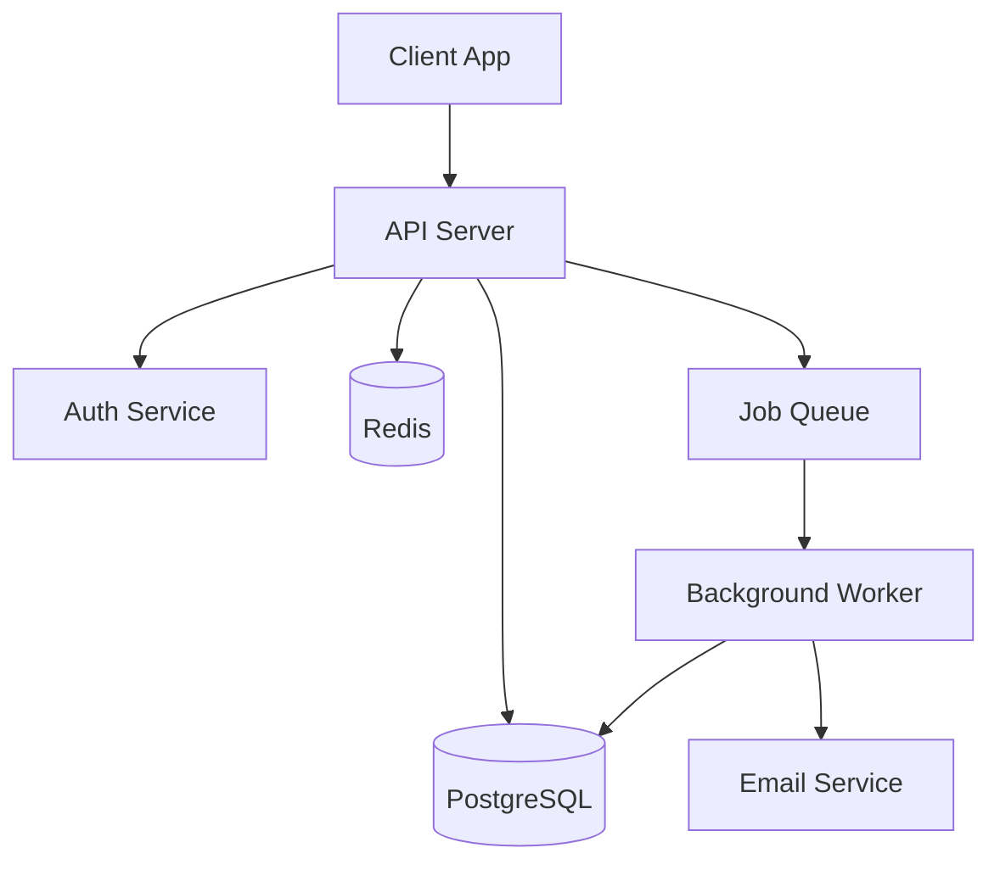

# 技术文档生成器

该工具可扫描代码库，并生成可供客户端使用的官方技术文档，包括 API 文档、项目 README 文件、架构概述、变更日志以及开发者入职指南等。

## 使用方法

```
/technical-doc-generator ./src api-docs
/technical-doc-generator . full
/technical-doc-generator ./src readme
/technical-doc-generator . changelog
/technical-doc-generator ./src onboarding
```

- `$ARGUMENTS[0]`：代码库的路径（默认为当前目录）
- `$ARGUMENTS[1]`：文档类型：`api-docs`、`readme`、`architecture`、`changelog`、`onboarding` 或 `full`（全部类型）

## 文档类型

### `readme` — 项目 README 文件

扫描项目并生成一份详细的 README 文件：

```markdown
# Project Name

Brief description (1-2 sentences from package.json, pyproject.toml, or code analysis).

## Features
- [Auto-detected from code structure]

## Quick Start

### Prerequisites
[Detected from package.json, requirements.txt, go.mod, etc.]

### Installation
[Generated from detected package manager and config files]

### Configuration
[Detected from .env.example, config files, environment variables in code]

### Usage
[Basic usage examples from entry points, CLI args, or main functions]

## Project Structure
[Generated directory tree with descriptions]

## API Reference
[Brief overview with link to full docs if generated]

## Contributing
[Standard contributing section]

## License
[Detected from LICENSE file]
```

### `api-docs` — API 文档

扫描项目中的 API 端点，并生成相应的文档：

1. **识别使用的框架**：Express、FastAPI、Django、Flask、Rails、Spring、Gin 等
2. **提取 API 端点信息**：路由、方法、参数、请求/响应数据
3. **生成 OpenAPI/Swagger 规范文档**（YAML 格式）
4. **生成易于阅读的文档**（Markdown 格式）

示例 API 端点信息：
```markdown
### `POST /api/users`

Create a new user account.

**Authentication**: Required (Bearer token)

**Request Body**:
| Field | Type | Required | Description |
|-------|------|----------|-------------|
| email | string | Yes | User's email address |
| name | string | Yes | Full name |
| role | string | No | User role (default: "member") |

**Example Request**:
```json
{
  "email": "user@example.com",
  "name": "Jane Doe",
  "role": "admin"
}
```

**Response** (`201 Created`):
```json
{
  "id": "usr_abc123",
  "email": "user@example.com",
  "name": "Jane Doe",
  "role": "admin",
  "created_at": "2026-02-13T10:00:00Z"
}
```

**Error Responses**:
| Status | Description |
|--------|-------------|
| 400 | Invalid request body |
| 409 | Email already exists |
| 401 | Missing or invalid auth token |
```

### `architecture` — 架构概述

生成一份架构文档，内容包括：

1. **系统功能**：系统的主要功能及工作原理
2. **技术栈**：项目中使用的语言、框架、数据库及服务
3. **目录结构**：各目录的用途说明
4. **组件图**：使用 Mermaid 图表示主要组件及其之间的关系
5. **数据流**：数据在系统中的流动方式
6. **数据库架构**：如果存在数据库迁移或模型文件，会将其内容也包含在文档中
7. **外部依赖**：第三方服务、API 和数据库的详细信息
8. **配置信息**：环境变量及其用途

示例 Mermaid 图：


### `changelog` — 从 Git 日志中提取的变更日志

解析 Git 日志并生成结构化的变更日志：

```markdown
# Changelog

## [Unreleased]
### Added
- [Features from commits since last tag]

### Changed
- [Modifications]

### Fixed
- [Bug fixes]

## [1.2.0] - 2026-02-10
### Added
- ...
```

- 变更日志按语义版本标签分组（如果没有版本标签，则按月份分组）
- 对提交类型进行分类：添加（Added）、修改（Changed）、修复（Fixed）、删除（Removed）、安全问题（Security）、弃用（Deprecated）
- 支持使用常规的提交标签（如 `feat:`、`fix:`、`chore:` 等）
- 跳过合并提交和构建/持续集成（CI）相关的提交
- 如果提交信息中提到了 Pull Request（PR）或问题（Issue），会提供相应的链接

### `onboarding` — 开发者入职指南

为新加入项目的开发者生成一份入职指南：

```markdown
# Developer Onboarding Guide

## Prerequisites
[Required software, versions, accounts]

## Getting Started
### 1. Clone and Setup
[Step-by-step with exact commands]

### 2. Environment Configuration
[All env vars explained with example values]

### 3. Run Locally
[Commands to start the dev server, run tests, etc.]

### 4. Verify Setup
[How to confirm everything is working]

## Codebase Tour
### Architecture Overview
[Brief system description with diagram]

### Key Directories
[What lives where and why]

### Important Files
[Config files, entry points, key modules]

## Development Workflow
### Branching Strategy
[Detected from git history or standard gitflow]

### Running Tests
[Test commands, test structure]

### Code Style
[Linting config, formatting tools detected]

### Making Changes
[Typical workflow: branch → code → test → PR]

## Common Tasks
### Add a new API endpoint
[Step-by-step based on existing patterns]

### Add a database migration
[Based on detected ORM/migration tool]

### Deploy
[If deployment config is detected]

## Troubleshooting
### Common Issues
[Based on README, issues, or common patterns]
```

### `full` — 完整的文档包

同时生成上述所有类型的文档，并将它们整理到 `docs/` 目录中：

```
docs/
  README.md              # Project README (also copy to project root if none exists)
  API.md                 # API documentation
  ARCHITECTURE.md        # Architecture overview
  CHANGELOG.md           # Changelog
  ONBOARDING.md          # Developer onboarding
  openapi.yaml           # OpenAPI spec (if API detected)
  diagrams/              # Mermaid source files
```

## 代码库扫描策略

1. **优先扫描配置文件**：`package.json`、`pyproject.toml`、`go.mod`、`Cargo.toml`、`Gemfile`、`pom.xml`
2. **入口文件**：`main.*`、`index.*`、`app.*`、`server.*` 等文件
3. **路由/端点文件**：包含路由定义的文件
4. **模型/数据库架构文件**：数据库模型、TypeScript 接口、Pydantic 模型文件
5. **测试文件**：用于理解系统的预期行为
6. **现有文档**：项目中的 README 文件、文档目录（`docs/`）及 wiki 内容

**注意**：无需扫描所有文件，应先分析代码库的结构，再重点查看关键文件。

## 输出结果

将生成的所有文档保存到 `output/docs/` 目录中（或根据用户指定路径）。同时会向客户端提供生成内容的总结，并建议下一步的操作。