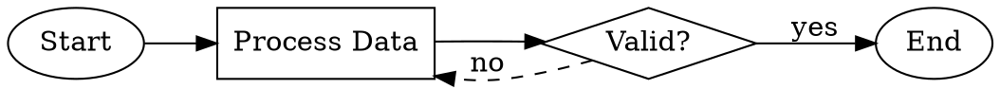

# Excalidraw 流程图技能

能够使用 Excalidraw 创建专业的流程图和图表，并将这些文件保存为 Excalidraw 格式，以便在 Excalidraw 中直接打开。

## 适用场景

- 用户需要创建流程图或图表
- 用户希望可视化某个过程或工作流程
- 用户需要架构图
- 用户提到“Excalidraw”或“流程图”
- 用户需要记录决策树

## 先决条件

必须安装 `@swiftlysingh/excalidraw-cli` 工具：

```bash
npm install -g @swiftlysingh/excalidraw-cli
```

或者通过 `npx` 命令直接使用（无需安装）：

```bash
npx @swiftlysingh/excalidraw-cli create --inline "DSL" -o output.excalidraw
```

## 创建流程图的步骤

### 第一步：分析需求

从用户的描述中确定以下信息：
- 主要步骤/节点是什么？
- 有哪些决策点？
- 流程的方向是什么？
- 是否存在循环或分支？

### 第二步：编写 DSL 代码

使用以下 DSL 语法来描述流程图：

| 语法       | 元素            | 用途                         |
|------------|-----------------|---------------------------|
| `[标签]`      | 矩形            | 表示流程步骤或操作                |
| `{标签?}`     | 菱形            | 表示决策点或条件判断                |
| `(标签)`      | 椭圆            | 表示起点/终点                    |
| `[[标签]]`     | 数据库            | 表示数据存储节点                  |
| `![路径]`     | 图像             | 插入图像                      |
| `![路径(WxH)`    | 带尺寸的图像        | 带明确尺寸的图像                  |
| `->`       | 箭头            | 表示连接关系                    |
| `-> "文本" ->`   | 带标签的箭头        | 表示带标签的连接关系              |
| `-->`      | 虚线箭头          | 表示可选/替代路径                |

### DSL 指令

| 指令        | 说明                          | 示例                          |
|------------|---------------------------------|-----------------------------------------|
| `@方向`      | 设置流程方向                      | `@方向 LR`                      |
| `@间距`      | 设置节点间距                      | `@间距 60`                      |
| `@图像`      | 定位图像                        | `@图像 logo.png 在 100,50`                 |
| `@装饰`      | 为节点添加装饰                    | `@装饰 icon.png 在右上角`                 |
| `@贴纸`      | 从贴纸库中添加贴纸                    | `@贴纸 checkmark 在 200,100`                 |
| `@库`       | 设置贴纸库路径                      | `@库 ./assets/stickers`                 |
| `@散布`      | 在画布上随机分布图像                  | `@散布 star.png 数量:5`                  |

### 第三步：生成文件

运行 CLI 命令来生成 `.excalidraw` 文件：

```bash
npx @swiftlysingh/excalidraw-cli create --inline "YOUR_DSL_HERE" -o flowchart.excalidraw
```

对于多行的 DSL 代码，可以使用 heredoc 格式：

```bash
npx @swiftlysingh/excalidraw-cli create --inline "$(cat <<'EOF'
(Start) -> [Step 1] -> {Decision?}
{Decision?} -> "yes" -> [Step 2] -> (End)
{Decision?} -> "no" -> [Step 3] -> [Step 1]
EOF
)" -o flowchart.excalidraw
```

### 第四步：通知用户

告知用户：
1. 文件已生成在指定路径。
2. 可以在 Excalidraw（https://excalidraw.com）中通过“文件”>“打开”来打开该文件。
3. 如有需要，可以在 Excalidraw 中进一步编辑文件。

## DSL 示例

### 简单线性流程图

```
(Start) -> [Initialize] -> [Process Data] -> [Save Results] -> (End)
```

### 决策树

```
(Start) -> [Receive Request] -> {Authenticated?}
{Authenticated?} -> "yes" -> [Process Request] -> (Success)
{Authenticated?} -> "no" -> [Return 401] -> (End)
```

### 循环/重试模式

```
(Start) -> [Attempt Operation] -> {Success?}
{Success?} -> "yes" -> [Continue] -> (End)
{Success?} -> "no" -> {Retry Count < 3?}
{Retry Count < 3?} -> "yes" -> [Increment Counter] -> [Attempt Operation]
{Retry Count < 3?} -> "no" -> [Log Failure] -> (Error)
```

### 多分支流程图

```
(User Input) -> {Input Type?}
{Input Type?} -> "text" -> [Parse Text] -> [Process]
{Input Type?} -> "file" -> [Read File] -> [Process]
{Input Type?} -> "url" -> [Fetch URL] -> [Process]
[Process] -> [Output Result] -> (Done)
```

### 使用数据库的流程图

```
[API Request] -> {Cache Hit?}
{Cache Hit?} -> "yes" -> [[Read Cache]] -> [Return Data]
{Cache Hit?} -> "no" -> [[Query Database]] -> [[Update Cache]] -> [Return Data]
```

## CLI 命令行选项

- `-o, --output <文件路径>` - 输出文件路径（默认：flowchart.excalidraw）
- `-f, --format <格式>` - 输入格式：dsl、json、dot（默认：自动检测）
- `-d, --方向 <TB|BT|LR|RL>` - 流程方向（默认：TB = 从上到下）
- `-s, --间距 <数值>` - 节点间距（单位：像素）（默认：50）
- `--inline <DSL>` - 将 DSL 代码内联显示
- `--stdin` - 从标准输入读取数据
- `--verbose` - 详细输出

示例命令：

```bash
npx @swiftlysingh/excalidraw-cli create --inline "[A] -> [B] -> [C]" --direction LR --spacing 80 -o horizontal-flow.excalidraw
```

## DOT/Graphviz 格式（1.1.0 版本新增）

CLI 现在支持 DOT/Graphviz 格式来创建图表。这在使用现有的 DOT 文件或偏好 DOT 语法时非常有用。

### DOT 语法示例



### 支持的 DOT 功能

| 功能            | DOT 语法                         | 对应的 Excalidraw 元素                |
|-----------------|---------------------------------|-----------------------------------------|
| 矩形             | `shape=box` 或 `shape=rect`                | `[标签]`                      |
| 菱形             | `shape=diamond`                      | `{标签}`                      |
| 椭圆             | `shape=ellipse` 或 `shape=circle`                | `(标签)`                      |
| 数据库             | `shape=cylinder`                      | `[[标签]]`                      |
| 方向             | `rankdir=TB\|BT\|LR\|RL`                  | `@方向`                      |
| 边缘标签           | `[label="文本"]`                     | `-> "文本" ->`                   |
| 虚线边缘           | `[style=dashed]`                    | `-->`                      |
| 颜色             | `[fillcolor="..." color="..."}`                | `@装饰`                      |
| 使用 DOT 文件         | `--input-file <文件路径>`                | （直接使用 DOT 文件）                   |

### 图像和装饰（1.1.0 版本新增）

### 图像节点

在流程图中插入图像：

```
(Start) ->  -> [Process] -> (End)
```

### 定位图像

将图像放置在指定位置：

```
@image background.png at 0,0
@image logo.png near (Start) top-right

(Start) -> [Process] -> (End)
```

### 节点装饰

为节点添加小图标或徽章：

```
[Deploy to Production]
@decorate checkmark.png top-right

[Review Required]
@decorate warning.png top-left
```

装饰的定位方式：`top`（顶部）、`bottom`（底部）、`left`（左侧）、`right`（右侧）、`top-left`（左上角）、`top-right`（右上角）、`bottom-left`（左下角）、`bottom-right`（右下角）。

### 贴纸库

使用可复用的贴纸库：

```
@library ./assets/stickers
@sticker success at 100,100
@sticker warning near (Error) top-right
```

### 随机分布图像

在画布上随机分布图像：

```
@scatter confetti.png count:10
@scatter star.png count:5 width:20 height:20
```

## 常见流程图模板

- **API 请求流程**                 | ```
[Client Request] -> [API Gateway] -> {Auth Valid?}
{Auth Valid?} -> "yes" -> [Route to Service] -> [[Database]] -> [Response]
{Auth Valid?} -> "no" -> [401 Unauthorized]
```                 |
- **持续集成/持续部署管道**           | ```
(Push) -> [Build] -> [Test] -> {Tests Pass?}
{Tests Pass?} -> "yes" -> [Deploy Staging] -> {Manual Approval?}
{Manual Approval?} -> "yes" -> [Deploy Production] -> (Done)
{Manual Approval?} -> "no" -> (Cancelled)
{Tests Pass?} -> "no" -> [Notify Team] -> (Failed)
```                 |
- **用户注册**                   | ```
(Start) -> [Enter Details] -> {Email Valid?}
{Email Valid?} -> "no" -> [Show Error] -> [Enter Details]
{Email Valid?} -> "yes" -> {Password Strong?}
{Password Strong?} -> "no" -> [Show Password Requirements] -> [Enter Details]
{Password Strong?} -> "yes" -> [[Save to Database]] -> [Send Verification Email] -> (Success)
```                 |

## 提示

1. **标签要简洁** - 使用简短、具有操作性的文本。
2. **决策节点以 `?` 结尾** - 表示这是一个条件判断。
3. **使用一致的命名规则** - 有助于避免节点重复。
4. **使用 `(Start)` 开头** - 明确表示流程的起点。
5. **复杂流程需分解** - 如有必要，可将流程拆分成更小的部分进行设计。