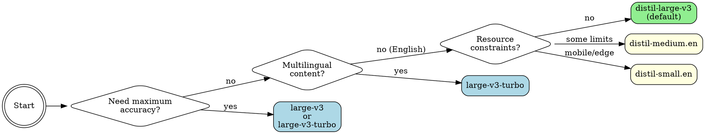

# Faster Whisper

这是一个基于CTranslate2实现的本地语音转文本工具，它是对OpenAI的Whisper的优化版本，运行速度提升了4到6倍，同时保持了相同的准确率。通过GPU加速，转录速度可达到接近实时的水平（10分钟的音频文件可在约30秒内完成转录）。

## 使用场景

当你需要以下功能时，可以使用这个工具：
- **转录音频/视频文件**：会议记录、采访、播客、讲座、YouTube视频
- **本地将语音转换为文本**：无需支付API费用，支持离线使用（模型下载完成后即可使用）
- **批量处理多个音频文件**：适用于大量音频文件的处理
- **生成字幕/标题**：支持添加字幕，并提供单词级别的时间戳
- **多语言转录**：支持99种以上语言，并能自动检测语言

**常用指令**：
- “转录这段音频”
- “将语音转换为文本”
- “他们说了什么”
- “生成文本记录”
- “为视频添加字幕”

**不适用场景**：
- 实时/流式转录（请使用专为流处理优化的工具）
- 仅依赖云环境的场景（没有本地计算资源）
- 音频文件时长小于10秒的情况（此时API调用的延迟影响不大）

## 快速参考

| 功能 | 命令 | 说明 |
|------|---------|-------|
| **基本转录** | `./scripts/transcribe audio.mp3` | 使用默认的distil-large-v3模型 |
| **更快的英语转录** | `./scripts/transcribe audio.mp3 --model distil-medium.en --language en` | 仅支持英语，速度提升6.8倍 |
| **最高准确率** | `./scripts/transcribe audio.mp3 --model large-v3-turbo --beam-size 10` | 转录速度较慢，但质量最高 |
| **添加单词时间戳** | `./scripts/transcribe audio.mp3 --word-timestamps` | 适用于生成字幕 |
| **JSON格式输出** | `./scripts/transcribe audio.mp3 --json -o output.json` | 支持程序化访问转录结果 |
| **多语言转录** | `./scripts/transcribe audio.mp3 --model large-v3-turbo` | 自动检测语言 |
| **去除静音部分** | `./scripts/transcribe audio.mp3 --vad` | 用于检测语音活动并去除静音 |

## 模型选择

根据你的需求选择合适的模型：



### 模型对比表

#### 标准模型（Full Whisper）

| 模型 | 大小（MB） | 转录速度 | 准确率 | 适用场景 |
|-------|--------|---------|-----------|-----------|
| `tiny` / `tiny.en` | 39MB | 最快 | 适合快速草稿 |
| `base` / `base.en` | 74MB | 非常快 | 适用于一般场景 |
| `small` / `small.en` | 244MB | 速度较快 | 适用于大多数任务 |
| `medium` / `medium.en` | 769MB | 中等速度 | 转录质量较高 |
| `large-v1/v2/v3` | 1.5GB | 转录速度较慢 | 准确率最高 |
| **`large-v3-turbo`** | 809MB | 速度较快 | 非常快，推荐用于需要高准确率的场景 |

#### 优化模型（速度提升约6倍，WER误差降低约1%）

| 模型 | 大小（MB） | 相比标准模型的速度提升 | 准确率 | 适用场景 |
|-------|--------|-------------------|-----------|-----------|
| **`distil-large-v3`** | 756MB | 速度提升约6.3倍 | WER误差为9.7% | 默认模型，平衡性最佳 |
| `distil-large-v2` | 756MB | 速度提升约5.8倍 | WER误差为10.1% | 备用模型 |
| `distil-medium.en` | 394MB | 速度提升约6.8倍 | 仅支持英语，适用于资源有限的环境 |
| `distil-small.en` | 166MB | 速度提升约5.6倍 | 适用于移动设备或边缘计算设备 |

`.en`模型仅支持英语内容，且处理英语文本时速度更快、效果更好。

## 安装说明

### Linux / macOS / WSL2

安装要求：
- Python 3.10及以上版本
- ffmpeg工具

### 平台支持

| 平台 | 加速方式 | 转录速度 |
|------|-----------|---------|
| **Linux + NVIDIA GPU** | 使用CUDA | 转录速度接近实时（约20倍） |
| **WSL2 + NVIDIA GPU** | 使用CUDA | 转录速度接近实时（约20倍） |
| macOS（Apple Silicon） | 使用CPU | 转录速度约为实时的3到5倍 |
| macOS（Intel） | 使用CPU | 转录速度约为实时的1到2倍 |
| Linux（无GPU） | 使用CPU | 转录速度约为实时的1倍 |

**注意**：faster-whisper在macOS上仅使用CPU进行转录，但由于Apple Silicon的处理能力较强，实际使用效果仍然不错。

### GPU支持（非常重要！）

安装脚本会自动检测你的GPU并安装带有CUDA的PyTorch。**如果有GPU，请务必使用GPU进行转录**——使用CPU时转录速度会非常慢。

| 硬件配置 | 转录速度（处理10分钟视频的情况） |
|------|---------------------|-------------------|
| RTX 3070（GPU） | 转录速度接近实时（约20倍） | 处理时间约27秒 |
| CPU（int8格式） | 转录速度约为实时的0.3倍 | 处理时间约30分钟 |

如果安装脚本未检测到GPU，请手动安装带有CUDA的PyTorch：

```bash
# For CUDA 12.x
uv pip install --python .venv/bin/python torch --index-url https://download.pytorch.org/whl/cu121

# For CUDA 11.x
uv pip install --python .venv/bin/python torch --index-url https://download.pytorch.org/whl/cu118
```

**WSL2用户**：请确保已安装[NVIDIA的WSL CUDA驱动程序](https://docs.nvidia.com/cuda/wsl-user-guide/)。

## 使用方法

```bash
# Basic transcription
./scripts/transcribe audio.mp3

# With specific model
./scripts/transcribe audio.wav --model large-v3-turbo

# With word timestamps
./scripts/transcribe audio.mp3 --word-timestamps

# Specify language (faster than auto-detect)
./scripts/transcribe audio.mp3 --language en

# JSON output
./scripts/transcribe audio.mp3 --json
```

## 配置选项

```
--model, -m        Model name (default: distil-large-v3)
--language, -l     Language code (e.g., en, es, fr - auto-detect if omitted)
--word-timestamps  Include word-level timestamps
--beam-size        Beam search size (default: 5, higher = more accurate but slower)
--vad              Enable voice activity detection (removes silence)
--json, -j         Output as JSON
--output, -o       Save transcript to file
--device           cpu or cuda (auto-detected)
--compute-type     int8, float16, float32 (default: auto-optimized)
--quiet, -q        Suppress progress messages
```

## 使用示例

```bash
# Transcribe YouTube audio (after extraction with yt-dlp)
yt-dlp -x --audio-format mp3 <URL> -o audio.mp3
./scripts/transcribe audio.mp3

# Batch transcription with JSON output
for file in *.mp3; do
  ./scripts/transcribe "$file" --json > "${file%.mp3}.json"
done

# High-accuracy transcription with larger beam size
./scripts/transcribe audio.mp3 \
  --model large-v3-turbo --beam-size 10 --word-timestamps

# Fast English-only transcription
./scripts/transcribe audio.mp3 \
  --model distil-medium.en --language en

# Transcribe with VAD (removes silence)
./scripts/transcribe audio.mp3 --vad
```

## 常见问题及解决方法

| 问题 | 原因 | 解决方法 |
|------|---------|-------------------|
| **在可用GPU的情况下仍使用CPU** | 转录速度会慢10到20倍 | 请使用`nvidia-smi`检查CUDA是否已正确安装 |
| **未指定语言** | 会对已知语言内容进行不必要的自动检测 | 如果知道语言，请使用`--language en`参数指定语言 |
| **使用了错误的模型** | 会导致转录速度变慢或准确率降低 | 默认的`distil-large-v3`模型表现优异；只有在需要更高准确率时才使用`large-v3` |
| **忽略了优化模型** | 会损失约6倍的转录速度，但准确率仅降低不到1% | 在使用标准模型之前，请先尝试`distil-large-v3` |
| **未安装ffmpeg** | 可能导致安装失败或无法处理音频文件 | 安装脚本会自动处理ffmpeg的依赖；手动安装时需单独安装 |
| **内存不足** | 模型过大，超出系统可用内存 | 选择较小的模型或使用`--compute-type int8`参数 |
| **设置`beam-size`过大** | 当`beam-size`超过5或7时，性能提升效果不明显 | 默认值5通常足够；对于关键转录任务可尝试设置为10 |

## 性能说明

- **首次运行**：会一次性将模型下载到`~/.cache/huggingface/`目录 |
- **GPU支持**：如果系统有GPU，会自动使用CUDA（速度提升约10到20倍） |
- **量化技术**：在CPU上使用INT8格式进行转录，速度提升约4倍，准确率损失很小 |
- **内存需求**：
  - `distil-large-v3`：需要约2GB的RAM和约1GB的VRAM |
  - `large-v3-turbo`：需要约4GB的RAM和约2GB的VRAM |
  - `tiny/base`：需要小于1GB的RAM

## 更快的语音转录工具（faster-whisper）的优势

- **速度**：比OpenAI的原始Whisper快4到6倍 |
- **准确率**：与原始模型相同（使用相同的模型权重） |
- **效率**：通过量化技术降低内存消耗 |
- **稳定性**：基于成熟的C++后端（CTranslate2） |
- **优化模型**：速度提升约6倍，准确率损失不到1%

## 故障排除

- **“CUDA不可用——使用CPU”**：请确保已安装带有CUDA的PyTorch |
- **安装失败**：请确认已安装Python 3.10及以上版本 |
- **内存不足**：选择较小的模型或使用`--compute-type int8`参数 |
- **CPU转录速度慢**：建议使用GPU进行转录 |
- **模型下载失败**：检查`~/.cache/huggingface/`目录的权限设置

## 参考资料

- [faster-whisper的GitHub仓库](https://github.com/SYSTRAN/faster-whisper) |
- [相关论文：Distil-Whisper](https://arxiv.org/abs/2311.00430) |
- [HuggingFace的模型库](https://huggingface.co/collections/Systran/faster-whisper)