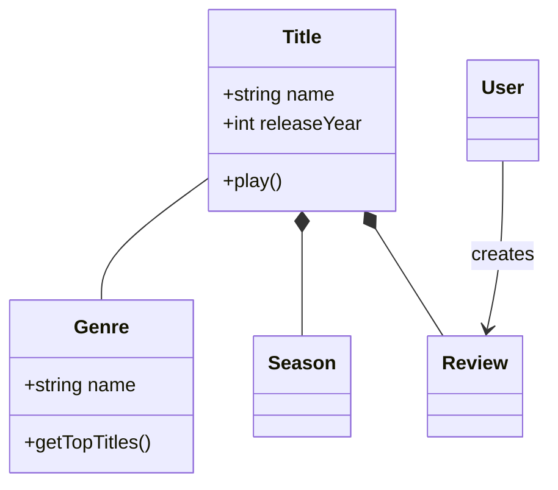
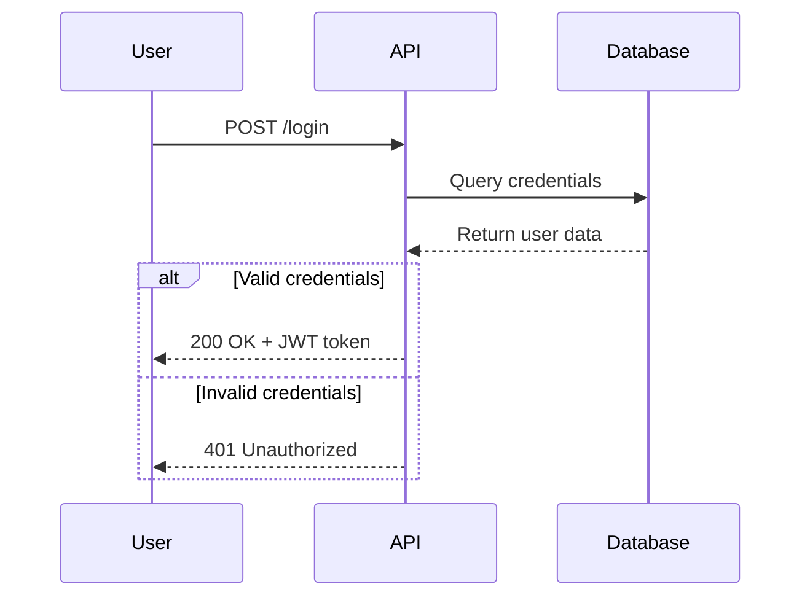
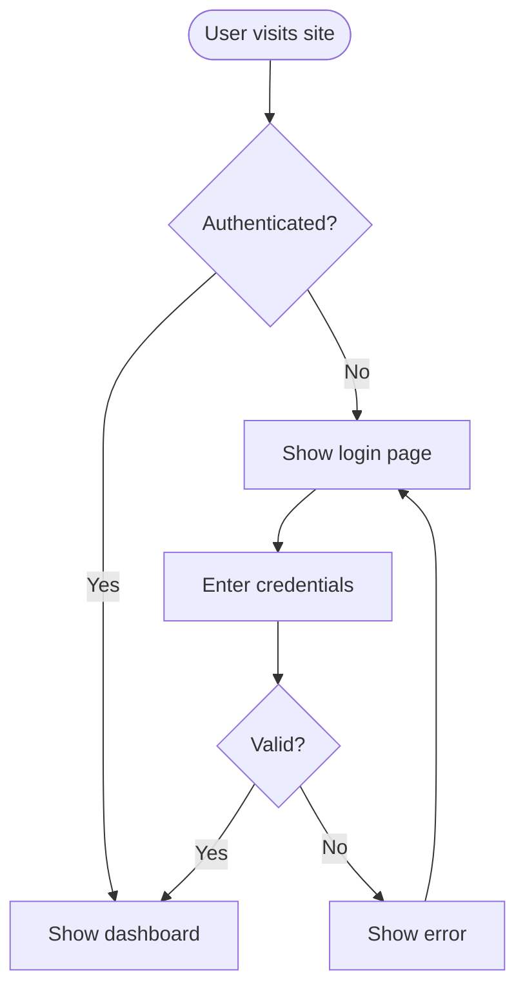
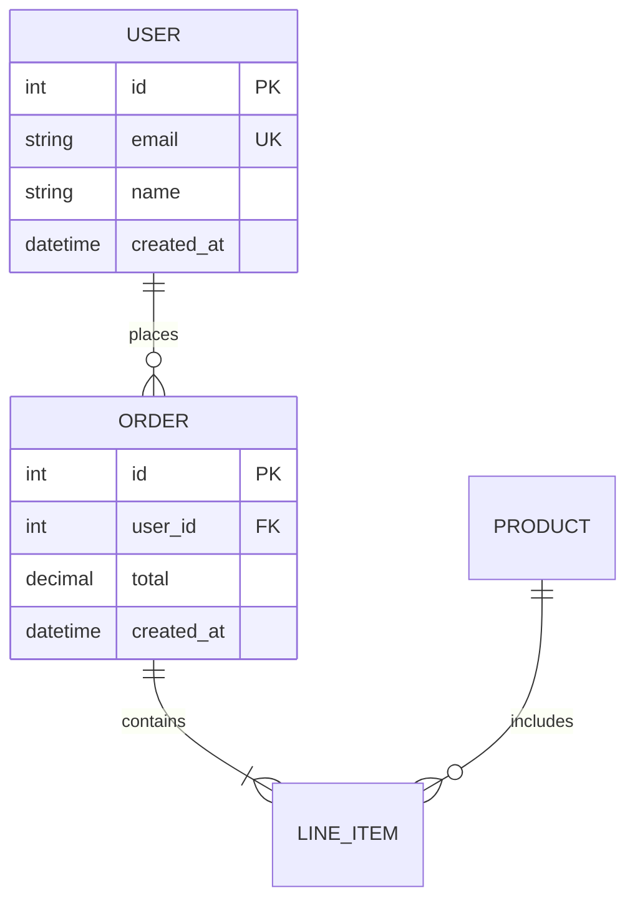

# Mermaid 图表

使用 Mermaid 的基于文本的语法来创建专业的软件图表。Mermaid 可以从简单的文本定义中渲染图表，使得图表易于版本控制、更新和维护，同时与代码保持同步。

## 安装

### OpenClaw / Moltbot / Clawbot

```bash
npx clawhub@latest install mermaid-diagrams
```

## 核心语法

所有 Mermaid 图表都遵循以下格式：

```mermaid
diagramType
  definition content
```

**关键原则：**
- 第一行声明图表类型（例如 `classDiagram`、`sequenceDiagram`、`flowchart`）
- 使用 `%%` 来添加注释
- 换行和缩进可以提高可读性，但不是必需的
- 未知的词汇会导致图表显示错误；无效的参数会默默地导致图表无法正确显示

## 图表类型选择

| 类型 | 用途 | 参考文档 |
|------|---------|-----------|
| **类图** | 领域建模、面向对象设计、实体关系 | `references/class-diagrams.md` |
| **序列图** | API 流程、认证流程、组件交互 | `references/sequence-diagrams.md` |
| **流程图** | 过程、算法、决策树、用户流程 | `references/flowcharts.md` |
| **ERD 图** | 数据库模式、表之间的关系、数据建模 | `references/erd-diagrams.md` |
| **C4 图** | 系统上下文、容器、组件、架构 | `references/c4-diagrams.md` |
| **状态图** | 状态机、生命周期状态 | — |
| **Git 图** | 分支策略 | — |
| **甘特图** | 项目时间线、调度 | — |

**关于样式、主题和布局选项**：请参阅 `references/advanced-features.md`

## 快速入门示例

### 类图（领域模型）



### 序列图（API 流程）



### 流程图（用户流程）



### ERD 图（数据库模式）



## 最佳实践

1. **从简单开始** — 先从核心实体/组件开始，逐步添加细节
2. **使用有意义的名称** — 清晰的标签可以使图表具有自文档说明的功能
3. **详细注释** — 使用 `%%` 注释来解释复杂的关系
4. **保持专注** — 每个概念对应一个图表；将大型图表拆分为多个视图
5. **版本控制** — 将 `.mmd` 文件与代码一起存储，以便于更新
6. **添加上下文** — 包含标题和注释来解释图表的目的
7. **迭代** — 随着理解的深入不断优化图表

## 配置和主题设置

使用 frontmatter 来配置图表：


**可用主题：** 默认、forest、dark、neutral、base

**布局选项：**
- `layout: dagre`（默认）—— 经典的平衡布局
- `layout: elk` — 适用于复杂图表的高级布局

**外观选项：**
- `look: classic` — 传统的 Mermaid 风格
- `look: handDrawn` — 类似草图的外观

## 渲染和导出

**支持的工具：**
- GitHub/GitLab — 可以在 Markdown 中自动渲染图表
- VS Code — 需要安装 Markdown Mermaid 扩展
- Notion、Obsidian、Confluence — 内置支持

**导出选项：**
- [Mermaid Live Editor](https://mermaid.live) — 在线编辑器，支持导出为 PNG/SVG 格式
- Mermaid CLI — `npm install -g @mermaid-js/mermaid-cli`，然后使用 `mmdc -i input.mmd -o output.png` 进行导出

## 何时创建图表

**在以下情况下一定要创建图表：**
- 开始新项目或新功能时
- 文档化复杂系统时
- 解释架构决策时
- 设计数据库模式时
- 规划重构工作时
- 新团队成员入职培训时

**使用图表来：**
- 使利益相关者对技术决策达成一致
- 协同文档化领域模型
- 可视化数据流和系统交互
- 在编码前进行规划
- 创建随代码一起演变的动态文档

## 常见问题

- **字符显示问题** — 避免在注释中使用 `{}`；需要对特殊字符进行转义
- **语法错误** — 拼写错误会导致图表显示错误；可以在 Mermaid Live 中验证语法
- **过于复杂** — 将复杂的图表拆分为多个专注的视图
- **缺少关系** — 必须记录实体之间的所有重要连接
- **图表过时** — 错误的图表比没有图表更糟糕；系统发生变化时要及时更新

## 绝对不要做的事情

1. **绝对不要创建超过 15 个节点的图表** — 这样的图表会难以阅读；应将其拆分为多个专注的图表
2. **绝对不要让箭头没有标签** — 每个连接都应该说明其代表的关系或数据流
3. **绝对不要创建没有标题或说明的图表** — 没有上下文的图表对外部人员来说毫无用处
4. **绝对不要仅依赖图表作为唯一文档** — 图表应与解释“为什么”原因的文字说明一起使用
5. **绝对不要让图表过时** — 架构发生变化时要及时更新图表；过时的图表会误导他人
6. **绝对不要用 Mermaid 来可视化数据** — Mermaid 适用于架构图和流程图，而不是业务数据的图表