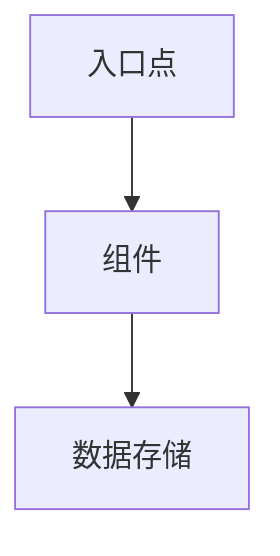

# 设计描述

研究代码库，并生成一份架构文档，说明各个功能或系统的工作原理。该文档采用Markdown格式编写，既适合人类读者阅读，也便于未来的AI代理理解。

## 工作流程

### 第1阶段：范围定义

在开始详细探索之前，先明确需要记录的内容：

1. 询问需要记录的功能、系统或组件是什么。
2. 明确目标受众（开发者、AI代理，或两者皆是）。
3. 如果从上下文中无法确定代码库的位置，请确认其具体位置。

### 第2阶段：初步探索

全面浏览代码库，建立对其结构的初步理解。可以使用高效的探索工具（例如，在Claude Code中可以使用Haiku Explore子代理）：

1. 扫描目录结构，找出主要的入口点。
2. 阅读README文件、配置文件以及现有的文档。
3. 确定与所需功能相关的主要文件和模块。
4. 在脑海中构建代码库的整体结构。

向用户展示一个高层次的文档大纲：

```
## Proposed Outline

1. [Component A] - Brief description
2. [Component B] - Brief description
3. [Component C] - Brief description

* Have I correctly captured the scope of the research? Reply "yes" to continue.
* Otherwise, please let me know what I've misunderstood.
```

当用户确认了文档范围后，即可进入深入研究阶段。

### 第3阶段：深入研究

对于大纲中列出的每个组件，执行以下操作：

1. 从入口点开始追踪代码的执行路径。
2. 识别组件之间的依赖关系和交互方式。
3. 记录配置选项及其定义位置。
4. 查明数据的存储或持久化方式。
5. 编制一个代码参考索引（包括文件路径和关键函数/类名）。

尽量利用初步的代码探索结果来获取大部分信息；如有需要，再阅读相关文件。如果在第2阶段文档范围发生了较大变化，可以重新使用代码探索工具。

#### 何时停止探索

**当满足以下条件时，可以开始起草文档：**

- **能够完整追踪代码执行流程**：能够从入口点开始，不遗漏任何步骤地追踪整个请求/操作的执行过程。
- **明确文档范围**：清楚界定哪些内容属于文档范围，哪些属于外部依赖。
- **完成架构图绘制**：能够绘制出组件之间的连接关系。
- **理解组件间的交互**：对于每个组件，都能明确其输入和输出。

**表示尚未完成的情况：**

- 存在不确定性：“我认为这个组件与……有关联”或“可能调用了……”。
- 有未解决的引用：发现了尚未检查的模块导入或调用。
- 缺少信息：无法解释数据是如何在组件A和组件B之间传递的。

**表示探索过度的情况：**

- 阅读了目录中的所有文件，而不仅仅是代表性样本。
- 进入了外部库或框架的内部实现细节。
- 探索了与架构无关的实现细节。

### 第4阶段：文档起草

根据以下模板生成文档，并将草稿呈现给用户审阅，根据反馈进行修改。如果条件允许，可以使用AskUserQuestion工具征求用户对关键决策的意见。

### 第5阶段：最终定稿

1. **在编写文档前确认文件存放位置**。可以根据仓库的规范建议文件路径（例如`docs/architecture/`、`ARCHITECTURE.md`），但在用户明确确认位置之前，切勿直接编写文件。如果用户事先提供了文件路径，即视为确认。
2. 将最终文档写入确认的位置。

## 文档模板

以下模板提供了一个基本的框架。根据需要记录的功能进行调整：省略不适用的部分，添加特定于该功能的章节，并调整结构以更好地满足目标受众的需求。

````markdown
# [Feature/System Name] Architecture

## Overview

[1-2 paragraph summary of what this feature/system does and why it exists]

## Architecture Diagram



## Components

### [Component Name]

**Purpose**: [What it does]

**Location**: `path/to/file.ext`

**Key Functions**:
- `functionName()` - Brief description
- `anotherFunction()` - Brief description

**Interactions**:
- Receives input from: [Component]
- Sends output to: [Component]

## Data Flow

[Description of how data moves through the system, from input to output]

## Configuration

[How features are enabled, disabled, or configured. Include file paths and
environment variables.]

## Code References

| Component | File | Key Symbols |
|-----------|------|-------------|
| Auth | `src/auth/index.ts` | `authenticate()`, `AuthConfig` |
| Cache | `src/cache/redis.ts` | `CacheManager`, `invalidate()` |

## Glossary

| Term | Definition |
|------|------------|
| [Term] | [Project-specific definition] |
````

## 代码引用规范

使用在重构后仍保持有效的引用格式：

- **路径**：使用从仓库根目录开始的相对路径（例如`src/auth/login.ts`）。
- **符号**：引用函数和类名，而非行号。
- **格式**：使用`path/to/file.ext`的格式，并单独列出关键符号。
- **锚点**：在需要时使用搜索模式（例如`handleAuth function in auth/`）。

**注意事项：**

- **避免复制代码**：切勿将代码直接粘贴到文档中。代码会随时间更新；文档应作为指引，引导读者找到原始代码。只需描述代码的功能和位置即可。
- **避免使用行号**：行号会随代码修改而变化。
- **使用相对路径**：始终使用仓库内的相对路径。

## Mermaid图表

使用Mermaid工具进行架构可视化：

- **流程图**：用于展示组件之间的关系。
- **序列图**：用于展示请求的处理流程。

**注意事项：**

- 图表应仅关注正在记录的具体功能，避免包含无关的组件。
- 保持图表简洁，避免信息过于复杂。

## 编写指南

- **描述而非复制**：解释代码的功能及其位置。需要了解实现细节的读者可以直接阅读源代码（源代码始终是最新的）。
- **便于阅读**：使用标题、表格和列表来帮助读者快速查找信息。
- **提供详细信息**：包括实际的文件路径、函数名和配置参数。
- **兼顾两种受众**：为人类读者提供清晰易懂的描述；同时为AI代理提供结构化的文档。
- **保持信息时效性**：注明对代码状态或版本的任何假设。